# 2D粒子编辑器

## 一、2D粒子编辑器基础

在LayaAir引擎中，2D粒子系统可以用于模拟雨、雪、烟、雾、火焰等非固定形态的效果。这些效果往往很难用一张图片来实现，需要多张图片组合在一起来实现效果，而这种组合中的最小单元就是2D粒子。

## 二、LayaAir引擎中创建2D粒子

开发者可以在2D中创建一个精灵节点，然后在属性设置面板中为这个节点添加2D粒子渲染器。

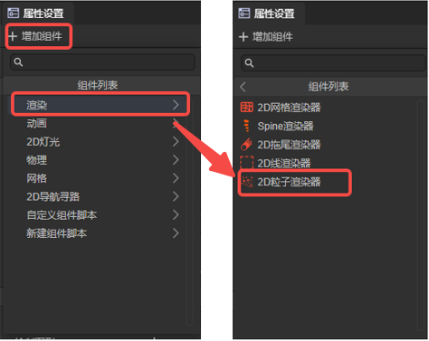

## 三、2D粒子的使用

### 2D粒子渲染器

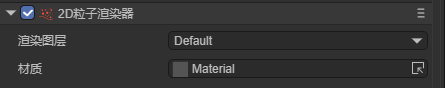

**`渲染图层`**：用于2D灯光组件的图层遮罩所影响的图层。

**`材质`**：设置自定义的2D着色器材质，不设置引擎会使用默认材质。

### 粒子系统

#### 参数模式

在开始讲解粒子系统各模块之前，我们先来讲解一下粒子属性的参数模式。

**`Constant`**：设置属性的常量值，该值在粒子整个生命周期内不会发生变化。

**`TwoConstants`**：设置一个最大值和一个最小值作为常量区间，每个粒子实际的属性值会在常量区间内随机变化。

**`Curve`**：设置一条曲线，每个粒子的属性值会随粒子的生命周期而沿曲线变化。

横坐标为粒子的生命周期，是一个归一化的值；纵坐标为属性值。

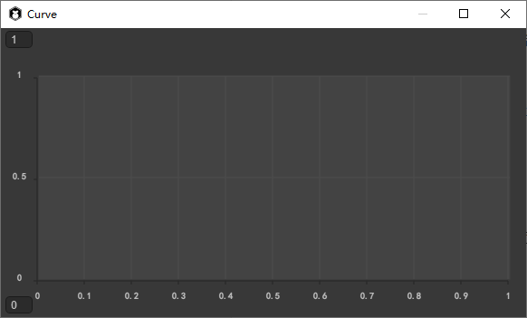

**`TwoCurves`**：设置两条曲线，作为属性值的上限与下限。在粒子的生命周期中，粒子会在两条曲线上取值作为这一时刻的属性值范围，并在这个范围内取一个随机值作为属性值。

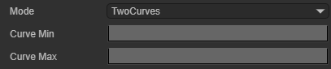

**`Color`**：设置一个固定的颜色作为属性值。

**`TwoColors`**：设置两个固定颜色值，每个粒子实际的属性值由这两个颜色值随机线性插值得到。

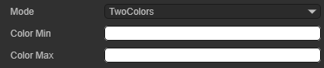

**`Gradient`**：设置一个颜色渐变，在粒子的生命周期中，每个粒子实际的属性值会根据颜色渐变而变化。

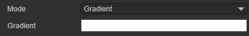

**`TwoGradients`**：设置两个颜色渐变，在粒子的生命周期中，粒子会在两个颜色渐变上取值，并将得到的两个颜色值随机线性插值作为这一时刻的属性值。

#### 通用

**`Duration`**：粒子系统运行的持续时间。到达设置的时间后，系统停止发射粒子。

*注意：`Duration`不是单个粒子是生命周期时间，下面会介绍单个粒子的生命周期时间。*

**`Loop`**：启用后，粒子系统会在其持续时间结束后再次启动并重复该循环。

**`Play On Awake`**：启用后，粒子系统会在所属对象被创建时自动启动。

**`Start Delay`**：启用此属性后，系统在开始发射粒子前将延迟一段时间。有两种模式可供选择：`Constant`和`TwoConstants`。

**`StartLifeTime`**：每个粒子的生命周期，表示粒子在被发射后多长时间消失。有两种模式可供选择：`Constant`和`TwoConstants`。

**`Start Speed`**：每个粒子的初始速度，只表示粒子速度的大小，不代表速度方向。有两种模式可供选择：`Constant`和`TwoConstants`。

**`Start Size2D`**：未启用此属性时，`Start Size`属性决定粒子的初始大小；

`Start Size`：每个粒子的初始大小。有两种模式可供选择：`Constant`和`TwoConstants`。

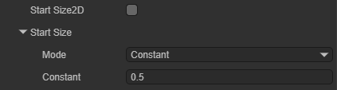

**`Start Size2D`**：启用此属性后，开发者可分别在X轴`Start Size X`和Y轴`Start Size Y`上设置粒子的大小。

`Start Size X`：每个粒子在X轴上的初始大小。有两种模式可供选择：`Constant`和`TwoConstants`。

`Start Size Y`：每个粒子在Y轴上的初始大小。有两种模式可供选择：`Constant`和`TwoConstants`。

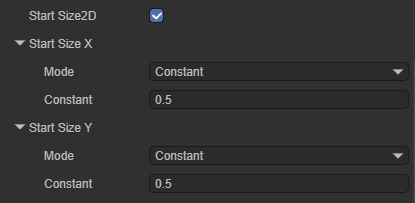

**`Start Rotation`**：每个粒子的初始旋转角度。有两种模式可供选择：`Constant`和`TwoConstants`。

**`Start Color`**：每个粒子的初始颜色。有两种模式可供选择：`Color`(颜色值)和`TwoColors`(颜色过渡)

**`Gravity Modifier`**：设置物理重力值。粒子的运动会受到重力值的影响。

**`Simulation Space`**：控制粒子是否跟随粒子发射器移动。有两种模式可供选择：`Local`和`World`。

`Local`：粒子生成后跟随粒子发射器坐标的移动而移动，这个模式下，粒子发射器的移动会表现在每个粒子上。

`World`：粒子生成后不跟随粒子发射器，直接在世界坐标系中移动。

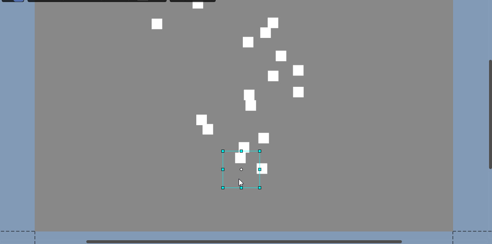

**`Simulation Speed`**：调整整个粒子系统更新的速度。

**`Scale Mode`**：控制粒子的缩放模式。有两种模式可供选择：`Hierarchy`和`Local`。

`Hierarchy`：同时受粒子系统组件所在节点与其父节点的影响。

`Local`：只受粒子系统组件所在节点的影响。

**`Max Particles`**：一个系统中的最大粒子数。当粒子数到达限制值时，系统会停止生成粒子，直到已发射的粒子消失。

**`Auto Random Seed`**：自动粒子随机种子。启用后每次播放都会有不同。去掉勾选后，可以填种子的数值，用于创建可重复效果。不同的数值，发射粒子的表现略有不同。

**`Unit Pixels`**：粒子系统中一个单位对应屏幕像素的大小。

#### 发射

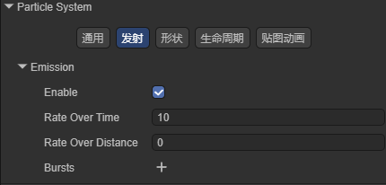

**`Enable`**：是否启用发射模块。只有在启用此属性时，系统才会发射粒子。当创建新的粒子系统时，此属性会默认启用。

**`Rate Over Time`**：系统每秒发射的粒子数。

**`Rate Over Distance`**：每移动单位距离发射的粒子数。

**`Bursts`**：爆发器，用于控制粒子系统在指定的时间点生成指定数量的粒子。一个粒子系统中可以添加多个爆发器。

爆发器上有两个属性：

`Time`：粒子爆发发射的时间，从粒子系统启动后开始计时，以秒为单位。

`Count`：爆发发射的粒子数量。爆发发射的粒子也会受到`Max Particles`属性的限制。

爆发器的效果如图所示，可以看到，粒子系统在一瞬间创建了大量粒子。

#### 形状

该模块用于控制粒子的初始位置以及粒子起始速度的方向。粒子会在shape范围内的随机位置生成。

**`Enable`**：是否启用Shape模块。启用此属性后，粒子会在Shape范围内的随机位置生成。禁用此属性后，粒子会在组件所属节点的锚点处生成。

**`Shape`**：粒子发射器的形状。有四种形状可以选择，每种形状的属性值各不相同。

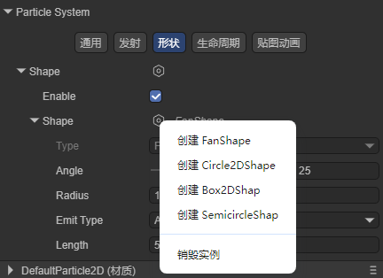

**`FanShape`**：扇形区域。粒子会像手电筒的光一样从一个扇形区域向外移动。

`Angle`：扇形圆心角的角度.

`Radius`：扇形的半径。

`Emit Type`：粒子发射的位置。Base：粒子在扇形内圈半径随机位置发射。Area：粒子在扇形区域内随机位置发射。

`Length`：Emit Type为Area时生效，用于控制扇形区域的宽度。

通过在粒子渲染器上添加爆发器，我们可以清楚的看到发射器的形状。

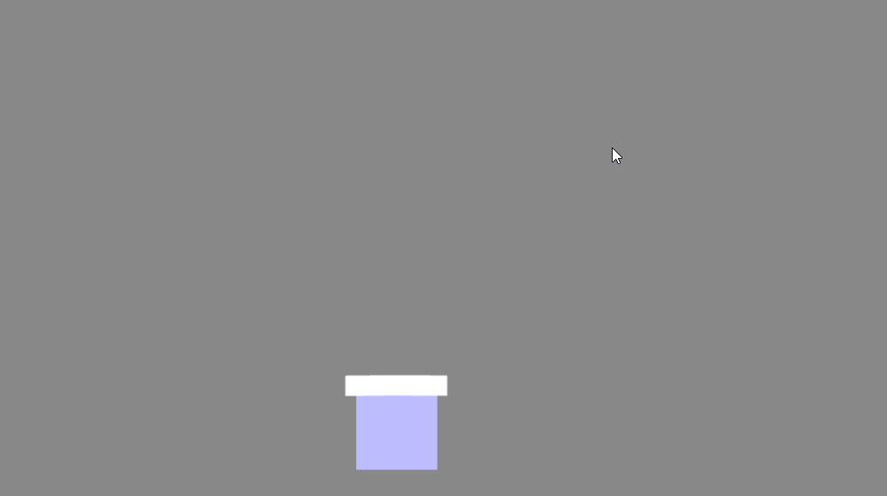

**`Circle2DShape`**：圆形区域。粒子会向四面八方发射。

`Radius`：圆形的半径。

`Emit From Edge`：从边缘发射。启用此属性后粒子只会在圆的半径处发射。

`Random Dirction`：随机方向。未启用此属性时，粒子的速度方向为圆心到粒子生成位置的向量；启用此属性后，粒子的速度方向随机。

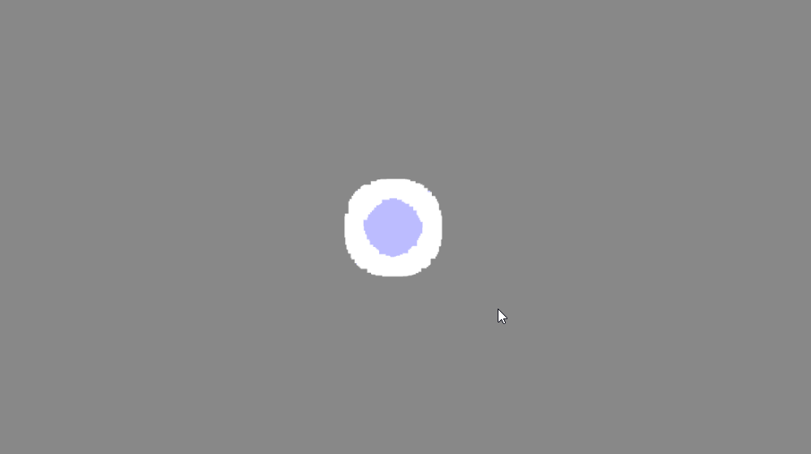

**`Box2DShape`**：盒子形区域，所有粒子会向一个方向发射。

`Size`：盒子的大小。

`Randomize Direction`：随机方向，启用此属性后粒子将向随机方向移动，而不是同一个方向。

**`SemicircleShape`**：半圆形区域。

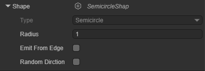

`Radius`：半圆的半径。

`Emit From Edge`：从边缘发射。启用此属性后粒子只会在圆的半径处发射。

`Random Dirction`：随机方向。未启用此属性时，粒子的速度方向为圆心到粒子生成位置的向量；启用此属性后，粒子的速度方向随机。

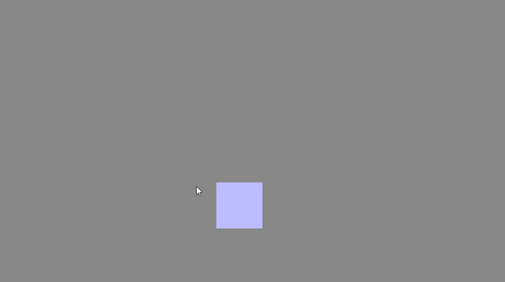

#### 生命周期

下面介绍的这些属性，用于控制单个粒子在其生命周期内状态的变化：

**`Velocity2D Over LifeTime`**：粒子速度随生命周期的变化。

`Enable`：是否启用此属性。

`Space`：此属性的参考空间是本地空间还是世界空间。

`X`：X轴上的线性速度。有两种模式可供选择：`Constant`和`TwoConstants`。

`Y`：Y轴上的线性速度。有两种模式可供选择：`Constant`和`TwoConstants`。

**`Color Over LifeTime`**：粒子颜色随生命周期的变化。

`Enable`：是否启用此属性。

`Color`：粒子的颜色值。有四种模式可供选择：`Color`，`Gradient`，`TwoColors`和`TwoGradients`

**`Size2D Over LifeTime`**：粒子大小随生命周期变化。

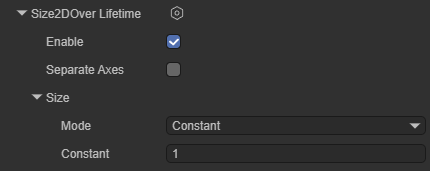

`Enable`：是否启用此属性。

`Separate Axes`：是否单独控制每个轴上的尺寸大小。

`Size`：未启用`Separate Axes`属性时可以设置此值，用于控制粒子整体的大小。有四种模式可供选择：`Constant`，`Curve`，`TwoConstants`和`TwoCurves`。

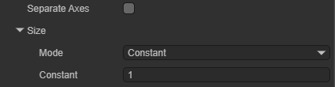

`X`：启用`Separate Axes`属性后设置此值，用于控制粒子X轴方向上的大小。有四种模式可供选择：`Constant`，`Curve`，`TwoConstants`和`TwoCurves`。

`Y`：启用`Separate Axes`属性后设置此值，用于控制粒子Y轴方向上的大小。有四种模式可供选择：`Constant`，`Curve`，`TwoConstants`和`TwoCurves`。

**`Rotation Over LifeTime`**：粒子旋转的角速度随生命周期的变化。

**`Enable`**：是否启用此属性。

**`Angular Velocity`**：粒子旋转的角速度，以角度为单位。有四种模式可供选择：`Constant`，`Curve`，`TwoConstants`和`TwoCurves`。

#### 贴图动画

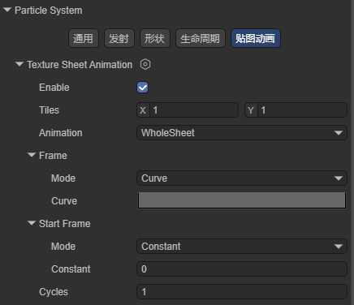

**`Enable`**：是否启用此属性。

**`Tiles`**：纹理在 X（水平）和 Y（垂直）方向上划分的图块数量。

**`Animation`**：动画模式可以设置为整张（整个图集作为一个动画序列）或单行（每行代表一个单独的动画序列）。

**`Frame`**：此属性决定了粒子的动画帧随生命周期如何变化。有四种模式可供选择：`Constant`，`Curve`，`TwoConstants`和`TwoCurves`。

**`Start Frame`**：动画的起始帧偏移量

**`Cycles`**：动画在粒子生命周期内循环的次数。

*注意：贴图动画需要创建对应的材质并设置纹理才能使用。*

### 粒子着色器

在`Shader`属性上选择Particle2D，可以添加Laya内置的2D粒子着色器。

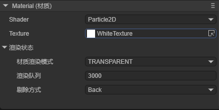

**`Texture`**：指定粒子使用的纹理。

**`材质渲染模式`**：设置渲染模式

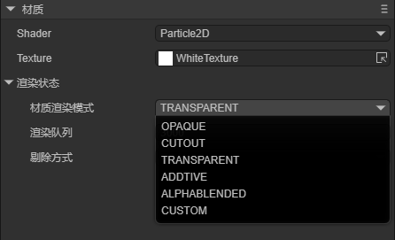

`Opaque`：默认设置，适用于没有透明区域的普通实体对象。

`Cutout`：允许创建在不透明和透明区域之间具有硬边的透明效果。在此模式下，没有半透明区域，纹理要么 100% 不透明，要么不可见。这在使用透明度来创建材料的形状（例如树叶或带孔和破烂的布）时很有用。

`Transparent`： 适用于渲染逼真的透明材质，例如透明塑料或玻璃。在此模式下，材质本身将采用透明度值（基于纹理的 Alpha 通道和色调颜色的 Alpha），但反射和照明高光将在完全清晰的情况下保持可见，就像真正的透明材质一样。

`Additive`： 叠加方式。

`AlphaBlended`： 透明混合方式。

`Custom`：自定义渲染模式。

**`渲染队列`**：用来设置着色器的渲染队列，值越大，渲染越靠后。

**`剔除方式`**：决定粒子的剔除方式。

## 四、创建一个2D粒子

本节内容，我们通过创建一个2D粒子的示例，帮助开发者理解2D粒子的使用方法。

### 4.1 创建一个预制体

一般来说，粒子效果是需要重复使用的，因此我们可以将粒子效果制作成预制体。这里我们创建一个2D预制体。

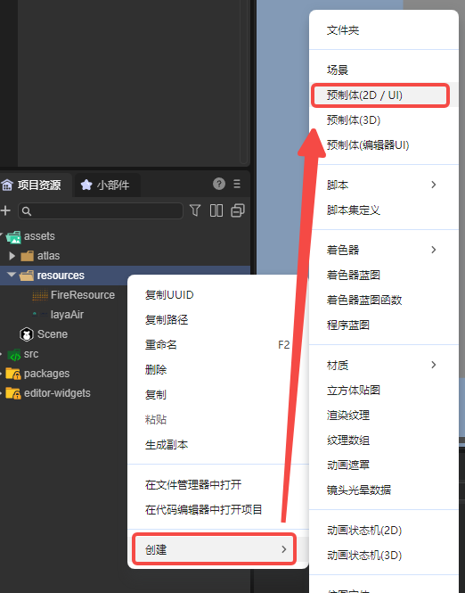

打开这个预制体，将其转化为2D精灵节点，并在其上添加2D粒子渲染器。

### 4.2 为粒子添加材质

在项目资源面板中创建一个基础2D渲染Shader：

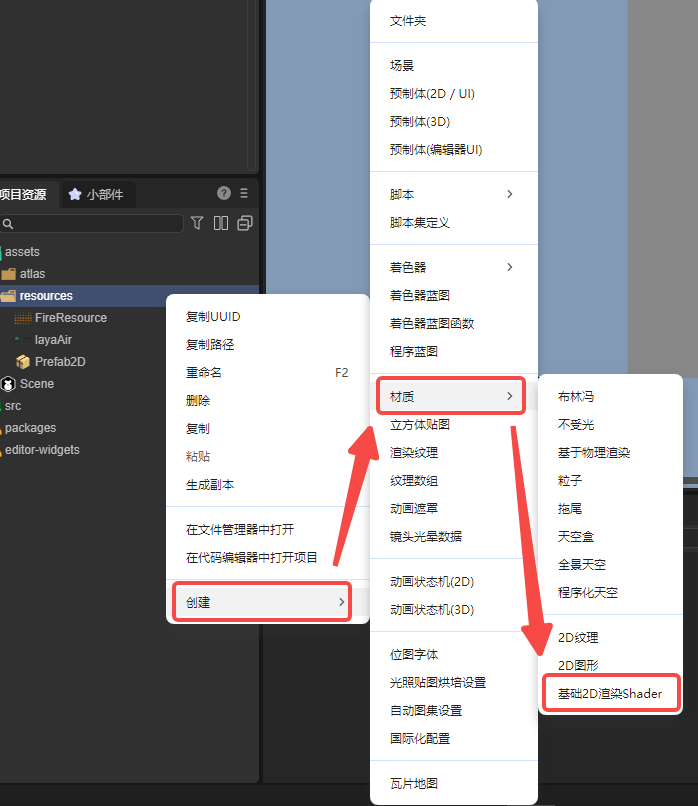

打开这个材质，将这个材质使用的shader更换为Particle2D：

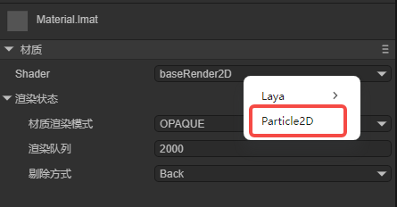

将这个材质添加到2D粒子渲染器上：

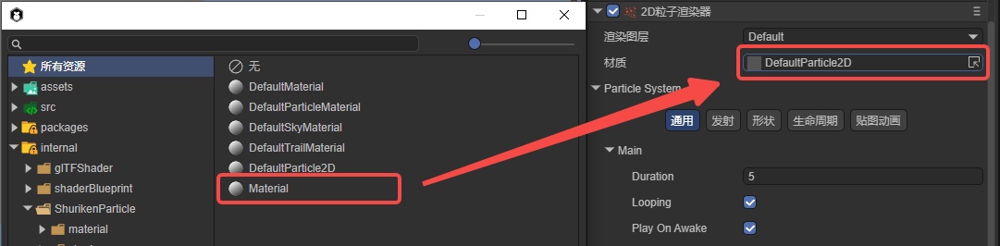

将需要用到的纹理贴图添加到材质的`Texture`属性上：

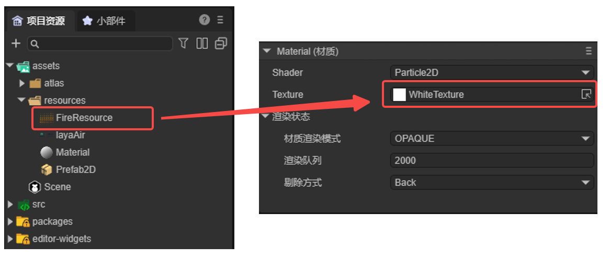

用到的贴图：

设置好后，我们已经可以看到粒子的贴图了：

显然，粒子的效果并不正确，我们还需要为其设置序列帧动画：

### 4.3 设置序列帧动画

在属性设置面板中找到Particle System栏，选择贴图动画，并创建实例：

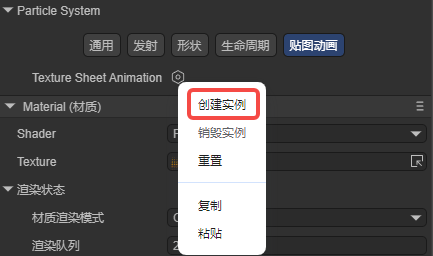

设置纹理在水平方向上和垂直方向上划分的图块数量：

设置序列帧动画后，粒子效果如图：

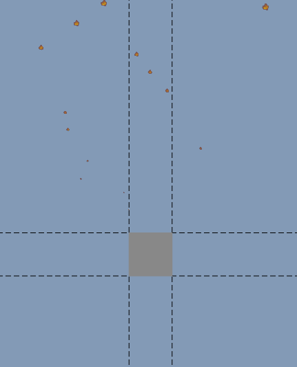

可以看到，粒子上已经有火焰动画了，但我们仍需对火焰效果进行调整。

### 4.4 设置基础属性

Start Lifetime的Constant为1，设置粒子的存在时间为1秒；Start Speed的Constant为1，设置粒子的初始速度为1；Start Size的Constant为2，设置粒子的大小为2；效果如图所示：

开发者也可以调整粒子系统的其它参数，改变粒子的效果，这里我们设置Start Speed为TwoConstants，最小值为0，最大值为5；在发射模块中设置Rate Over Time为30；在形状模块设置Shape为Box2DShape；运行效果如图：

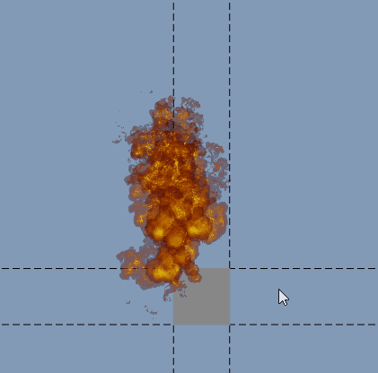

