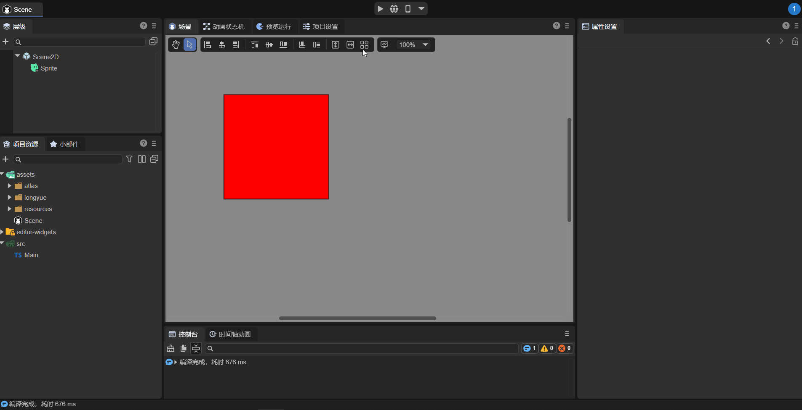
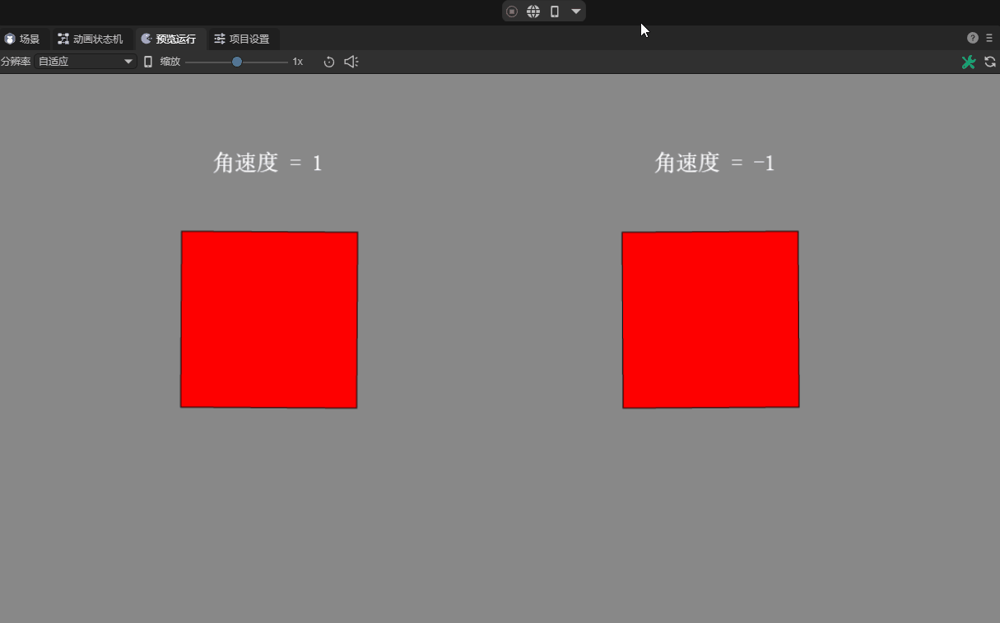
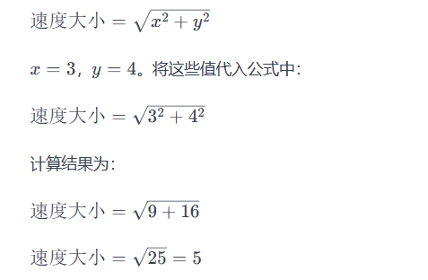
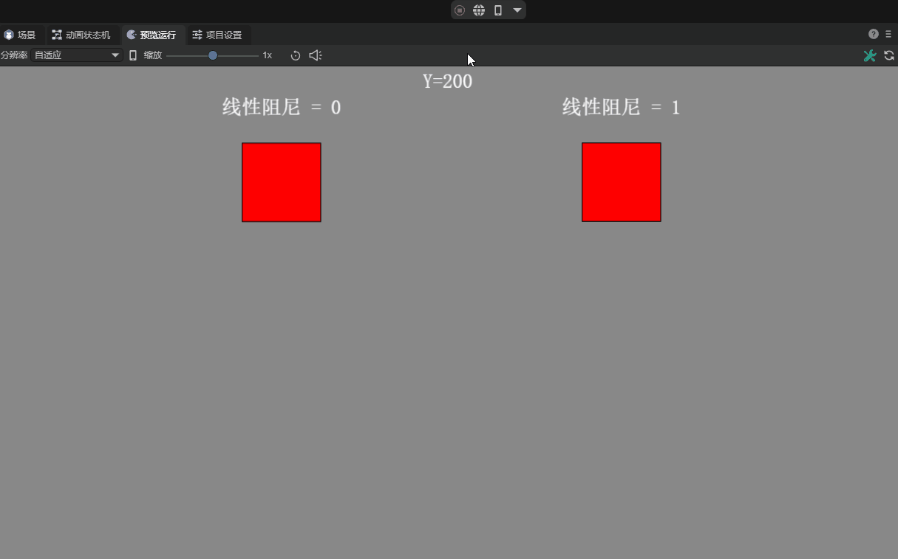
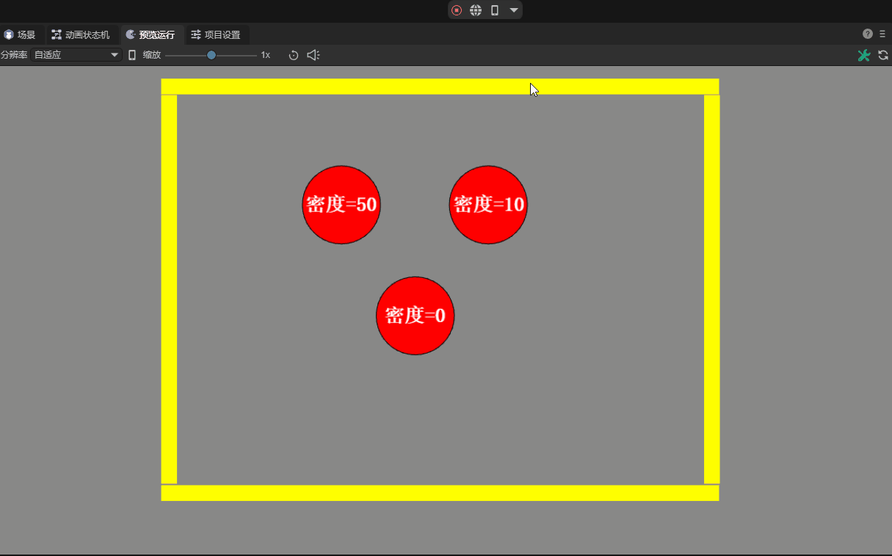
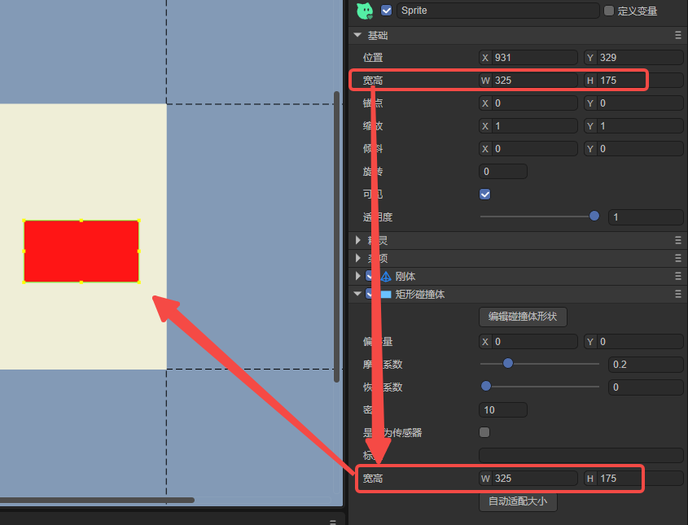

## LayaAir3-IDE可视化2D物理编辑详解

> Author : Charley     Version >= LayaAir 3.1
>

## 一、新手必读

### 1.1  前言

本篇涉及2D物理IDE可视化编辑的全部内容，也就是说，不需要写一行代码，就可以通过可视化操作完成了物理的配置与效果实现。

如果您是刚接触物理引擎的新手，本篇不可避免的会涉及一些物理学相关的基础概念，文档中会尽可能简要说明，让大家理解作用与效果。

但本篇重点在于介绍引擎物理组件属性的作用与如何使用，为了文档的连贯性，对于过于基础的概念，可能不会太详细的进行描述。

此时，如果涉及到某块基础概念不理解，或者想进一步深入理解，需根据关键字自行搜索补习相关的基础知识。

### 1.2   物理引擎长度需知（必读）

LayaAir3引擎内置支持Box2D物理引擎2.4.1版本。

在Box2D物理引擎中，长度的单位是一个抽象的概念，物理引擎只关心相对长度和比例关系，而不关心具体的实际物理单位。

所以，这对开发者而言，并不直观，LayaAir3引擎IDE为了直观的表达，默认将物理引擎中的1长度单位转换为50个渲染像素。

并且，在项目设置中开放了长度转换比率的设置，开发者可根据项目实际需求，自主进行调整，调整位置如图1所示：

 

(图1)

> 该设置与原生的Box2D物理引擎以及LayaAir3.1之前的版本有所不同，使用过旧版引擎的老用户请重点留意。

## 二、刚体 RigidBody

### 2.1 添加刚体组件

#### 2.1.1 什么是刚体

大家都知道，自然界一切有形体的物质，都可以叫物体。

**刚体**是力学中为了体现物体特性的一种科学抽象概念，也是一种理想状态的力学表达模型，**是指在运动中和受到力的作用后，形状和大小不变，而且内部各点的相对位置不变的物体。**

> 现实中不可能存在这种理想模型，物体在受力之后，会根据力、材料、弹性、 塑性等综合因素，决定是否改变或改变多少。 如果物体本身的变化不影响整个运动过程，为使被研究的问题简化，仍将该物体当作刚体来处理而忽略物体的体积和形状，这样所得结果仍与实际情况相当符合。
>

LayaAir引擎中的2D刚体组件类是 `Laya.RigidBody` ，继承自创建组件的基类 Component。

#### 2.1.2  如何添加刚体组件

在LayaAirIDE中，我们可以直接为2D节点添加刚体组件。如动图2-1所示。



(动图2-1)

> 在实际使用的时候，单独添加刚体的时候比较少，因为在添加碰撞体和关节的时候，会自动添加刚体

### 2.2 刚体类型 `type`

Box2D物理引擎的刚体类型`type`分为：

静态刚体`static`、动态刚体`dynamic`、运动学刚体`kinematic`，默认为动态刚体`dynamic`。 如图2-2所示。

  

(图2-2)

#### 2.2.1 静态刚体`static`

**静态刚体**通常用于表示不可移动的物体，如地面、墙壁等。静态刚体的质量和惯性是无限大的，因此它们不受外部力的作用，也不会对其他刚体施加力。

静态刚体的特点是：**始终静止不动**，无论施加怎样的力都不会移动， **不受重力影响**，**速度为零且不可设置** 。

#### 2.2.2 动态刚体`dynamic`

**动态刚体**是最常见的刚体类型，用于表示可以移动并受到外部力影响的物体，如角色、球体等。动态刚体具有质量和惯性，会根据外部力和扭矩的作用而移动和旋转。

动态刚体的特点是：**会根据受到的力进行运动**， **会受到重力的影响，可设置速度。**

#### 2.2.3 运动学刚体`kinematic`

 运动学刚体是介于静态和动态之间的类型。它们不受外部力的影响，但可以通过设置线性速度和角速度来移动，而不是受到外力的直接作用。运动学刚体通常用于控制关节、平台等。

运动学刚体的特点是：**不会根据受到的力进行移动**，**不受重力影响，可设置速度。**与静态刚体主要区别就是，通常会通过设置速度（线速度和角速度）使其移动。

#### 2.2.4 三种刚体类型特点对比表格

|                  | 静态刚体                   | 动态刚体         | 运动学刚体     |
| ---------------- | -------------------------- | ---------------- | -------------- |
| 是否受外部力影响 | 静止不动，且不受外部力影响 | **受外部力影响** | 不受外部力影响 |
| 是否受重力影响   | 不受重力影响               | **受重力影响**   | 不受重力影响   |
| 是否可设置速度   | 速度为零，且**不可设置**   | 可设置速度       | 可设置速度     |

### 2.3 重力

#### 2.3.1 什么是重力

重力是一种基本的自然力，是物体之间由于质量而产生的相互吸引力。根据万有引力定律，两个物体之间的引力与它们的质量成正比，与它们之间的距离的平方成反比。在地球表面附近，地球的质量导致物体朝向地心方向受到重力的作用，使其具有向下的加速度，通常被定义为9.8米/秒²。

在物理引擎中，重力是模拟现实世界中物体受到的引力效应的关键因素之一。物理引擎通过模拟重力可以使物体在仿真环境中按照自然规律受到牵引，落地，或者在斜面上滚动。引擎通常使用物体的质量和一个预定义的重力加速度值来计算物体所受的重力。这些计算可以基于经典力学的牛顿定律，通过使用离散的时间步长来模拟物体的运动。

物理引擎中的重力概念涉及到力的计算、运动的数学模型和仿真的时间步进。通过逼真地模拟重力，物理引擎能够提供更真实的虚拟环境，使开发者能够更容易地创建具有自然物理特性的游戏或其他应用。

#### 2.3.2 全局的重力参数设置`gravity`
$$
重力的表达式为 ：F = m ⋅ g　　（其中 F 是物体所受的重力，m 是物体的质量，g 是重力加速度。）
$$

在LayaAir3-IDE项目设置里，2D物理分组下的`重力加速度`是用于整个2D物理重力的全局参数设置，该设置支持X、Y两个方向的重力设置，默认是Y轴正方向（垂直向下）的重力加速度值9.8。如图3-1所示：

 

（图3-1）

在同等情况下，重力加速度的值越大，受重力影响的物体下落速度越快。

#### 2.3.3 重力缩放系数 `gravity Scale`

除了全局的重力加速度参数设置外，刚体的重力缩放系数属性，是用于独立影响单个动态刚体重力效果的参数。

该值乘以重力值，得到当前刚体最终受重力影响的值。该数值可以为正数或负数，也包括了正负小数。默认值为1，即正常的全局重力，如图3-2所示。

 

（图3-2）

如果数值为0则表示没有重力。大于1的数值表示正常重力的倍数，数值越大则重力越大。数值为负数，则表示反方向重力，数值越小则反方向的重力越大。如动图3-3所示。


(动图3-3)

> 注意：如果要使刚体受到重力的影响，需要添加碰撞体物理组件。

### 2.4 角速度 `angularVelocity`

角速度即物体围绕其质心的自旋转速度，是表示单位时间内的角位移物理量，标准国际单位是弧度每秒。

LayaAir3.1开始，为了用户更容易直观的理解和设置，该处直接**设置为角度值**即可。例如设置为90，如图4-1所示，表示每秒的速度为90度角对应的弧度值。

 

（图4-1）

当我们设置角速度属性为正值的时候，则按顺时针旋转。角速度属性为负值的时候，则按逆时针旋转。属性值的绝对值越大，旋转速度越快。角速度属性的默认值为0，此时不会旋转。效果如动图4-2所示。

 

(动图4-2)

### 2.5 角阻尼 `angularDampin`

在现实中，旋转的物体通常会由于外部阻力而逐渐减速。

角阻尼正是用来模拟刚体在旋转运动中逐渐减速的参数，它用于表示外界作用或自身原因引起逐渐下降的衰减特性。

具体而言，刚体的角阻尼则是相对于角速度的旋转阻尼系数，这意味着角阻尼会导致刚体的旋转速度逐渐减小。通过调整该值，可以控制刚体在旋转过程中的减速程度。默认值为0，表示没有阻尼。

有无角阻尼的对比效果，如动图5所示。

 

（动图5）

### 2.6 线性速度 `linearVelocity`

线性速度也可简称为线速度，是指刚体在运动中沿着直线路径的速度，而不考虑其旋转。

该属性用二维向量来表示，分别描述了刚体沿着X（水平方向）和Y轴（垂直方向）的线性速度分量。从3.1开始，这两个分量采用像素为单位。

并且，该向量值同时也是矢量值，包含大小和方向。

线速度的实际大小通过勾股定理（X平方加Y平方的根）计算得到，其大小表示物体运动的快慢。例如，X为3，Y为4，则线速度的大小为5，即5像素/秒。计算公式如图6-1所示。

 

(图6-1)

线速度的方向代表物体沿直线运动的方向，物理引擎通过计算线速度向量的Y分量与X分量的反正切(`Math.atan2`)值来获取角度，这个角度反映了速度向量相对于X轴的方向。计算公式如图6-2所示。

 

（图6-2）

默认值为0，在不受力的作用时，表示不进行线性运动。线速度效果如动图6所示。


（动图6-3）

### 2.7 线性阻尼 `linearDamping`

线性阻尼通常与刚体（RigidBody）的运动有关。刚体在运动过程中，除了受到外部的力之外，还可能受到一种与其速度成正比的阻尼力，该阻尼力被称为线性阻尼力。线性阻尼的引入可以模拟物体在流体或空气中运动时由于介质的阻碍而逐渐减缓速度并最终停止的现象。

开发者可以通过设置刚体的**线性阻尼**属性来调整刚体在运动过程中受到的线性阻尼力的强度。范围从0到无穷大。默认值为0，表示没有阻尼。有无阻尼的效果如动图7所示。

 

（动图7）

> 通常情况下，阻尼的值设置在0到1之间
>

### 2.8 子弹 `bullet`

当物体运动速度非常高时，传统的碰撞检测可能无法准确捕捉到碰撞的发生，导致隧穿等问题的出现。这是由于在碰撞检测的两个时间步之间，物体可能已经移动了一个较大的距离，离开了检测范围。这种情况下子弹属性的启用变得十分重要。

如动图8所示，启用子弹属性后，物理引擎采用更为精确的碰撞检测算法（连续碰撞检测CCD），即使在高速运动的情况下，也能够准确地检测到碰撞。而未开启弹属性的刚体在高速运动时出现了隧穿现象。

  

（动图8）

除了避免隧穿现象，子弹属性还可以用于避免高速移动的物体碰撞时可能产生的误差（如反弹或转动发生错误），以及避免高速刚体可能会对物理世界中的其他动态刚体造成剧烈冲击，从而影响整个物理世界的稳定性等问题的发生。

然而，需要注意的是，勾选启用子弹属性会增加物理引擎的计算负担。因为更为精确的碰撞检测需要更多的计算资源。因此，建议仅对确实需要进行高速运动的刚体启用该属性，以避免不必要的性能开销。

### 2.9 刚体休眠

物理引擎进行运动模拟时，是存在性能消耗的。当刚体停止运动时，其实我们可以不去模拟它。刚体设置为休眠状态就会跳过该刚体的模拟，直到被其它刚体解除才会醒来（关节被破坏或者手动唤醒也可以），从而节省性能的消耗。

#### 2.9.1 允许休眠 `allowSleep`

如图9-1所示，勾选`允许休眠`，当刚体长时间没有发生运动或受到外力时，物理引擎会将其置于休眠状态。允许刚体休眠可以减少不必要的计算，提高性能。

 

（图9-1）

但是从休眠恢复到计算，也可能会导致无法即时响应。是否启用休眠取决于具体需求和对性能的权衡。在大多数情况下，启用休眠通常是合理的选择。

#### 2.9.2 全局的刚体休眠功能开关

除了在刚体组件的休眠属性外，全局（项目设置面板）也有一个刚体功能的开关，如图9-2所示。

 

（图9-2）

需要注意的是，只有全局的**刚体休眠功能开关**是**勾选**启用的，**单个的刚体才可以设置是否允许休眠**。

否则，全局**去掉勾选**，则**表示所有的刚体都不得休眠**。这里建议保持全局的默认开启。

### 2.10 允许旋转 `allowRotation`

刚体的`允许旋转`是指当力或者冲击作用于该刚体时，它会按照物理规则进行自然旋转。这种旋转能够提供更加逼真的物理交互效果，比如当车辆碰撞或者物体掉落时的自然翻滚。如动图10-1所示。


(动图10-1)

如果把`允许旋转`的默认勾选去掉，则强制该刚体在整个物理模拟过程中保持不旋转，无论何种力学作用其上。这样的设置在某些游戏设计中也是有用的。例如，在一些需要刚体仅沿着特定轴移动或保持特别姿态的场景，禁用旋转能够简化物理响应，让游戏体验更加直接和可控。如动图10-2所示。不过，需要注意的是，这种非自然的物理限制可能会使碰撞的结果看起来不那么真实。


(动图10-2)

此外，在性能需求较高的情形下，关闭不必要的物体旋转也可能有助于提升物理模拟的效率，特别是在处理大量物体时。

### 2.11 碰撞相关的属性

#### 2.11.1 碰撞组 `group`

每一个刚体，我们都可以分配一个整数的碰撞组索引值。通过碰撞组的索引比对规则来决定两个刚体是否应该进行碰撞。

碰撞组规则如下：

1、如果两个刚体的**碰撞组**索引**相等**，且都大于零，它们将始终会发生碰撞。

2、如果两个刚体的**碰撞组**索引**相等**，但都小于零，它们将永远不会发生碰撞。

3、如果两个刚体的**碰撞组**索引**都等于0**，**或者**碰撞组的索引**不相等**，则碰撞行为的检测不再依靠碰撞组的索引值，而是使用刚体的碰撞类别和碰撞掩码来判断是否进行碰撞。

#### 2.11.2 碰撞类别`category`

碰撞类别是用来指定一个刚体属于哪个碰撞分类的，这个**类别**的值通常**使用2的N次幂作为属性值**，范围为[1, 2^31]，最多有32种不同的碰撞类别可用。

| 指数 | 2的N次幂 | 指数 | 2的N次幂 | 指数 | 2的N次幂 | 指数 | 2的N次幂   |
| ---- | -------- | ---- | -------- | ---- | -------- | ---- | ---------- |
| 0    | 1        | 8    | 256      | 16   | 65536    | 24   | 16777216   |
| 1    | 2        | 9    | 512      | 17   | 131072   | 25   | 33554432   |
| 2    | 4        | 10   | 1024     | 18   | 262144   | 26   | 67108864   |
| 3    | 8        | 11   | 2048     | 19   | 524288   | 27   | 134217728  |
| 4    | 16       | 12   | 4096     | 20   | 1048576  | 28   | 268435456  |
| 5    | 32       | 13   | 8192     | 21   | 2097152  | 29   | 536870912  |
| 6    | 64       | 14   | 16384    | 22   | 4194304  | 30   | 1073741824 |
| 7    | 128      | 14   | 32768    | 23   | 8388608  | 31   | 2147483648 |

#### 2.11.3 碰撞掩码 `mask`

碰撞掩码是用来声明当前刚体可能会与哪些碰撞类别的其他刚体发生碰撞的。

##### 碰撞规则：

当两个刚体的**碰撞组**索引**都等于0**，**或者**碰撞组的索引**不相等**时，刚体的碰撞类别和碰撞掩码`按位与`的计算结果非0，可以碰撞；为0，则不可以碰撞。

例如，碰撞类别为2（2进制是10）， 碰撞掩码为3（2进制是11），二进制的`按位与`运算，如示意图11-1所示：

 

(图11-1)

通过图11-1，我们可以看到，10是二进制`按位与`位运算的结果，而10的十进制对应值是2，非0，所以上面的示例可以发生碰撞。

开发者在设置不常用的数值时，可以在Devtools的控制台等工具中，通过`&`运算符直接用十进制数字来计算，从而确认碰撞关系，如图11-2所示：

 

(图11-2)

##### 掩码默认值-1的意义：

碰撞掩码默认值的默认值为-1，如图11-3所示：

 

(图11-3)

-1（所有二进制位都为1）与任何2的N次幂值进行`按位与`运算，都是幂值本身，**非0**，是**可以碰撞**的。

所以，相当于默认值就是一切都可以碰撞。

##### 指定碰撞目标的掩码：

如果想指定具体某个刚体作为碰撞目标，那么想碰哪个类别的刚体，就为`碰撞掩码`直接设置那个`碰撞类别`值即可。

有的时候，我们需要为多个碰撞类别（不同的刚体），指定一个共同的碰撞掩码。

从原理上，我们可以通过`按位或`，直接计算多个碰撞类别，得到的结果就是可以碰撞的掩码，如图11-4所示：

  

(图11-4)

通过上图的观察，细心的开发者可能发现，`按位或`得到的结果，就是要碰撞类别之和。

虽然本质是二进制位运算，但为了快速的设置碰撞掩码，直接将2的幂的碰撞类别总和作为可碰撞的掩码来理解也可以。

> 如果碰撞类别不是2的幂，是不能当作求和来理解的。这也是碰撞类别的值要设置为2的幂的原因之一。

##### 排除碰撞目标的掩码：

前文都是介绍如何指定想与谁发生碰撞，如果我们不想碰撞某些碰撞类别的刚体，如何设置掩码呢？

答案为，用-1去`异或`运算任何2的N次幂值，得到的结果再与该幂值进行`按位与`运算，一定是**为0**，也就是**不可以碰撞**的。

验证该理论的计算过程，如图11-5所示：

  

(图11-5)

通过异或的二进制方式，我们就可以快速指定要排除的碰撞刚体。例如，图11-5中的-25就可以排除碰撞类别为8和16的刚体，其它刚体均可以发生碰撞。

为了简化理解和快速设计，异或运算也有简单的掩码取值方法。那就是把要排除碰撞类别之和+1，然后再取负，即可。


## 三、碰撞体 `collider`

LayaAir引擎与IDE基于Box2D物理引擎的形状（shape）封装了更容易理解和使用的碰撞体（collider）。下面针对LayaAir3碰撞体进行介绍。

### 3.1 碰撞体与刚体的关系

碰撞体顾名思义，是用来检测碰撞的形状体组件。

**刚体**是作为碰撞体的载体，它定义了一个物体的物理性质（如刚体类型、重力、速度等），而**碰撞体**则定义了刚体的碰撞形状和与其他物体交互时的物理特性（如密度、摩擦力等）。

在物理世界中，进行碰撞检测和响应的实际是碰撞体，没有碰撞体的形状区域，只有刚体，则无法产生碰撞效果。

一个渲染节点对象，可以拥有多个不同形状的碰撞体，但只能有一个刚体。

### 3.2 碰撞体基类属性

碰撞体都继承于碰撞体基类`ColliderBase`，有着共有的基类属性。

所以，我们先介绍一下通用的属性和基类的属性。稍后再分别介绍各碰撞体的特有属性。

#### 3.2.1 偏移量

碰撞体的偏移量是指该碰撞体形状相对于所属节点坐标的偏移值，XY的默认值均为0，与节点坐标保持一致，如图12-1所示。

  

（图12-1）

#### 3.2.2 摩擦系数 `friction`

摩擦系数是一个描述两个接触表面之间相对滑动阻力大小的无量纲比值，定义为摩擦力与这两个表面上的垂直力之比。

在游戏开发和物理模拟中，摩擦系数用于确保物体运动的真实性和准确性。常用值在0到1之间， 0表示没有摩擦，1表示强摩擦。

对于非常光滑的表面（如冰面），摩擦系数可能接近0.01；对于日常生活中的接触表面，如橡胶与干燥路面，摩擦系数可能在0.1到1之间；动图12-2演示了不同摩擦系数的效果。


（动图12-2）

#### 3.2.3 恢复系数 `restitution`

恢复系数是描述碰撞过程中物体弹性的属性。我们可以想象一下打乒乓球、篮球等，以恢复的特性使其弹出或弹起。

具体而言，恢复系数表示物体在碰撞时弹射回的速度相对于碰撞前的速度的比例。当两个物体发生碰撞时，它们之间的相对速度会影响碰撞的结果。如果恢复系数为1，表示碰撞是完全弹性的，物体之间会以相同的速度反弹；而如果恢复系数为0，表示碰撞是非弹性的，物体在碰撞后会停止。效果如动图12-3所示：


（动图12-3）

#### 3.2.4 密度 `density`

密度属性定义了一个物体单位面积所拥有的质量。密度的作用体现在它可以影响游戏中的多个物理特性，例如质量、惯性、浮力等。

> 在现实中，密度是物体质量与其体积的比值。但在二维世界里，由于缺失了一个维度，所以使用面积代替体积来简化计算。

密度值可以为零或者是正数，如果为零，无论形状的面积是多少，质量都将为零。这将使得物理反应类似于静态刚体，不会受到外部的力或重力等影响。

密度值在通常情况下都是正数，密度值越大，那么同等面积下，它的质量就越大。过小的密度可能会导致物体的行为不稳定，而过大的密度可能会导致物体质量极大，计算的消耗也更大。合理设置密度对于实现逼真的物理模拟至关重要，IDE内的默认值为10。不同密度的对比效果如动图12-4所示：



（动图12-4）

> 当产生多物体堆叠在一起时，建议使用相似的密度，这样做可以使得堆叠更加稳定。
>

#### 3.2.5 是否为传感器 `isSensor`

当交互逻辑需要判断两个碰撞体是否碰撞发生，但又不需要有碰撞反应。这时候，可以通过传感器来完成。

勾选该属性，设置为传感器后，可以检测到与其他物体的碰撞事件，但不会对这些物体产生物理的碰撞影响。

例如，可用于监测角色是否到达某个特定区域导致游戏行为发生改变，又或者用于触发特定效果，比如声音和动画。

是否设置为传感器的不同效果区别，如动图12-5所示：


（动图12-5）

#### 3.2.6 标签 `label`

碰撞体的标签，用于脚本物理碰撞事件中的碰撞体识别，当自定义了标签名后，如图12-6所示。

 

(图12-6)

应对的示例代码：

```typescript
    onTriggerEnter(other: any): void {
        //other是碰撞到的碰撞体对象，根据碰撞到的标签处理对应的逻辑
        if (other.label === "buttle") {
            //碰撞到子弹后，增加积分，播放声音特效
            //省略若干代码……
        } else if (other.label === "ground") {
            //只要有一个盒子碰到地板，则停止游戏
            //省略若干代码……
        }
    }
```

#### 3.2.7  编辑碰撞体形状

点击编辑碰撞体形状，可以使得该碰撞体在场景面板中进入可视化的编辑状态，对其整体位置偏移或改变宽高的操作，鼠标离开碰撞体范围，编辑模式自动退出，再次编辑需要再次点击该按钮。演示效果如动图12-7所示：


(动图12-7)

### 3.3 矩形碰撞体 `BoxCollider`

> 公共的属性说明在上文的`碰撞体基类属性`，本节不再重复介绍

#### 3.3.1 宽高 `Size`

矩形碰撞体，是封闭的直角平行四边形碰撞框。

宽高是该碰撞体特有的属性，如图13-1所示，通过设置宽高改变碰撞体的大小。

  

(图13-1)

#### 3.3.2 自动适配大小 `autoFit`

碰撞体的所属节点宽高改变后，碰撞体大小不会自动跟随改变。

自动适配大小是指，通过该按钮一键将节点的宽高设置为碰撞体的宽高。如图13-2所示。

 

(图13-2)

### 3.5 圆形碰撞体 `CircleCollider`

> 公共的属性说明在上文的`碰撞体基类属性`，本节不再重复介绍
>

#### 3.5.1 半径 `radius`

圆形碰撞体是一种用于模拟圆形物体的碰撞形状。它通常由一个中心点和一个半径组成的封闭圆形框。

而**半径**正是圆形碰撞体特有的属性，其大小通过半径来控制，半径越大，该碰撞体的圆形框越大。效果如动图14-1所示：


(动图14-1)

#### 3.5.2 自动适配大小 `autoFit`

圆形碰撞体的自动适配大小与矩形碰撞体不同，

点击自动适配大小后，不仅会根据节点宽高中最长边的一半作为半径，还会修改节点的锚点值为0.5，

这样的好处是，不再以节点的左上角作为中心点，使得更符合圆形碰撞体的常用需求。效果如动图14-2所示。


（动图14-2）

### 3.6 多边形碰撞体 `PolygonCollider`

> 公共的属性说明在上文的`碰撞体基类属性`，本节不再重复介绍

#### 3.6.1 多边形点数据集的设置

多边形碰撞体用于表示由多个顶点组成的凸多边形物体。顶点数量不能低于3个且不能超过8个。多边形碰撞体可以用来模拟各种平面物体，比如箱子、三角形或其他多边形形状的物体。

在定义时，需要指定多边形的各个顶点，这些顶点默认按逆时针排列，并且必须构成一个凸形状。

#### 3.6.2 可视化设置点数据集

#### 3.6.3 反转数据


### 边缘碰撞体 `Edgecollider`

边缘碰撞体表示两个顶点之间的一条线段。它主要用于表示地形的边界或其他不需要填充的平面。由于它没有体积，所以不会发生质量相关的计算。

在创建一个边缘碰撞体时，通常需要指定两个端点。这种碰撞体一般不用于动态对象，因为它是无限薄的。


这个碰撞体与链条碰撞体`ChainCollider`非常相似。属性参数完全一样，外观看上去相似，尤其是同样都处于两点组成的线段时。

但是，区别在于点坐标集合`points`的值，边线碰撞体`EdgeCollider`只能是两个端点的直线线段，如图7-6所示。

 

（图7-6）

链条碰撞体`ChainCollider`可以是两个端点的线段也可以是多个点的折线，如图7-7所示：

 

（图7-7）

另外，**ChainCollider只能是单边产生碰撞，另一边是可以穿透过去的。边线碰撞体 `Edgecollider`可以两边都发生碰撞**。

需要注意的是，边线碰撞体与链条碰撞体都不受重力影响。而以前版本的物理，链条碰撞体ChainCollider是可以受重力影响的。

边线碰撞体可以与矩形碰撞体、圆形碰撞体和多边形碰撞体碰撞，但不能与它们自身碰撞，也不能与未闭合的链条碰撞体碰撞。因为Box2D使用的碰撞算法要求俩个碰撞体形状中至少有一个具有体积。


CircleCollider的fitsize与BoxCollider的fitsize作用其实一样，都是自动按节点来适配碰撞体大小，只不过规则不同而已。在4种不同的碰撞体种类里，只有BoxCollider与CircleCollider支持fitsize这种自动适配碰撞体大小的功能。

#### 2.2.6 链形碰撞体 `ChainCollider` 、

ChainCollider与PolygonCollider这两种碰撞体，除了继承的基类属性外，还有一个通用的属性Points。它们都是用x,y坐标点来表示一个线段节点，两个线段节点之间为线段或边，两种碰撞体都可以直接增加点，让ChainCollider成为任意多节的链条状碰撞体，让PolygonCollider成为任意凸多边形框状碰撞体。

##### 点坐标集合 `Points`

 

（图7-1）

Points的属性是一个由x,y坐标组成的点集合，每个x和y坐标为一个点，每一个坐标都是以逗号间隔区分。

除了直接在属性栏里输入坐标数值，在编辑界面中可以更快捷的操作。拖动线段或边上的点可改变位置，点击线段或边可增加新的线段点。双击线上或边上的点可以删除该点。

ChainCollider最少由2个点的线段组成，链接形状不能进行穿插自相交（不同的线形碰撞体可相交）。

PolygonCollider最少由3个点的封闭三角形组成，最多只能是8个点（超出会报错），并且只能是凸多边形。

所以，我们要注意，ChainCollider碰撞体为不自相交的形状或线段，PolygonCollider为一个整体的凸多边形。如下图7-2所示。

 

（图7-2）

> 凹多边形是不支持的，如果一定要凹多边形，可以用多个凸多边形组合拼接

链条碰撞体ChainCollider在LayaAir3.0中仅提供单侧碰撞。链条碰撞体的单侧碰撞方向取决于链条碰撞体的缠绕顺序，当链条碰撞体逆时针缠绕时，碰撞发线向外；顺时针缠绕时碰撞发线向内。如图7-3所示：

链形碰撞体ChainCollider只能是单侧碰撞。单侧碰撞的方向取决于链条碰撞体的缠绕顺序，规则如图7-3所示。当最终链的形状是呈逆时针缠绕时，碰撞的法线方向就是向外（从里向外可以发生碰撞，从外向里直接穿透）。当最终链的形状是呈顺时针缠绕时，碰撞的法线方向就是向内（也就是从外向里可以发生碰撞，从里向外直接穿透）。

 

（图7-3）

我们再放两组效果动图，让大家加深理解：

逆时针缠绕碰撞的动态演示如动图7-4所示：

  

（动图7-4）

顺时针缠绕碰撞的动态演示如动图7-5所示：

 

（动图7-5）

也许还会有开发者提出疑问，如果没有发生缠绕，例如直线，单边碰撞的规则是什么？

当处于水平直线时，

如果链的初始点在左边，末端点在右边，那么从下向上直接穿透，从上向下发生碰撞。

如果链的初始点在右边，未端点在左边，效果相反，从下向上碰撞，从上向下穿透。

具体效果，就不再放图了，开发者可以在LayaAirIDE里动手尝试体验一下。通常采用链形碰撞体大多会是缠绕的形状，非缠绕形态的直线，除非就是想使用单边碰撞效果，否则建议采用边线碰撞体。

#### 2.2.7 

### 2.3 关节 `Joint`

关节用于将刚体约束到物理世界或彼此约束。 譬如游戏中的提线木偶、钟摆等都是关节的应用。

LayaAir引擎封装了10种关节组件，可在IDE中直接添加使用，如图8所示。分别为：距离关节`DistanceJoint`、齿轮关节 `GearJoint`、马达关节`MotorJoint`、鼠标关节`MouseJoint`、平移关节`PrismaticJoint`、滑轮关节`PulleyJoint`、旋转关节`RevoluteJoint`、绳索关节`RopeJoint`、焊接关节`WeldJoint`、车轮关节`WheelJoint`。

 

（图8）

#### 2.3.1 距离关节`DistanceJoint`

距离关节描述了两个刚体锚点之间的距离，并且保持着这个约束的距离。 默认状态下像铁棍一样始终固定连接两点。也可以像弹簧一样连接着两个刚体点。

 

（图9-1）

##### 另一个刚体 `otherBody`

距离关节必须由两个刚体组成，otherBody属性用于绑定另一个刚体，此处需要拖拽层级面板中的目标节点或者目标节点刚体到该属性栏目。拖拽后，如图9-1所示。双击已绑定的otherBody属性输入栏，被绑定的目标刚体会在层级面板中被选中，方便我们快速定位被绑定的是哪个刚体。

至于两个刚体之间，谁是绑定或被绑定（otherBody）的关系，要综合实际业务逻辑考虑。仅是为了体现两者的约束关系，那谁是绑定者，并没有什么区别。

##### 另一个锚点 `otherbody`、自身锚点 `selfbody`

每一个刚体都有一个刚体锚点，默认是在自身刚体的左上角（自身`(0,0)`坐标），使用距离关节后，当选中距离关节，场景编辑面板中会出现一红一绿两个圆点，绿色圆点为自身锚点selfbody，红色锚点为otherBody绑定的另一个刚体锚点。如果开发者没有手动进行指定，则是绑定到IDE默认创建的另一个刚体初始坐标`(0,0)`。效果如下图9-2所示（图中的线是方便开发者观看用脚本挂载到Scene2D上实现的，下面是代码。红点和绿点也是方便开发者观看用截图工具的画笔画出来的引擎中并无红绿点）。

```
Laya.PhysicsDebugDraw.enable();
```

                                                                                                                                                                                                                                                                                   

（图9-2）

通常我们会指定锚点位置，例如钟摆的示例，如下图9-3所示。

 

（图9-3）

##### 振动频率 `frequency`

 

（图10-1）

默认情况下，关节之间的联系是固定的。要想让关节具有弹性，就可以调节`frequency`（振动频率）。

为了让大家更直观的理解，图10-2是个动图，左侧是`frequency`默认值，中间是`frequency`值为0.8，右侧是`frequency`值为3。

 

（动图10-2）

##### 阻尼率`damping`

 

 

（图11-1）

阻尼率`damping`会影响弹性的振动，0是无阻尼，也可以无穷大。但是建议取值0到1之间。

相对于动图10-2，我们将`damping`设置值为1，所以看到效果，如动图11-2所示，影响了振动的幅度和回弹效果。

 

（动图11-2）

##### 静止长度`length`

 

（图12-1）

`length`值是当约束的目标静止时，自身锚点到另一个锚点的距离长度（会受振动频率值影响）。默认值0是不设置长度。

上面的振动频率动图效果示例，我们去掉阻尼效果，把长度值都设置为20时，效果如动图12-2所示。

  

（动图12-2）

##### 连接刚体是否碰撞 `collideConnect`

 

（图13-1）

`collideConnect`是控制关节连接两端的刚体是否可以发生碰撞，当值为true是允许碰撞，所以连接的刚体就不会形成穿透现象，如动图13-2右侧的效果所示。不过，默认值为false，不发生物理碰撞，所以动图13-2左侧的两个球形刚体就直接穿透了。

 

（动图13-2）

##### 最小长度`minLength`

 

（图13-3）

最小长度`minLengh`属性，最小长度`minLength`设置的是俩个刚体锚点之间最小的距离长度，-1表示使用默认值。

##### 最大长度`maxLengh`

最大长度`maxLengh`属性，最大长度`maxLength`设置的是俩个刚体锚点之间最大的距离长度，-1表示使用默认值。

##### 注意要点：

距离关节的`otherBody`、`selfAnchor`、`otherAnchor`、`collideConnected`这几个属性全都是只读属性，只是在首次设置值有效（比如在IDE中设置属性值），不支持动态修改属性值。

#### 2.3.2 绳索关节`RopeJoint`（LayaAir2.12.1中删除）

> 绳索关节Rope Joint在LayaAir2.12.1中被删除，如有使用原绳索关节的，可以用此版本中的距离关节DistanceJoint来代替。

绳索关节与距离关节比较类似，稍有区别的是，距离关节有弹性（振动频率），并会受其影响；绳索关节只能通过maxLength设置固定的最大距离长度。

##### 最大长度 `maxLength`

 

（图14-1）

最大长度`maxLength`设置的是自己锚点与关节另一端锚点之间最大时的距离长度。无论在IDE如何摆放关节位置，运行时都会强行调整为`maxLength`属性设置的距离。正如下面动图14-2所示，图左是默认值1，图右是200的固定值。

 

（动图14-2）

##### 其它说明：

其它属性与距离关节一样去理解，就不再重复介绍了。

#### 2.3.3 鼠标关节 `MouseJoint`

鼠标关节用于通过鼠标来操控物体。它试图将物体拖向当前鼠标所在的位置。

##### 锚点 `anchor`

 

（图15-1）

关节的控制点，是相对自身刚体的左上角位置偏移，如果不设置，则根据鼠标点击点作为连接点

由于鼠标关节是刚体与鼠标之间的约束，所以默认情况下，鼠标点中这个刚体的哪里，锚点就在哪里。如动图15-2所示。

 

（动图15-2）

如果我们设置了锚点`anchor`的属性值为中心点（例如50,50），无论鼠标点中刚体的什么位置，都会以锚点为约束该关节的控制点。如动图15-3所示。

 

（动图15-3）

> `anchor`是只读属性，只是在首次设置值有效（比如在IDE中设置属性值），不支持动态修改属性值。

##### 最大力 `MaxForce`

 

（图16-1）

最大力是指鼠标在拖曳鼠标关节的目标刚体时，施加的最大作用力，默认值是10000。假如我们改成100，会发现，只有比较小的牵引力。比如，无法将目标刚体拖起。效果如动图15-2所示。

 

（动图16-2）

##### 其它说明：

其它属性与距离关节一样去理解，就不再重复介绍了。

#### 2.3.4 焊接关节`WeldJoint`

焊接关节的特点是约束两端的刚体不能相对运动，如同焊接起来的整体一样。

 

（动图17-1）

上面的动图17-1是对比距离关节的效果图，我们可以看到，右上摆动的梯形是受静态刚体约束的距离关节，我们用鼠标关节去撞击它，虽然约束的距离始终不变。但是运动方向却发生了改变。而左上的球形同样被静态刚体所约束着。但由于焊接关节的特性，左上的球性怎么去撞击，都不会发生运动，相当于焊接到静态刚体之上。

另外，我们注意到下面的焊接关节刚体，虽然两个刚体没有静态的，但也是如同一个整体一样，始终保持着相对的角度和位置。

那如果我们想让他既保持相对的位置，也可以灵活的动一下，可以通过设置振动频率`frequency`，让焊接起来的两个刚体保持一些弹性，如动图17-2所示。

 

（动图17-2）

##### 其它说明：

 

（图17-3）

其它属性可参考距离关节与鼠标关节去理解，就不再重复介绍了。

#### 2.3.5 滑轮关节 `PulleyJoint`

滑轮关节就是模拟改变施力方向杠杆的物理滑轮，当滑轮关节的其中一个刚体运动，滑轮另一端的刚体就会因约束而跟随运动。例如，当一个物体上升，另一个物体就会下降。效果如动图18-1所示：

 

（动图18-1）

> 动图18-1，对三角进行拖拽，结合了鼠标关节

##### 另一个范围点`otherGroundPoint`、自己的范围点`selfGroundPoint`

由于滑轮运动是基于杠杆原理的，那范围点就是运动的尽头，正如动图18-1所示，到达范围点后，就不会沿着原有运动方向继续运动。下面的图18-2，红圈中的绿色点就是滑轮约束自己的范围点`selfGroundPoint`，红圈中的红色点是滑轮约束连接的另一个范围点`otherGroundPoint`。

 

（图18-2）

初始的范围点与锚点是重合在一起，全都在`0,0`点的，需要按项目需求进行调整，如动图18-3所示。

 

（动图18-3）

##### 移动比率`ratio`

`ratio`属性值可以用来模拟滑轮组，它会使得一方的移动速度与距离是另一方的倍率关系。比如，我们为方块添加了滑轮关节，并设置`ratio`属性值为2.5。效果如动图18-4所示，很明显，左侧三角下降的速度与移动距离是右侧方块上升的2.5倍。

 

（动图18-5）

##### 其它说明：

- 滑轮关节的这些属性，均为只读属性，仅首次设置有效。
- 其它未介绍的属性可参照距离关节的属性介绍去理解。

#### 2.3.6 马达关节 `motorJoint`

马达关节是通过设置最大作用力与最大扭力，让A刚体（自己）到达目标位置（B刚体的偏移量）的一种约束。

即便B刚体处于运动中，那A刚体最终也会到达B刚体偏移量的相对目标位置，并且始终保持着相对的位置以及角度。

##### 线性偏移 `linearOffset`

 

（动图19-1）

线性偏移的值 ，就是基于B刚体（otherBody）的位置偏移量，当施加了力之后，动图19-2的左侧是默认值`0,0`效果，右侧是设置了`50,50`偏移值效果。

 

（动图19-2）

##### 角度偏移 `angularOffset`

 

（图19-3）

角度偏移的值，就是基于B刚体（otherBody）的旋转角度偏移量，当施加了扭力之后，动图19-4的左侧是没有设置角度偏移的效果（默认值0），右侧是设置旋转180度的角度偏移效果。

 

（动图19-4）

需要注意的是，`angularOffset`的属性值是弧度值，不是直接填写角度值。

> 弧度值计算公式：角度数 ×（π / 180）

##### 最大力 `maxForce` 与 最大扭力 `maxTorque`

 

（图19-5）

在物理引擎的计算中，为了满足约束条件，需要计算出一个受力，这个受力可能会很大。通常是为了提高计算的稳定性，需要设定一个最大受力的限制。

在马达关节里，

`maxForce`是用来限制为达到线性偏移`linearOffset`这个约束条件时受到力的最大值。

`maxTorque`是用来限制为达到角度偏移 `angularOffset`这个约束条件时受到扭力的最大值。

最大力与最大扭力的默认值都是1000，开发者可以根据实际需求来调节。如果设置为0，则被限制在0这个最大受力上，会导致无法达成约束条件。例如，无法到线性偏移位置，或者无法到达偏移的角度。

之前的动图19-2与动图19-4，就是分别设置了最大力与最大扭力的效果。

##### 修正系数 `correctionFactor`

 

（图19-6）

修正系数是修正自己刚体到达目标刚体位置时的位移速度参数。取值范围是0-1，值越大移动的速度越快。

 

（动图19-7）

动图19-7的左侧是默认值0.3，右侧值是0.05，很明显，0.05慢很多。

#### 2.3.7 旋转关节 `RevoluteJiont`

旋转关节会迫使两个刚体共享同一个锚点，这个共享的锚点通常被称为铰链点。旋转关节只有一个自由度，两个刚体处于相对旋转。

> 跳过之前小节介绍过的属性，不理解的可以前翻

##### 启动马达 `enableMotor`、 马达速度 `motorSpeed`

 

（图20-1）

想让旋转关节转起来，我们需要启动马达，将`enableMotor`属性值设置为`true`。

> 马达开启后，马达速度与最大马达扭力的值才会有效果。

然后设置马达的最大转动速度`motorSpeed`，通过动图20-2所示的效果看出，左侧明显转动的更快，这就是左侧设置马达转速值高于右侧的效果。

 

（动图20-2）

为了仅演示转速对比效果，动图20-2固定了三角刚体。如果三角刚体恢复为默认的动态刚体，当马达转速高的时候，我们就可以看到相对旋转的关节运动效果，如动图20-3所示。

 

（动图20-3）

##### 最大马达扭力 `maxMotorTorque`

 

(图20-4)

最大马达扭力是为马达施加的最大扭力。值越大，初始旋转的作用力越高。为0时，无法旋转。

在之前的动图效果中，由于`motorSpeed`是最大转速值，而最大马达扭力`maxMotorTorque`的默认值为10000，所以一开始就有一个较高的速度。

当我们把`maxMotorTorque`值设置为一个较小的值时，则会发现，初始转速会较慢，然后逐渐达到motorSpeed属性值的设置。效果如动图20-5的中间所示。

 

(动图20-5)

并且我们可以看到，动图20-5的左侧甚至没有转起来，这就是由于`maxMotorTorque`设置为0导致的。

另外要注意的是，即便是`maxMotorTorque`值设置的很大，当 `motorSpeed`值设置比较小，那转速还是会受到最高马达转速的限制，不会越来越快。效果如动图20-5的右侧所示。

##### 启用约束`enableLimit` 、下限角度`lowerAngle`、上限角度`upperAngle`

 

(图20-6)

当启用约束（`enableLimit`为`true`）后，下限角度`lowerAngle`与上限角度`upperAngle`这两个属性才会生效。

下限角度`lowerAngle`是弧度值来设置旋转关节的最小旋转角度，当马达的扭力不足时，甚至是不启动马达，这个最小角度的设置依然有效。

上限角度`upperAngle`是弧度值来设置旋转关节的最大旋转角度。即便马达的扭力再大，仍然会受到这个最大角度设置的限制。

具体效果如动图20-7所示，

 

(动图20-7)

#### 2.3.8 平移关节 `PrismaticJoint`

`PrismaticJoint`的关节特性是将两个刚体锁定在一个指定的平移轴进行相向或相背移动，平移关节只有一个自由度，无法旋转。所以尽管prismatic直译过来是棱柱的，但我们把`PrismaticJoint`叫做平移关节或者移动关节更容易理解记忆。

##### 轴向`axis`、开启马达`enableMotor`、马达速度`motorSpeed`、最大马达力`maxMotorForce`

 

（图21-1)

之前在介绍马达关节的时候，有两种力，作用力与扭力。

上个小节的旋转关节只用到了马达的扭力。这个小节的平移关节只用到了马达的作用力。

所以，与旋转关节类似，在使用平移关节的时候，也是要先开启马达（`enableMotor`设置为`true`），才会有移动效果。只是旋转关节的最大马达扭力在这里换成了平移的作用力`maxMotorForce`。马达的速度`motorSpeed`也变成了启用马达后的最大移动速度。

而移动的方向，就取决于轴向属性`axis`了，这个属性值是一个向量值，默认`1,0`是表示沿X轴向右移动，反之，沿X轴向左移动设置`-1,0`即可。具体效果可参考动图21-2所示。

 

(动图21-2)

##### 启用约束`enableLimit`、平移下限`lowerTranslation`、平移上限`upperTranslation`

 

(图21-3)

当启用平移关节的约束（`enableLimit`设置为`true`）后，与旋转关节类似，平移的范围也有下限和上限。

平移下限`lowerTranslation`是指移动的最短距离是离锚点`anchor`有多远。即便没有启用马达力，也会受这个限制影响。

平移上限`upperTranslation`是指移动的最长距离可以离锚点`anchor`有多远，达到限制后，无论设置多大的马达力，也不会再移动。

下限与上限的对比效果如动图21-4所示。

 

(动图21-4)

#### 2.3.9 齿轮关节 `GearJoint`

 

(图22-1)

要绑定的第一个关节，类型可以是RevoluteJoint或者PrismaticJoint

##### 绑定关节`joint`

通过图22-1，我们看到齿轮关节`joint1`与`joint2`绑定的不再是刚体，而是两个关节，而且必须是旋转关节或者平移关节。

这是因为，齿轮关节就是通过一个齿轮带动另一个齿轮进行旋转或者平移运动，来模拟现实中的齿轮效果。

 

（动图22-2）

在动图22-2中，我们就是使用了两个平移关节和两个旋转关节组成了一组复合的齿轮关节。

齿轮的关节，仅从IDE上的属性数量上来看，貌似最简单。其实对新手来说是一个不太容易直观理解的关节，在这个小节中，详细描述一下齿轮关节的制作方式，供开发者作为参考。

首先，我们要了解齿轮关节的本质，就是用一个关节的马达动力来驱动所有的关联关节。

所以，我们先设置一个动力关节，例如动图22-2中，我们用最上面的平移关节，作为齿轮的动力关节。

> Tips：
>
> 要想不让关节掉下来，要把所有的关节刚体重力值设置为0，否则会直接掉下去。
>
> 需要受力而运动的刚体不要设置为静力学或者运动学类型，否则会导致无法通过力来使其运动起来。

##### 第一步：

 

(图22-3)

如图22-3所示，我们为一个叫box的节点添加了刚体和矩形碰撞体。然后添加平移关节，并设置平移的方向（轴`axis`），开启马达（`enableMotor`），设置移动速度(`motorSpeed`)。

> 注意这里，关节属性上，不需要绑定其它的约束刚体（`otherBody`）。
>
> 在本个齿轮示例的后面，所有的关节属性上都没有绑定其它的约束刚体。

##### 第二步：

 

(图22-4)

如图22-4所示，我们为一个名为laya1的节点添加刚体和圆形碰撞体，然后添加旋转关节，设置锚点为中心点即可。马达等开关都不用管，保持默认的关闭就行。因为我们为laya1添加齿轮关节，并将laya1节点的旋转关节与box节点的平移关节关联起来之后（如图22-4箭头所指），box节点的平移关节马达，就会为laya1的旋转关节提供动力。

其实，到此，齿轮关节的完整制作方式已经完成。运行起来，我们就可以看到沿x轴向左平移运动的box正带动着laya1作逆时针旋转。

##### 第N步：

当需要更多齿轮结构的时候，所有的后续关节，我们衔接的方式，无论是旋转关节，还是平移关节，要想成为齿轮组成员之一，不仅要添加好对应的物理关节，还要同时为其所属的节点也添加上齿轮关节。而绑定关系，就是把自己的旋转关节或者平移关节绑到齿轮关节的joint1或者jonit2上。另一个绑定你打算与其发生齿轮咬合关系的关节。可参考图22-5与图22-4所示。基本上都是在重复第二步的操作流程。

 	

(图22-5)

##### 齿轮系数 `ratio`

齿轮系数与之前在滑轮关节介绍的移动比率类似，是一个比率值。对于平移是影响移动的速率，对于旋转是影响转动的速率，其值可以为负数。

#### 2.3.10 车轮关节`WheelJoint`

车轮关节是专为车辆而设计的，它同时提供了平移和旋转，平移的时候有弹簧和阻尼减震来模拟汽车悬架。而旋转马达可以用来模拟汽车的启动与刹车。

> 前面小节中介绍过的属性在这个小节就不再次说明了，不理解的可以往前翻。

##### LayaAir2.12.1新增属性：

刚体移动范围约束`enableLimit`

 

（图23-1）

是否对刚体的移动范围加以约束

当启用约束（`enableLimit`为`true`）后，移动范围下限`lowerTranslation`与移动范围上限`upperTranslation`才会生效。

移动范围下限`lowerTranslation`

 

（图23-2）

启用约束后，刚体移动范围的下限，是距离anchor的偏移量

刚体移动范围的下限`lowerTranslation`是指移动的最短距离距锚点`anchor`可以多远，即便没有启用马达力，也会受此限制的影响。

移动范围上限`upperTranslation`

 

（图23-3）

启动约束后，刚体移动范围的上限，是距离anchor的偏移量

刚体移动范围的上限`upperTranslation`是指移动的最长距离距锚点`anchor`可以多远，到达限制后，无论设置多大马达力都不会再移动。

##### 车轮关节的注意要点

###### 绑定刚体

在车轮关节里，所有的旋转车轮都可以绑定同一个车身刚体，如图23-1所示。

  

(图23-4)

###### 锚点

由于车轮是以自己的圆心为轴心进行旋转，一定要把轮子圆心点作为车轮关节的控制锚点`anchor`，如图23-1右侧的车轮关节`anchor`属性配置。

###### 震动频率

震动频率其实就是弹簧的弹性系数，引擎中的默认值是5，大家可以根据业务需求来调节，但不要过小，否则可能会导致轮子与车体的组合不稳定。

##### 效果展示

最后我们将调整好属性值的车轮关节运行效果展示出来，如动图23-2所示。

 

(动图23-5)

## 三、物理碰撞的生命周期

之前介绍的所有物理属性，开发者都可以在IDE里调节属性值，然后直接运行起来查看效果，不需要写一行代码。

从这个章节里，我们就了解一下脚本中有哪些物理生命周期方法。

> 如果有对生命周期也不理解的新手，请先去Layabox官网文档的组件化开发相关文档去补一下基础。

### 3.1 onTriggerEnter

`onTriggerEnter`是在发生物理碰撞时，也就是碰撞生命周期内的第一次进入碰撞，自动执行的生命周期虚方法。

### 3.2 onTriggerStay

`onTriggerStay`是在发生持续的物理碰撞时，也就是碰撞生命周期内的第二次碰撞到碰撞离开前，每帧都在触发，自动执行的生命周期虚方法。

### 3.3 onTriggerExit

`onTriggerExit`是在物理碰撞结束时，自动执行的生命周期虚方法。

> Tips:
>
> 以上的方法是发生在每一次碰撞发生的完整生命周期内，例如，从进入到离开为“Enter,Stay,Stay,……,Exit”
>
> 我们在为显示节点设置了碰撞体之后，开发者可以为这些节点挂接Script脚本。在脚本中直接重写以上虚方法的代码逻辑。当运行触发了这些物理碰撞条件，就可以自动执行相应的代码逻辑。