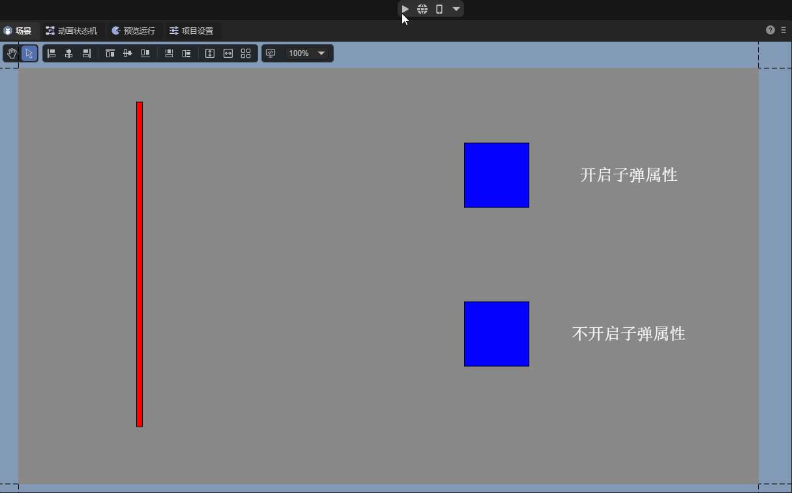
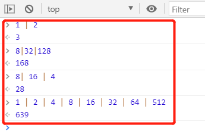
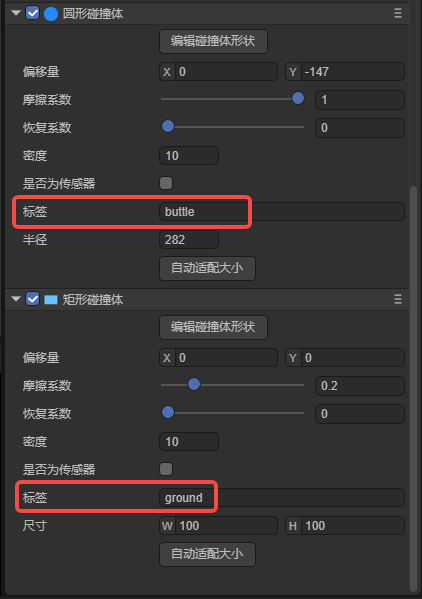
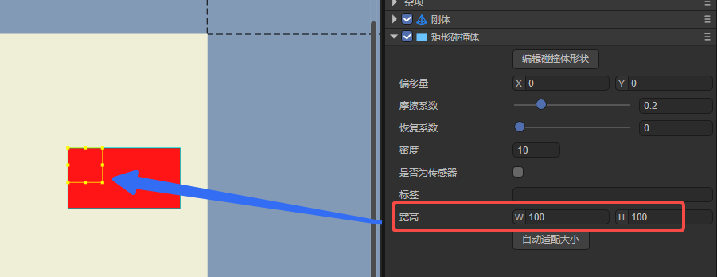
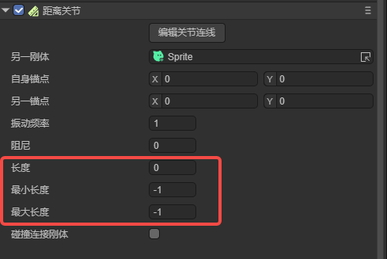

## LayaAir3-IDE可视化2D物理编辑详解

> Author : Charley     Version >= LayaAir 3.1
>

## 一、新手必读

### 1.1  前言

本篇涉及2D物理IDE可视化编辑的全部内容，也就是说，不需要写一行代码，就可以通过可视化操作完成了物理的配置与效果实现。

如果您是刚接触物理引擎的新手，本篇不可避免的会涉及一些物理学相关的基础概念，文档中会尽可能简要说明，让大家理解作用与效果。

但本篇重点在于介绍引擎物理组件属性的作用与如何使用，为了文档的连贯性，对于过于基础的概念，可能不会太详细的进行描述。

此时，如果涉及到某块基础概念不理解，或者想进一步深入理解，需根据关键字自行搜索补习相关的基础知识。

### 1.2   物理引擎长度需知（必读）

> LayaAir3引擎内置支持Box2D物理引擎2.4.1版本。本篇文档全部内容均是基于该版本的物理引擎。
>

在Box2D物理引擎中，长度的单位是一个抽象的概念，物理引擎只关心相对长度和比例关系，而不关心具体的实际物理单位。

所以，这对开发者而言，并不直观，LayaAir3引擎IDE为了直观的表达，默认将物理引擎中的1长度单位转换为50个渲染像素。

并且，在项目设置中开放了长度转换比率的设置，开发者可根据项目实际需求，自主进行调整，调整位置如图1所示：

 

(图1)

> 该设置与原生的Box2D物理引擎以及LayaAir3.1之前的版本有所不同，使用过旧版引擎的老用户请重点留意。

## 二、刚体 RigidBody

### 2.1 添加刚体组件

#### 2.1.1 什么是刚体

大家都知道，自然界一切有形体的物质，都可以叫物体。

**刚体**是力学中为了体现物体特性的一种科学抽象概念，也是一种理想状态的力学表达模型，**是指在运动中和受到力的作用后，形状和大小不变，而且内部各点的相对位置不变的物体。**

> 现实中不可能存在这种理想模型，物体在受力之后，会根据力、材料、弹性、 塑性等综合因素，决定是否改变或改变多少。 如果物体本身的变化不影响整个运动过程，为使被研究的问题简化，仍将该物体当作刚体来处理而忽略物体的体积和形状，这样所得结果仍与实际情况相当符合。
>

LayaAir引擎中的2D刚体组件类是 `Laya.RigidBody` ，继承自创建组件的基类 Component。

#### 2.1.2  如何添加刚体组件

在LayaAirIDE中，我们可以直接为2D节点添加刚体组件。如动图2-1所示。


(动图2-1)

> 在实际使用的时候，单独添加刚体的时候比较少，因为在添加碰撞体和关节的时候，会自动添加刚体

### 2.2 刚体类型 `type`

Box2D物理引擎的刚体类型`type`分为：

静态刚体`static`、动态刚体`dynamic`、运动学刚体`kinematic`，默认为动态刚体`dynamic`。 如图2-2所示。

  

(图2-2)

#### 2.2.1 静态刚体`static`

**静态刚体**通常用于表示不可移动的物体，如地面、墙壁等。静态刚体的质量和惯性是无限大的，因此它们不受外部力的作用，也不会对其他刚体施加力。

静态刚体的特点是：**始终静止不动**，无论施加怎样的力都不会移动， **不受重力影响**，**速度为零且不可设置** 。

#### 2.2.2 动态刚体`dynamic`

**动态刚体**是最常见的刚体类型，用于表示可以移动并受到外部力影响的物体，如角色、球体等。动态刚体具有质量和惯性，会根据外部力和扭矩的作用而移动和旋转。

动态刚体的特点是：**会根据受到的力进行运动**， **会受到重力的影响，可设置速度。**

#### 2.2.3 运动学刚体`kinematic`

 运动学刚体是介于静态和动态之间的类型。它们不受外部力的影响，但可以通过设置线性速度和角速度来移动，而不是受到外力的直接作用。运动学刚体通常用于控制关节、平台等。

运动学刚体的特点是：**不会根据受到的力进行移动**，**不受重力影响，可设置速度。**与静态刚体主要区别就是，通常会通过设置速度（线速度和角速度）使其移动。

#### 2.2.4 三种刚体类型特点对比表格

|                  | 静态刚体                   | 动态刚体         | 运动学刚体     |
| ---------------- | -------------------------- | ---------------- | -------------- |
| 是否受外部力影响 | 静止不动，且不受外部力影响 | **受外部力影响** | 不受外部力影响 |
| 是否受重力影响   | 不受重力影响               | **受重力影响**   | 不受重力影响   |
| 是否可设置速度   | 速度为零，且**不可设置**   | 可设置速度       | 可设置速度     |

### 2.3 重力

#### 2.3.1 什么是重力

重力是一种基本的自然力，是物体之间由于质量而产生的相互吸引力。根据万有引力定律，两个物体之间的引力与它们的质量成正比，与它们之间的距离的平方成反比。在地球表面附近，地球的质量导致物体朝向地心方向受到重力的作用，使其具有向下的加速度，通常被定义为9.8米/秒²。

在物理引擎中，重力是模拟现实世界中物体受到的引力效应的关键因素之一。物理引擎通过模拟重力可以使物体在仿真环境中按照自然规律受到牵引，落地，或者在斜面上滚动。引擎通常使用物体的质量和一个预定义的重力加速度值来计算物体所受的重力。这些计算可以基于经典力学的牛顿定律，通过使用离散的时间步长来模拟物体的运动。

物理引擎中的重力概念涉及到力的计算、运动的数学模型和仿真的时间步进。通过逼真地模拟重力，物理引擎能够提供更真实的虚拟环境，使开发者能够更容易地创建具有自然物理特性的游戏或其他应用。

#### 2.3.2 全局的重力参数设置`gravity`
$$
重力的表达式为 ：F = m ⋅ g　　（其中 F 是物体所受的重力，m 是物体的质量，g 是重力加速度。）
$$

在LayaAir3-IDE项目设置里，2D物理分组下的`重力加速度`是用于整个2D物理重力的全局参数设置，该设置支持X、Y两个方向的重力设置，默认是Y轴正方向（垂直向下）的重力加速度值9.8。如图3-1所示：

 

（图3-1）

在同等情况下，重力加速度的值越大，受重力影响的物体下落速度越快。

#### 2.3.3 重力缩放系数 `gravity Scale`

除了全局的重力加速度参数设置外，刚体的重力缩放系数属性，是用于独立影响单个动态刚体重力效果的参数。

该值乘以重力值，得到当前刚体最终受重力影响的值。该数值可以为正数或负数，也包括了正负小数。默认值为1，即正常的全局重力，如图3-2所示。

 

（图3-2）

如果数值为0则表示没有重力。大于1的数值表示正常重力的倍数，数值越大则重力越大。数值为负数，则表示反方向重力，数值越小则反方向的重力越大。如动图3-3所示。


(动图3-3)

> 注意：如果要使刚体受到重力的影响，需要添加碰撞体物理组件。

### 2.4 角速度 `angularVelocity`

角速度即物体围绕其质心的自旋转速度，是表示单位时间内的角位移物理量，标准国际单位是弧度每秒。

LayaAir3.1开始，为了用户更容易直观的理解和设置，该处直接**设置为角度值**即可。例如设置为90，如图4-1所示，表示每秒的速度为90度角对应的弧度值。

 

（图4-1）

当我们设置角速度属性为正值的时候，则按顺时针旋转。角速度属性为负值的时候，则按逆时针旋转。属性值的绝对值越大，旋转速度越快。角速度属性的默认值为0，此时不会旋转。效果如动图4-2所示。

 

(动图4-2)

### 2.5 角阻尼 `angularDampin`

在现实中，旋转的物体通常会由于外部阻力而逐渐减速。

角阻尼正是用来模拟刚体在旋转运动中逐渐减速的参数，它用于表示外界作用或自身原因引起逐渐下降的衰减特性。

具体而言，刚体的角阻尼则是相对于角速度的旋转阻尼系数，这意味着角阻尼会导致刚体的旋转速度逐渐减小。通过调整该值，可以控制刚体在旋转过程中的减速程度。默认值为0，表示没有阻尼。

有无角阻尼的对比效果，如动图5所示。

 

（动图5）

### 2.6 线性速度 `linearVelocity`

线性速度也可简称为线速度，是指刚体在运动中沿着直线路径的速度，而不考虑其旋转。

该属性用二维向量来表示，分别描述了刚体沿着X（水平方向）和Y轴（垂直方向）的线性速度分量。从3.1开始，这两个分量采用像素为单位。

并且，该向量值同时也是矢量值，包含大小和方向。

线速度的实际大小通过勾股定理（X平方加Y平方的根）计算得到，其大小表示物体运动的快慢。例如，X为3，Y为4，则线速度的大小为5，即5像素/秒。计算公式如图6-1所示。

 

(图6-1)

线速度的方向代表物体沿直线运动的方向，物理引擎通过计算线速度向量的Y分量与X分量的反正切(`Math.atan2`)值来获取角度，这个角度反映了速度向量相对于X轴的方向。计算公式如图6-2所示。

 

（图6-2）

默认值为0，在不受力的作用时，表示不进行线性运动。线速度效果如动图6所示。


（动图6-3）

### 2.7 线性阻尼 `linearDamping`

线性阻尼通常与刚体（RigidBody）的运动有关。刚体在运动过程中，除了受到外部的力之外，还可能受到一种与其速度成正比的阻尼力，该阻尼力被称为线性阻尼力。线性阻尼的引入可以模拟物体在流体或空气中运动时由于介质的阻碍而逐渐减缓速度并最终停止的现象。

开发者可以通过设置刚体的**线性阻尼**属性来调整刚体在运动过程中受到的线性阻尼力的强度。范围从0到无穷大。默认值为0，表示没有阻尼。有无阻尼的效果如动图7所示。

 

（动图7）

> 通常情况下，阻尼的值设置在0到1之间
>

### 2.8 子弹 `bullet`

当物体运动速度非常高时，传统的碰撞检测可能无法准确捕捉到碰撞的发生，导致隧穿等问题的出现。这是由于在碰撞检测的两个时间步之间，物体可能已经移动了一个较大的距离，离开了检测范围。这种情况下子弹属性的启用变得十分重要。

如动图8所示，启用子弹属性后，物理引擎采用更为精确的碰撞检测算法（连续碰撞检测CCD），即使在高速运动的情况下，也能够准确地检测到碰撞。而未开启弹属性的刚体在高速运动时出现了隧穿现象。

  

（动图8）

除了避免隧穿现象，子弹属性还可以用于避免高速移动的物体碰撞时可能产生的误差（如反弹或转动发生错误），以及避免高速刚体可能会对物理世界中的其他动态刚体造成剧烈冲击，从而影响整个物理世界的稳定性等问题的发生。

然而，需要注意的是，勾选启用子弹属性会增加物理引擎的计算负担。因为更为精确的碰撞检测需要更多的计算资源。因此，建议仅对确实需要进行高速运动的刚体启用该属性，以避免不必要的性能开销。

### 2.9 刚体休眠

物理引擎进行运动模拟时，是存在性能消耗的。当刚体停止运动时，其实我们可以不去模拟它。刚体设置为休眠状态就会跳过该刚体的模拟，直到被其它刚体解除才会醒来（关节被破坏或者手动唤醒也可以），从而节省性能的消耗。

#### 2.9.1 允许休眠 `allowSleep`

如图9-1所示，勾选`允许休眠`，当刚体长时间没有发生运动或受到外力时，物理引擎会将其置于休眠状态。允许刚体休眠可以减少不必要的计算，提高性能。

 

（图9-1）

但是从休眠恢复到计算，也可能会导致无法即时响应。是否启用休眠取决于具体需求和对性能的权衡。在大多数情况下，启用休眠通常是合理的选择。

#### 2.9.2 全局的刚体休眠功能开关

除了在刚体组件的休眠属性外，全局（项目设置面板）也有一个刚体功能的开关，如图9-2所示。

 

（图9-2）

需要注意的是，只有全局的**刚体休眠功能开关**是**勾选**启用的，**单个的刚体才可以设置是否允许休眠**。

否则，全局**去掉勾选**，则**表示所有的刚体都不得休眠**。这里建议保持全局的默认开启。

### 2.10 允许旋转 `allowRotation`

刚体的`允许旋转`是指当力或者冲击作用于该刚体时，它会按照物理规则进行自然旋转。这种旋转能够提供更加逼真的物理交互效果，比如当车辆碰撞或者物体掉落时的自然翻滚。如动图10-1所示。


(动图10-1)

如果把`允许旋转`的默认勾选去掉，则强制该刚体在整个物理模拟过程中保持不旋转，无论何种力学作用其上。这样的设置在某些游戏设计中也是有用的。例如，在一些需要刚体仅沿着特定轴移动或保持特别姿态的场景，禁用旋转能够简化物理响应，让游戏体验更加直接和可控。如动图10-2所示。不过，需要注意的是，这种非自然的物理限制可能会使碰撞的结果看起来不那么真实。


(动图10-2)

此外，在性能需求较高的情形下，关闭不必要的物体旋转也可能有助于提升物理模拟的效率，特别是在处理大量物体时。

### 2.11 碰撞相关的属性

#### 2.11.1 碰撞组 `group`

每一个刚体，我们都可以分配一个整数的碰撞组索引值。通过碰撞组的索引比对规则来决定两个刚体是否应该进行碰撞。

碰撞组规则如下：

1、如果两个刚体的**碰撞组**索引**相等**，且都大于零，它们将始终会发生碰撞。

2、如果两个刚体的**碰撞组**索引**相等**，但都小于零，它们将永远不会发生碰撞。

3、如果两个刚体的**碰撞组**索引**都等于0**，**或者**碰撞组的索引**不相等**，则碰撞行为的检测不再依靠碰撞组的索引值，而是使用刚体的碰撞类别和碰撞掩码来判断是否进行碰撞。

#### 2.11.2 碰撞类别`category`

碰撞类别是用来指定一个刚体属于哪个碰撞分类的，这个**类别**的值通常**使用2的N次幂作为属性值**，范围为[1, 2^31]，最多有32种不同的碰撞类别可用。

| 指数 | 2的N次幂 | 指数 | 2的N次幂 | 指数 | 2的N次幂 | 指数 | 2的N次幂   |
| ---- | -------- | ---- | -------- | ---- | -------- | ---- | ---------- |
| 0    | 1        | 8    | 256      | 16   | 65536    | 24   | 16777216   |
| 1    | 2        | 9    | 512      | 17   | 131072   | 25   | 33554432   |
| 2    | 4        | 10   | 1024     | 18   | 262144   | 26   | 67108864   |
| 3    | 8        | 11   | 2048     | 19   | 524288   | 27   | 134217728  |
| 4    | 16       | 12   | 4096     | 20   | 1048576  | 28   | 268435456  |
| 5    | 32       | 13   | 8192     | 21   | 2097152  | 29   | 536870912  |
| 6    | 64       | 14   | 16384    | 22   | 4194304  | 30   | 1073741824 |
| 7    | 128      | 14   | 32768    | 23   | 8388608  | 31   | 2147483648 |

#### 2.11.3 碰撞掩码 `mask`

碰撞掩码是用来声明当前刚体可能会与哪些碰撞类别的其他刚体发生碰撞的。

##### 碰撞规则：

当两个刚体的**碰撞组**索引**都等于0**，**或者**碰撞组的索引**不相等**时，刚体的碰撞类别和碰撞掩码`按位与`的计算结果非0，可以碰撞；为0，则不可以碰撞。

例如，碰撞类别为2（2进制是10）， 碰撞掩码为3（2进制是11），二进制的`按位与`运算，如示意图11-1所示：

 

(图11-1)

通过图11-1，我们可以看到，10是二进制`按位与`位运算的结果，而10的十进制对应值是2，非0，所以上面的示例可以发生碰撞。

开发者在设置不常用的数值时，可以在Devtools的控制台等工具中，通过`&`运算符直接用十进制数字来计算，从而确认碰撞关系，如图11-2所示：

 

(图11-2)

##### 掩码默认值-1的意义：

碰撞掩码默认值的默认值为-1，如图11-3所示：

 

(图11-3)

-1（所有二进制位都为1）与任何2的N次幂值进行`按位与`运算，都是幂值本身，**非0**，是**可以碰撞**的。

所以，相当于默认值就是一切都可以碰撞。

##### 指定碰撞目标的掩码：

如果想指定具体某个刚体作为碰撞目标，那么想碰哪个类别的刚体，就为`碰撞掩码`直接设置那个`碰撞类别`值即可。

有的时候，我们需要为多个碰撞类别（不同的刚体），指定一个共同的碰撞掩码。

从原理上，我们可以通过`按位或`，直接计算多个碰撞类别，得到的结果就是可以碰撞的掩码，如图11-4所示：

  

(图11-4)

通过上图的观察，细心的开发者可能发现，`按位或`得到的结果，就是要碰撞类别之和。

虽然本质是二进制位运算，但为了快速的设置碰撞掩码，直接将2的幂的碰撞类别总和作为可碰撞的掩码来理解也可以。

> 如果碰撞类别不是2的幂，是不能当作求和来理解的。这也是碰撞类别的值要设置为2的幂的原因之一。

##### 排除碰撞目标的掩码：

前文都是介绍如何指定想与谁发生碰撞，如果我们不想碰撞某些碰撞类别的刚体，如何设置掩码呢？

答案为，用-1去`异或`运算任何2的N次幂值，得到的结果再与该幂值进行`按位与`运算，一定是**为0**，也就是**不可以碰撞**的。

验证该理论的计算过程，如图11-5所示：

  

(图11-5)

通过异或的二进制方式，我们就可以快速指定要排除的碰撞刚体。例如，图11-5中的-25就可以排除碰撞类别为8和16的刚体，其它刚体均可以发生碰撞。

为了简化理解和快速设计，异或运算也有简单的掩码取值方法。那就是把要排除碰撞类别之和+1，然后再取负，即可。


## 三、碰撞体 `collider`

LayaAir引擎与IDE基于Box2D物理引擎的形状（shape）封装了更容易理解和使用的碰撞体（collider）。下面针对LayaAir3碰撞体进行介绍。

### 3.1 碰撞体与刚体的关系

碰撞体顾名思义，是用来检测碰撞的形状体组件。

**刚体**是作为碰撞体的载体，它定义了一个物体的物理性质（如刚体类型、重力、速度等），而**碰撞体**则定义了刚体的碰撞形状和与其他物体交互时的物理特性（如密度、摩擦力等）。

在物理世界中，进行碰撞检测和响应的实际是碰撞体，没有碰撞体的形状区域，只有刚体，则无法产生碰撞效果。

一个渲染节点对象，可以拥有多个不同形状的碰撞体，但只能有一个刚体。

### 3.2 碰撞体基类属性

碰撞体都继承于碰撞体基类`ColliderBase`，有着共有的基类属性。

所以，我们先介绍一下通用的属性和基类的属性。稍后再分别介绍各碰撞体的特有属性。

#### 3.2.1 偏移量

碰撞体的偏移量是指该碰撞体形状相对于所属节点坐标的偏移值，XY的默认值均为0，与节点坐标保持一致，如图12-1所示。

  

（图12-1）

#### 3.2.2 摩擦系数 `friction`

摩擦系数是一个描述两个接触表面之间相对滑动阻力大小的无量纲比值，定义为摩擦力与这两个表面上的垂直力之比。

在游戏开发和物理模拟中，摩擦系数用于确保物体运动的真实性和准确性。常用值在0到1之间， 0表示没有摩擦，1表示强摩擦。

对于非常光滑的表面（如冰面），摩擦系数可能接近0.01；对于日常生活中的接触表面，如橡胶与干燥路面，摩擦系数可能在0.1到1之间；动图12-2演示了不同摩擦系数的效果。


（动图12-2）

#### 3.2.3 恢复系数 `restitution`

恢复系数是描述碰撞过程中物体弹性的属性。我们可以想象一下打乒乓球、篮球等，以恢复的特性使其弹出或弹起。

具体而言，恢复系数表示物体在碰撞时弹射回的速度相对于碰撞前的速度的比例。当两个物体发生碰撞时，它们之间的相对速度会影响碰撞的结果。如果恢复系数为1，表示碰撞是完全弹性的，物体之间会以相同的速度反弹；而如果恢复系数为0，表示碰撞是非弹性的，物体在碰撞后会停止。效果如动图12-3所示：


（动图12-3）

#### 3.2.4 密度 `density`

密度属性定义了一个物体单位面积所拥有的质量。密度的作用体现在它可以影响游戏中的多个物理特性，例如质量、惯性、浮力等。

> 在现实中，密度是物体质量与其体积的比值。但在二维世界里，由于缺失了一个维度，所以使用面积代替体积来简化计算。

密度值可以为零或者是正数，如果为零，无论形状的面积是多少，质量都将为零。这将使得物理反应类似于静态刚体，不会受到外部的力或重力等影响。

密度值在通常情况下都是正数，密度值越大，那么同等面积下，它的质量就越大。过小的密度可能会导致物体的行为不稳定，而过大的密度可能会导致物体质量极大，计算的消耗也更大。合理设置密度对于实现逼真的物理模拟至关重要，IDE内的默认值为10。不同密度的对比效果如动图12-4所示：


（动图12-4）

> 当产生多物体堆叠在一起时，建议使用相似的密度，这样做可以使得堆叠更加稳定。
>

#### 3.2.5 是否为传感器 `isSensor`

当交互逻辑需要判断两个碰撞体是否碰撞发生，但又不需要有碰撞反应。这时候，可以通过传感器来完成。

勾选该属性，设置为传感器后，可以检测到与其他物体的碰撞事件，但不会对这些物体产生物理的碰撞影响。

例如，可用于监测角色是否到达某个特定区域导致游戏行为发生改变，又或者用于触发特定效果，比如声音和动画。

是否设置为传感器的不同效果区别，如动图12-5所示：


（动图12-5）

#### 3.2.6 标签 `label`

碰撞体的标签，用于脚本物理碰撞事件中的碰撞体识别，当自定义了标签名后，如图12-6所示。

 

(图12-6)

应对的示例代码：

```typescript
    onTriggerEnter(other: any): void {
        //other是碰撞到的碰撞体对象，根据碰撞到的标签处理对应的逻辑
        if (other.label === "buttle") {
            //碰撞到子弹后，增加积分，播放声音特效
            //省略若干代码……
        } else if (other.label === "ground") {
            //只要有一个盒子碰到地板，则停止游戏
            //省略若干代码……
        }
    }
```

#### 3.2.7  编辑碰撞体形状

点击编辑碰撞体形状，可以使得该碰撞体在场景面板中进入可视化的编辑状态，对其整体位置偏移或改变宽高的操作，鼠标离开碰撞体和节点的范围，编辑模式自动退出，再次编辑需要再次点击该按钮。演示效果如动图12-7所示：


(动图12-7)

### 3.3 矩形碰撞体 `BoxCollider`

> 公共的属性说明在上文的`碰撞体基类属性`，本节不再重复介绍

#### 3.3.1 宽高 `Size`

矩形碰撞体，是封闭的直角平行四边形碰撞框。

宽高是该碰撞体特有的属性，如图13-1所示，通过设置宽高改变碰撞体的大小。

  

(图13-1)

#### 3.3.2 自动适配大小 `autoFit`

碰撞体的所属节点宽高改变后，碰撞体大小不会自动跟随改变。

自动适配大小是指，通过该按钮一键将节点的宽高设置为碰撞体的宽高。如图13-2所示。

 

(图13-2)

### 3.5 圆形碰撞体 `CircleCollider`

> 公共的属性说明在上文的`碰撞体基类属性`，本节不再重复介绍
>

#### 3.5.1 半径 `radius`

圆形碰撞体是一种用于模拟圆形物体的碰撞形状。它通常由一个中心点和一个半径组成的封闭圆形框。

而**半径**正是圆形碰撞体特有的属性，其大小通过半径来控制，半径越大，该碰撞体的圆形框越大。效果如动图14-1所示：


(动图14-1)

#### 3.5.2 自动适配大小 `autoFit`

圆形碰撞体的自动适配大小与矩形碰撞体不同，

点击自动适配大小后，不仅会根据节点宽高中最短边的一半作为半径，还会修改节点的锚点值为0.5，

这样的好处是，不再以节点的左上角作为中心点，使得更符合圆形碰撞体的常用需求。效果如动图14-2所示。


（动图14-2）

### 3.6 多边形碰撞体 `PolygonCollider`

> 公共的属性说明在上文的`碰撞体基类属性`，本节不再重复介绍

#### 3.6.1 多边形点数据集的设置`datas`

多边形碰撞体用于表示由多个顶点组成的凸多边形物体。顶点数量不能低于3个且不能超过8个。多边形碰撞体可以用来模拟各种平面物体，比如箱子、三角形或其他多边形形状的物体。点击`点数据集`右侧的点数据列表按钮，可以通过弹窗面板设置每个顶点的坐标（XY），如图15-1所示，

 

(图15-1)

> 多边形碰撞体必须构成一个凸形状，如果必须要用凹多边形，可以由多个碰撞体组合拼接，强行设置凹多边形可能会导致不精确或者不正确的碰撞结果。
>

#### 3.6.2 可视化设置点数据集

除了在弹窗中准确的设置数据，我们也可以可视化的编辑顶点，或先初步可视化编辑大致的基础形状，再到数据集弹窗中精准矫正。

进入可视化编辑碰撞状态，首先要点击碰撞体属性顶部的`编辑碰撞体形状`，进入碰撞体形状的编辑模式。此时就可以用鼠标左键，持续按住顶点拖拽，来改变顶点的位置。

如果想增加顶点，可以按住 `ctrl` 鼠标左键单击碰撞体形状的边线。

如果想删除顶点，可以按住 `Atl` 鼠标左键单击碰撞体的顶点。

效果如动图15-2所示：


(动图15-2)

### 3.7  链形碰撞体 `ChainCollider` 

> 公共的属性说明在上文的`碰撞体基类属性`，本节不再重复介绍

#### 3.7.1 链形碰撞体与多边形碰撞体的主要差异

如果将链形碰撞体闭合起来，构建出同样外观的多边形，表面上看与多边形碰撞体并无不同，也是由多个顶点构成。

但是，无论链形碰撞体是否闭合，该碰撞体都不具有面积，不具有质量，无法受重力或碰撞力的影响，这与多边形碰撞体的特性完全不同。

因此，链形碰撞体通常用于静态的刚体。用于创建不规则或复杂的地面，例如山脉轮廓或多折线路径。

另外，在Box2D引擎中，双方发生碰撞，至少要有一方是具有面积形状的，而链形碰撞体显然没有，也就是说，当链形碰撞体与其它有实体形状（矩形、圆形、多边形）的碰撞体均可以发生碰撞，但与无实体的碰撞体（链形碰撞体与边缘碰撞体）之间不会发生碰撞。

#### 3.7.2 链形点数据集的设置`datas`

链形碰撞体通常由一系列顶点连接的线段构成，形成一个开放的或者封闭的链。这种结构不会填充中间的区域，它仅仅定义了物体的边界。

链形碰撞体的数据集设置与多边形的方式一样，点击`点数据集`右侧的点数据列表按钮，可以通过弹窗面板设置每个顶点的坐标，这里就不配图了。

重点提醒一下，链形碰撞体最少由2个点的线段组成，通常是3个或更多。链形碰撞体的线段不能进行穿插自相交。如图16-1所示。

 

（图16-1）

> 自相交会导致物理引擎很难确定碰撞的确切行为，无法明确区分哪一部分应该在另一部分上方或下方。

#### 3.7.3 可视化设置点数据集

与多边形碰撞体一样，除了在弹窗中准确的设置数据，我们也可以可视化的编辑顶点，或先初步可视化编辑大致的基础形状，再到数据集弹窗中精准矫正。

进入可视化编辑碰撞状态，首先要点击碰撞体属性顶部的`编辑碰撞体形状`，进入碰撞体形状的编辑模式。此时就可以用鼠标左键，持续按住顶点拖拽，来改变顶点的位置。

如果想增加顶点，可以按住 `ctrl` 鼠标左键单击碰撞体形状的边线。

如果想删除顶点，可以按住 `Atl` 鼠标左键单击碰撞体的顶点。

需要注意的是，由于链形碰撞体的实体只是线段本身，哪怕是封闭的链形碰撞体也没有对内部进行填充，所以在编辑模式下，只能对线段进行拖拽位移和增删顶点。离开节点显示对象的宽高范围后，只要不是点击线段，就会导致离开编辑模式。所以尽可能在节点范围内进行编辑操作。

效果如动图16-2所示：


(动图16-2)

#### 3.7.4 闭合`loop`

尽管链形碰撞体通常是用来创建开放的、不闭合的形状，如道路或者河流的边缘。

但也会存在闭合的需求，例如需要所有的碰撞反馈只在一个矩形区内发生，或环形湖泊等需求时，使用引擎的闭合功能来处理一个完整的链形碰撞体，就无需开发者手动连接起始和终点顶点，这样做不仅提高了工作效率，而且减小了出错的可能性，并且能保持物理模拟的连贯性和准确性。

勾选闭合的不同效果如动图16-3所示：


(动图16-3)

#### 3.7.5 反转数据`ReversalData`

由于链形碰撞体采用的是单侧碰撞，即法线朝向的一侧可以产生碰撞。因此，顶点的排列顺序非常重要，它会决定碰撞的方向（法线的方向）。

如图16-4所示，当链形碰撞体的顶点逆时针排序时，法线朝向外侧。当顶点顺时针排序时，法线朝向内侧。我们沿着法线的方向，就可以发生碰撞。

 

（图16-4）

举个例子，

当闭合的链形碰撞体顶点逆时针排序形成一个封闭的区域，物理从外部向封闭区域撞击会穿透进入（不发生碰撞），然后会在区域内产生碰撞，无法再穿透出去。效果如动图16-5所示，

 

(动图16-5)

当顶点顺时针排序时，则是相反，在区域内可以穿透出去（不发生碰撞），而区域外无法进入（会发生碰撞）。效果如动图16-6所示，

 

(动图16-6)

有的开发者可能想了解，如果链形碰撞体不是闭合的，怎么判断？

其实，还是上面的理论，根据顶点逆时针还是顺时针排序来判断，与是否闭合没有关系。上面的示例只是由于闭合时，更形象的解释和理解了逆时针和顺时针的排序特点。例如动图16-7演示了未闭合的碰撞效果。


(动图16-7)

以上示例，无论是闭合还是不闭合，均较为明显的可以识别出顺逆时针的方向，那当链形碰撞体接近水平直线的时候，又是怎么判断呢？

其实，还是一样的，关键点是，顺时针是从左向右开始环绕，逆时针是从右向左开始环绕的。

当起始的顶点到最终的顶点，方向是从左向右，哪怕是没有形成环绕，是水平的，那也属于顺时针方向，法线向下，从上向下才会发生碰撞。

反之，方向从右向左，是逆时针方向，法线向上，从下向上才会碰撞。效果如动图16-8所示，


（动图16-8）

通过以上的示例，我们其实已经可以完全理解链形碰撞体的单侧碰撞，是与顶点的排序有着直接的关系。

而反转数据的功能，正是将顶点的数据进行逆向重排，也就是在链的形状不变的前提下，只是顶点的顺序相反。带来的效果，就是直接改变法向方向，改变了可碰撞的方向。

### 3.8 边缘碰撞体 `Edgecollider`

> 公共的属性说明在上文的`碰撞体基类属性`，本节不再重复介绍

边缘碰撞体是两个端点间一条线段形状的碰撞体。它主要用于表示地形的边界或其他不需要填充的平面。由于它没有体积，所以不会发生质量相关的计算。

该碰撞体与链形碰撞体一样，不具有面积，不具有质量，无法受重力或碰撞力的影响，而产生力的物理反馈，所以通常用于静态刚体。

但与链形碰撞体可以多条线段组合完全不同的是，**边缘碰撞体只能由两个端点构成线段形状**，如图17-1所示，

 

(图17-1)

另外，在碰撞关系方面，

与链形碰撞体相同的是，都只能与有面积的碰撞体发生碰撞。

与链形碰撞体不同的是，哪怕是同为两个点组成的线段形状，边缘碰撞体两侧均可以发生碰撞，而链形碰撞体是单侧的。效果如动图17-2所示，


(动图17-2)


## 四、 关节 `Joint`

关节用于连接两个或多个刚体，将刚体约束到物理世界或彼此约束。关节定义了物体之间如何运动，用于模拟真实世界中各种机械结构的运动方式，如铰链、弹簧、绳索、钟摆等。通过使用不同类型的关节，开发者能够创建复杂的物理模型，为游戏或仿真提供更富有现实感的动态行为。

### 4.1 关节的通用功能

关节的属性并不像碰撞体有大量的基类属性，只要属于碰撞体基类的属性，那所有的碰撞体都会拥有该属性。

但是关节里也有一些属性在好几个关节属性中都会出现，为避免重复介绍，把一些经常出现的通用属性和功能，这里统一进行说明。

#### 4.1.1 编辑关节连线

关节的物理辅助编辑功能，主要是编辑连接两个关节连线的锚点位置。点击 `编辑关节连线`，关节连线的两端会出现两个点，红点表示自身刚体的锚点，绿点表示另一刚体的锚点。如图18-1所示：

 

（图18-1）

在关节连线的编辑模式时，通过长按拖拽不同颜色锚点，就可以改变对应的刚体锚点位置。

当鼠标双击刚体和节点之外的位置后，关节连续锚点的编辑会自动取消。如需再次编辑，再次点击编辑关节连线按钮即可。

#### 4.1.2 绑定另一刚体`otherBody`

在关节组件中，绝大多数都需要绑定另一个刚体，形成组合的关节关系与效果。

关节属性中的`另一刚体`就是指定当前刚体要与哪个刚体绑定，从而形成一对关节组合。

我们可以通过刚体选择弹窗来选择某个带刚体的节点进行绑定，也可以直接从层级面板上拖拽带有刚体组件的节点拖入到另一刚体的属性输入栏，操作如动图18-2所示。


(动图18-2)

#### 4.1.3 设置锚点(自身锚点、另一锚点)

锚点指定了关节连接刚体的确切位置，它告诉物理引擎关节应该作用于刚体的什么位置。

锚点默认值是位于节点的原点位置，例如节点默认是左上角(0,0点)为原点，那锚点的值就是基于这个位置的偏移。如果想将锚点设置为中心点，建议直接修改节点锚点的XY均为0.5，这样关节锚点默认就不用再设置偏移值了，否则需要更改锚点的值到中心位置。

关于锚点的名称上，

有的关节只需要设置自身刚体的锚点，有的关节不仅需要设置自身刚体的锚点，还需要设置与当前关节绑定的另一个刚体的锚点。

当出现自身锚点与另一个刚体的锚点都需要设置时，为了明确区分，分别称为`自身锚点selfAnchor`和`另一锚点otherAnchor`，不需要设置另一个刚体锚点时，自身刚体的锚点直接称为`锚点anchor`。效果如下图所示：

 

(图18-3)

#### 4.1.4 振动频率` frequency`

振动频率也是很多关节中都会出现的属性，该属性值越大表示振动频率越高，意味着在更短的时间内完成一个振动周期，所以，振动幅度相对较小，振动速度更快。反之，振动幅度相对较大，振动速度更慢。效果如动图18-4所示：

 

（动图18-4）

因此，我们可以理解，振动频率定义了关节刚体振动的速率。较高的振动频率通常对应于更快的振动，而较低的频率对应于更慢的振动。在某些应用中，可以通过调整振动频率来模拟不同类型的运动。

需要注意的是，振动频率不能过低，尤其是不能设置为0，设置为0相当于禁用了关节的弹簧效果，这会导致关节失去约束能力。

#### 4.1.5 阻尼 `damping`

阻尼一般用来描述能量在系统中逐渐丧失的过程，例如由于摩擦力、空气阻力等造成的速度减少等。与上文刚体中涉及的线性阻尼和角阻尼的基本物理性质一样，都用于降低系统中的动能，帮助物体在无外力作用时返回稳定状态。

其区别是，刚体阻尼作用于单一物体，影响其线性或角运动。

而关节阻尼特别针对连接在一起的两个刚体，控制它们之间的相对运动和震动。它帮助控制通过关节运动传递的震动和冲击，防止过度振荡。

例如，在游戏中模拟车辆的悬挂系统，适当的关节阻尼可以让车辆在颠簸的道路上运行得更平稳。

有无阻尼的对比效果如动图18-5所示：

 

（动图18-5）

#### 4.1.6 碰撞连接刚体`collideConnected`

通常情况下，关节之间彼此连接的关节之间是不需要产生碰撞的，这也是关节的默认设置。然而也有一些情况，两个相互连接的关节刚体之间也存在碰撞的需求，此时，勾选`碰撞连接刚体`就可以使得关节彼此连接的刚体之间也可以发生碰撞。效果如动图18-6所示：

 

（动图18-6）

> 提示：即便是勾选了碰撞连接刚体，碰撞的前提是关节连接的两个刚体本身，是可以发生碰撞的刚体。

### 4.2 距离关节`DistanceJoint`

> 本小节只介绍距离关节的特色属性，其它通用属性请查看<<4.1 关节的通用功能>>

距离关节描述了两个刚体锚点之间的距离，并且最终会保持着这个约束的距离。

根据距离关节的特点，这个关节的特色属性就是长度相关了，分别是长度、最小长度、最大长度，如图19-1所示：

 

(图19-1)

#### 4.2.1 长度`length`

长度的默认值为0，这并不是表示没有长度，而是自动取得关节的两个关节锚点之间的长度。

如果我们手动设置一个长度的话，那这里的长度就是两个关节在振荡停止后的最终长度。

但是，当我们设置了最小长度与最大长度，则长度的设置会受这两个属性所影响，我们继续向下阅读。

#### 4.2.2 最小长度`minLength`与最大长度`maxLength`

最小长度是指关节连接的两个刚体之间可以达到的最小距离，当两个刚体受到关节约束时，它们之间的距离不会小于此最小长度。这可以防止关节连接的两个刚体过分靠近，确保物体在运动过程中不会穿透或发生异常行为。

最大长度是指关节连接的两个刚体之间可以达到的最大距离。当两个刚体受到关节约束时，它们之间的距离不会大于此最大长度。这有助于限制关节连接的两个物体之间的距离，确保它们不会在过大的范围内分离。

因此，这两个关节是影响距离关节的距离范围的参数。哪怕振荡幅度较大（频率低）也会受到这个范围的影响。

例如，钟摆示例中，如果不设置最小和最大长度，那震荡过程中，最短的弹性距离会小于长度的的设置，最大的弹性距离会大于长度的设置。而设置了最小和最大的长度后，最小和最大的振荡幅度范围会固定在这两个设定的范围区间。甚至是，当最小与最大长度保持一致时，直接不再振动，如同铁棍一样，关节约束的两个刚体固定在该长度的距离。效果如动图19-2所示。

 

(动图19-2)

### 4.3 鼠标关节 `MouseJoint`

> 本小节只介绍鼠标关节的特色属性，其它通用属性请查看<<4.1 关节的通用功能>>

鼠标关节是一种用来模拟用户用鼠标拖拽物体的物理约束。它通常会使得一个刚体可以跟随鼠标移动，但同时也能受到其他物理效果如碰撞、重力等的影响。

#### 4.3.1 锚点

鼠标关节的锚点有些特别，所以除了通用属性的介绍外，这里再次进行说明。

其它关节需要手动指定另一个刚体，而鼠标关节的另一个刚体锚点会自动指向鼠标所在的位置，也就是说，鼠标关节是一种鼠标点与刚体锚点形成运动约束的关节。

另外，其它的关节锚点都是基于节点00点的位置偏移，而鼠标锚点则是基于鼠标点中的刚体位置进行偏移。

当振动频率较低时，更容易观察鼠标锚点与关节自身刚体锚点的连接关系，效果如动图20-1所示。


(动图20-1)

#### 4.3.2 最大力 `MaxForce`

在鼠标关节中，核心的属性是设置最大的施加力`maxForce`，这个力用于限制鼠标关节试图将物体移向鼠标位置时所能施加的最大力量，避免力过大导致的异常行为或不自然的效果。

例如10牛顿可以勉强提起的物体，用100牛顿的力可以快速使得该鼠标关节的刚体跟随鼠标移动。效果如动图20-2所示。

 

（动图20-2）

该属性的值越大，将该关节刚体拉向鼠标的位置的牵引力越强，移动的响应速度越快。过小的值甚至不能克服其它作用在物体上的力（比如重力）的影响。

### 4.4 焊接关节`WeldJoint`

> 本小节只介绍焊接关节的特色属性，其它通用属性请查看<<4.1 关节的通用功能>>

焊接关节是一种常见的关节类型，用于将两个刚体固定在一起，使它们在物理仿真中相对位置和旋转保持不变，如同焊接起来一样，从而实现一体化的运动。

在游戏中，焊接关节可以用于实现机关、车辆等复杂物体的连接和运动。在工程仿真中，焊接关节可以用于模拟机器人、工业设备等的运动和控制。

焊接关节是个非常简单的关节组件，简单到它的属性在通用功能里都已经讲过，之所以放到鼠标关节之后来介绍，也仅仅是因为示例里需要用鼠标关节来撞击焊接关节，以显示焊接关节的约束关系。

动图21演示了焊接关节的约束效果，


（动图21）

通过动图效果，我们可以看出，无论如何撞击，关节之间的刚体都如同被关节连线焊住一样，总能恢复如初，保持着相对的位置和角度。这正是焊接关节的特性。

### 4.5 滑轮关节 `PulleyJoint`

> 本小节只介绍滑轮关节的特色属性，其它通用属性请查看<<4.1 关节的通用功能>>

滑轮关节通过连接两个刚体，模拟现实中绳索或链条相互连接的滑轮系统运动和行为，实现力的传递和方向的改变，以及限制连接刚体之间的相对运动。当一个刚体上升时，另一个刚体就会下降。效果如动图22-1所示：

 

(动图22-1)

> 动图22-1中，对三角形进行拖拽不是滑轮关节自身的功能，而是叠加了鼠标关节组件

#### 4.5.1 自身地面点`selfGroundPoint`、另一地面点`otherGroundPoint`

地面点是沿用于Box2D引擎中的说法直译，并非是"地面"的中文字面意思，用于表示一个静止不变的固定点。相当于滑轮系统中的滑轮支架。

在滑轮关节中，存在两个滑轮支架，一个是连接自身刚体锚点的自身地面点，另一个是连接另一刚体锚点的另一地面点。

当一侧的刚体进行位移时，另一侧的刚体基于连接的“绳索”进行关联移动，移动的约束限制就是地面点。效果如动图22-2所示。

 

（动图22-2）

初始的地面点与锚点是对齐的，在默认值的状态下，相同质量的物体是静止的。如果我们调整地面点的位置，使得与锚点不再对齐，刚体受重力影响产生运动。如动图22-3所示。

 

（动图22-3）

#### 4.5.2 传动比率`ratio`

传动比率模拟了现实中滑轮组的运动原理，它定义了两个连接刚体之间绳索长度的变化比率。也就是说，自身刚体的移动距离与另一刚体的移动距离之间存在着固定的倍率关系。

例如，如果传动比率被设为2，这意味着当自身刚体在其滑轮上升1米时，另一刚体的滑轮将下降2米。同样，当另一刚体上升2米时，自身刚体将下降1米。

所以说，在同一时间，`另一刚体移动的距离   =   自身刚体移动的距离 *  传动比率`；或者是，`自身刚体移动的距离    =   另一刚体移动的距离 / 传动比率`

效果如动图22-4所示：

 

（动图22-4）

### 4.6 马达关节 `motorJoint`

> 本小节只介绍马达关节的特色属性，其它通用属性请查看<<4.1 关节的通用功能>>

马达关节允许指定两个刚体间的相对位置和角度，然后尝试通过施加力和扭矩来达到这些目标，并会尽力维持这样的配置。

#### 4.6.1 线性偏移 `linearOffset`

线性偏移的作用在于试图将连接的另一刚体与自身刚体保持在某一个相对的位置上，而这个相对的位置正是基于自身刚体锚点的偏移位置。默认的偏移是0，表示与另一刚体的位置会与自身刚体重合，通过调整线性偏移值，我们可以使得其中一个刚体到达预期的目标位置，例如实现自动门的效果，如动图23-1所示：


(动图23-1)

> 如果需要设置线性偏移，并且关节中的一方是静态刚体的时候，建议将马达关节添加给静态刚体，这样最终另一刚体的锚点会直接与静态刚体的线性偏移点重合，看上去更加直观。否则动态刚体的线性偏移点会与静态刚体锚点主动重合，导致线性偏移点在运行的时候与编辑时候位置不一致（不影响结果，都可以实现出同样的运行效果）。

#### 4.6.2 角度偏移 `angularOffset`

角度偏移定义了两个刚体之间期望保持的角度差，马达关节会尝试通过施加力和扭矩来使刚体旋转到目标角度，并尽可能地维持这个角度差。

角度偏移值以X轴正方向为起始，顺时针计算角度。该功能可以适用于关卡中的旋转门或板桥开合等效果的实现，效果如动图23-2所示：


（动图23-2）

这里有一个细节需要注意，当力作用于自身刚体时，正角度是顺时针方向。如果自身刚体是静态刚体，基于力的相互性，力作用于另一刚体时，另一刚体则会与自身刚体处于逆时针的角度。效果如动图23-3所示：


（动图23-3）

> [!tip]
>
> 由于角度偏移涉及力与质量的计算。设置角度偏移的目标刚体，必须要添加碰撞体，否则角度偏移无效果。

#### 4.6.3 最大力 `maxForce` 

最大力是指在马达关节中施加在刚体上的最大力的大小。设置最大力的目的是限制马达关节施加在刚体上的力的大小，以防止力过大导致刚体的运动不稳定或产生不受控制的行为。当马达关节施加的力超过最大力时，引擎会自动截断力的大小，使其不超过设定的最大值。

但是如果最大力设置的过小，也可能会导致受其它力的影响而无法实现预期的刚体运动效果。合理的最大力设置有助于保持马达关节约束能力的稳定性和可控性。

效果如动图23-4所示：


（动图23-4）

#### 4.6.4 最大扭矩 `maxTorque`

马达关节的力指的是线性力（推或拉力），而扭矩是绕轴旋转的角力，用来旋转刚体。

与最大力类似，最大扭矩用于当马达关节施加的扭矩超过最大扭矩值时，引擎会自动截断扭矩的大小，以确保不超过设定的最大值。

扭矩的大小会影响旋转速度，过小的最大扭矩值，甚至会导致无法实现马达关节的角度偏移。因此，在实现角度偏移时，既需要足够的力保持刚体运动的稳定性，也需要足够的扭矩使得刚体能够旋转起来。

效果如动图23-5所示：


（动图23-5）

#### 4.6.5 修正系数 `correctionFactor`

当马达关节连接的刚体发生了位置偏差时（不在指定的偏移位置上），修正系数影响用多快的速度来纠正这一偏差，使得物体回到预期的位置。

修正系数取值范围是0-1之间，该值影响着马达关节的偏移纠正速度，可以理解为是一个控制马达关节响应速度的参数。较大的修正系数会导致更快的达到偏移位置，但会引起振荡。较小的修正系数会导致更慢的达到偏移位置，但更稳定。

它允许开发者为关节设定一个响应灵敏度的平衡点，使得刚体能以期望的方式运动，同时又不会因过于剧烈的校正而造成的不稳定。

效果如动图23-6所示：


（动图23-6）

### 4.7 旋转关节 `RevoluteJiont`

> 本小节只介绍旋转关节的特色属性，其它通用属性请查看<<4.1 关节的通用功能>>

旋转关节允许刚体围绕自身锚点旋转。该关节可以配置马达，施加扭矩以实现持续旋转，如模拟车轮转动效果；也可以设定角度限制，实现铰链动作效果，仅允许刚体在特定范围内旋转。

#### 4.7.1 启用马达 `enableMotor`

在勾选**启用马达**后，有两个关联的属性，马达速度`motorSpeed`与最大扭矩`maxMotorTorque`，如图24-1所示：

 

（图24-1）

最大扭矩通常不用设置，采用默认值即可，该属性的作用与前文中的马达关节一致。

关键属性是马达速度，这将直接影响旋转的速度。该值与扭矩的共同作用下，使得旋转关节可以产生持续旋转的动力。

另外，马达速度的正负值会影响旋转方向，如果马达速度为正值，旋转方向为顺时针旋转，为负值的时候旋转方向为逆时针旋转。

动图24-2中对比了不同转速与方向的效果：

 

（动图24-2）

#### 4.7.2 角度限制`enableLimit` 

在勾选**角度限制**后，也有两个关联的属性，角度下限`lowerAngle`与角度上限`upperAngle`，如图24-3所示：

 

(图24-3)

角度限制由角度的下限与上限组成，下限表示最小的角度范围，上限表示最大的角度范围。

当启用马达或施加外力的时候，关节的刚体会在该角度的范围内具有旋转的自由度。效果如动图24-4所示；

 

（动图24-4）

### 4.8 平移关节 `PrismaticJoint`

> 本小节只介绍平移关节的特色属性，其它通用属性请查看<<4.1 关节的通用功能>>

平移关节也被称为棱柱关节，其中“棱柱关节”是从Box2D中的英文名称“Prismatic Joint”直译而来，源自于棱柱两侧面平行的几何特性。而“平移关节”这个名称则更加直观地描述了关节允许的物理运动——那就是沿特定轴线的直线移动。

此外，在理解它的工作原理时，平移关节可以类比于马达中的线性推力，相对于旋转关节（RevoluteJoint）代表马达中的角扭矩。这样的对比有助于我们了解不同类型的关节及其功能：旋转关节允许刚体围绕某个点进行旋转，就像马达产生的角动作；平移关节则限制刚体沿着一个方向进行线性平移，类似于马达施加的直线动作。 

因此，尽管平移关节具备两个刚体间只能平行运动及沿着特定直线方向进行平移这两个特性，我们更倾向于使用“平移关节”这个名称，因为它更加形象地体现了该关节的主要作用。

#### 4.8.1 平移方向`angle`

平均方向是指该关节只能沿着哪个方向进行平移，单位是角度。例如0度表示水平向右方向，90度表示垂直向下的方向，180度表示水平向左的方向，采用顺时针的角度作为方向，以此类推。效果如动图25-1所示：


(动图25-1)

#### 4.8.2 启用马达`enableMotor`

在勾选`启用马达`后，有两个关联的属性，马达速度`motorSpeed`、最大力`maxMotorForce`，如图25-2所示：

 

(图25-2)

最大力通常不用设置，采用默认值即可，该属性的作用与前文中的马达关节一致。

关键属性是马达速度，这将直接影响移动的速度与方向。马达速度属性的绝对值越大，移动的速度也就越快，通常设置为正值，如果设置负值，则会向相反方向移动。

动图25-3中对比了不同速度与方向的效果：

 

（动图25-3）

#### 4.8.3 平移限制`enableLimit`

在勾选`平移限制`后，有两个关联的属性，平移下限`lowerTranslation`、平移上限`upperTranslation`，如图25-4所示：

 

(图25-4)

与旋转关节类似，平移范围也有下限和上限，限制的值以像素为单位。

平移下限`lowerTranslation`是指移动的最短距离是离锚点`anchor`有多远。即便没有启用马达，也会受这个限制影响。

平移上限`upperTranslation`是指移动的最长距离可以离锚点`anchor`有多远，达到限制后，无论设置多大的马达力，也不会再移动。

下限与上限的对比效果如动图21-4所示。

 

(动图25-5)

### 4.9 齿轮关节 `GearJoint`

> 本小节只介绍齿轮关节的特色属性，其它通用属性请查看<<4.1 关节的通用功能>>

齿轮关节是一种模拟两个齿轮连接效果的关节类型，它可以用来将两个关节的运动通过一定的比例关系连接起来。

#### 4.9.1 绑定关节`joint`

齿轮关节与其它关节不同的是，齿轮关节并非是连接绑定刚体，而是连接两个关节，如图26-1所示。并且关节类型只能是旋转关节（RevoluteJoint）或平移关节（PrismaticJoint）。

 

(图26-1)

##### 齿轮关节应该添加在哪个节点上？

对于齿轮关节而言，它本身并不直接与任何刚体相连，而是通过连接另外两个关节(关节1和关节2)来传递运动和约束。所以，齿轮关节添加到哪个节点均无所谓，关键点是关节1和关节2是谁，这会影响哪两个关节会发生作用。通常情况下，建议添加到关节1或关节2的节点对象上，或者是它们的父节点上。

##### 被连接的关节有什么要注意的？

- 关节1与关节2选择哪个关节，并没有先后顺序的影响，只要是旋转关节或平移关节二者之一即可，其它关节类型不得应用于齿轮关节。
- 由于旋转关节或平移关节均可以不设置连接其它刚体，所以关节1与关节2的被连接关节，是否连接另一个显示对象的刚体取决于实际的需求。
- 如果需要设置马达力给关节，虽然可以给两个关节都设置马达力，但通常情况下，**只给其中一个关节设置马达力** 是更佳选择。这是因为两个马达力可能会产生冲突，导致齿轮关节的运动不稳定。

动图26-2中，演示了齿轮关节设置的基础流程：


(动图26-2)

#### 4.9.2 齿轮比率 `ratio`

齿轮比率是决定两个通过齿轮关节连接的关节之间运动转换方式的系数。当你设置了一个齿轮比率，相当于是在定义转动或平移的一种“汇率”。例如，一个旋转关节与一个平移关节通过齿轮关节连接，并设定了一个特定的齿轮比率。这个比率决定了旋转关节的每一度旋转会导致平移关节移动多少距离，反之亦然。

- **正比率**：如果齿轮比率为正值，这意味着两个关节将会以相同的方向进行转动或移动（即一个关节的顺时针旋转会导致另一个关节相应地以正比率移动或旋转）。

- **负比率**：如果齿轮比率为负值，这表示两个关节会以相反的方向进行转动或移动（即一个关节的顺时针旋转会导致另一个关节相应地以负比率反向移动或旋转）。

效果如动图26-3所示：


(动图26-3)

### 4.10 轮子关节`WheelJoint`

> 本小节只介绍轮子关节的特色属性，其它通用属性请查看<<4.1 关节的通用功能>>

轮子关节是一种可以模拟车辆轮子挂载以及悬挂系统的关节。这种关节允许一个物体在另一个物体上以固定的轴向转动，同时还能沿着轴向弹簧回弹。轮子关节广泛用于模拟车辆动力学，如摩托车、汽车等在游戏中的行为。利用轮子关节，可以轻松实现车辆的平滑行驶、跳跃和过弯等复杂动作。

#### 4.10.1 启用马达 `enableMotor`

启用马达在前文中介绍过，基础的使用完全一样，这里只说一下需要注意的要点。

由于轮子关节通常是应用于模拟车辆，所以我们通常会将多个轮子连接到同一个车身刚体。例如摩托车的两个轮子关节的另一刚体都连接到同一个车身节点的刚体。

需要注意的是，我们保持至少有一个轮子启用马达，用于模拟车辆的驱动力，但无需所有轮子都要启用马达，这相当于摩托车是后轮驱动还是前轮驱动的效果。当然，如果您需要全轮驱动（全部轮子都启用马达）的效果，也是允许的。

效果如动图27-1所示：


(动图27-1）

#### 4.10.2 弹性方向 `angle`

弹性方向是一个角度值，用于定义模拟悬挂的弹性运动方向，即轮子在哪个方向可以如弹簧一样压缩和伸展，比如0度是沿X轴向右, 90度是沿Y轴向下的方向。

> 更多弹性方向的介绍与移动限制结合起来介绍

#### 4.10.3 移动限制 `enableLimit`

弹性方向的设置，只是定义了悬挂模拟的弹簧方向，移动限制勾选后，定义了在这个方向上的移动范围。如图27-2所示：

 

(图27-2)

这个范围是的基于弹性方向和锚点位置的线性范围区间。

当运行后，如果我们勾选了绘制关节，那我们可以直观的看到移动的范围区间，如图27-3所示：

 

（图27-3）

有了这个范围区间，我们就可以爬坡、落地的时候，直观的感受到悬挂模拟效果受这个范围的限制后，会更加的稳定。否则可能会出现不真实的弹性效果。对比效果如动图27-4所示：


(动图27-4)

> 实现悬挂的效果还要配合振动频率，太低和太高均会影响最终效果。

如果移动上限与移动下限均为0，那即便是设置了弹性的方向，也无法得到悬挂的效果。对比效果如动图27-5所示：


（动图27-5）

## 五、物理碰撞的生命周期

之前介绍的所有物理属性，开发者都可以在IDE里调节属性值，然后直接运行起来查看效果，不需要写一行代码。

从这个章节里，我们就了解一下脚本中有哪些物理生命周期方法。

> 如果有对生命周期也不理解的新手，请先去Layabox官网文档的组件化开发相关文档去补一下基础。

### 3.1 onTriggerEnter

`onTriggerEnter`是在发生物理碰撞时，也就是碰撞生命周期内的第一次进入碰撞，自动执行的生命周期虚方法。

### 3.2 onTriggerStay

`onTriggerStay`是在发生持续的物理碰撞时，也就是碰撞生命周期内的第二次碰撞到碰撞离开前，每帧都在触发，自动执行的生命周期虚方法。

### 3.3 onTriggerExit

`onTriggerExit`是在物理碰撞结束时，自动执行的生命周期虚方法。

> Tips:
>
> 以上的方法是发生在每一次碰撞发生的完整生命周期内，例如，从进入到离开为“Enter,Stay,Stay,……,Exit”
>
> 我们在为显示节点设置了碰撞体之后，开发者可以为这些节点挂接Script脚本。在脚本中直接重写以上虚方法的代码逻辑。当运行触发了这些物理碰撞条件，就可以自动执行相应的代码逻辑。

## 六、自定义物理引擎