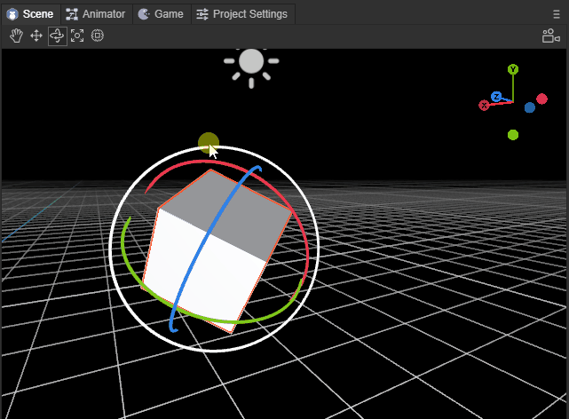
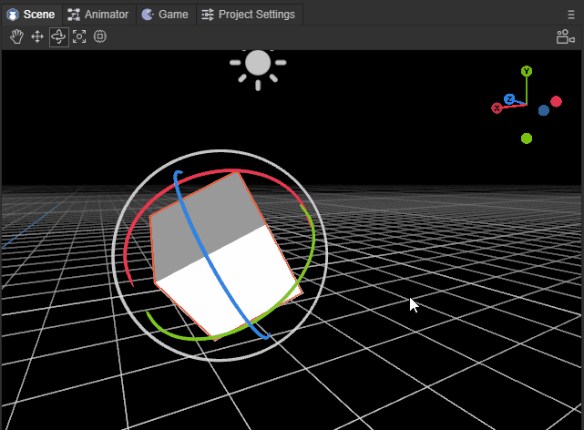
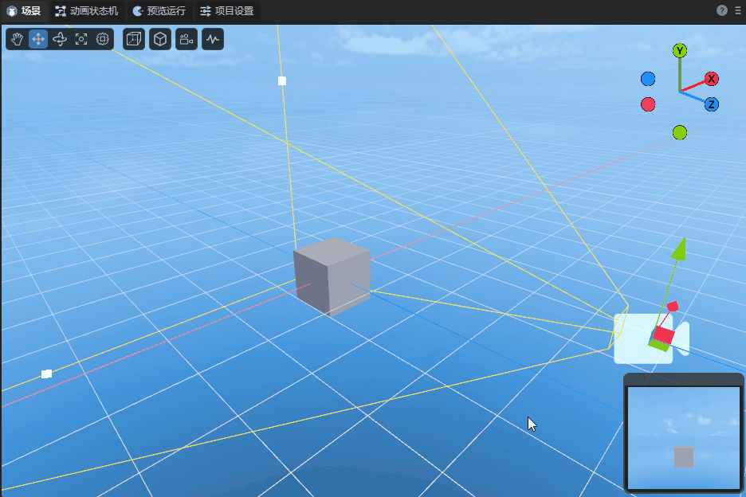
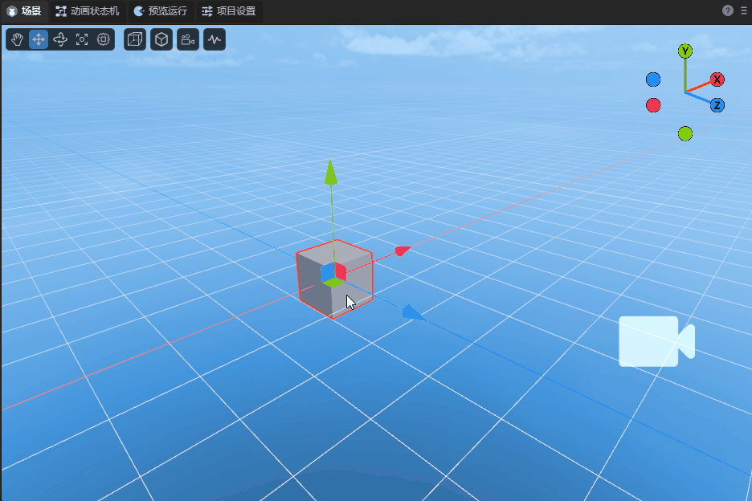
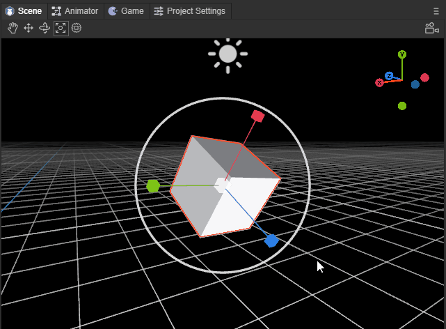
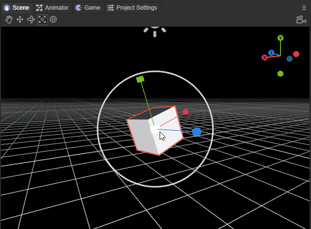

# 3D场景编辑的基础交互

> Author: Charley 

3D场景中的基础交互，主要是两大类基础操作，

一是，改变场景视窗的摄像机位置与角度，让开发者如同自己的眼睛一样观察3D场景世界。

二是，改变模型的位置与角度，将模型摆放到场景中适当位置。

我们可以使用如图1所示的基础工具，

 

（图1）

也可以使用快捷键切换到对应的工具。

本篇我们逐个分解示意，让大家了解全部的3D场景编辑的交互基础操作。

### 3.1 操作视窗摄像机

#### 3.1.1 旋转视窗摄像机：鼠标右键

在3D场景中，只要持续按住`鼠标右键`即进入视窗摄像机的旋转模式，松开`鼠标右键`即退出视窗摄像机旋转模式。

在该模式下，在屏幕方向上移动鼠标，可以改变视窗摄像机的角度，对整个场景的任意角度进行观察，效果如动图2-1所示。

 

(动图2-1)

#### 3.1.2 空间位移视窗摄像机：

当按住鼠标右键 + 键盘功能键，可以让摄像机按上下左右前后，具体功能键如下：

| 功能说明         | 操作          |
| ---------------- | ------------- |
| 摄像机`向上`位移 | 鼠标右键  + E |
| 摄像机`向下`位移 | 鼠标右键  + Q |
| 摄像机`向左`位移 | 鼠标右键  + A |
| 摄像机`向右`位移 | 鼠标右键  + D |
| 摄像机`向前`位移 | 鼠标右键  + W |
| 摄像机`向后`位移 | 鼠标右键  + S |

位移视窗摄像机的效果如动图2-2所示。

 

(动图2-2)

> 上下前后左右，是一个相对的方向，无论旋转到任何角度，都会按这个相对的方向进行位移。

#####  位移视窗摄像机加速：

在位移视窗摄像机的基础上，按住Shift叠加，可以在原功能基础上进行加速移动。

操作按键为：鼠标右键 + shift + (E、Q、A、D、W、S)

#### 3.1.3 屏幕内位移视窗摄像机：Q \ 鼠标中键

除了采用`鼠标右键 + 键盘功能键（E、Q、A、D）`实现视窗摄像机上下左右的位移外，还可以通过快捷键Q或鼠标中键来启动屏幕任意方向位移。

使用快捷键Q时，鼠标左键按下并拖拽，即可实现视窗摄像机在屏幕任意方向位移，效果如动图2-3所示。

 

(动图2-3)

要想退出该模式，则需要通过其它模式的快捷键，除非是需要持续不断的采用该模式位移视窗摄像机。否则更建议采用鼠标中键来启动屏幕任意方向位移。

鼠标中键的方式，只有在按下并拖拽时才会进入该模式，松开鼠标中键会自动回到其它模式。

#### 3.1.4 视窗摄像机缩放：鼠标滚轮

视窗摄像机缩放本质上就是视窗摄像机的前后位移，只因在位移过程中，观察目标时基于近大远小的透视原理，有种缩放的错觉，所以称为缩放视窗摄像机。效果如动图2-4所示，

 

(动图2-4）

#### 3.1.5 视窗摄像机绕焦点中心旋转：Alt + 左键拖拽

在观察或操作具体某个模型时，我们可能需要找一个非正面的合适角度。此时，之前介绍的方式都不太方便。所以围绕目标进行任意旋转是最适合的操作。

要旋转视窗摄像机之前，我们首先要做的事，就是聚焦（选中3D对象，快捷键F），将模型处于视窗摄像机的中心位置。

聚焦后，通过`Alt + 左键`的组合，左键向任意角度拖拽，即可实现绕焦点中心旋转，效果如动图2-5所示，

 

(动图2-5)

### 3.2 操作模型

操作模型的工具有四种，分别是位移、旋转、缩放、混合使用。可以通过快捷键 `W、E、R、T`进行启动不同的工具模式。

| 快捷键名称   | 按键 |
| ------------ | ---- |
| 模型位移工具 | W    |
| 模型旋转工具 | E    |
| 模型缩放工具 | R    |
| 混合编辑模型 | T    |

#### 3.2.1 模型位移工具：W

通过快捷键`W`进入模型位移工具模式后，模型上会出现红绿蓝三色的轴和片。

红绿蓝三个轴分别代表X、Y、Z三个方向，轴的颜色与右上角的坐标轴对应。

箭头所指的方向为正方向，拖动其中一个轴，可使该模型按该轴的正负方向进行位移，效果如动图3-1所示。

 

(动图3-1)

> 留意属性面板，如果该模型没有任何旋转（rotation都为0），拖动其中一个轴，只有该轴的属性值会发生变化 。如果有旋转，则会影响其它轴属性值。

三个相邻的面，蓝色为XY面、绿色XZ面、红色为YZ面。

拖动其中一个面，可使该模型在该面范围内任意位移，效果如动图3-2所示。

 

(动图3-2)

#### 3.2.2 模型旋转工具：E

通过快捷键`E`进入模型旋转工具模式后，模型上出现红绿蓝三色的交叉弧线和外层白圈，当鼠标划到模型上时，还会出现一个半透明圆。

红绿蓝三色的弧线分别代表X、Y、Z三个轴的方向，颜色与右上角的坐标轴对应。

选中其中一个弧线后，会变成完整的圆圈，代表按该该轴方向进行旋转，效果如动图4-1所示。

 

(动图4-1)

外层白圈，是基于屏幕的垂直旋转，效果如动图4-2所示。

 

(动图4-2)

如果鼠标在半透明圆拖拽，则可以任意角度旋转，效果如动图4-3所示。

 

(动图4-3)

#### 3.2.3 模型缩放工具：R

通过快捷键`R`进入模型缩放工具模式后，模型上不仅有红绿蓝三色轴，还有中心白块和外层白色圆圈。

红绿蓝三色轴分别代表X、Y、Z三个轴的方向，拉动其中一个轴，可在该轴对模式进行缩放，效果如动图5-1所示。

 

(动图5-1）

中心的白块与外层白色圆圈均是三轴同时缩放，两者的区别仅是缩放速率差异，效果如动图5-2所示。

 

(动图5-2）

#### 3.2.4 模型工具集合：T

通过快捷键`T`进入模型工具集合后，前文介绍的模型操作工具，都会集合到一起。

唯一需要注意的是，混合模式下，中心块缩放不再保留，只能通过外层白色圆圈整体缩放，以及通过拉动各轴的方块从单轴方向缩放，效果如动图6所示。

 

(动图6)

#### 3.2.5 模型的多选

多选的方式分别是框选、Shift、Ctrl这几种方式。

模型的框选，就是通过鼠标拉起屏幕矩形区，只要在矩形区内，无论远近都会被选中。

除了框选，也可以通过Shift或Ctrl结合鼠标点击，进行连续多选。

> 无论是单选，还是多选，选中的模型都会出现红色边框。							

