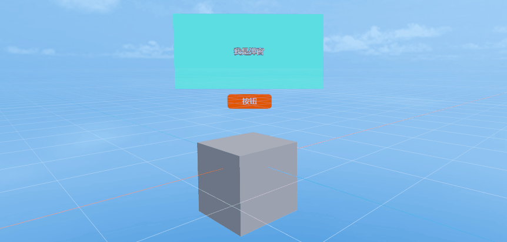
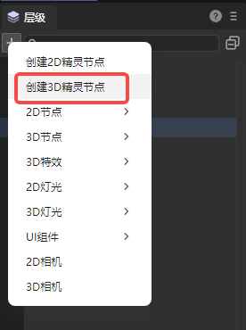
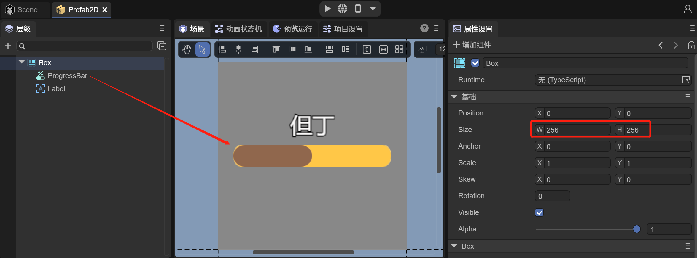
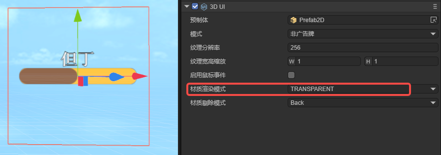
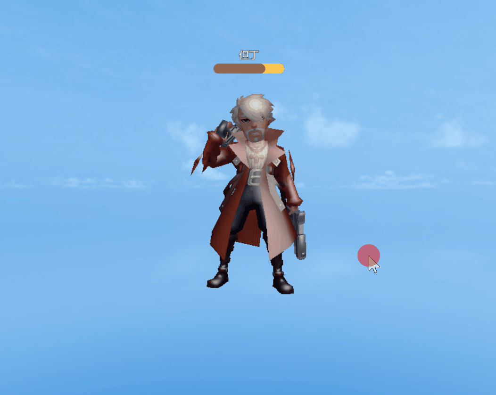
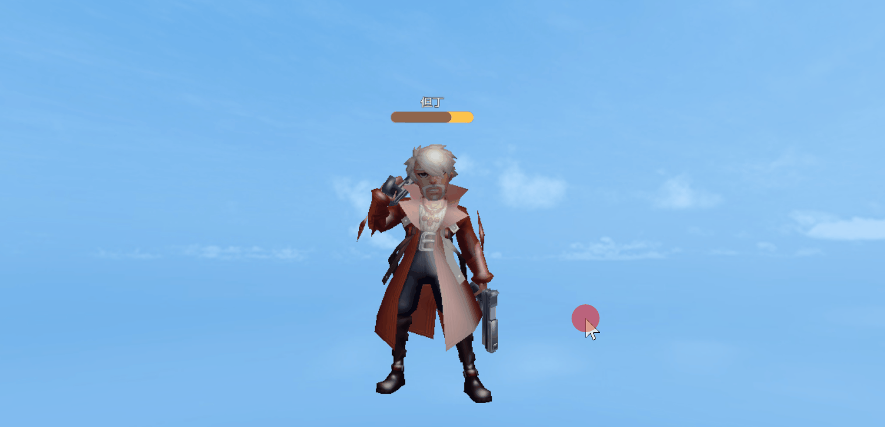
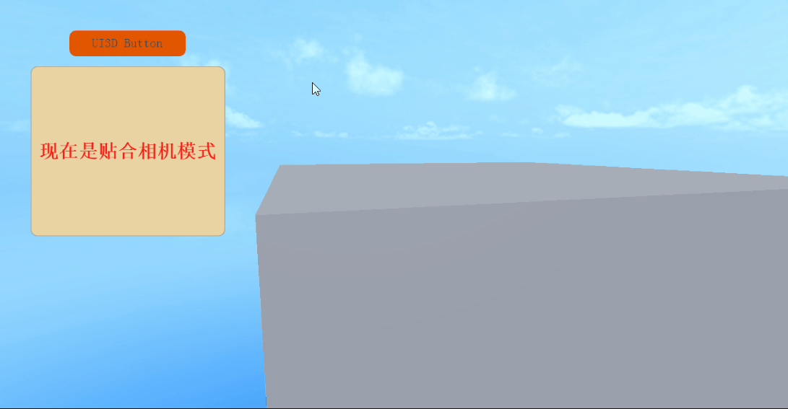
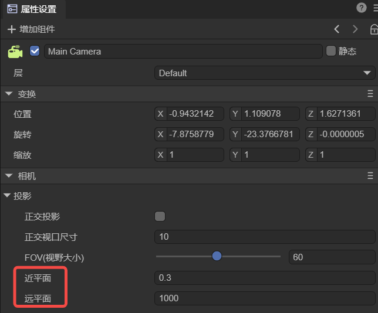

# 使用3D UI

## 一、概述

2D UI都是纯粹的2D图片按层次显示，不会出现三维立体效果，所以都是直接紧贴着视窗上。而3D UI（在引擎中，变量不能用数字开头，所以代码中叫做UI3D）的原理是，创建的UI控件都在一个三维立体空间中，这和2D UI有着截然不同的区别，因为2D UI没有深度信息。因此，如果要出现UI有三维变换的效果，就必须用3D UI。

3D UI也是UI，也承担UI的交互职能。例如，当点击UI上的按钮时，按钮会带来交互反馈，并触发设定的事件，以达到逻辑运行的目的。 


（动图1-1）

3D UI 可以是一个位于3D场景中的物件，并带有UI的交互特征。



（动图1-2）

并且，3D UI 始终位于窗口上，就和常规的UI一样。但可以进行XYZ三个轴上的运动，带来明显的透视变化。


（动图1-3）


## 二、IDE中使用

### 2.1 添加组件

在LayaAir-IDE的层级面板中，添加一个Sprite3D节点，如图2-1所示，



（图2-1）

然后在节点的属性上增加一个3D UI组件，如动图2-2所示，在属性面板中，点击添加组件，选择渲染->3D UI组件。


（动图2-2）


### 2.2 属性介绍

对于3D UI组件，如图2-3所示，有如下一些属性： 


（图2-3）

| 中文属性名称 | 英文属性名称    | 属性解释                                                     |
| ------------ | --------------- | ------------------------------------------------------------ |
| 预制体       | Prefab          | 需要显示的Prefab2D资源文件。                                 |
| 模式         | Mode            | 有三种模式：相机空间（CameraSpace）、广告牌（BillBoard）、非广告牌（Not Billboard） |
| 纹理分辨率   | Resolution Rate | 当拖入Prefab时，会自动识别Prefab下节点的size，来动态调整纹理的分辨率。 |
| 纹理宽高缩放 | Scale           | 基于纹理分辨率的缩放比率，通过控制缩放，让2的幂纹理与UI资源宽高相符。 |
| 启用鼠标事件 | Enable Hit      | 默认不勾选。勾选后，可以实现按钮的响应、滑动条的拖动、List组件的滑动等。 |
| 材质渲染模式 | Render Mode     | 有五种可选模式：OPAQUE（不透明）、CUTOUT（裁剪）、TRANSPARENT（透明）、ADDTIVE（效果叠加）、ALPHABLENDED（透明度混合）。 |
| 材质剔除模式 | Cull            | 有三种可选模式：Off（不剔除）、Front（剔除正面，只显示背面）、Back（剔除背面，只显示正面）。 |


## 三、3种模式

### 3.1 非广告牌

在非广告牌（Not Billboard）模式下，UI永远朝向Z轴方向，在场景中具有透视效果。这个模式较为常用，下面以一个具体的例子展示此模式：

#### 3.1.1 创建一个Prefab2D

在IDE中使用3D UI，首先需要创建一个用于在3D场景中展示的2D UI，这里必须使用2D预制体（Prefab2D）来实现。然后在预制体中搭建一个希望实现的2D UI，例如，做一个游戏中人物战斗中头顶的血条，如图3-1所示。



（图3-1）

在2D预制体中，创建一个进度条（Progress），因为血条有当前血量和总体血量构成，因此Progress正好符合要求。并且血条上面使用Label显示人物的名字。另外注意Prefab的根节点Box的size最好改为2的N次幂，这符合纹理的2的N次幂原则。


#### 3.1.2 创建Sprite3D，添加3D UI组件

在IDE的Scene3D节点下，创建一个Sprite3D对象，添加3D UI组件，操作可参考2.1节。

可以看到，当添加3D UI组件后，场景中在Sprite3D节点的位置，多了一个显示的纹理（黑色），如图3-2所示，这个纹理就是用来显示UI的。


（图3-2）


#### 3.1.3 添加Prefab2D资源

准备好3D UI组件后，下一步就是要把之前做好的Prefab2D拖入到3D UI组件的Prefab属性中，如动图3-3所示。


（动图3-3）

拖入Prefab后，纹理会立即显示2D UI。但是默认是OPAQUE渲染模式，纹理有黑色的背景色。


#### 3.1.4 更改渲染模式

设置材质渲染模式为TRANSPARENT，也就是支持透明色，如图3-4所示，背景变成透明的了。 



（图3-4）


#### 3.1.5 调整3D UI位置

需求是做人物的血条，那首先把做好的但丁人物拖入到场景中，并设置好位置，如图3-5所示。 


（图3-5）

但是Sprite3D的位置在人物脚下，这时需要调整Sprite3D的位置，来符合血条的效果，如动图3-6所示。 


（动图3-6）

这时来看看运行的效果：



（动图3-7）

可以看到随着人物在摄像机前拉进和拉远，血条也在变大变小，很符合实际的效果 。如果用2D UI来实现的话，还需要动态去计算人物相对摄像机的位置来缩放UI的大小。


### 3.2 广告牌

广告牌（Billboard）模式下，3D UI会始终朝向摄像机。例如，在上面的例子中，可以将“模式”选择为“广告牌”，调整XYZ轴的旋转，让血条随着人物的旋转而改变朝向。 



（动图3-8）


### 3.3 相机空间

相机空间（CameraSpace）模式下，3D UI会始终保持在相机视野中的固定位置，并且UI的大小不会随距离变化。与2D UI相比，这个模式下的3D UI会受到3D场景中其他物体的遮挡，如图3-9所示，3D UI具有深度信息。



（图3-9）

此模式是为了满足VR里也能用2D UI的需求。VR里不支持2D，2D的UI显示不出来，需要用到这个功能进行实现。

相对于前两个模式，相机空间具有两个不一样的属性：

- 绑定的相机（Attach Camera）：如图3-10所示，选择场景中的相机即可。


（图3-10）

- 距离相机的距离（Camera Plane Distance）：这个距离需要在相机的“近平面”和“远平面”之间，如图3-11所示，距离需要大于0.3且小于1000。



（图3-11）


## 四、脚本控制

开发者通常需要对UI中的内容进行操作，例如，血条中血量比例的变化，有向上飘动的伤害数等，这些都是通过对Prefab2D中UI组件控制来实现的。而3D UI组件通常是用来控制显示效果，比如透视效果，位置信息等。

在3.1节中的Prefab2D中，添加一个Text节点，命名为“value”，并将进度条命名为“bar”，接着勾选value、bar的`定义变量`选项。如图4-1所示，


（图4-1）

保存场景后，就像处理2D UI的操作一样，在2D预制体的根节点上添加Runtime类，添加逻辑代码如下：

```typescript
const { regClass } = Laya;
import { BloodBarBase } from "./BloodBar.generated";
import { Main } from "./Main";

@regClass()
export class BloodBar extends BloodBarBase {
    onAwake(): void {
        this.bar.value = 1;
        this.value.visible = false;
        Laya.stage.on(Laya.Event.CLICK, this, this.onHurt);
    }

    onHurt(): void {
        this.bar.value = this.bar.value - 0.9;
        this.value.y = 35;
        this.value.visible = true;
        Main.instance.animator.play("stun");
        Laya.Tween.create(this.value).to("y", -30).duration(1000);
	}
}
```

上述代码中的`Main.instance.animator.play("Stun");`表示改变动画状态，目的是在减少血量时播放受到攻击的动画。需要在场景的Scene2D中添加如下脚本：

```typescript
const { regClass, property } = Laya;

@regClass()
export class Main extends Laya.Script {

    // 设置单例
    static instance: Main;

    constructor() {
        super();
        Main.instance = this;
    }

    @property({type:Laya.Sprite3D})
    private target: Laya.Sprite3D;

    @property({type:Laya.UI3D})
    private ui3d: Laya.UI3D;

    public animator: Laya.Animator;

    onEnable() {
        // 广告牌模式
        this.ui3d.billboard = true;
        //获得状态机
        this.animator = this.target.getComponent<Laya.Animator>(Laya.Animator);
    }
}
```

最后来看看运行效果： 


（动图4-2）


