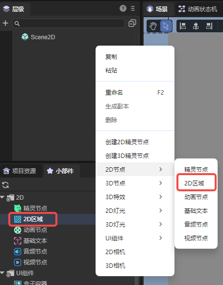
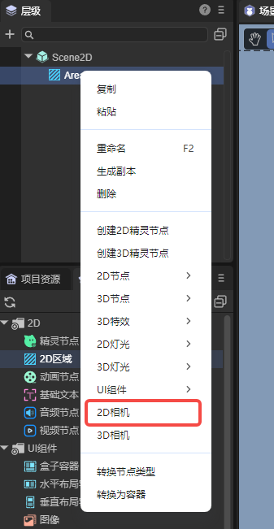
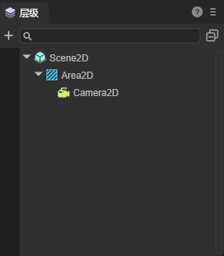
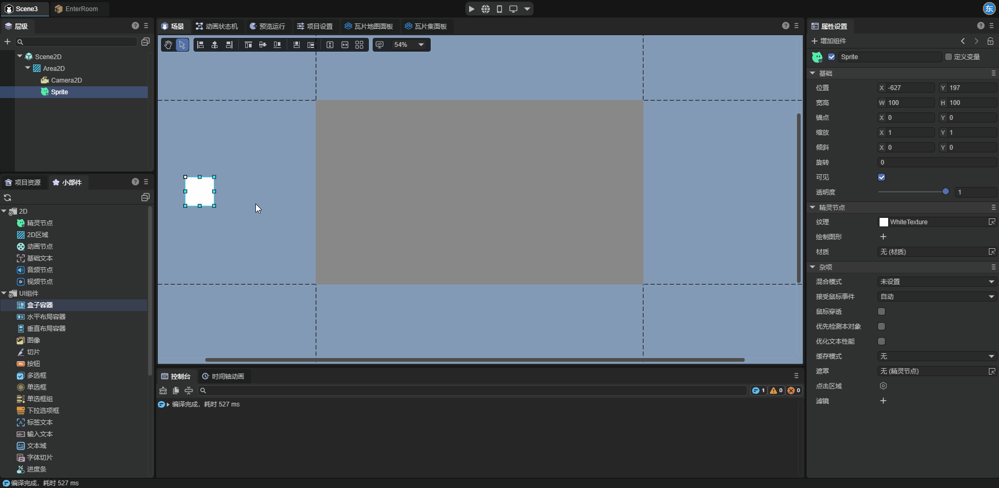
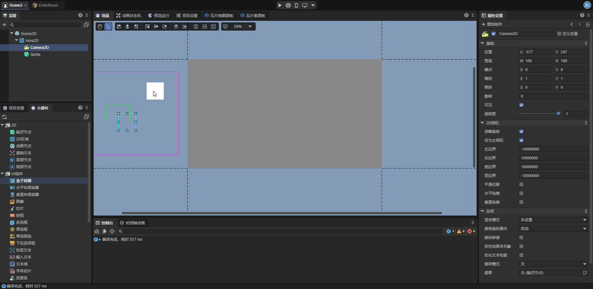
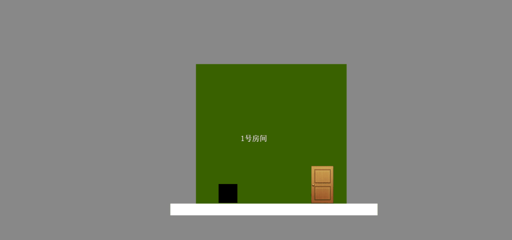
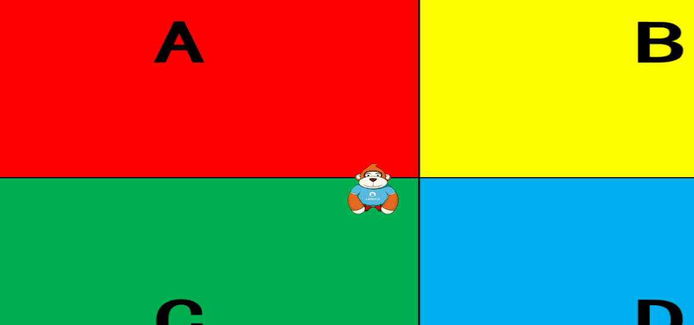

# 2D相机

2D相机是应用于2D场景中的相机节点。它会使场景中被渲染的区域跟随该节点移动。通过2D相机，开发者可以方便快捷的实现许多游戏效果，例如滚动场景、视角跟随角色移动等。


## 一、创建2D相机

需要说明，2D相机必须作为2D区域节点的子节点来使用。将2D相机单独添加到场景中是不被允许的。

### 1.1 通过LayaAir IDE创建2D相机

首先，我们在层级面板中创建一个2D区域节点，也可以在小部件窗口中拖拽添加2D区域节点：



接下来，在层级面板中向2D区域节点添加一个2D相机节点作为其子节点。



### 1.2 通过代码创建2D相机

如果开发者希望在程序运行时动态创建2D相机，就需要通过代码来创建2D相机，示例代码如下：

```typescript
const { regClass, property } = Laya;

@regClass()
/**
 * 创建2D相机的脚本，开发者可将脚本添加到2D场景中查看效果
 */
export class Script extends Laya.Script {

    declare owner : Laya.Scene;

    area2D: Laya.Area2D;
    camera2D: Laya.Camera2D;

    //组件被激活后执行，此时所有节点和组件均已创建完毕，此方法只执行一次
    onAwake(): void {
        this.createCamera2D();
    }

    createCamera2D() {
        //2D相机必须添加在2D区域节点下，因此需要先创建一个2D区域节点
        this.area2D = new Laya.Area2D();
        //设置2D区域节点的位置和大小
        this.area2D.pos(100, 100);
        this.area2D.size(200, 200);
        this.owner.addChild(this.area2D);

        //创建2D相机
        this.camera2D = this.area2D.addChild(new Laya.Camera2D);

        //开发者可以根据需求自行设置相机的各项属性，例如：
        //将相机设为主相机
        this.camera2D.isMain = true;
        //启用平滑位移
        this.camera2D.positionSmooth = true;
        //设置平滑移动的速度
        this.camera2D.positionSpeed = 2;
    }
}
```


## 二、2D相机的属性

### 2.1 场景中可视化的相机

在2D相机被添加到场景后，我们可以在场景面板中看到它：


相机上有四个不同颜色的方框，我们在这里简单介绍一下这四个方框：

**红色方框**：相机边界，代表相机视窗可移动的范围，超出边界的移动会被阻止。（开发者将相机添加到场景后可能无法看到红色方框，这是因为引擎默认的相机边界很大，开发者可适当调整边界值，以观察到相机边界）。

**紫色方框**：相机视窗，类似于3D场景中的摄像机的视锥体，只有进入相机视窗范围内的节点才能被观察到。相机视窗的大小和相机所在的2D区域的大小一致。

**绿色方框**：相机的拖拽边界，分为水平拖拽和垂直拖拽，在开发者启用对应的属性后才会生效。相机节点在拖拽边界内移动时不会使相机视窗移动。

**白色方框**：相机节点，相机视窗以相机节点的锚点为中心，相机视窗会跟随相机节点移动。


### 2.2 2D相机的特有属性

2D相机的特有属性如下：


| 属性                           | 功能                                                         |
| ------------------------------ | ------------------------------------------------------------ |
| 忽略旋转(ignoreRotation)       | 启用此属性后，2D相机的旋转值始终为0。                        |
| 设为主相机(isMain)             | 启用此属性后，2D相机才会生效。                               |
| 左边界(limit_Left)             | 通过相机节点控制相机视窗向左移动的极限距离，单位为像素。     |
| 右边界(limit_Right)            | 通过相机节点控制相机视窗向右移动的极限距离，单位为像素。     |
| 底边界(limit_Bottom)           | 通过相机节点控制相机视窗向下移动的极限距离，单位为像素。     |
| 顶边界(limit_Top)              | 通过相机节点控制相机视窗向上移动的极限距离，单位为像素。     |
| 平滑位移(positionSmooth)       | 启用此属性后，相机会以 `Position Speed` 的速度，平滑的移动到其目标位置。 |
| 位移速度(positionSpeed)        | 在启用平滑位移属性后此属性才会生效，用于控制相机在平滑移动过程中的快慢。 |
| 水平拖拽(dragHorizontalEnable) | 控制相机是否启用水平方向的拖拽跟随效果。启用后，相机会在水平方向保持一定的拖拽范围，通过左拖拽边界(drag_Left)和右拖拽边界(drag_Right)的值来控制拖拽范围的大小。这样可以让相机视窗不会严格跟随相机节点，相机节点在水平方向上一定范围内的移动不会使相机视窗移动。禁用后，相机视窗会在水平方向严格跟随相机节点位置移动，没有任何缓冲或拖拽效果，相机节点在水平方向上将始终位于相机视窗中间。 |
| 左拖拽边界(drag_Left)          | 在启用水平拖拽属性后此属性才会生效。当相机节点向左移动并超出此边距时，相机视窗会跟随移动。其值表示相机节点距离相机视窗左侧边缘的相对比率。 |
| 右拖拽边界(drag_Right)         | 在启用水平拖拽属性后此属性才会生效。当相机节点向右移动并超出此边距时，相机视窗会跟随移动。其值表示相机节点距离相机视窗右侧边缘的相对比率。 |
| 垂直拖拽(dragVerticalEnable)   | 控制相机是否启用垂直方向的拖拽跟随效果。启用后，相机会在垂直方向保持一定的拖拽范围，通过顶拖拽边界(drag_Top)和底拖拽边界(drag_Bottom)的值来控制拖拽范围的大小。这样可以让相机不会严格跟随目标，而是在目标上下一定范围内进行缓冲式移动。禁用后，相机会在垂直方向严格跟随目标位置移动，没有任何缓冲或拖拽效果，相机的y坐标将始终等于目标的y坐标。 |
| 顶拖拽边界(drag_Top)           | 在启用垂直拖拽属性后此属性才会生效。当相机节点向上移动并超出此边距时，相机视窗会跟随移动。其值表示相机节点距离相机视窗顶部边缘的相对比率。 |
| 底拖拽边界(drag_Bottom)        | 在启用垂直拖拽属性后此属性才会生效。当相机节点向下移动并超出此边距时，相机视窗会跟随移动。其值表示相机节点距离相机视窗底部边缘的相对比率。 |

 

## 三、 使用2D相机

在开始学习2D相机之前，建议开发者先了解一下引擎中的渲染纹理(RenderTexture)。渲染纹理的一个典型用法是将其设置为3D摄像机的“目标纹理”属性，这将使3D摄像机渲染到纹理， 而不是渲染到屏幕，从而像普通纹理一样在Sprite对象中使用。2D相机的使用与渲染纹理有很多相似之处，下面我们来介绍一下2D相机的使用方法。

### 3.1 2D相机与2D区域

对于2D区域节点，如果其上不存在启用了`isMain`属性的2D相机，那这个节点就只是一个容器，没有其它的功能。在前文中，我们已经提到，2D相机必须作为2D区域节点的子节点来使用。因此，2D相机节点与2D区域节点是两个需要相互配合使用的节点。



注意：只有添加到2D区域下并启用了`isMain`属性的2D相机才能正常生效，因此，除非另有说明，否则本章节中提到的2D相机均为添加到2D区域下并启用了`isMain`属性的2D相机。


### 3.2 2D相机的使用方式

在了解2D相机与2D区域的关系之后，下面我们通过几个演示示例，讲解2D相机的使用方式。

如下图所示，将一个2D区域设置在场景范围内，并在其上添加一个白色的Sprite2D；将这个节点移动到场景范围之外，但让其处于相机视窗范围内，运行查看效果：


（图3-2-1）

接下来我们改变白色节点的位置，但使其仍在相机视窗内，再次运行，可以发现场景中白色节点的位置发生了改变：



（图3-2-2）

接下来，我们将白色节点移动到相机视窗之外，但使其位于场景范围之内，运行后查看，可以发现白色节点没有出现在场景中：



（图3-2-2）

再将白色节点移动到相机范围内，然后将2D区域向右移动，使其离开场景范围，但让相机和白色节点处于场景范围内，运行后查看，可以发现，白色节点没有出现在场景中：


（图3-2-4）

通过这四个例子，我们来说明2D相机的使用方法，当一个节点满足以下条件时：

**1.**节点被添加为2D区域的子节点；

**2.**这个2D区域上添加了2D相机；

**3.**节点位于2D相机的相机视窗范围内；

此时，这个节点就会显示在2D区域节点的对应位置上（相机视窗大小与其所在的2D区域大小相同）。2D区域本身也是也是一个节点，它会与场景中的其它节点一同显示在场景中。如图(3-2-4)所示，与其它节点相同，当2D区域节点离开了场景范围，它也不会出现在场景中。

在图(3-2-3)所示的示例中，我们可以发现，当一个添加在2D区域上的节点离开了相机视窗，即便这个节点在场景范围内，这个节点也不会显示在场景中。


## 四、2D相机的使用示例

通过使用2D相机，开发者可以实现许多有趣的游戏效果，下面我们来展示一些简单的Demo，并说明其上2D相机的使用方法。

### 4.1 通过切换主相机来切换游戏场景

在一些需要频繁切换场景的游戏中，例如玩家需要频繁的进出房间，开发者可以将两个房间的节点设置在场景中相距较远的两个位置，并为这两个房间添加2D相机，当玩家进出房间时，通过代码启用对应房间相机的`isMain`属性即可。




### 4.2 限制游戏地图大小

大部分游戏的地图大小是有限的，玩家不能在无限大的范围内移动，因此游戏需要对玩家的视角范围做出限制。开发者可以通过设置相机的四个边界来限制玩家的视角范围。



可以看到，在一定范围内，相机会跟随角色移动，但到达边界后，相机的移动会被限制。

### 4.3 相机跟随玩家运动

有些时候，开发者需要游戏画面随着玩家的移动而移动，这时我们可以让2D相机跟随玩家，结合2D相机的各项属性，可以设计出许多画面效果。


在这个示例中，我们可以发现右上角的重新开始按钮位置始终都没有变化。如果一个节点不被2D相机所影响，则这个节点依然会正常出现在场景中。开发者可以通过这种方式为游戏添加UI系统。


