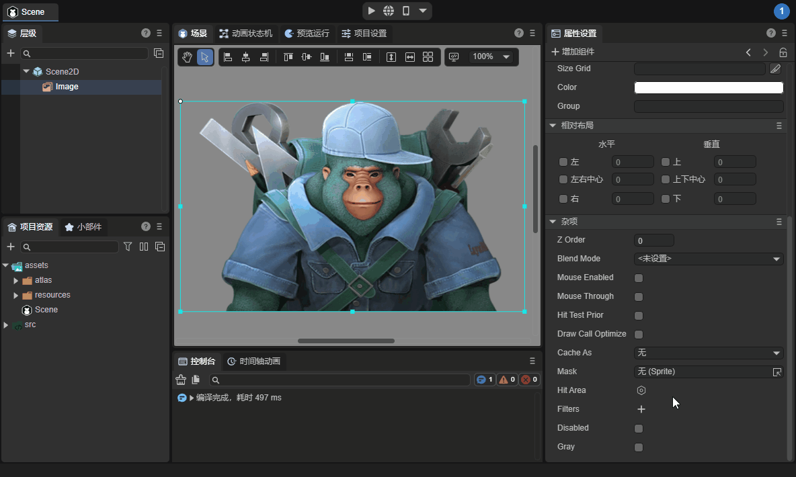
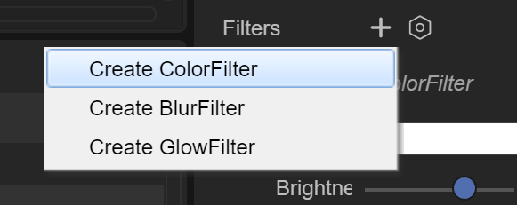
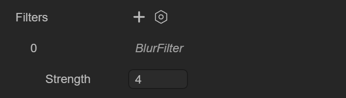
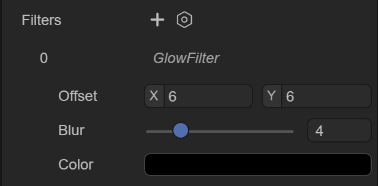

# UI滤镜效果

## 一、概述

滤镜，主要是用来实现图像的各种特殊效果，使图像取得最佳艺术效果。滤镜的类型有很多，但是营造不同的效果需要不同的滤镜功能。

LayaAir提供了颜色滤镜、模糊滤镜、发光(或阴影)滤镜三种效果，其中模糊滤镜与发光滤镜对性能的消耗较大。


### 1.1 IDE中创建滤镜

在LayaAir 3.0中，除了Sprite对象以外，可以将滤镜应用于任何显示对象，开发者通常对Image组件使用最多。选择Image组件，在属性设置面板的杂项中，添加滤镜的属性Filters，如动图1-1所示，演示了如何在Image组件上使用滤镜。



（动图1-1）


如图1-2所示，可以创建颜色滤镜（ColorFilter）、模糊滤镜（BlurFilter）、发光滤镜（GlowFilter）。



（图1-2）


### 1.2 同时生效

如图1-3所示，不同滤镜效果可以叠加使用并同时生效，开发者可以根据需要进行设置。


（图1-3） 


## 二、颜色滤镜

ColorFilter是颜色滤镜，颜色滤镜是图像后期处理中非常重要的一部分，它可以改变原有图像中的各种参数，从而在不改变图像大体的前提下，使其呈现出不同的风格。在实际操作时，颜色滤镜主要改变的参数为亮度、对比度、饱和度、色调等，整体来讲只改变颜色，并不对图像进行任何变形处理。正确地使用颜色滤镜，可以修正图像非正常曝光、缓解图片失真现象，从而突出主要细节，弱化掉一些不太好的部分。在艺术领域，颜色滤镜还被用来呈现不同的美学风格。


### 2.1 基础属性

如图2-1所示，颜色滤镜有5个属性：


（图2-1）

`Color`：设置滤镜颜色。

`Brightness`：调整亮度。

`Contrast`：调整对比度。

`Saturation`：调整饱和度。

`Hue`：调整色调。


### 2.2 代码实现

代码控制滤镜有以下两种：

1、使用ColorFilter类直接创建滤镜，示例代码如下：

```typescript
const { regClass, property } = Laya;

@regClass()
export class NewScript extends Laya.Script {

    // 获得Image组件
    @property({ type: Laya.Image })
    public img: Laya.Image;

    //组件被激活后执行，此时所有节点和组件均已创建完毕，此方法只执行一次
    onAwake(): void {
        //创建一个颜色滤镜对象
        let colorFilter: Laya.ColorFilter = new Laya.ColorFilter();
        //给Image组件添加颜色滤镜
        this.img.filters = [colorFilter];
        //设置滤镜颜色
        colorFilter.color(0.5, 0.5, 0.5, 1);
        //设置滤镜亮度
        colorFilter.adjustBrightness(-50);
        //设置滤镜对比度
        colorFilter.adjustContrast(8);
        //设置滤镜饱和度
        colorFilter.adjustSaturation(30);
        //设置滤镜对比度
        colorFilter.adjustHue(-15);
    }
}
```

2、使用代码调整已经添加滤镜效果的Image组件，示例代码如下：

```typescript
const { regClass, property } = Laya;

@regClass()
export class NewScript extends Laya.Script {

    // 获得Image组件
    @property({ type: Laya.Image })
    public img: Laya.Image;

    //组件被激活后执行，此时所有节点和组件均已创建完毕，此方法只执行一次
    onAwake(): void {
        //获得Image的颜色滤镜对象（在IDE中已经给Image组件添加了颜色滤镜）
		let colorFilter: Laya.ColorFilter = this.img.filters[0];
        //设置滤镜颜色
        colorFilter.color( 0.5, 0.5, 0.5, 1 );
        //设置滤镜亮度
        colorFilter.adjustBrightness(-50);
        //设置滤镜对比度
        colorFilter.adjustContrast(8);        
        //设置滤镜饱和度
        colorFilter.adjustSaturation(30);
        //设置滤镜对比度
        colorFilter.adjustHue(-15);
    }
}
```

> 其它滤镜的使用方法与此类似，后续只给出第一种方法，即直接创建滤镜的示例。


## 三、模糊滤镜

BlurFilter是模糊滤镜，能够产生模糊的效果。


### 3.1 基础属性

如图3-1所示，模糊滤镜只有1个属性：



（图3-1）

`Strength`：模糊滤镜的模糊强度值，数值越大越模糊。 


### 3.2 代码实现

使用BlurFilter类直接创建滤镜，示例代码如下：

```typescript
const { regClass, property } = Laya;

@regClass()
export class NewScript extends Laya.Script {

    // 获得Image组件
    @property({ type: Laya.Image })
    public img: Laya.Image;

    //组件被激活后执行，此时所有节点和组件均已创建完毕，此方法只执行一次
    onAwake(): void {
        let blurFilter: Laya.BlurFilter = new Laya.BlurFilter();
        // 设置模糊强度
        blurFilter.strength = 5;
        // 给Image组件添加模糊滤镜
        this.img.filters = [blurFilter];
    }
}
```


## 四、发光滤镜

GlowFilter是发光滤镜，就是创建放光效果或者阴影的效果，比如外发光。


### 4.1 基础属性

如图4-1所示，发光滤镜有3个属性：



（图4-1）

`Offset`：发光滤镜相对于组件的偏移，X轴方向和Y轴方向。

`Blur`：发光滤镜的边缘模糊大小，数值越大，边缘越模糊。

`Color`：发光滤镜的颜色。 


### 4.2 代码实现

使用GlowFilter类直接创建滤镜，示例代码如下：

```typescript
const { regClass, property } = Laya;

@regClass()
export class NewScript extends Laya.Script {

    // 获得Image组件
    @property({ type: Laya.Image })
    public img: Laya.Image;

    //组件被激活后执行，此时所有节点和组件均已创建完毕，此方法只执行一次
    onAwake(): void {
        // 创建发光滤镜，创建时初始化滤镜
        let glowFilter: Laya.GlowFilter = new Laya.GlowFilter("#ffff00", 10, 0, 0);
        // 给Image组件添加发光滤镜
        this.img.filters = [glowFilter];
    }
}
```


