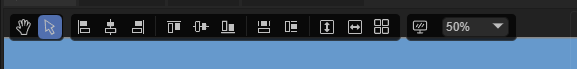
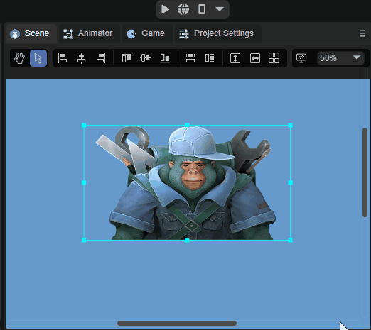
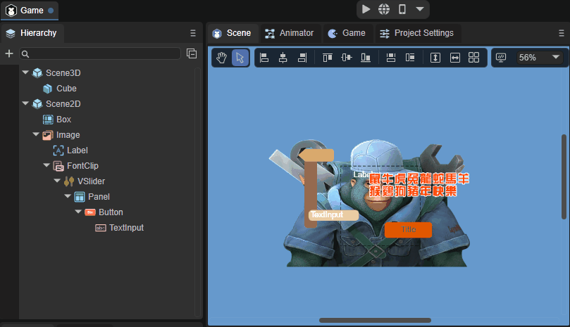
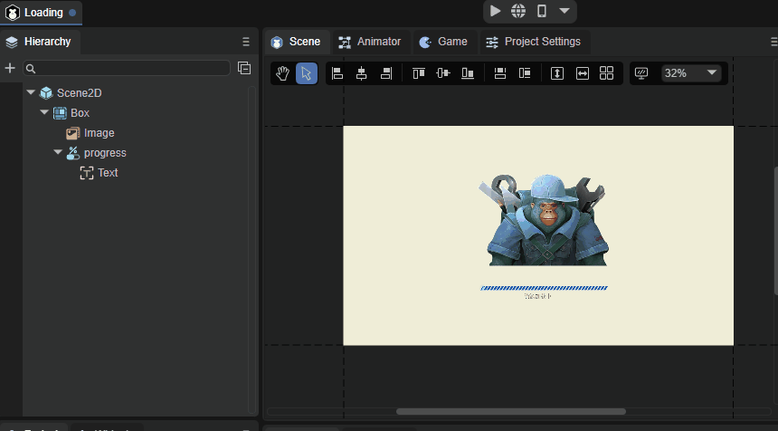
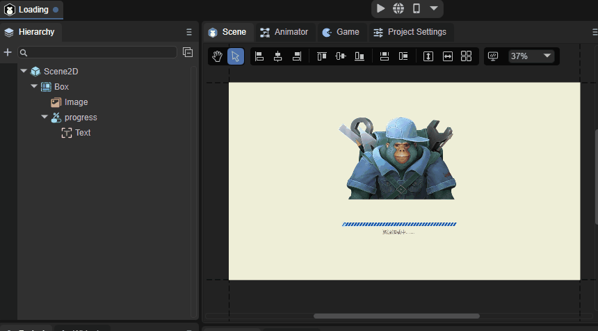
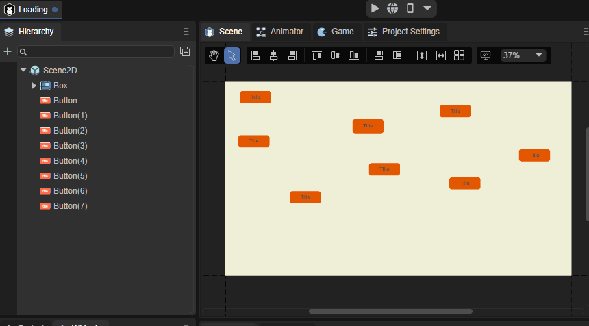
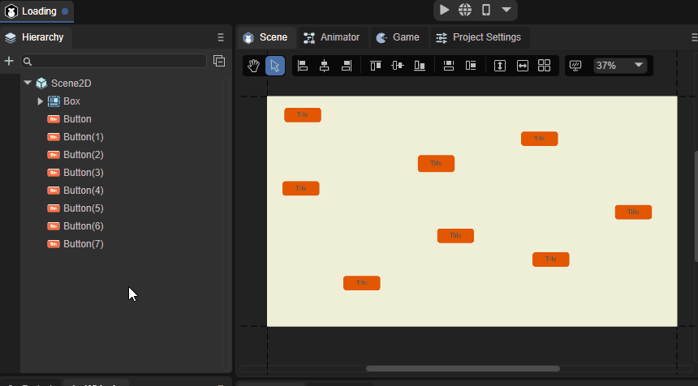
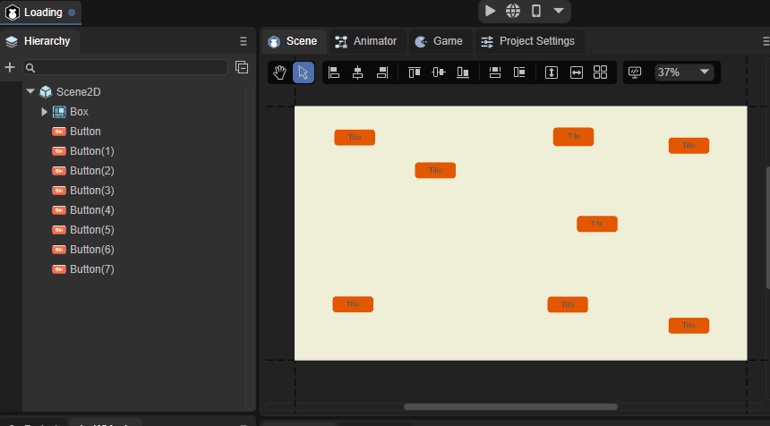
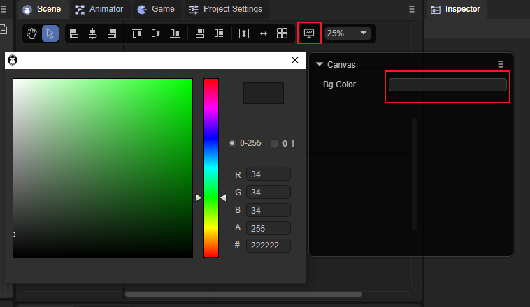
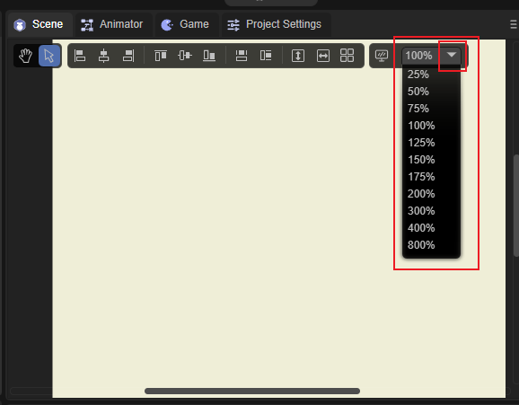

# UI编辑器基础交互

## 1、UI编辑器基础交互图标说明

先来看一下UI编辑器基础交互的图标，如图1-1所示。

（图1-1）

​        从左至右依次为视窗摄像机模式、平移模式、左对齐、左右居中对齐、右对齐、上对齐、上下居中对齐、下对齐、相同宽度、相同高度、均匀行距、均匀列距、表格排列、显示设置、缩放设置。

## 2、视窗摄像机模式

​        在2D场景中点击小手图标即可进入视窗摄像机模式，也可以按住鼠标右键直接进入该模式，在该模式下，持续按住鼠标左键或右键，可以往任意方向拖动整个场景，效果如动图2-1所示。

 

（动图2-1）

## 3、平移模式

在2D场景中点击箭头图标即可进入平移模式，在该模式下持续按住鼠标左键即可往任意方向拖动所选中的控件。

如场景层级很多，拖动想要移动的组件会比较困难，这时候就可以从层级面板单击选中该组件然后进行拖动，效果如动图3-1所示。

 

（动图3-1）

如果想一次性移动多个控件，只需要在画布之外长按鼠标左键然后滑过画布就可以了，如动图3-2所示。

 

（动图3-2）

## 4、对齐设置

将控件在该控件的父节点上进行平移，可以只移动一个，也可一次性平移多个，方法为在画布之外长按鼠标左键然后滑过画布，点击自己需要的对齐设置即可。

| 名称         | 功能                                                   | 快捷键     |
| ------------ | ------------------------------------------------------ | ---------- |
| 左对齐       | 将所选中的控件以水平方向平移到该控件父节点的最左边。   | Ctrl+Alt+1 |
| 左右居中对齐 | 将所选中的控件以水平方向平移到该控件父节点的水平中心。 | Ctrl+Alt+2 |
| 右对齐       | 将所选中的控件以水平方向平移到该控件父节点的最右边。   | Ctrl+Alt+3 |
| 上对齐       | 将所选中的控件以垂直方向平移到该控件父节点的最上方。   | Ctrl+Alt+4 |
| 上下居中对齐 | 将所选中的控件以垂直方向平移到该控件父节点的垂直中心。 | Ctrl+Alt+5 |
| 下对齐       | 将所选中的控件以垂直方向平移到该控件父节点的最下方。   | Ctrl+Alt+6 |

## 5、宽高设置

相同宽度（快捷键Ctrl+Alt+7）：以画布作为类比对象，对所选中的控件修改宽度，如动图5-1所示。

 

（动图5-1）

相同高度（快捷键Ctrl+Alt+8）：以画布作为类比对象，对所选中的控件修改高度，如动图5-2所示。

 

（动图5-2）

## 6、行、列距、列数设置

均匀行距：以像素为单位，对所选控件进行均匀的行距排列,效果如动图6-1所示。

 

（动图6-1）

均匀列距：以像素为单位，对所选控件进行均匀的列距排列,效果如动图6-2所示。

 

（动图6-2）

表格排列：对所选控件进行整齐的表格式排列，直接输入数值即可完成，非常的方便，效果如动图6-3所示。

 

（动图6-3）

## 7、显示设置

显示设置功能可以用来修改编辑器场景视窗的背景颜色，开发者可自行选择，效果如图7-1所示。

 

（图7-1）

还可以在Design Image中，设置UI编辑时的参考图（根据美术需求设计UI时，放置在场景中的位图，运行时不显示）。参数设置如下：

Source：选择位图作为参考图。

Offset：参考图的位置。

Alpha：参考图的透明度。

In Front：是否位于上层。勾选后，参考图将位于最上层。

## 8、缩放设置

对当前场景进行缩放，开发者可自行选择。

如图8-1所示。

 

（图8-1）

缩放设置的快捷键。

| 按键              | 功能       |
| ----------------- | ---------- |
| ctrl  +  +        | 放大       |
| ctrl  +  -        | 缩小       |
| ctrl  +  1        | 恢复到100% |
| ctrl  +  鼠标滚轮 | 自由缩放   |

