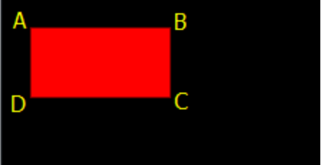
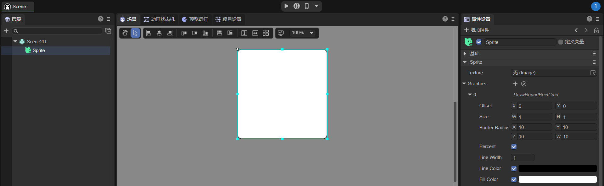
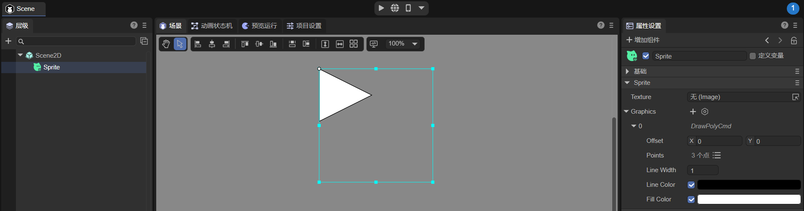
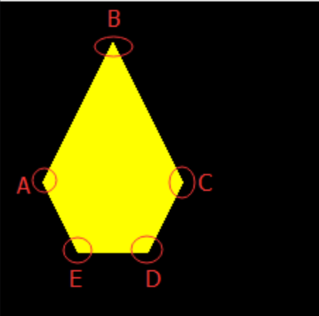

# 绘制图形


## 一、IDE中绘制图形

LayaAir 中可以在Sprite对象中通过使用图形组件来绘制各种图形，我们来看一下，如动图1-1所示


（动图1-1）


在IDE中我们可以通过这些选项来绘制图形，如图1-2所示，下面将对这些图形进行讲解

 

（图1-2）

 

## 二、绘制矩形与圆角矩形

### 2.1 IDE绘制矩形

在Sprite对象的 Graphics 组件中，可以通过点击 `+` 来创建一个绘制图形命令，如图2-1所示，第一个选项 `DrawRectCmd` 为绘制矩形

 

（图2-1）

`Offset`：矩形相对于Sprite对象，X轴，Y轴的偏移量

`Size`：矩形的尺寸

`Percent`：当勾选时，矩形的尺寸为Sprite对象尺寸的百分比，当不勾选时，矩形的尺寸为像素大小

`Line Width`：矩形线的宽度

`Line Color`：矩形线的颜色

`Fill Color`：矩形填充的颜色

通过动图2-2，我们来看看这些属性的操作过程

 

（动图2-2）


### 2.2 代码绘制矩形

Laya引擎中 `laya.display.Graphics` 类可以查看到该API的各种矢量绘图方法。

- `drawRect`
- `drawPath`
- `drawCircle`
- `drawPie`
- `drawLine`
- `drawLines`
- `drawPoly`
- `drawCurves`

其中 `drawRect()` 方法用于绘制矢量矩形。该方法的详细说明如下

```
    /**
     * 绘制矩形。
     * @param x			开始绘制的 X 轴位置。
     * @param y			开始绘制的 Y 轴位置。
     * @param width		矩形宽度。
     * @param height	矩形高度。
     * @param fillColor	填充颜色，或者填充绘图的渐变对象。
     * @param lineColor	（可选）边框颜色，或者填充绘图的渐变对象。
     * @param lineWidth	（可选）边框宽度。
     * @param percent 位置和大小是否是百分比值。
     */
    drawRect(x: number, y: number, width: number, height: number, fillColor: any, lineColor: any = null, lineWidth: number = 1, percent?: boolean): DrawRectCmd {
        return this.addCmd(DrawRectCmd.create(x, y, width, height, fillColor, lineColor, lineWidth, percent));
    }
```

代码示例：

```
let sp = new Laya.Sprite();
//画矩形
sp.graphics.drawRect(20, 20, 100, 50, "#ffff00", "#00ff00", 5, false);
this.owner.addChild(sp);
```

示例中的 20，20 是矩形起始点坐标，100是向右的宽度，如果是负数则是向左的宽度。50是向下的高度，如果是负数则是向上的高度。大家可以在编写代码中，自行调整参数进行体验。

运行效果：

  

（图2-3） 


### 2.3 用drawPath绘制矩形

LayaAir引擎 `laya.display.Graphics` 类的绘制路径的方法 `drawPath()` 可以根据路径绘制矢量图形，来看下方法描述

```
/**
* 绘制路径。
* @param x		开始绘制的 X 轴位置。
* @param y		开始绘制的 Y 轴位置。
* @param paths	路径集合，路径支持以下格式：[["moveTo",x,y],["lineTo",x,y],["arcTo",x1,y1,x2,y2,r],["closePath"]]。
* @param brush	（可选）刷子定义，支持以下设置{fillStyle:"#FF0000"}。
* @param pen	（可选）画笔定义，支持以下设置{strokeStyle,lineWidth,lineJoin:"bevel|round|miter",lineCap:"butt|round|square",miterLimit}。
*/
drawPath(x: number, y: number, paths: any[], brush: any = null, pen: any = null): DrawPathCmd {
	return this.addCmd(DrawPathCmd.create(x, y, paths, brush, pen));
}
```

代码示例：

```
//自定义路径
var path:Array<any> =  [
["moveTo", 0, 0], //画笔移到A点
["lineTo", 100, 0],//画到B点
["lineTo", 100, 50],//再画到C点
["lineTo", 0, 50], //继续画到D点
["closePath"] //闭合路径
];
//绘制矩形
sp.graphics.drawPath(20, 20, path, {fillStyle: "#ff0000"});
```

drawPath 第一和第二位的坐标点“20,20”是控制整体位置的起始位置，第三位是路径参数。描述信息 MoveTo 是将画笔移动初始位置，此时并没有开始画。”0,0”是相对于”20,20”这个起始位置的，所以A点还是在起始位置原点。描述信息 lineto 是绘制到路径点坐标，“100，0”这个就是绘制到B点位置的坐标。C点和D点以此类推，最后通过描述信息 closePath 与MoveTo的起点位置闭合，否则是不会被闭合的。

从绘制矩形来看，drawPath 方法肯定没有 drawRect 方法更加方便。但是大家可以通过这个示例理解相关的参数用法。至于其它非圆角的图形，大家可自行编码，通过调整参数体验。

运行效果：

  

（图2-4） 


### 2.4 用drawPath绘制圆角矩形

LayaAir引擎中可以使用 graphics 的 `drwaPath` 方法绘制圆角或弧线，具体的操作需要三步，指定绘制路径的起始点 ["moveTo", x, y]、绘制一条水平直线["lineTo", x, y]、绘制弧线 ["arcTo", p1.x, p1.y, p2.x, p2.y, r]。

#### 2.4.1 参数示例

```
["moveTo", 50, 50],["lineTo", 150, 50],["arcTo", 200, 50, 200, 100, 50],
```

上述参数运行效果图如2-5所示：


（图2-5）

通过图2-5我们可以看出，`["moveTo", 50, 50]` 将画笔的起始点定位于`"50,50"`这个位置。`["lineTo", 150, 50]` 绘制了一条由于起始点到当前端点（”150, 50“）的直线。`["arcTo", 200, 50, 200, 100, 50]` 绘制了一段r（半径）为50弧线。

#### 2.4.2 弧线绘制原理

在制作这段弧线时，这个弧其实是利用当前端点`"150, 50"`、端点1`"200, 50"`、端点2`"200, 100"`，这三个端点所形成的夹角，制作一条半径为50px并且与两边相切的圆上的一段弧线。

如果我们已经理解了弧线的绘制原理，我们还会发现，构成弧线的核心要素为两条边和与两边形成夹角的顶点（上例中的端点1），图2-5中的端点2与端点1形成的x轴边比较好理解，那当前端点与端点1已经构成了y轴边，那与当前端点在同一个y轴的起始点是不是可以去掉呢，事实并不可以，画笔的起始点必须存在，但是绘制直线的lineTo可以去掉，如果`["lineTo", 150, 50],`被注释掉，那么arcTo绘制弧线的时候，会视起始点为当前端点，arcTo找不到lineTo绘制的直线时，会自动添加一条由起始点到弧线起点的直线，因此，绘制圆角矩形时，lineTo可以省略。

#### 2.4.3 绘制圆角矩形示例

下面我们绘制一个圆角弧线半径为30的圆角矩形，示例代码如下：

```
//自定义路径
var path:any[] =  [
    ["moveTo", 0, 0], //画笔的起始点，
    ["lineTo",400,0],
    ["arcTo", 500, 0, 500, 30, 30], //p1（500,0）为夹角B，（500,30）为端点p2
    ["lineTo",500,200],
    ["arcTo", 500, 300, 470, 300, 30],//p1（500,300）为夹角C，（470,300）为端点p2
    ["lineTo",30,300],
    ["arcTo", 0, 300, 0, 270, 30], //p1(0,300)为夹角D，（0,270）为端点p2
    ["lineTo",0,100],
    ["arcTo", 0, 0, 30, 0, 30],//p1(0,0)为夹角A，（30,0）为端点p2
];
//绘制圆角矩形
sp.graphics.drawPath(100, 100, path, {fillStyle: "#ff0000"});
```

代码运行效果：

   

（图2-6） 

在上面的代码里，看起来没有任何问题，其实moveTo的起始点，需要在圆弧之间的直线上，下面我们只需要在 drawPath 绘制时，增加一个边框线，就可以清楚的看出错误。绘制方法 graphics.drawPath 修改为：

```
//绘制圆角矩形
this.sp.graphics.drawPath(100, 100, path, {fillStyle: "#ff0000"},{"strokeStyle":"#ffffff","lineWidth":"10"});
```

修改后运行效果如图2-7所示，由于画线的时候，从画笔的起始点`0,0`开始的，所以并不是我们想要的结果。

 

（图2-7） 

下面我们将示例修改为正确的代码：

```
//自定义路径
var path:any[] =  [
    ["moveTo", 30, 0], //画笔的起始点，
    ["lineTo",400,0],
    ["arcTo", 500, 0, 500, 30, 30], //p1（500,0）为夹角B，（500,30）为端点p2
    ["lineTo",500,200],
    ["arcTo", 500, 300, 470, 300, 30],//p1（500,300）为夹角C，（470,300）为端点p2
    ["lineTo",30,300],
    ["arcTo", 0, 300, 0, 270, 30], //p1(0,300)为夹角D，（0,270）为端点p2
    ["lineTo",0,100],
    ["arcTo", 0, 0, 30, 0, 30],//p1(0,0)为夹角A，（30,0）为端点p2
];
//绘制圆角矩形
sp.graphics.drawPath(100, 100, path, {fillStyle: "#ff0000"},{"strokeStyle":"#ffffff","lineWidth":"10"});
```

运行效果如图2-8所示：

 

（图2-8） 


## 三、绘制圆形与扇形

### 3.1 IDE绘制圆形

绘制圆形的操作与绘制矩形一样，只不过在Graphics组件下点击 DrawCircleCmd ，如图3-1所示

 

（图2-1）

`Offset`：圆形相对于Sprite对象，X轴，Y轴的偏移量

`Radius`：圆形相对于Sprite对象的尺寸

`Percent`：当勾选时，圆形的Offset和Radius为Sprite对象尺寸的百分比，当不勾选时，圆形的尺寸为像素大小

`Line Width`：圆形线的宽度

`Line Color`：圆形线的颜色

`Fill Color`：圆形填充的颜色


### 3.2 代码绘制圆形

 `drawCircle()` 方法用于绘制矢量圆形。该方法的详细说明如下

```
    /**
     * 绘制圆形。
     * @param x			圆点X 轴位置。
     * @param y			圆点Y 轴位置。
     * @param radius	半径。
     * @param fillColor	填充颜色，或者填充绘图的渐变对象。
     * @param lineColor	（可选）边框颜色，或者填充绘图的渐变对象。
     * @param lineWidth	（可选）边框宽度。
     */
    drawCircle(x: number, y: number, radius: number, fillColor: any, lineColor: any = null, lineWidth: number = 1): DrawCircleCmd {
        return this.addCmd(DrawCircleCmd.create(x, y, radius, fillColor, lineColor, lineWidth));
    }
```

代码示例：

```
//画圆
sp.graphics.drawCircle(80,80,50,"#ff0000");
```

圆形绘制比较简单，“80，80”是圆形中心点坐标。50是半径，”#ff0000”是圆形填充颜色值。

运行效果：

  

（图3-2） 


### 3.3 代码绘制扇形

下面继续延伸，介绍一下比圆形稍复杂一点的扇形绘制方法 `drawPie()` 该方法的详细说明如下

```
    /**
     * 绘制扇形。
     * @param x				开始绘制的 X 轴位置。
     * @param y				开始绘制的 Y 轴位置。
     * @param radius		扇形半径。
     * @param startAngle	开始角度。
     * @param endAngle		结束角度。
     * @param fillColor		填充颜色，或者填充绘图的渐变对象。
     * @param lineColor		（可选）边框颜色，或者填充绘图的渐变对象。
     * @param lineWidth		（可选）边框宽度。
     */
    drawPie(x: number, y: number, radius: number, startAngle: number, endAngle: number, fillColor: any, lineColor: any = null, lineWidth: number = 1): DrawPieCmd {
        return this.addCmd(DrawPieCmd.create(x, y, radius, Utils.toRadian(startAngle), Utils.toRadian(endAngle), fillColor, lineColor, lineWidth));
    }
```

代码示例：

```
//画扇形
sp.graphics.drawPie(80,80,50,90,180,"#ff0000");
```

代码运行效果如下图所示：

  

（图3-3） 

绘制扇形与圆形类似，前三个参数的用法也是一样的，只是增加了绘制开始与结束的角度。为了让大家更好的理解，扇形的绘制代码与参数沿用圆形代码示例，除了方法名的改变，只增加了90与180两个角度参数。大家可在编码过程中通过调整参数，再深入理解。


## 四、绘制三角形、多边形及根据数据绘制图案

### 4.1 IDE绘制三角形，多边形

绘制三角形的操作与绘制矩形一样，只不过在Graphics组件下点击 DrawPolyCmd ，如图4-1所示

 

（图4-1）

`Offset`：多边形相对于Sprite对象，X轴，Y轴的偏移量，单位是像素

`Points`：多边形的点集合，三角形也是一个多边形，只不过是3个点

`Line Width`：多边形的宽度

`Line Color`：多边形的颜色

`Fill Color`：多边形填充的颜色

通过动图4-2，我们来看以下如何创建一个多边形

 

（动图4-2）


### 4.2 代码绘制三角形

在绘制三角形、多边形以及根据指定的路径数据绘制出图案均可使用LayaAir引擎中 laya.display.Graphics 类的 `drawpoly()` 方法实现。该方法的详细说明如下

```
    /**
     * 绘制多边形。
     * @param x			开始绘制的 X 轴位置。
     * @param y			开始绘制的 Y 轴位置。
     * @param points	多边形的点集合。
     * @param fillColor	填充颜色，或者填充绘图的渐变对象。
     * @param lineColor	（可选）边框颜色，或者填充绘图的渐变对象。
     * @param lineWidth	（可选）边框宽度。
     */
    drawPoly(x: number, y: number, points: any[], fillColor: any, lineColor: any = null, lineWidth: number = 1): DrawPolyCmd {
        return this.addCmd(DrawPolyCmd.create(x, y, points, fillColor, lineColor, lineWidth));
    }
```

代码示例：

```
//画三角形
sp.graphics.drawPoly(30, 28, [0, 100, 50, 0, 100, 100], "#ffff00");
```

运行效果：

  

（图4-3） 

通过代码，我们可以看出，`drawPoly` 第三位参数的“0，100”是A点坐标。“50，0”是B点坐标。“100, 100”是C点坐标，将三个坐标点连接后填充第四位参数的颜色值，即绘制出上图的黄色三角形。但是这里需要大家理解和注意的是，第三位参数中所有的坐标都是相对坐标，都会受到第一位和第二位坐标参数“30，28”的影响。一旦“30，28”产生改变，整体形状位置都会受到影响。


### 4.3 代码绘制多边形

 我们继续用上面的代码示例，通过增加 `drawPoly` 第三位参数的坐标，来实现多边形的绘制，修改的代码如下：

```
//画多边形
sp.graphics.drawPoly(30, 28, [0, 100, 50, 0, 100, 100, 75, 150, 25, 150], "#ffff00");
```

代码运行效果如下图所示：

 

（图4-4）

 在修改的代码中，新增了D点坐标”75，150“与E点坐标”25，150“。通过将各个坐标点连接填充颜色后，即绘制出我们想要的多边形。要绘制更多边的多边形，按上述方式增加坐标点即可。


### 4.4 根据指定的路径数据绘制出图案

 通过上面的三角形和多边形，我们已经掌握了 `drawPoly` 的绘图用法，下面再通过示例深入介绍一下，如何指定路径绘制一个五角星。示例代码如下：

```
//画五角星
var path: Array<number> = [];
path.push(0, -130);//五角星A点坐标
path.push(33, -33);//五角星B点坐标
path.push(137, -30);//五角星C点坐标
path.push(55, 32);//五角星D点坐标
path.push(85, 130);//五角星E点坐标
path.push(0, 73);//五角星F点坐标
path.push(-85, 130);//五角星G点坐标
path.push(-55, 32);//五角星H点坐标
path.push(-137, -30);//五角星I点坐标
path.push(-33, -33);//五角星J点坐标

sp.graphics.drawPoly(Laya.stage.width / 2, Laya.stage.height / 2, path, "#FF7F50");
```

代码运行效果如下图所示：

 

 （图4-5）

通过上面的示例代码的写法，是不是感觉代码的可读性得到了增强，大家也可以将之前的三角形或多边形改成这种方式去体验一下，掌握了这些基础，可以衍生出很多灵活的用法。


## 五、绘制直线与折线

### 5.1 IDE绘制直线

绘制直线的操作与绘制矩形一样，只不过在Graphics组件下点击 DrawLineCmd ，如图5-1所示

 

（图5-1）

`From`：线的起始点，相对于Sprite对象，X轴，Y轴的偏移量

`To`：线的终点，相对于Sprite对象，X轴，Y轴的偏移量

`Percent`：当勾选时，线的起始点和终点为Sprite对象尺寸的百分比，当不勾选时，线的起始点和终点为像素点

`Line Width`：线的宽度

`Line Color`：线的颜色


### 5.2 IDE绘制折线

绘制折线的操作与绘线一样，只不过在Graphics组件下点击 DrawLinesCmd ，如图5-2所示


（图5-2）

`Offset`：线段相对于Sprite对象，X轴，Y轴的偏移量，单位是像素

`Points`：线段的点集合

`Line Width`：线的宽度

`Line Color`：线的颜色


### 5.3 代码绘制直线

Laya引擎中 `laya.display.Graphics` 类中 `drawLine()` 方法用于绘制直线。该方法的详细说明如下

```
    /**
     * 绘制一条线。
     * @param fromX		X轴开始位置。
     * @param fromY		Y轴开始位置。
     * @param toX		X轴结束位置。
     * @param toY		Y轴结束位置。
     * @param lineColor	颜色。
     * @param lineWidth	（可选）线条宽度。
     */
    drawLine(fromX: number, fromY: number, toX: number, toY: number, lineColor: string, lineWidth: number = 1): DrawLineCmd {
        return this.addCmd(DrawLineCmd.create(fromX, fromY, toX, toY, lineColor, lineWidth));
    }

```

代码示例：

```
//画直线
sp.graphics.drawLine(10, 58, 146, 58, "#ff0000", 3);
```

运行效果：

  

（图5-3） 


### 5.4 代码绘制折线

那么如何绘制折线呢？直接使用 `drawLines()` 方法即可。该方法与 `drawLine` 比较像，编码时千万不要漏掉了末尾的“s”。`drawLines` 的参数详细说明如下

```
    /**
     * 绘制一系列线段。
     * @param x			开始绘制的X轴位置。
     * @param y			开始绘制的Y轴位置。
     * @param points	线段的点集合。格式:[x1,y1,x2,y2,x3,y3...]。
     * @param lineColor	线段颜色，或者填充绘图的渐变对象。
     * @param lineWidth	（可选）线段宽度。
     */
    drawLines(x: number, y: number, points: any[], lineColor: any, lineWidth: number = 1): DrawLinesCmd | null {
        if (!points || points.length < 4) return null;
        return this.addCmd(DrawLinesCmd.create(x, y, points, lineColor, lineWidth));
    }
```

代码示例：

```
//画折线
sp.graphics.drawLines(20, 88, [0, 0, 39, -50, 78, 0, 120, -50], "#ff0000", 3);
```

运行效果：

  

（图5-4） 

通过代码，我们可以看出，画折线与画直线的参数区别是从第三位开始，第三位参数是Array类型的折线点集合，其中的“0，0”是折点A的起始坐标。“39，-50”是折点B的起始坐标。“78, 0”是折点C的起始坐标，“120, -50”是终点D的坐标。但是这里需要大家理解和注意的是，第三位参数中所有的坐标都是相对坐标，都会受到第一位和第二位参数的“20，88”而影响。一旦“20，88”产生改变，整体折线都会受到影响。

大家可以在实际编码的过程中，通过手动调整参数去感受区别。


## 六、绘制曲线

相对于直线而言，曲线的绘制与坐标关系更难理解一些。由于LayaAir引擎绘制的是贝塞尔曲线，所以本文中先针对贝塞尔曲线的基础进行说明，然后再结合引擎的API进行讲解。

### 6.1 贝塞尔曲线的基础

贝塞尔曲线在港澳台等地称为貝茲曲線，新加坡马来西亚等地称为贝济埃曲线。一般的矢量图形软件通过它来精确画出曲线，贝塞尔曲线由线段与节点组成，节点是可拖动的支点，线段像可伸缩的皮筋，我们在绘图工具上看到的钢笔工具就是来做这种矢量曲线的。

贝塞尔曲线是应用于二维图形应用程序的数学曲线。曲线的定义有四个点：起始点、终止点（也称锚点）以及两个相互分离的中间点。滑动两个中间点，贝塞尔曲线的形状会发生变化。

基于线性、二次方、三次方等公式的不同，贝塞尔曲线也被称为一次、二次……五次贝塞尔曲线，有些文章也称为一阶、二阶……说的是一回事。下面通过动图让大家直观的理解一下：

#### **6.1.1 一次贝塞尔曲线**

 

 （动图6-1）

说明：上图是由 P0 至 P1 的连续点， 描述的是一条线性的贝赛尔曲线。线性贝塞尔曲线函数中的 t 会经过由 P0 至 P1 的 B(t) 所描述的曲线。例如当 t=0.25 时，B(t) 即一条由点 P0 至 P1 路径的四分之一处。就像由 0 至 1 的连续 t，B(t) 描述一条由 P0 至 P1 的直线。

#### 6.1.2 二次贝塞尔曲线

 

 （动图6-2）

 

 （动图6-3）

说明：为建构二次贝塞尔曲线，上图由 P0 至 P1 的连续点 Q0，描述一条线性贝塞尔曲线。由 P1 至 P2 的连续点 Q1，描述一条线性贝塞尔曲线。由 Q0 至 Q1 的连续点 B(t)，描述一条二次贝塞尔曲线。

#### 6.1.3 三次贝塞尔曲线

 

 （动图6-4）

 

 （动图6-5）

说明：对于三次曲线，可由线性贝塞尔曲线描述的中介点 Q0、Q1、Q2，和由二次曲线描述的点 R0、R1 所建构。

#### 6.1.4 高阶贝塞尔曲线

由于高阶贝塞尔曲线并不常见，本文将不再详细说明，想对贝塞尔曲线原理了解更多的可以查看其它相关文章。

 

 （动图6-6） 四次贝塞尔曲线

 

 （动图6-7） 五次贝塞尔曲线


### 6.2 代码绘制二次贝塞尔曲线

LayaAir引擎的曲线绘制采用的是二次贝塞尔曲线，开发者可以用 laya.display.Graphics 类的 `drawCurves()` 方法来绘制曲线。该方法的详细说明如下

```
    /**
     * 绘制一系列曲线。
     * @param x			开始绘制的 X 轴位置。
     * @param y			开始绘制的 Y 轴位置。
     * @param points	线段的点集合，格式[controlX, controlY, anchorX, anchorY...]。
     * @param lineColor	线段颜色，或者填充绘图的渐变对象。
     * @param lineWidth	（可选）线段宽度。
     */
    drawCurves(x: number, y: number, points: any[], lineColor: any, lineWidth: number = 1): DrawCurvesCmd {
        return this.addCmd(DrawCurvesCmd.create(x, y, points, lineColor, lineWidth));
    }
```

下面我们用LayaAir引擎绘制矢量曲线，示例代码如下：

```
//画折线
sp.graphics.drawCurves(10, 58, [0, 0, 19, -100, 39, 0], "#ff0000", 3);
```

运行效果如下

 

 （图6-8）

通过增加 `drawCurves` 的第三位points点集合的参数，我们可以让曲线更复杂一些，修改的示例代码如下：

```
//增加58, 100与78, 0坐标让曲线更复杂一些
sp.graphics.drawCurves(10, 58, [0, 0, 19, -100, 39, 0, 58, 100, 78, 0], "#ff0000", 3) ;
```

运行效果如下

 

 （图6-9）

如果想绘制更复杂的曲线，可自行调整 `drawCurves` 中的参数，再结合二次贝赛尔曲线原理进行理解。

最后提醒一下，与绘制折线一样，第三位参数中所有的坐标都是相对坐标，都会受到第一位和第二位参数的“10，58”而影响。一旦“10，58”产生改变，整体曲线都会受到影响。


## 七、消除矢量图绘制

在PC电脑的浏览器上，我们经常发现LayaAir引擎绘制的矢量图会有一些锯齿，这是由于LayaAir引擎基于性能的考虑，做的优化处理，由于移动手机端的像素密度比较大，所以在PC上看起来明显的锯齿问题，其实在移动设备上基本上看不出来。

### 7.1 开启锯齿消除设置

如果有追求完美的开发者，可以通过开启 Laya.Config.isAntialias=true 开设置，也可以在Project Settings 中开启，如图7-1所示

 

 （图7-1）