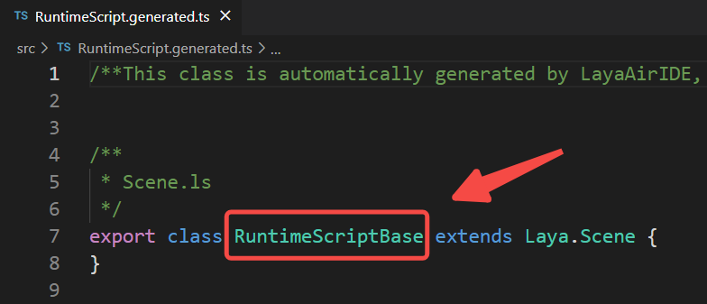
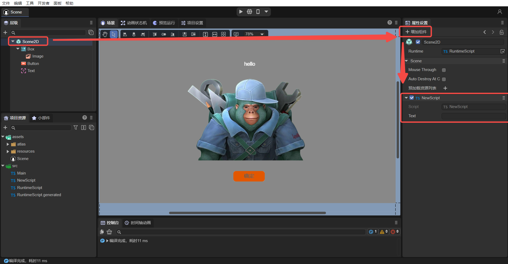

# UI继承类


## 一、概述

在项目开发过程中，开发者往往对UI的开发思路不够清晰，开发方式也多种多样，对项目的结构和使用方式会造成一定的混乱。这篇文章可以帮助开发者理清一些思路，我们会从这几个方面来展开：

- **UI组件脚本（UI继承类、Runtime类）**
- **UI组件脚本和自定义组件脚本的区别**
- **UI组件脚本和自定义组件脚本混合使用的高级用法**

本篇之前已经介绍了所有的[UI小部件](https://layaair.layabox.com/3.x/doc/IDE/uiEditor/widgets/readme.html)，并且在[《ECS组件系统》](https://layaair.layabox.com/3.x/doc/basics/common/Component/readme.html)中讲解了自定义的组件脚本管理UI小部件的方式。其实还有一种UI管理方式，就是之前在[《项目入口说明》](https://layaair.layabox.com/3.x/doc/basics/IDE/entry/readme.html)中和自定义组件脚本一起介绍的**UI组件脚本**，虽然已经告诉大家它在IDE中创建的方式，但是并没有介绍在哪种情况下使用这种方式，所以我们先来聊一聊2D开发UI过程中会遇到的情况，再引入UI组件脚本的深入讲解。


### 1.1 功能划分方式

首先，我们的项目不止一套UI，就比如游戏开发来说，有登陆界面，加载界面，英雄属性界面，背包界面，战斗界面等等，那么对于这些界面的合理规划，我们建议是通过划分场景或者预制体来解决。如图1-1所示，这里有很多UI**场景**，因为这些UI的功能是不一样的，所以将它们划分到场景里。


（图1-1）

如图1-2所示，这里有很多Prefab（**预制体**），因为这些UI的功能是一样的，可以重复利用，所以划分到预制体中。


（图1-2）

所以，通常我们把每一套不同功能的UI，用场景（Scene）来规划；把能复用的功能性UI，用预制体（Prefab）来规划 。


### 1.2 UI管理方式

在UI开发过程中，我们会使用Image，Box，Tab等等这些LayaAir 提供的UI组件。对于一套相对复杂的UI界面来说，大量的UI组件，用自定义组件脚本的方式管理并**不方便**，需要每个组件都拖拽到自定义属性中，繁琐而费力。因此我们建议开发者，使用UI组件脚本来管理UI组件，后面我们再说UI组件脚本和自定义组件脚本的区别。**UI组件脚本设计的目的就是在场景或者是预制体的根节点创建，能对其内部所有的组件进行更加方便的管理。**

如图1-3所示，这是一套复杂的UI的预制体，是通过UI组件脚本（Runtime）进行管理的。


（图1-3）

从图1-3中可以看到，这套UI并没有使用自定义的组件脚本，而是使用UI组件脚本（Runtime），是在预制体的根节点 View上的 Runtime 属性里添加“ BagListRT.ts”代码来管理的。


## 二、UI继承类

UI组件脚本只能添加在Scene2D节点或2D预制体根节点的“属性设置”面板上的Runtime入口。如果添加在Scene2D上，它的父类就继承于Laya.Scene；如果添加在2D预制体的根节点，它的父类就继承于UI小部件的类（根据2D预制体根节点的节点类型而定）。因此，UI组件脚本就是**UI继承类**，也叫做 Runtime 类，可以对场景或预制体内部所有UI组件进行方便的管理。

在[《项目入口说明》](https://layaair.layabox.com/3.x/doc/basics/IDE/entry/readme.html)中已经介绍了IDE中创建UI组件脚本，下面介绍它的使用。


### 2.1 勾选UI组件声明

在UI组件脚本中管理UI组件，需要先关联UI组件。

新建一个场景，创建一个UI组件脚本，并在场景中先添加几个UI组件（如图2-1）。


（图2-1）

要想管理这几个UI组件，需要对这些组件勾选 `定义变量` 选项，如动图2-2所示。


（动图2-2）

勾选 `定义变量` 选项后，**保存场景**，此时IDE会自动识别出组件的声明有变化，再看 `RuntimeScript.generated.ts` 代码（如图2-3），多了几个属性，正是对应于刚刚勾选的组件。

 

（图2-3） 

通过这样操作，UI组件和代码就自动关联了。


### 2.2 代码中使用UI组件

此时，我们可以在UI组件脚本中，使用此场景中已经勾选过的UI组件，直接使用`this.`即可使用。例如下面的代码：

```typescript
    onAwake(): void {
        
        // Button添加鼠标事件，让Image不显示
        this.Button.on( Laya.Event.MOUSE_DOWN, this, ()=>{
            this.Image.visible = false;
        });
    }
```

运行此场景来看看效果，如动图2-4所示。


（动图2-4） 

UI组件脚本就已经介绍完了，再复杂的UI都可以通过勾选组件声明，让IDE自动创建关联关系，提供给 Runtime 类来使用。不需要像自定义组件脚本的方式建立关联关系，因此**UI组件脚本在管理场景方面会更加方便**。


## 三、与自定义组件脚本区别

### 3.1 继承类不同

UI组件脚本如果添加在Scene2D上，它的父类就继承于Laya.Scene（如图3-1）；如果添加在2D预制体的根节点，它的父类就继承于UI小部件的类，例如Laya.Box（如图3-2）。而自定义的组件脚本继承于Laya.Scirpt（如图3-3）。


（图3-1）


（图3-2）


（图3-3）


### 3.2 不同的生命周期

自定义的组件脚本的生命周期，如图3-4所示。


（图3-4）

而UI组件脚本的生命周期只有如下方法：

```typescript

    /**
    * 组件被激活后执行，此时所有节点和组件均已创建完毕，次方法只执行一次
    * 此方法为虚方法，使用时重写覆盖即可
    */
    onAwake(): void {
    }

    /**
     * 组件被启用后执行，比如节点被添加到舞台后
     * 此方法为虚方法，使用时重写覆盖即可
     */
    onEnable(): void {
    }

    /**
     * 组件被禁用时执行，比如从节点从舞台移除后
     * 此方法为虚方法，使用时重写覆盖即可
     */
    onDisable(): void {
    }
        
    /**
     * 销毁时执行
     * 此方法为虚方法，使用时重写覆盖即可
     */
    onDestroy(): void {
    }
    
    /**
     * 关闭完成后，调用此方法（如果有关闭动画，则在动画完成后执行）
     * @param type 如果是点击默认关闭按钮触发，则传入关闭按钮的名字(name)，否则为null。
     */
    onClosed(type: string = null): void {
    }

    /**场景打开完成后，调用此方法（如果有弹出动画，则在动画完成后执行）*/
    onOpened(param: any): void{
    }
```

> **注意1：不论是Scene2D节点还是2D预制体的根节点，它们的Runtime是没有onStart、onUpdate、onLateUpdate方法的。**
>
> **注意2：onOpened、onClosed方法是只有Scene2D节点的Runtime有，其它情况是没有的。**


### 3.3 不同的使用UI组件方式

相比自定义的组件脚本，UI组件脚本可以直接使用UI定义的属性（通过IDE内勾选`定义变量`，因此它也不需要@property装饰器暴露属性），然后直接通过“this.”的方法使用，比如 this.Button，this.Image，具有代码提示效果。而自定义的组件脚本获取只能通过代码定义属性，再在IDE中拖入节点获取节点或组件。

因此建议开发者：**一般情况下使用自定义脚本的方式。只有当页面内需要管理较多的组件时，使用UI组件脚本能够更加方便的进行管理**。


## 四、UI继承类和自定义组件脚本的混合使用

### 4.1 简单用法

在上述示例中（图2-1），已经在Scene场景中创建好了UI组件脚本，而后添加的代码如图4-1所示。



（图4-1）


其次，可以在Scene2D节点下添加自定义的组件脚本，如图4-2所示。


（图4-2）


此时Scene场景中既有UI组件脚本（Runtime），又有自定义的组件脚本。通过在自定义的组件脚本“NewScript.ts”中添加如下代码，来看看如何在自定义的组件脚本中使用Runtime的功能。

```typescript
import { RuntimeScript } from "./RuntimeScript";

const { regClass, property } = Laya;

@regClass()
export class NewScript extends Laya.Script {

    private ui : RuntimeScript;
    onStart() {

        // 获得场景的Runtime对象
        this.ui = this.owner.scene as RuntimeScript;

        // Button添加鼠标事件，让Image不显示
        this.ui.Button.on( Laya.Event.MOUSE_DOWN, null, ()=>{
            this.ui.Image.visible = false;
        });
    }
}
```

> ui 属性直接从脚本中通过 `this.owner.scene as RuntimeScript` 这句代码拿到了Runtime对象，那么Runtime下的UI组件也就可以直接获取了（this.ui.）。

将图4-1添加的“Button添加鼠标事件”代码注释后，运行项目，效果依然是动图2-4所展示的效果。说明以上这段代码的运行效果与图4-1所示代码的运行效果是一致的。通过UI组件脚本和自定义组件脚本的混合使用，开发者可以在自定义组件脚本中方便的使用UI组件了。


### 4.2 高级用法

上述方案中，自定义的组件脚本已经可以拿到场景的Runtime对象，那么在复杂的项目中，如果有很多的UI界面，我们是否可以对所有的UI界面做统一的管理呢？比如，统一找到和处理所有UI相关的Button，让所有Button点击时自动缩放。再比如更高级的用处，统一做所有UI的自适应功能。我们通过下面的方式来看看。

#### 4.2.1 创建多个场景

那么以“统一找到和处理所有UI的Button，让所有Button点击时自动缩放” 为例，我们需要再创建一个有多个Button的UI场景，命名为“Button_Scene”，如图4-3所示。


（图4-3）

因为不同的UI，所持有的UI组件是不一样的，比如A场景有a1，a2组件，B场景有b1，b2，b3组件，那么不同的场景就需要有不同的 Runtime来关联每个UI的组件。那么下一步，针对这个Button_Scene的场景，再在Runtime入口创建一个UI组件脚本，并重命名为“ButtonRuntime.ts” ，如动图4-4所示。


（动图4-4）

接下来，我们需要把Button_Scene中的Button1，Button2，Button3都勾选`定义变量`属性，然后保存场景。这个操作和动图2-2类似，就不再详细介绍了。

最后，我们还需要给Button_Scene再添加一个自定义的组件脚本，命名为“ButtonScript.ts”，如图4-5所示。


（图4-5）


#### 4.2.2 创建脚本父类

在上述操作后，两个场景都有UI组件脚本和自定义组件脚本了，那么如何做统一处理呢？我们发现Runtime类是用来关联UI组件的，因为它们都是继承于各自生成的脚本（RuntimeScript继承于RuntimeScriptBase、ButtonRuntime继承于ButtonRuntimeBase），就不能再统一继承某个类了。

而自定义的组件脚本类（NewScript、ButtonScript）都继承自Laya.Script，那么我们再多继承一层，让NewScript和ButtonScript都继承自一个新的类“Main”（这个类就是创建项目时默认生成的Main.ts），Main类再继承自Laya.Script（图4-6），从而实现统一处理的目的。


（图4-6）

另外在Main类加一个方法baseUI()：

```typescript
const { regClass, property } = Laya;

@regClass()
export class Main extends Laya.Script {

   //用来统一处理ui的事情，比如自适应，缩放所有Button
   public baseUI(ui: Laya.Scene){
   }

}
```

接下来，修改NewScript和ButtonScript都继承自Main，获得Runtime对象，并调用Main的baseUI()方法，传入runtime对象，如下：

```typescript
import { Main } from "./Main";
import { RuntimeScript } from "./RuntimeScript";

const { regClass, property } = Laya;

@regClass()
export class NewScript extends Main {
    
    private ui: RuntimeScript;
    onStart() {
        console.log("Game start");
        this.ui = this.owner.scene as RuntimeScript;
        super.baseUI(this.ui);
    }
}
```

```typescript
import { Main } from "./Main";
import { ButtonRuntime } from "./ButtonRuntime";

const { regClass, property } = Laya;

@regClass()
export class ButtonScript extends Main {

    private ui: ButtonRuntime;
    onStart() {
        console.log("Game start");
        this.ui = this.owner.scene as ButtonRuntime;
        super.baseUI(this.ui);
    }
}
```

最后，在 Main中加入点击缩放Button的代码，如下：

```typescript
const { regClass, property } = Laya;

@regClass()
export class Main extends Laya.Script {

    //用来统一处理ui的事情，比如自适应，缩放所有Button
    public baseUI(ui: Laya.Scene) {
        this.searchButton(ui);
    }

    //找出所有ui下的Button包括子节点下
    searchButton(ui: Laya.Node) {
        for (let i = 0; i < ui.numChildren; i++) {
            let child = ui.getChildAt(i);
            if (child instanceof Laya.Button) {
                console.log("发现Button");
                this.onButtonScaleEvent(child);
            }
            else {
                //查找子节点
                this.searchButton(child);
            }
        }
    }

    //处理按钮缩放事件
    onButtonScaleEvent(target: Laya.Button) {
        target.on(Laya.Event.MOUSE_DOWN, this, this._onScaleBtnDown);
        target.on(Laya.Event.MOUSE_UP, this, this._onScaleBtnOut);
    }

    //按钮放大
    _onScaleBtnDown(e: Laya.Event) {
        console.log("开始缩放");
        e.target.scale(1.1, 1.1);
    }

    //按钮还原
    _onScaleBtnOut(e: Laya.Event) {
        console.log("取消缩放");
        e.target.scale(1.0, 1.0);
    }
}
```

分别运行两个场景看看效果：


（动图4-7）Scene的Button可以点击缩放


（动图4-8）Button_Scene的三个Button都可以点击缩放

到此，我们了解了什么是UI继承类，UI继承类和自定义组件脚本类的区别，以及混合使用的方式，统一管理UI的高级用法，开发者可以更深一步研究，有更多的混合用法欢迎和我们交流~


 

