# 纹理压缩


## 一、概述

纹理是指物体表面的纹路样式和细腻程度等外观效果。在计算机图形学中，常用于描述三维模型表面图案的二维图形。

我们日常见到和使用的图片格式，主要为PNG和JPG，虽然在三维和二维的某些情况下，也会把这些图片称为纹理，但他们并不是纹理格式，不能被GPU直接读取并显示。因此，这些图片文件要先经过CPU解码成纹理格式，再传送到GPU进行使用。

而纹理格式，自然就是可以被GPU直接读取并显示的格式。所以，一方面，避免CPU解码可以减少运算带来的性能压力。另一方面，就是直接读取并渲染，也可以避免图像解压到内存的占用开销。

### 1.1 纹理压缩的目的

1，降低内存，特别是移动端应用，内存占用不应过大，否则低端机很容易崩溃。
2，降低带宽，手游类应用，在渲染时会有大量贴图传输到GPU，不限制的话不仅会严重影响渲染性能，同时会带来很严重的发热。

### 1.2 纹理格式种类

#### 1.2.1 ASTC

ASTC（Adaptive Scalable Texture Compression）是一种世界领先的新型纹理压缩格式。ASTC由ARM和AMD联合开发，2012年发布。是一种基于块的有损压缩算法。它的压缩分块从4x4到12x12最终可以压缩每个像素占用1bit以下，并且ASTC格式支持RGBA。以ASTC 4x4 Block Size为例，可以看到每个像素占用8bits即1个字节。因此一张1024x1024的RGBA图片按照该格式压缩后占用的内存大小为1MB。如果你的纹理是选择了生成mipmap的话，那么最终的资源大小还需要乘以1.333也就是大约1.333MB。而相对应的如果采用了ASTC 8x8的格式进行压缩的话，最终纹理资源的大小就应该是 1024 × 1024 × 2 × 1.333333 ÷ 8 ≈ 341K。所以如果想要使用10x10或12x12这种更小的压缩格式的话，选用这两种格式基本也就意味着放弃对画质的基本要求了。因此我们推荐使用6x6的压缩格式。

**适配机型：**

iOS：苹果从A8处理器开始支持ASTC，即iPhone6和iPad mini 4及以上的设备都支持，ASTC格式在iOS设备上的显示效果比PVRTC的效果要好很多(PVRTC格式存在两个大问题：首先是透明贴图在iOS上显示比较模糊，失真；另一点是对于颜色比较丰富的图，特别是UI，颜色过渡大的区域会出现色阶问题，目前的方案一般是拆分Alpha通道。因此在当前情况下iOS上可以全部使用ASTC作为纹理格式。

安卓：安卓中所有支持OpenGL ES 3.1及以上的设备，和大部分支持OpenGL ES 3.0的设备都支持ASTC。因此在安卓上需要根据具体情况来设置纹理压缩格式，一般而言若项目依旧要考虑低端机型，就要退而求其次使用ETC2格式进行压缩。

#### 1.2.2 ETC

ETC（Ericsson Texture Compression）最初为移动设备开发，如今它是安卓的标准压缩方案，ETC1在OpenGL和OpenGL ES中都有支持。
RGB ETC1 4 bit：4 bits/pixel，对RGB压缩比6:1，不支持Alpha，绝大部分安卓设备都支持。
RGB ETC2 4 bit：4 bits/pixel，对RGB压缩比6:1。不支持Alpha，ETC2兼容ETC1，压缩质量可能更高，但对于色度变化大的块误差也更大，需要在OpenGL ES 3.0和OpenGL 4.3以上版本。
RGBA ETC2 8bit：8 bits/pixel，对RGBA压缩比4:1。支持完全的透明通道，版本要求同上。

#### 1.2.3 PVR

PVRTC（PowerVR Texture Compression）由Imagination公司专为PowerVR显卡核心设计，由于专利原因一般它只被用于苹果的设备，仅iPhone、iPad和部分PowerVR的安卓机支持。

#### 1.2.4 BC1

DXTC（或BC）是微软为DX而推出的基于block的贴图压缩格式，其主要采用调色板的原理来进行压缩。BC1（Block Compression）是最小的一种变体，也是转换比最高的一种，在不需要高精度也不需要a值时可以使用。它将4x4个像素作为一个块（block）存储64位数据，不含有alpha通道，每个block内记录两个16bits的颜色做为基准颜色，然后解压时再使用两个基准色调制出另外两个颜色做为块内4个压缩颜色。

#### 1.2.5 BC3

BC3在BC1的基础上支持alpha通道。首先，颜色的存储方式与BC1相同，需要64bits；对于alpha部分，使用与颜色部分相同的策略来处理。在block存储两个基准的alpha值，然后在其基础上插值得到其它6个共计8个alpha值，来做为alpha的调色板；然后对于每个texel存储一个3bits的索引，用来指向到这8个alpha中的一个。

### 1.3 总结

ASTC在压缩率、图像质量、种类上都挺不错的，也正在逐步代替ETC和PVR，最大的缺点可能就是兼容性还不够完善和解码时间较长，但以现在移动端的发展趋势来看，GPU计算能力越来越难成为瓶颈，因此非常有希望在以后能成为统一的压缩格式。

整理网络上的一些资料：

- 桌面端：不需要透明通道使用BC1，需要透明通道使用BC3。
- 安卓：用ETC2没有什么问题；ASTC在Android 5.0/OpenGL ES 3.1后支持，市场大部分机型都支持，可以考虑选择。
- iOS：在iPhone6以上（包含）都支持ASTC，6以下可以选择PVRTC2。

LayaAir 3.0引擎及工具也更新了这一情况，全面支持ASTC标准，也仍然支持ETC1和ETC2_RGB，ETC2_RGBA，同时不再支持PVR。

所以我们**建议使用ASTC 6x6作为安卓和iOS统一的压缩纹理格式**，而且两个平台只需要一个压缩纹理文件，也节省了项目的使用空间。


## 二、IDE中使用纹理压缩

### 2.1 图片纹理压缩

如图2-1所示，LayaAir 3.0可以在IDE中直接操作图片，做纹理压缩的转换。 

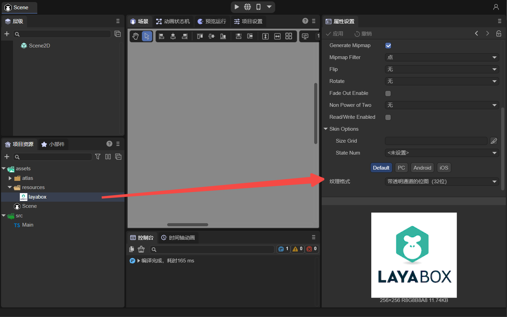

（图2-1）

点击“layabox.png”图片，可以在右边的属性面板中，看到默认是使用Default选项，纹理格式选择的是“带透明通道的位图(32位)”。在没有纹理压缩前，图片在所有平台都使用此格式。

纹理压缩在PC端和手机端有所不同，如动图2-2所示，若在Default选项中选择“纹理压缩(BC1与ASTC_6×6)”，那么PC就默认使用`BC1`，Android和IOS默认都使用`ASTC_6×6`。

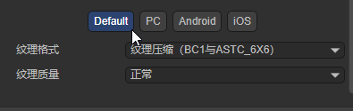

（动图2-2）

这里的Default选项只是给了一个通用的设置，开发者如果有需求，还可以分别进行设置，下面就来分别介绍PC端和手机端。

> 设置纹理压缩格式后，在assets目录下实际上是不会生成对应的压缩文件的。也就是说在预览模式下，也无法使用。只有在发布后，才可以使用压缩纹理，发布方法请参考文档[《Web发布》](../../../released/web/readme.md)。

#### 2.1.1 桌面端

在PC端以BC1为例（BC3也可以，但PC端不支持ASTC格式），按照如图2-3所示进行设置，勾选`PC平台设置`后，就可以单独设置纹理格式了。其它平台如果要单独设置也是同样的道理，只需勾选对应的选项即可，后面会再介绍。


（图2-3）

如动图2-4所示，设置好后，可以将图像作为Image组件的皮肤，然后构建发布。

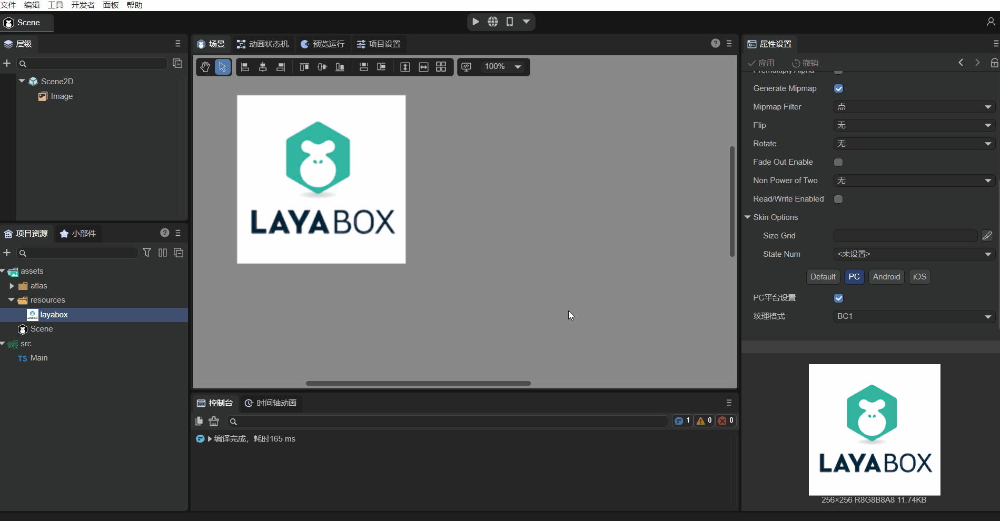

（动图2-4）

如图2-5所示，发布后的目录里，有一个`layabox@0.dds`文件，这个就是BC1纹理压缩格式的图片。同时生成的还有一个.png图片，因为在设置纹理压缩格式时，虽然PC平台设置的是BC1，但是Android和iOS设置的还是“带透明通道的位图(32位)”，所以生成的”layabox.png“是在Android和iOS运行的纹理格式。

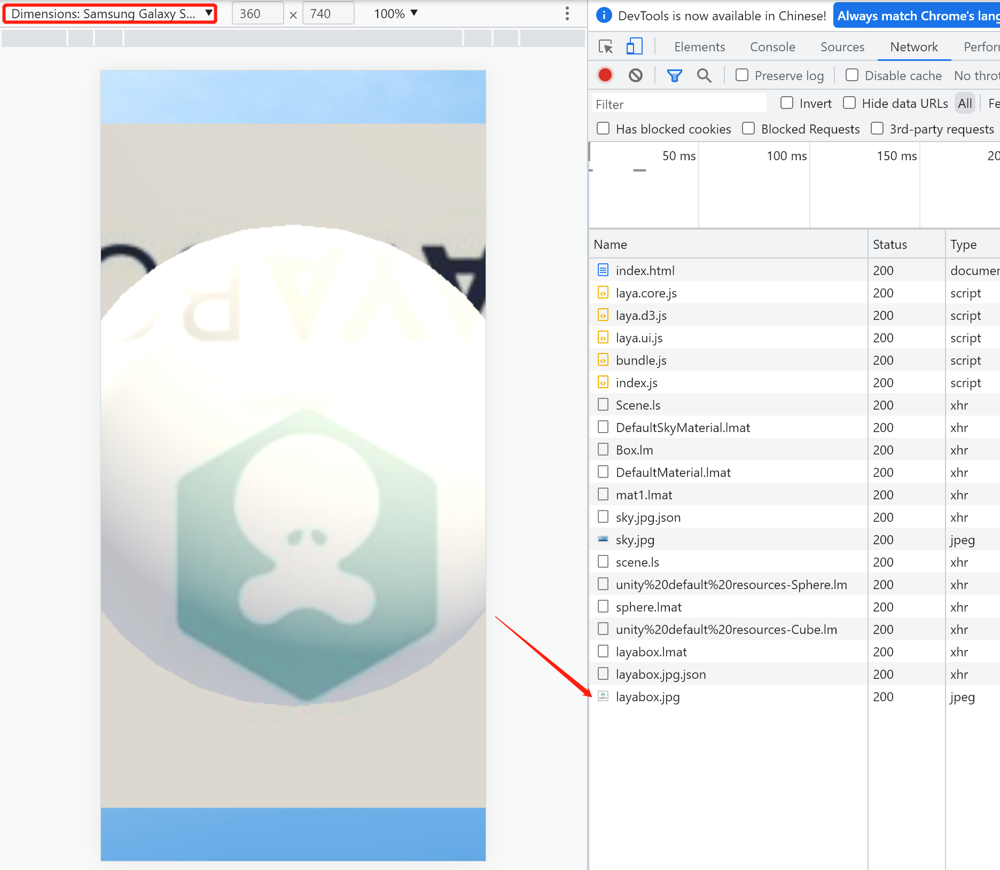

（图2-5）

在发布目录下可以找到一个”fileconfig.json“文件，这个文件中记录了一些对图片属性设置信息，其中包括使用纹理压缩信息，打开.json文件如下：

```json
{
    "files": {
        "resources": [
            "layabox.png"
        ]
    },
    "config": [
        {
            "sRGB": true,
            "filterMode": 1,
            "mipmap": true,
            "pma": false,
            "files": [
                {
                    "file": "0",
                    "ext": "dds",
                    "format": 3
                },
                {
                    "file": "",
                    "ext": "png",
                    "format": 1
                }
            ],
            "platforms": {
                "0": 0,
                "1": 1,
                "2": 1
            },
            "t": 0,
            "i": 0
        }
    ]
}
```

> platforms表示图片使用的平台，0表示PC平台，1和2分别指向Android和iOS平台。

运行发布后的Web项目（可以使用anywhere启动本地服务器，参考文档[《Web发布》](../../../released/web/readme.md)），启动后在Chrome浏览器中打开DevTools工具。如图2-6所示，点击“Network“选项，可以看到使用的是BC1纹理格式，`@0`表示在PC平台运行。

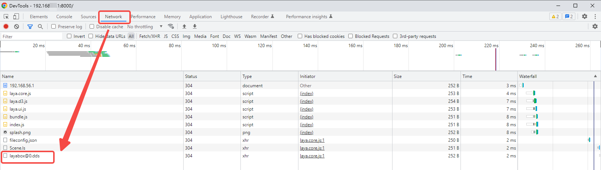

（图2-6）

#### 2.1.2 手机端

如果我们想针对Android和iOS平台使用ASTC_6x6，设置方法如动图2-7所示： 


（动图2-7）

>ASTC格式可以设置纹理质量，有时，质量低的比质量高的会更模糊。

分别对Andorid和iOS选择ASTC_6x6纹理压缩格式，并点击应用后，再将设置好的图像作为Image组件的皮肤，然后构建发布。通过发布web平台，如图2-8所示，来看发布后的文件： 

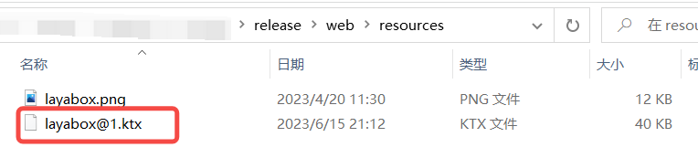

（图2-8）

发布出“layabox.png”和“layabox@1.ktx”两个文件。其中“layabox@1.ktx”就是上述操作生成的纹理压缩文件，因为都使用了ASTC_6x6，所以只生成一个压缩纹理文件。如果Android和iOS平台分别配置为不同的格式，那么就会生成两个不同的文件。同时生成的还有一个.png图片，因为在设置纹理压缩格式时，PC平台默认设置的是“带透明通道的位图(32位)”，并没有改变。

发布目录下的”fileconfig.json“文件记录了一些对图片属性设置信息，其中包括使用纹理压缩信息，打开.json文件如下：

```json
{
    "files": {
        "resources": [
            "layabox.png"
        ]
    },
    "config": [
        {
            "sRGB": true,
            "filterMode": 1,
            "mipmap": true,
            "pma": false,
            "files": [
                {
                    "file": "",
                    "ext": "png",
                    "format": 1
                },
                {
                    "file": "1",
                    "ext": "ktx",
                    "format": 19
                }
            ],
            "platforms": {
                "0": 0,
                "1": 1,
                "2": 1
            },
            "t": 0,
            "i": 0
        }
    ]
}
```

> platforms表示图片使用的平台，1和2分别指向Android和iOS平台，两个平台都使用files信息中的ktx为后缀的纹理压缩文件。

运行发布后的Web项目，启动后，以Android手机为例来看实际运行效果。在手机的Chrome浏览器中输入启动的Web项目网址，然后连接USB数据线，开启手机的开发者模式，再在PC的Chrome浏览器中输入`chrome://inspect/#devices`，然后点击`inspect`。

> 输入`chrome://inspect/#devices`后的操作类似[小米快游戏](../../../released/miniGame/xiaomi/readme.md)的调试方法。

点击后，如下图所示：


（图2-9）

可以看到正在使用“layabox@1.ktx”，其中`@1`表示在Android平台运行。

> 注意：**手机端调试必须使用真机**。如果不使用真机，只是在PC平台的Chrome下，使用手机模式（如图2-10），是无法使用到纹理压缩格式的。因为虽然使用了手机模式，但是LayaAir引擎会判断当前运行的平台依然是win32。  

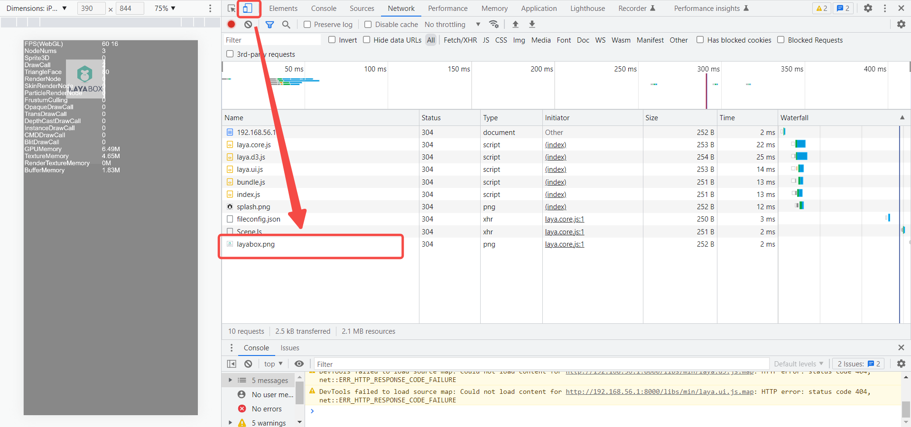

（图2-10）


### 2.2 图集纹理压缩

不仅图片可以纹理压缩，通常我们在2D开发中使用的图集也可以使用纹理压缩格式，如图2-11所示： 

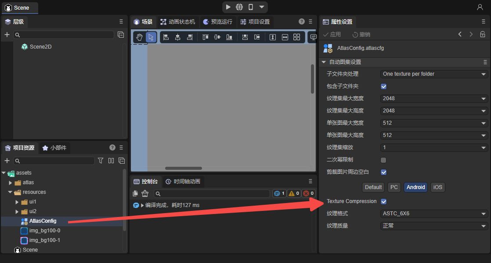

（图2-11）

> 自动生成图集的使用方法请参考[《Web发布》](../../../released/web/readme.md)。

以Android平台为例，在LayaAir IDE中，对自动图集设置进行纹理压缩配置，然后在场景中将图像作为Image组件的皮肤。发布后可以看到图集也可以使用纹理压缩格式了，如图2-12所示，`@1.ktx`是Android平台的纹理压缩格式，.atlas是图集文件，.png是其它平台默认的纹理格式。

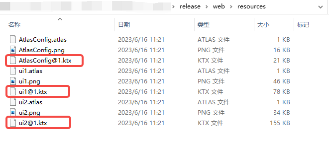

（图2-12）

再用Android手机来看看运行时的情况，图集纹理压缩文件“@1.ktx”成功使用了，如图2-13所示： 

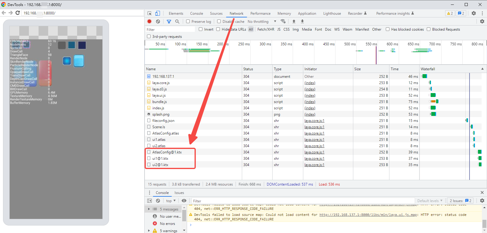

（图2-13）

到此，在IDE中配置图片纹理压缩和图集的纹理压缩就介绍完了，开发者可以自己来试一试！


## 三、代码加载纹理压缩

通过IDE配置纹理压缩后，本身LayaAir引擎是可以自动识别运行平台来使用对应的压缩纹理的，这个改进对开发者来说是非常方便的。如果开发者希望用代码来动态加载也是一样的。

### 3.1 图片纹理压缩的加载

与正常图片加载一样，在代码中直接使用图片的路径即可。以给Image组件添加皮肤为例，示例代码如下：

```typescript
const { regClass, property } = Laya;

@regClass()
export class Main extends Laya.Script {

    onAwake(): void {
        let img = new Laya.Image;
        Laya.stage.addChild(img);
        img.pos(500,100);
        img.skin = "resources/layabox.png"; //纹理压缩的图片的路径
    }

    onStart() {
        Laya.Stat.show(0, 0); //性能面板
    }
}
```

> 发布后，使用的图片就是压缩后的图片了。


### 3.2 图集纹理压缩的加载

对于2D图集，预加载图集atlas文件即可，引擎在加载图集的时候，会检测是否包含了纹理压缩转换的信息，如果包含，会自动识别平台并加载对应的纹理压缩格式文件，不需要开发者在代码里判断平台。

示例代码如下所示：

```typescript
const { regClass, property } = Laya;

@regClass()
export class Main extends Laya.Script {

    onAwake(): void {
        Laya.loader.load(["resource/AtlasConfig.atlas"], Laya.Handler.create(this, () => {
            let img = new Laya.Image;
            Laya.stage.addChild(img);
            img.pos(500, 100);
            img.skin = "resources/img_bg.png"; //图集中的图片
        }));
    }

    onStart() {
        Laya.Stat.show(0, 0);
    }
}
```

通过示例代码，我们可以看到，图集的纹理压缩的代码使用是无感的，和普通的图集使用方式完全相同。


## 四、优化效果到底怎么样

由于纹理压缩格式不需要CPU解码，那因解码而产生的瞬间性能压力就没有了，不过如果不是特别多的处理，这个过程并不是持续的，所以并不明显。

比较显著的优化还是在显存上。我们仍然举个例子来说明。

使用IDE里Image组件自带的那张图，我们将宽高改成`512*512`后，

当舞台上什么显示也没有的时候，初始显存占用是2.31M，使用纹理压缩格式，只增加170K，加上初始大小最终为2.48M。而原图则增加1024K，达到3.31M。如图4-1所示。所以显存优化效果还是非常明显的，减少约83%。

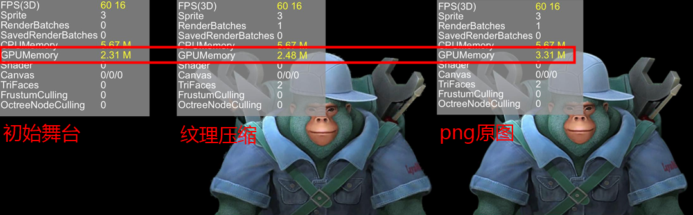

（图4-1）

> 性能显示面板介绍参考文档[《性能统计与优化》](../../../basics/common/Stat/readme.md)。

有一些开发者，还不太理解显存的占用与文件的关系。我这里告诉大家一个简单的计算依据。如果是非纹理压缩的图片，比如PNG和JPG，直接用图片像素的`宽*高*4`就是显存的占用。

所以有一些游戏，为了减少显存的占用，把图片的宽高像素做小，然后用缩放的方式，再显示放大。不过这种方式，虽然显存占用小了，但是质量的损失也大了。纹理压缩虽然也是有损压缩，但同样质量的情况下，显存占用更小，甚至和原图质量差不多的情况下，也比拉伸的方式内存占用小。所以纹理压缩是开发者比较常用的一种节省显存的方案。

那纹理压缩的显存占用，怎么计算呢，除了统计面板上的信息外，也有一种比较简单的统计方案。直接查看纹理压缩文件的大小就好了，比如纹理压缩文件是170k，那显存占用也是170k。


