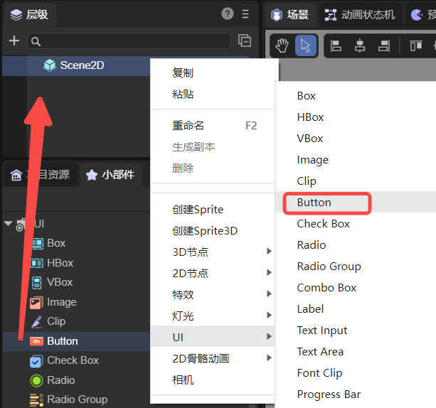
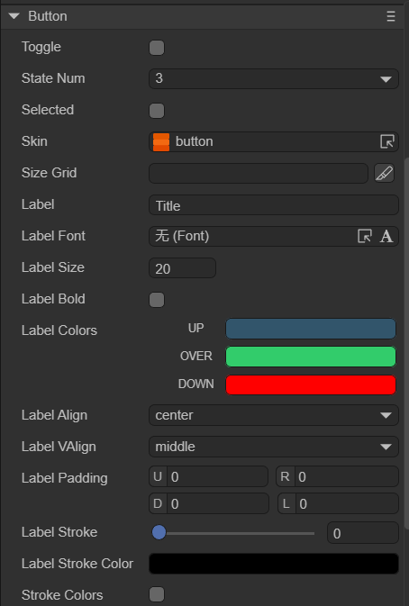
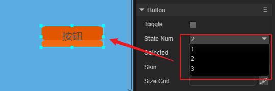
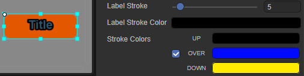
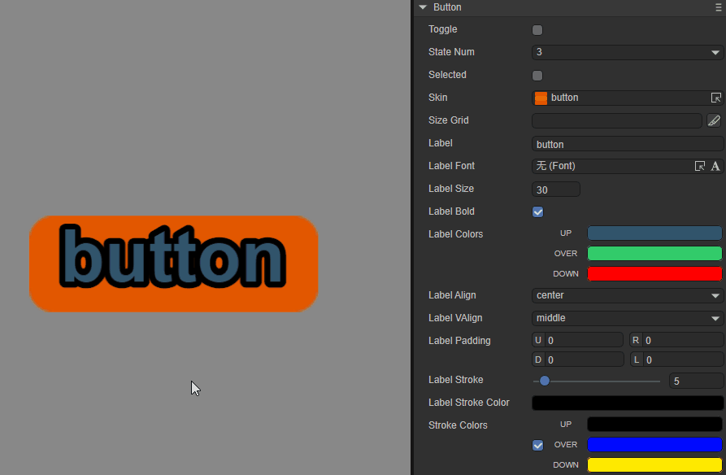
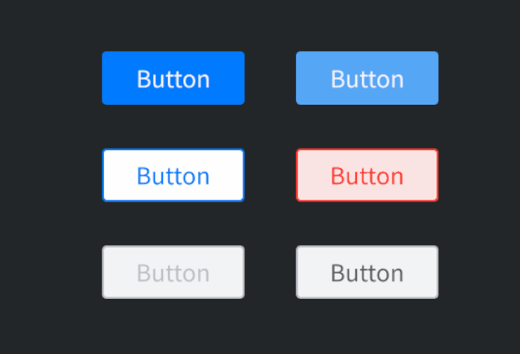

# 按钮组件（Button）

## 1、LayaAir IDE中使用Button组件

按钮（Button）组件是最常用的组件之一，可以显示文本标签、图标或者两者同时显示。在LayaAir IDE里的按钮图片（皮肤）[资源命名](../readme.md)通常是以btn为前缀。Button 组件的属性接口介绍请参考 [Button API](https://layaair.com/3.x/api/Chinese/index.html?version=3.0.0&type=2D&category=UI&class=laya.ui.Button)。


### 1.1 创建Button组件

使用LayaAir IDE创建Button非常简单，通过IDE的可视化操作，完全不需要程序基础，即可实现组件的创建与布局，也是推荐使用的组件创建方式。如图1-1所示，可以在`层级`窗口中右键进行创建，也可以从`小部件`窗口中拖拽添加。



（图1-1）

在这个过程不需要任何程序编码，完全可以交给美术或策划实现。从而减少了与程序员的沟通成本，加快了游戏的开发效率。


### 1.2 Button属性

Button组件的特有属性如下：



（图1-2）

| 属性             | 功能说明                                                     |
| ---------------- | ------------------------------------------------------------ |
| toggle           | 是否切换按钮的显示状态。默认为false，按钮点击后会直接恢复初始状态。勾选后为true，可以通过点击切换按钮显示状态，当点击按钮组件后，按钮会保持在选中（持续按下）状态，再次点击可以还原。 |
| stateNum         | 按钮皮肤的状态数，支持单态（1）、两态（2）和三态（3）按钮。  |
| selected         | 按钮是否为选中状态，默认为false。设置为true后，按钮将会一直保持选中（持续按下）的状态，而不会再对其它状态产生变化（除非在代码中进行状态改变）。 |
| skin             | 按钮的皮肤纹理资源。设置后需要根据皮肤资源设置stateNum皮肤状态数。 |
| sizeGrid         | 位图的有效缩放网格数据（九宫格信息）：上边距、右边距、下边距、左边距、是否重复填充。 |
| label            | 按钮的文本标签。                                             |
| labelFont        | 文本标签的字体。                                             |
| labelSize        | 文本标签的字体大小。                                         |
| labelBold        | 文本标签是否加粗，默认为false。                              |
| labelColors      | 鼠标在元素释放时（up）、鼠标移动到元素时（over），鼠标按下时（down）各个状态下的文本标签颜色。 |
| labelAlign       | 文本标签的水平对齐模式：left、center、right，默认为居中对齐。 |
| labelVAlign      | 文本标签的垂直对齐模型：top、middle、bottom，默认为居中对齐。 |
| labelPadding     | 文本标签的边距。格式：上边距、右边距、下边距、左边距。       |
| labelStroke      | 文本标签的描边宽度，以像素为单位。默认值为0，表示不描边。    |
| labelStrokeColor | 文本标签描边的颜色，以字符串表示，默认值为#000000（黑色）。  |
| strokeColors     | 勾选后，可以根据状态设置文本的描边颜色。分三种状态进行设置：鼠标在元素释放时（up）、鼠标移动到元素时（over），鼠标按下时（down），三种状态可以设置不同的描边颜色。 |

下面将围绕Button组件中通过文字难以理解的属性给予重点介绍。

#### 1.2.1 按钮皮肤（skin）

按钮的皮肤因切割方式不同，分成单态（1）、两态（2）和三态（3）。这里的态指的是按钮皮肤（skin）的状态。

三态常用于PC浏览器中，是将皮肤图片按竖直方向以等比分割的形式分为3部分。图1-3所示是LayaAir中自带的按钮皮肤（button.png），从上至下依次为：鼠标弹起或离开时的状态皮肤、鼠标经过时的状态皮肤、鼠标按下和选中时的状态皮肤。


（图1-3）

在移动设备上，通常只采用两态，图片以竖直方向被等比切割为两部分，上面的部分为按钮弹起或非选中时的状态皮肤，下面的部分为 按钮选中和按下时的状态皮肤。

单态按钮不切割图片，无论什么状态，按钮的皮肤只有一种，保持不变。

#### 1.2.2 指定按钮皮肤的切割状态（stateNum）

stateNum的属性值决定皮肤资源图片的切割方式。默认值为3，也就是说默认按3态按钮进行切割，等比分割为3部分。如果是两态按钮，需要将stateNum的属性值设为2，等比切割为2部分。单态按钮设置为1，不进行切割。

这里需要注意的是，指定按钮状态，需要与按钮皮肤对应好。如果是三态的按钮皮肤，stateNum设置为2，切割后如图1-4所示，是错误的。



（图1-4）

#### 1.2.3 根据状态设置按钮的文本描边颜色（strokeColors）

labelStrokeColor可以为按钮的文本描边设置一个统一的颜色（不同状态的颜色一致）。而strokeColors属性可以根据不同的状态设置按钮的描边文本颜色。

如图1-5所示，strokeColors颜色的先后设置顺序格式为：upColor（弹起或离开状态的颜色）、overColor（经过状态的颜色）、downColor（按下和选中状态的颜色）。



（图1-5）

如果想要更清晰的感受描边颜色的变化，可以将按钮大小、文本标签的字体大小和描边宽度等属性值设置大一些，效果如动图1-6所示。



（动图1-6）


### 1.3 脚本控制Button

有时，要通过代码设定Button相关的属性，就需要用到脚本了。在Scene2D的属性设置面板中，增加一个自定义组件脚本。然后，将Button组件拖入到其暴露的属性入口中。在脚本文件中添加如下示例代码：

```typescript
const { regClass, property } = Laya;

@regClass()
export class NewScript extends Laya.Script {

    @property({ type: Laya.Button })
    public btn: Laya.Button;

    //组件被激活后执行，此时所有节点和组件均已创建完毕，此方法只执行一次
    onAwake(): void {
        this.btn.scale(5, 5); //放大五倍
        this.btn.skin = "atlas/comp/button.png"; //皮肤
        this.btn.stateNum = 3; //皮肤状态

        this.btn.label = "确定"; //文本标签
        this.btn.labelFont = "宋体"; //文本标签字体
        this.btn.labelSize = 20; //文本标签字体大小
        this.btn.labelBold = true; //文本标签加粗
        this.btn.labelAlign = "center"; //文本标签水平居中对齐

        this.btn.labelStroke = 3; //文本标签字体描边宽度
        this.btn.labelStrokeColor = "#ffffff"; //描边颜色
        this.btn.strokeColors = "#000000, #c6ff00, #001aff"; //各状态下的描边颜色
        this.btn.labelColors = "#0100ff, #16fa0e, #ff0000"; //各状态下的文本颜色

        // this.btn.toggle = true; //是否保持点击状态
        // this.btn.selected = true; //是否选中
    }
}
```


## 2、Button代码创建

使用LayaAir引擎创建一个Button组件比较简单，通常只需要几个步骤，加载资源、创建一个Button实例、将Button添加到当前场景上，最后设置Button组件的属性。具体实现可以参考下面的代码与注释：

```typescript
const { regClass, property } = Laya;

@regClass()
export class UI_Button extends Laya.Script {

    private COLUMNS: number = 2;
    private BUTTON_WIDTH: number = 147;
    private BUTTON_HEIGHT: number = 165 / 3;
    private HORIZONTAL_SPACING: number = 200;
    private VERTICAL_SPACING: number = 100;

    private xOffset: number;
    private yOffset: number;

    private skins: any[];

    //组件被激活后执行，此时所有节点和组件均已创建完毕，此方法只执行一次
    onAwake(): void {
        // 以下图片资源来自“引擎API使用示例”项目
        this.skins = ["resources/res/ui/button-1.png", "resources/res/ui/button-2.png", "resources/res/ui/button-3.png",
            "resources/res/ui/button-4.png", "resources/res/ui/button-5.png", "resources/res/ui/button-6.png"];

        // 计算将Button至于舞台中心的偏移量
        this.xOffset = (Laya.stage.width - this.HORIZONTAL_SPACING * (this.COLUMNS - 1) - this.BUTTON_WIDTH) / 2;
        this.yOffset = (Laya.stage.height - this.VERTICAL_SPACING * (this.skins.length / this.COLUMNS - 1) - this.BUTTON_HEIGHT) / 2;

        Laya.loader.load(this.skins).then(() => {
            this.onUIAssetsLoaded();
        });
    }

    private onUIAssetsLoaded(e: any = null): void {
        for (var i: number = 0, len: number = this.skins.length; i < len; ++i) {
            var btn: Laya.Button = this.createButton(this.skins[i]);
            var x: number = i % this.COLUMNS * this.HORIZONTAL_SPACING + this.xOffset;
            var y: number = (i / this.COLUMNS | 0) * this.VERTICAL_SPACING + this.yOffset;
            btn.pos(x, y);
            console.log(x, y);
        }
    }

    private createButton(skin: string): Laya.Button {
        var btn: Laya.Button = new Laya.Button(skin);
        this.owner.addChild(btn);
        return btn;
    }
}
```

上述代码运行效果如动图2-1所示：



 (动图2-1)


