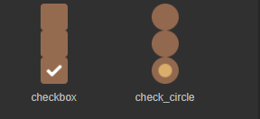
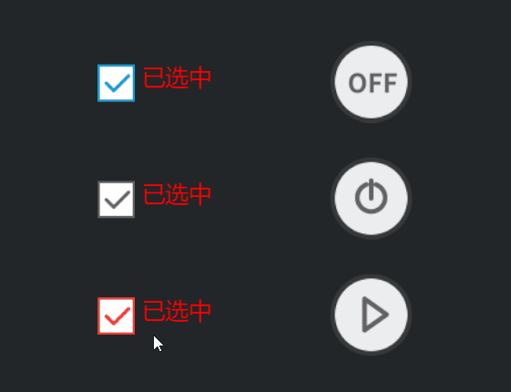
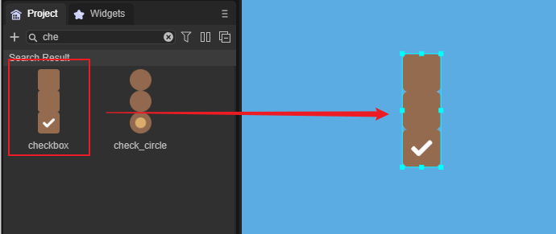
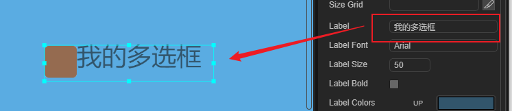
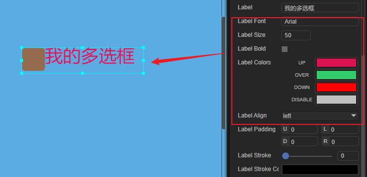
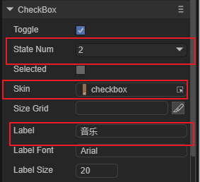
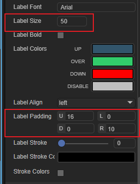
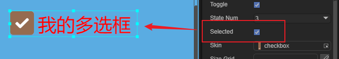

# CheckBox 组件详解

> 由于很多组件属性是通用的，常用及通用的组件属性在`属性设置器`文档中已进行介绍。阅读本篇内容前请先阅读《属性设置器》文档。

## 1、创建CheckBox组件

 CheckBox （多选框）组件由两部分组成，选择状态框及内容说明标签label。其中选择状态框必须是图片资源，标签为文本。在使用 CheckBox组件的时候，可以只使用选择状态框，也可以只设置一个标签label。

### 1.1 准备资源

CheckBox组件的选择框图片是CheckBox组件的皮肤（skin），图片资源命名通常是`check`、`checkbox`或以`check_`为前缀，如图1所示。CheckBox组件资源通常是由三态或两态的skin图片组件。

<br/>

 （图1）

*Tips:关于组件皮肤skin以及多态切割stateNum相关请查看《属性设置器》文档。*

### 1.2 用引擎直接创建CheckBox组件


使用LayaAir引擎创建一个CheckBox组件比较简单，通常只需要几个步骤，加载资源，创建一个CheckBox实例，将CheckBox添加到舞台，设置CheckBox组件的属性。具体实现参考下面的代码与注释。

**创建一个入口类GameMain.ts，编写如下代码：**

```typescript
const { regClass, property } = Laya;

@regClass()
export class UI_CheckBox extends Laya.Script {

	private COL_AMOUNT: number = 2;
	private ROW_AMOUNT: number = 3;
	private HORIZONTAL_SPACING: number = 200;
	private VERTICAL_SPACING: number = 100;
	private X_OFFSET: number = 100;
	private Y_OFFSET: number = 50;

	private skins: any[] = [
        "resources/res/ui/checkbox (1).png", 
        "resources/res/ui/checkbox (2).png", 
        "resources/res/ui/checkbox (3).png", 
        "resources/res/ui/checkbox (4).png", 
        "resources/res/ui/checkbox (5).png", 
        "resources/res/ui/checkbox (6).png"
    ];
    constructor() {
        super();
    }

    /**
     * 组件被激活后执行，此时所有节点和组件均已创建完毕，此方法只执行一次
     */
    onAwake(): void {
		Laya.loader.load(this.skins).then( ()=>{
            this.onCheckBoxSkinLoaded();
        } );
	}

	private onCheckBoxSkinLoaded(e: any = null): void {
		var cb: Laya.CheckBox;
		for (var i: number = 0; i < this.COL_AMOUNT; ++i) {
			for (var j: number = 0; j < this.ROW_AMOUNT; ++j) {
				cb = this.createCheckBox(this.skins[i * this.ROW_AMOUNT + j]);
				cb.selected = true;

				cb.x = this.HORIZONTAL_SPACING * i + this.X_OFFSET;
				cb.y += this.VERTICAL_SPACING * j + this.Y_OFFSET;

				// 给左边的三个CheckBox添加事件使其能够切换标签
				if (i == 0) {
					cb.y += 20;
					cb.on("change", this, this.updateLabel, [cb]);
					this.updateLabel(cb);
				}
			}
		}
	}

	private createCheckBox(skin: string): Laya.CheckBox {
		var cb: Laya.CheckBox = new Laya.CheckBox(skin);
		this.owner.addChild(cb);

		cb.labelColors = "white";
		cb.labelSize = 20;
		cb.labelFont = "Microsoft YaHei";
		cb.labelPadding = "3,0,0,5";

		return cb;
	}

	private updateLabel(checkBox: Laya.CheckBox): void {
		checkBox.label = checkBox.selected ? "已选中" : "未选中";
	}
}
```

代码运行效果如动图2所示：

 <br />

 (动图2)


**Tips:** CheckBox 组件的属性接口介绍请参考 [CheckBox API](https://layaair.com/3.x/api/Chinese/index.html?version=3.0.0&type=2D&category=UI&class=laya.ui.CheckBox)。


## 二、通过LayaAirIDE创建CheckBox组件

### 2.1 创建CheckBox

 创建一个ui的DEMO页，点击选择`资源管理器`里的 CheckBox 组件资源，拖到场景编辑器，即成功添加 CheckBox 组件到页面上，如图3-1所示。   

<br/>

（图3-1）


### 2.2 设置CheckBox常用属性

创建完组件，可以通过属性设置器，为组件设置属性。例如，CheckBox组件的默认文本为“label”，我们将默认文本修改为“我的多选框”，并设置label标签的颜色、状态、字体、大小等。如图3-2、3-3所示。

 <br/>

  （图3-2）

<br/>

（图3-3）


#### 2.2.1 Label相关的其他属性

| **属性名**       | **功能说明**                                                 |
| ---------------- | ------------------------------------------------------------ |
| labelAlign       | 标签对齐模式，默认为居左对齐。注：在CheckBox中无效           |
| labelColors      | 表示标签各个状态下的文本颜色。 格式: " UpColor，OverColor，DownColor，DisableColor “。默认为“蓝色，绿色”。 |
| labelBold        | 表示标签文本标签是否为粗体字。                               |
| labelFont        | 表示文本标签的字体名称，以字符串形式表示。IDE中可选择。      |
| labelPadding     | 表示文本标签的边距。 格式："上边距,右边距,下边距,左边距"。   |
| labelSize        | 表示文本标签的字体大小。                                     |
| labelStroke      | 文字描边宽度（以像素为单位）。 默认值0，表示不描边。         |
| labelStrokeColor | 文字描边颜色，以字符串表示。 默认值为 "#000000"（黑色）;     |
| strokeColor      | 表示各个状态下的描边颜色。 格式: "upColor，overColor，downColor，disableColor"。 |


#### 2.2.2  关于多选框大小与九宫格

需要特别说明的是九宫格（sizeGrid）在CheckBox组件中无效，**多选框**的大小需美术资源制作的时候去设置。

#### 2.2.3  skin与stateNum配合换皮肤资源

 **skin：**选择框的图像资源。与按钮类似，可两态或三态美术资源。IDE或程序中俱可修改。

**stateNum：**表示选择框的状态，多选框组件默认为三个状态，如果多选框美术资源改为两态，如图4所示，需设置状态值为2，正常情况下多选框至少应当有2个状态。

<br/>

  （图4）两态美术资源图

*Tips：特殊情况下，也可以使用单态。比如仅由label文本组成的CheckBox组件。*

**两态CheckBox调整示例：**

下面我们上例的多选框换成另一个两态的“音乐开关”多选框。从资源管理器中拖拽一个两态资源到skin属性上，并把stateNum设置为2，修改label文本为音乐，并调整label标签的字体大小与边距，如图5-1、5-2所示。

<br/>

  （图5-1）

<br/>

  （图5-2）


#### 2.2.4 默认勾选 selected

布尔值，表示多选框是否被选中，可通过程序调用或IDE设置，设置 CheckBox 的 selected 属性的值为 true 后，显示效果如图6所示：

<br/>

  （图6）

#### 2.2.5 不能设置的属性toggle

toggle决定按下时是否切换组件的显示状态。这里需要特别的注意的是，该属性在CheckBox组件时不要改成false，否则会变成按钮模式，永远都选不中。


