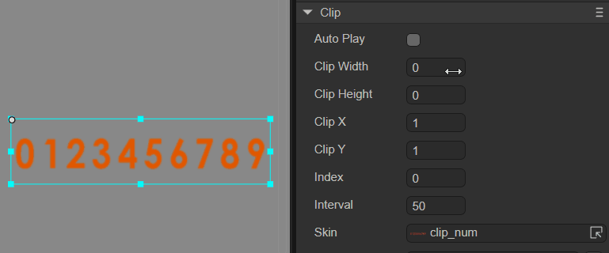

# 位图切片组件（Clip）

Clip 组件可以用来播放切片动画，和显示切片动画的某一帧图片。Clip 可以将一张图片，按横向分隔数量 ClipX、竖向分隔数量 ClipY，或横向分割每个切片的宽度 ClipWidth、竖向分割每个切片的高度 ClipHeight，从左向右，从上到下，分割组合为一个切片动画。Clip 的脚本接口参考[Clip API](https://layaair.com/3.x/api/Chinese/index.html?version=3.0.0&type=2D&category=UI&class=laya.ui.Clip)。

##  一、通过LayaAir IDE创建Clip组件

### 1.1 创建Clip

如图1-1所示，可以在`层级`窗口中右键进行创建，也可以从`小部件`窗口中拖拽添加。


（图1-1）

在创建的工程中，LayaAir会自带一个Clip 组件的资源示例（clip_num.png），效果如图1-2。


（图1-2）


### 1.2 Clip 组件的常用属性

Clip组件的特有属性如下：


（图1-3）

| **属性**   | **功能说明**                                            |
| ---------- | ------------------------------------------------------- |
| autoPlay   | 布尔值，表示是否自动播放当前切片动画。                  |
| clipWidth  | 横向分割图片资源时，每个切片的宽度。（优先级高于clipX） |
| clipHeight | 纵向分割图片资源时，每个切片的高度。（优先级高于clipY） |
| clipX      | 横向分割图片资源时，等宽切割的份数。                    |
| clipY      | 纵向分割图片资源时，等高切割的份数。                    |
| index      | 切片动画当前显示动画帧索引。                            |
| interval   | 切片动画的播放时间间隔。                                |
| skin       | 切片动画的纹理。                                        |
| sizeGrid   | 图像资源的有效网格数据（九宫格数据）。                  |
| group      | 加载分组，设置后可以按组管理资源。                      |

这里使用LayaAir自带的资源演示clipWidth和clipX的效果。如动图1-4所示，每个数字的宽度为26，所以将clipWidth设置为26，此时再调节clipX的值就无效了。



（动图1-4）

如果不设置clipWidth，设置clipX为10，则会将十个数字等分，效果如下：


（图1-5）


### 1.3 脚本控制Clip

有时，要通过代码设定Clip相关的属性，就需要用到脚本了。在Scene2D的属性设置面板中，增加一个自定义组件脚本。然后，将Clip组件拖入到其暴露的属性入口中。下面给出一个示例代码，实现脚本控制Clip：

```typescript
const { regClass, property } = Laya;

@regClass()
export class NewScript extends Laya.Script {

    @property({ type: Laya.Clip })
    public clip: Laya.Clip;

    //组件被激活后执行，此时所有节点和组件均已创建完毕，此方法只执行一次
    onAwake(): void {
        this.clip.pos(Laya.stage.width >> 1, Laya.stage.height >> 1); // 位置
        this.clip.skin = "atlas/comp/clip_num.png"; // 皮肤
        this.clip.interval = 1000; // 切片动画的播放时间间隔1000毫秒
        this.clip.clipX = 10; // 切片x轴数量
        this.clip.autoPlay = true; // 动画自动播放
    }
}
```


##  二、通过代码创建Clip组件

在进行书写代码的时候，免不了通过代码控制UI，创建`UI_Clip`类，通过代码设定Clip相关的属性。

通过代码创建计数器，运行示例效果:


（动图2-1）

示例说明：


（图2-2）

Clip的其他属性也可以通过代码来设置，上述示例演示了如何通过计时器获取每一秒更新clip.clipX切片，通过每秒更新数字实现计时器的功能，有兴趣的读者可以自己通过代码设置Clip，创建出符合自己项目中需要的Clip。

> 注：需要将图片资源的纹理类型设置为“精灵纹理”。

**示例代码：**

```typescript
const { regClass, property } = Laya;

@regClass()
export class UI_Clip extends Laya.Script {

    // 以下资源来自“引擎API使用示例”
    private buttonSkin: string = "resources/res/ui/button-7.png";
    private clipSkin: string = "resources/res/ui/num0-9.png";
    private bgSkin: string = "resources/res/ui/coutDown.png";

    counter: any;
    controller: any;
    currFrame: any;


    //组件被激活后执行，此时所有节点和组件均已创建完毕，此方法只执行一次
    onAwake(): void {
        Laya.loader.load([this.buttonSkin, this.clipSkin, this.bgSkin]).then( ()=>{
            this.onSkinLoaded();
        } );
    }

    private onSkinLoaded(e: any = null): void {
        this.showBg();
        this.createTimerAnimation();
        this.showTotalSeconds();
        this.createController();
    }

    private showBg(): void {
        var bg: Laya.Image = new Laya.Image(this.bgSkin);
        bg.size(224, 302);
        bg.pos(Laya.stage.width - bg.width >> 1, Laya.stage.height - bg.height >> 1);
        this.owner.addChild(bg);
    }

    private createTimerAnimation(): void {
        this.counter = new Laya.Clip(this.clipSkin, 10, 1);
        this.counter.autoPlay = true;
        this.counter.interval = 1000;
        this.counter.x = (Laya.stage.width - this.counter.width) / 2 - 35;
        this.counter.y = (Laya.stage.height - this.counter.height) / 2 - 40;
        this.owner.addChild(this.counter);
    }

    private showTotalSeconds(): void {
        var clip: Laya.Clip = new Laya.Clip(this.clipSkin, 10, 1);
        clip.index = clip.clipX - 1;
        clip.pos(this.counter.x + 60, this.counter.y);
        this.owner.addChild(clip);
    }

    private createController(): void {
        this.controller = new Laya.Button(this.buttonSkin, "暂停");
        this.controller.labelBold = true;
        this.controller.labelColors = "#FFFFFF,#FFFFFF,#FFFFFF,#FFFFFF";
        this.controller.size(84, 30);

        this.controller.on('click', this, this.onClipSwitchState);

        this.controller.x = (Laya.stage.width - this.controller.width) / 2;
        this.controller.y = (Laya.stage.height - this.controller.height) / 2 + 110;
        this.owner.addChild(this.controller);
    }

    private onClipSwitchState(e: any = null): void {
        if (this.counter.isPlaying) {
            this.counter.stop();
            this.currFrame = this.counter.index;
            this.controller.label = "播放";
        }
        else {
            this.counter.play();
            this.counter.index = this.currFrame;
            this.controller.label = "暂停";
        }
    }
}
```


 