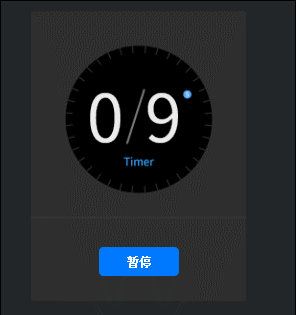

# Clip 组件参考


##  一、通过LayaAirIDE创建Clip组件

### 1.1 创建Clip

 Clip 组件可用于显示位图切片动画。Clip 可以将一张图片，按横向分隔数量 ClipX、竖向分隔数量 ClipY，或横向分割每个切片的宽度 ClipWidth、竖向分割每个切片的高度 ClipHeight，从左向右，从上到下，分割组合为一个切片动画。

 Clip 组件可以用来播放切片动画，和显示切片动画的某一帧图片。
​        点击资源面板里的 Clip 组件，拖放到页面编辑区，即可添加 Tab 组件到页面上。
Clip 的脚本接口参考[Clip API](https://layaair2.ldc2.layabox.com/api2/Chinese/index.html?version=2.9.0beta&type=2D&category=UI&class=laya.ui.Clip)

Clip 组件的资源示例：

<br/>

（图1）

 

​        设置 ClipX 属性的值为10后的显示效果：

​        <br/>

​    （图2）

​        设置 index 属性的值为 1后的显示效果：

​        <br/>

​    （图3）

### 1.2 Clip 组件的常用属性

​        <br/>

​    （图4）

 

| **属性**     | **功能说明**            |
| ---------- | ------------------- |
| autoPlay   | 布尔值，表示是否自动播放当前切片动画。 |
| clipWidth  | 横向分割图片资源时，每个切片的宽度。  |
| clipHeight | 纵向分割图片资源时，每个切片的高度。  |
| clipX      | 横向分割图片资源时，等宽切割的份数。  |
| clipY      | 纵向分割图片资源时，等高切割的份数。  |
| index      | 切片动画当前显示动画帧索引。      |
| interval   | 切片动画的播放时间间隔。        |
| sizeGrid   | 图像资源的有效网格数据（九宫格数据）。 |
| skin       | 选项卡按钮图像资源。          |


##  二、通过代码创建Clip组件

 	在我们进行书写代码的时候，免不了通过代码控制UI，创建`UI_Clip`类，通过代码设定Clip相关的属性。

**运行示例效果:**

​	<br/>

​	(图5)通过代码创建计数器

​	<br/>

​	(图6)

​	Clip的其他属性也可以通过代码来设置，上述示例演示了如何通过计时器获取每一秒更新clip.clipX切片，通过每秒更新数字实现计时器的功能，有兴趣的读者可以自己通过代码设置Clip，创建出符合自己项目中需要的Clip。

注：需要将图片资源预乘Alpha

**示例代码：**

```typescript
const { regClass, property } = Laya;

@regClass()
export class UI_Clip extends Laya.Script {

	private buttonSkin: string = "resources/res/ui/button-7.png";
	private clipSkin: string = "resources/res/ui/num0-9.png";
	private bgSkin: string = "resources/res/ui/coutDown.png";
    pageHeight: any;
    pageWidth: any;
    counter: any;
    controller: any;
    currFrame: any;


    constructor() {
        super();
    }

    /**
     * 组件被激活后执行，此时所有节点和组件均已创建完毕，此方法只执行一次
     */
    onAwake(): void {
		Laya.loader.load([this.buttonSkin, this.clipSkin, this.bgSkin]).then( ()=>{
            this.onSkinLoaded();
        } );
	}

	private onSkinLoaded(e: any = null): void {
		this.showBg();
		this.createTimerAnimation();
		this.showTotalSeconds();
		this.createController();
	}

	private showBg(): void {
		var bg: Laya.Image = new Laya.Image(this.bgSkin);
		bg.size(200, 200);
		bg.pos(Laya.stage.width - bg.width >> 1, Laya.stage.height - bg.height >> 1);
		this.owner.addChild(bg);
	}

	private createTimerAnimation(): void {
		this.counter = new Laya.Clip(this.clipSkin, 10, 1);
		this.counter.autoPlay = true;
		this.counter.interval = 1000;

		this.counter.x = (Laya.stage.width - this.counter.width) / 2 - 35;
		this.counter.y = (Laya.stage.height - this.counter.height) / 2 - 40;

		this.owner.addChild(this.counter);
	}

	private showTotalSeconds(): void {
		var clip: Laya.Clip = new Laya.Clip(this.clipSkin, 10, 1);
		clip.index = clip.clipX - 1;
		clip.pos(this.counter.x + 60, this.counter.y);
		this.owner.addChild(clip);
	}

	private createController(): void {
		this.controller = new Laya.Button(this.buttonSkin, "暂停");
		this.controller.labelBold = true;
		this.controller.labelColors = "#FFFFFF,#FFFFFF,#FFFFFF,#FFFFFF";
		this.controller.size(84, 30);

		this.controller.on('click', this, this.onClipSwitchState);

		this.controller.x = (Laya.stage.width - this.controller.width) / 2;
		this.controller.y = (Laya.stage.height - this.controller.height) / 2 + 110;
		this.owner.addChild(this.controller);
	}

	private onClipSwitchState(e: any = null): void {
		if (this.counter.isPlaying) {
			this.counter.stop();
			this.currFrame = this.counter.index;
			this.controller.label = "播放";
		}
		else {
			this.counter.play();
			this.counter.index = this.currFrame;
			this.controller.label = "暂停";
		}
	}
}
```


 