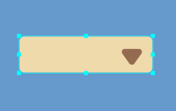
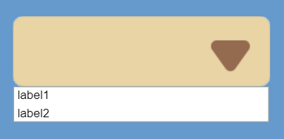
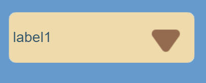
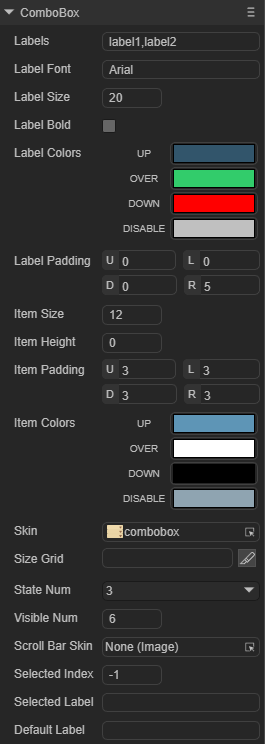
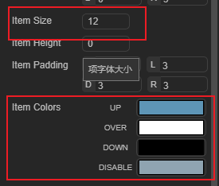
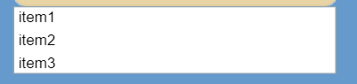
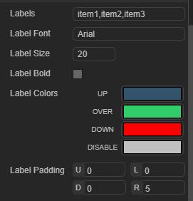
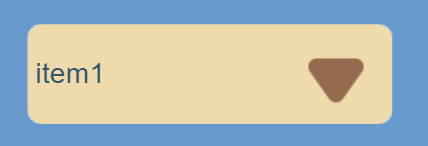
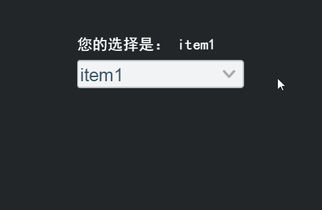

# ComboBox 组件参考


## 一、通过LayaAirIDE创建ComboBox组件
### 1.1 创建ComboBox

​        ComboBox 是一个下拉列表选项框组件。
​        点击选择资源面板里的 ComboBox 组件，拖放到页面编辑区，即可添加 ComboBox 组件到页面上。
​        ComboBox 的脚本请接口参考  [ComboBox API](https://layaair.com/3.x/api/Chinese/index.html?version=3.0.0&type=2D&category=UI&class=laya.ui.ComboBox)。

​        ComboBox 组件的图像资源示例：

​        

​    （图1）

​        设置 ComboBox 的属性 labels 的值为 “label1,label2” 后，显示效果如下：
​        常态：

​        

​    （图2）

​        点击后显示下拉选项列表：

​        

​    （图3）

​        在下拉选项中选择 lable1 后：

​        

​    （图4）


### 1.2 ComboBox 组件的常用属性

​       

​    （图5）

 

| **属性**      | **功能说明**                                       |
| ------------- | -------------------------------------------------- |
| labels        | 下拉选框的标签文本内容集合字符串，以逗号分隔。     |
| visibleNum    | 下拉列表中可显示的最大行数。                       |
| statenum      | 按钮的状态值。                                     |
| scrollBarSkin | 下拉列表的滚动条图像资源。                         |
| selectedIndex | 表示当前选择的项的索引。                           |
| selectedlable | 按标签文本设置下拉列表默认选项值。                 |
| defaultlable  | 未设置下拉列表选项值时，在显示框中用于提示的文本。 |
| sizeGrid      | 下拉列表图像资源的有效缩放网格数据（九宫格数据）。 |
| skin          | 下拉列表图像资源。                                 |
| itemcolors    | 下拉选项列表的各种颜色。                           |
| itemsize      | 项字体大小                                         |
| itempadding   | 下拉框单元项的文本边距。                           |

 

### 1.3 ComboBox 组件下拉选项相关属性
​        

​    （图6）

​        

​    （图7）

| **属性**     | **功能说明**                      |
| ---------- | ----------------------------- |
| itemColors | 下拉列表项的各状态的标签文本颜色值集合。详细请参考API。 |
| itemSize   | 下拉列表项的标签文本的字体大小。              |

### 1.4 ComboBox 组件下拉按钮相关属性

​        

​    （图8）

​        

​    （图9）

 

| **属性**       | **功能说明**                    |
| ------------ | --------------------------- |
| labelBold    | 下拉按钮的标签文本是粗体显示。             |
| labelColor   | 下拉按钮的各状态下的文本颜色值集合。详细请参考API。 |
| labelFont    | 下拉按钮的文本字体。                  |
| labelPadding | 下拉按钮的文本边距。详细请参考API          |
| labelSize    | 下拉按钮的文本字体大小。                |

 

## 二、通过代码创建ComboBox组件 

在我们进行书写代码的时候，免不了通过代码控制UI，创建`UI_ComboBox`类，通过代码设定ComboBox相关的属性。

**运行示例效果：**

​	

（图10）

ComboBox的其他属性也可以通过代码来设置，下述示例演示了如何通过代码创建选中框中的下拉选项，并通过点击获取到自己的点击是哪一条选项。有兴趣的读者可以自己通过代码设置ComboBox，创建出符合自己需要的下拉框。

```javascript
const { regClass, property } = Laya;

@regClass()
export class UI_ComboBox extends Laya.Script {
	private skin: string = "resources/res/ui/combobox.png";
	pageWidth: number;

    constructor() {
        super();
    }

    /**
     * 组件被激活后执行，此时所有节点和组件均已创建完毕，此方法只执行一次
     */
    onAwake(): void {


		Laya.loader.load(this.skin).then( ()=>{
            this.onLoadComplete();
        } );
	}

	private onLoadComplete(e: any = null): void {
		var ComboBox: Laya.ComboBox = this.createComboBox(this.skin);
		ComboBox.autoSize = true;
		
	}

	private createComboBox(skin: string): Laya.ComboBox {
		var ComboBox: Laya.ComboBox = new Laya.ComboBox(skin, "item0,item1,item2,item3,item4,item5");
		ComboBox.labelSize = 30;
		ComboBox.itemSize = 25
		this.owner.addChild(ComboBox);

		return ComboBox;
	}

	private onSelect(cb: Laya.ComboBox, e: any = null): void {
		console.log("选中了： " + cb.selectedLabel);
	}
}
```

