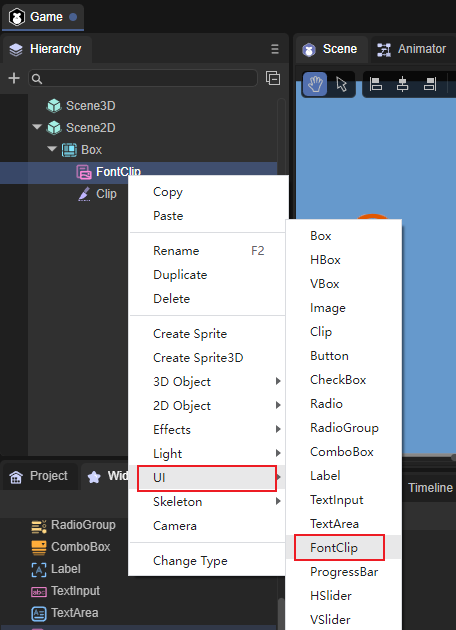
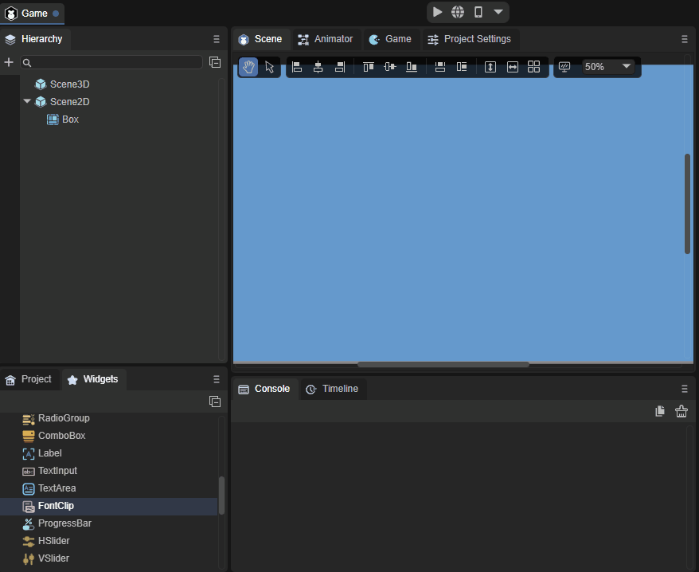
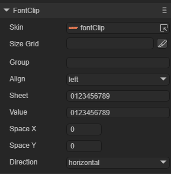
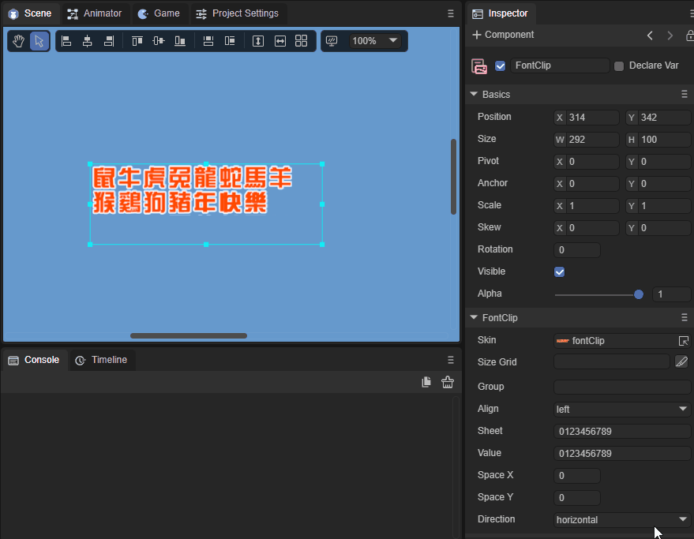
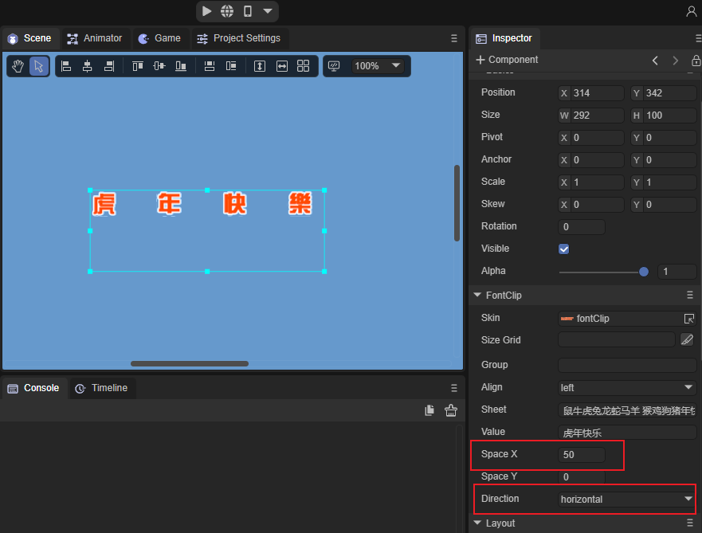
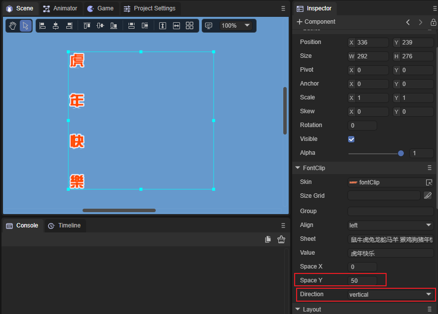

# FontClip组件参考

FontClip组件本质上是对位图从方向上进行等比切割，FontClip继承于Clip。

## 1、创建Fontclip

创建Fontclip非常简单，通过IDE的可视化操作，只需要用鼠标就可以实现。右键单击Scence2D，找到UI，点击FontClip即可创建成功。如图一所示。

 

（图1）

我们也可以从IDE资源管理右侧组件面板的UI文件夹中，将FontClip组件拖拽到UI页面中，如动图2所示。

 

（动图2）

## 2、Fontclip属性介绍

 

（图3）

| 属性      | 功能说明                                                     |
| --------- | ------------------------------------------------------------ |
| sheet     | 位图内容范围，位图内容在有换行时需要在换行的位置添加空格。   |
| value     | 位图数字内容。                                               |
| align     | 水平对齐方式，共有三种方式。left：居左对齐，center：居中对齐，right：居右对齐。 |
| spacex    | X方向间隔，以像素为单位。                                    |
| spacey    | Y方向间隔，以像素为单位。                                    |
| direction | 位图内容排列方向，共有两个选项。horizontal：水平方向排列，vertical：垂直方向排列。 |

FontClip相比于Clip更适用于字体切片，所以叫FontClip。FontClip在游戏中比Clip用的更多更广，FontClip也是我们推荐使用的，一些特殊的文本或者字体就会用到FontClip。

### 2.1 Fontclip sheet和value属性使用方法

Fontclip如果位图内容是图形的话，可以将其当成数字，按索引处理。

演示一下sheet属性的使用方法，按照位图内容填上对应的字符，在value中输入想要显示的内容就可以将其显示出来如动图4所示。

 

（动图4）

sheet就相当于一个位图切片样板，value会直接对比sheet中的内容，取值非常方便和灵活。

### 2.2 Fontclip SpaceX和SpaceY属性使用方法

SpaceX用来调节X方向的间隔，需要配合Direction来使用，如图5所示。

 

（图5）

SpaceY用来调节Y方向的间隔，需要配合Direction来使用，如图6所示。

 

（图6）