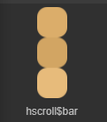
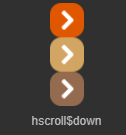
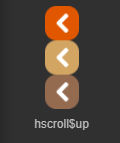
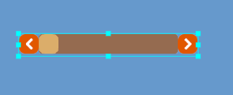
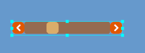
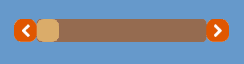
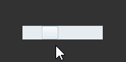
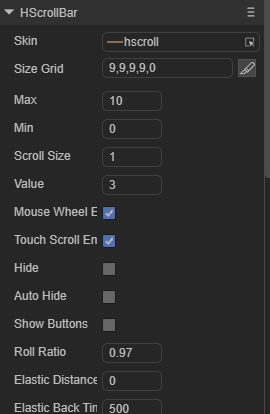
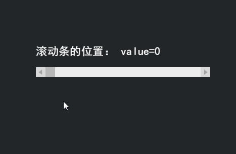

# HScrollBar 组件参考


##  一、通过LayaAirIDE创建HScrollBar组件

###         1.1创建HscrollBar

​	HScrollBar 组件是一个水平方向滚动条组件。
​        当数据太多以至于显示区域无法容纳时，最终用户可以使用 HScrollBar 组件控制所显示的数据部分。
​        滚动条由四部分组成：一个轨道图、一个滑块按钮和两个箭头按钮。
​        点击选择资源面板里的 HScrollBar 组件，拖放到页面编辑区，即可添加 HScrollBar 组件到页面上。
​        HScrollBar 组件的脚本接口请参考 [HScrollBar API](https://layaair2.ldc2.layabox.com/api2/Chinese/index.html?version=2.9.0beta&type=2D&category=UI&class=laya.ui.HScrollBar)。
​        HScrollBar 组件的图像资源示例：

​        <br/>

​    （图1）

​        <br/>

​    （图2）

​        <br/>

​    （图3）

​        <br/>

​    （图4）

​        HScrollBar 拖放到编辑器区后，显示效果：

​        <br/>

​    （图5）

​        设置 HScrollBar 的属性 max 的值为 10、属性 min 的值为0、属性 value 的值为3后，显示效果如下：

​        <br/>

​    （图6）

​        在程序中运行时，可以拖动滑块或点击箭头按钮控制进度条的值：

​        <br/>

​    （图7）

​        设置 HScrollBar 的属性 showButtons 的值为 false时的显示效果：

​        <br/>

​    （图8）

​        在程序里运行时的效果：

​        <br/>

​    （图9）

 

### 1.2 HScrollBar 组件常用属性

​        <br/>

​    （图10）

 

| **属性**          | **功能说明**                                                 |
| ----------------- | ------------------------------------------------------------ |
| skin              | 滚动条的图像资源地址。                                       |
| sizeGrid          | 滚动条轨道图资源的有效缩放网格数据（九宫格数据）。           |
| value             | 表示当前滚动位置的数字。                                     |
| min               | 表示最低滚动位置的数字。                                     |
| max               | 表示最高滚动位置的数字。                                     |
| scrollSize        | 表示按下滚动条轨道时页面滚动的增量。                         |
| mouseWheelEnable  | 一个布尔值，指定是否滑轮滚动，默认值为true。                 |
| touchScrollEnable | 一个布尔值，指定是否开启触摸，默认值为true。                 |
| autoHide          | 一个布尔值，指定是否自动隐藏滚动条(无需滚动时)，默认值为false。 |
| showButtons       | 一个布尔值，指定是否显示向上、向下按钮，默认值为true。       |
| rollratio         | 滚动衰减系数，默认为0.95。                                   |

 

## 二、通过代码创建HScrollBar组件

​	在我们进行书写代码的时候，免不了通过代码控制UI，创建`UI_ScrollBar`类，通过代码设定HScrollBar相关的属性。

**运行示例效果:**
​	<br/>
​	(图11)通过代码创建HScrollBar

​	HScrollBar的其他属性也可以通过代码来设置，下述示例演示了如何通过代码创建的HScrollBar，有兴趣的读者可以自己通过代码设置HScrollBar，创建出符合自己需要的HScrollBar。

**示例代码：**

```javascript
const { regClass, property } = Laya;

@regClass()
export class UI_HScrollBar extends Laya.Script {


    constructor() {
        super();
    }

    /**
     * 组件被激活后执行，此时所有节点和组件均已创建完毕，此方法只执行一次
     */
    onAwake(): void {
    
		var skins: any[] = [];
		skins.push("resources/res/ui/hscroll.png", "resources/res/ui/hscroll$bar.png", "resources/res/ui/hscroll$down.png", "resources/res/ui/hscroll$up.png");
		
		Laya.loader.load(skins).then( ()=>{
            this.onLoadComplete();
        } );
	}

	private onLoadComplete(e: any = null): void {
		this.placeHScroller();
		
	}

	private placeHScroller(): void {
		var hs: Laya.HScrollBar = new Laya.HScrollBar();
		hs.skin = "resources/res/ui/hscroll.png";
		hs.width = 300;
		hs.pos(50, 170);

		hs.min = 0;
		hs.max = 100;

		hs.changeHandler = new Laya.Handler(this, this.onChange);
		this.owner.addChild(hs);
	}


	private onChange(value: number): void {
		console.log("滚动条的位置： value=" + value);
	}
    
}
```

