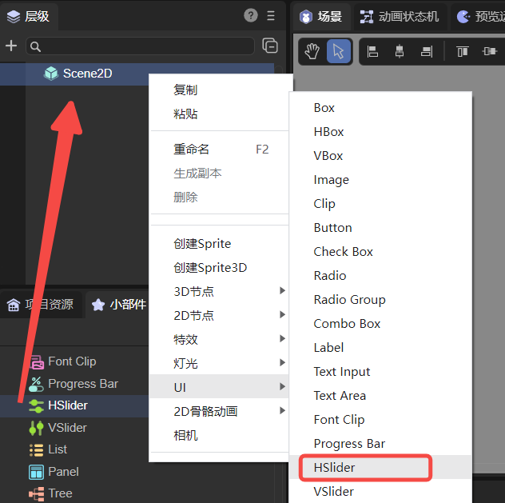
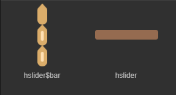
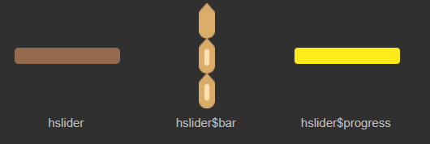
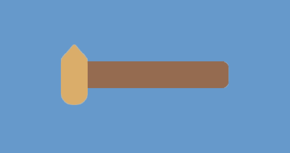
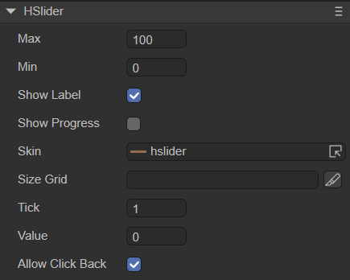
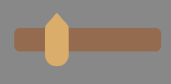
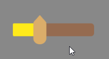
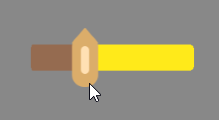
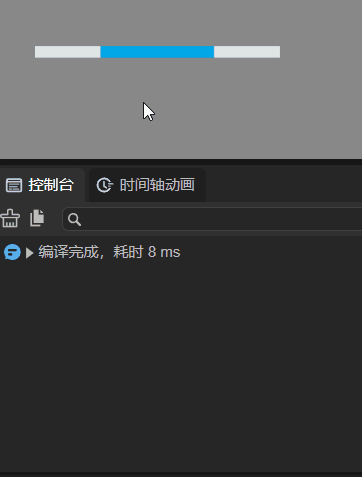

# 水平滑动条组件（HSlider）

## 一、通过LayaAir IDE创建HSlider组件

HSlider与VSlider组件都是Slider组件的子类，它们分别表示横向滑动条与纵向滑动条。用户可以通过在滑块轨道之间移动滑块来选择值。常用于如播放器进度控制、音量大小控制，一些UI上的数值调整等。HSlider的详细属性可查看[API](https://layaair.com/3.x/api/Chinese/index.html?version=3.0.0&type=2D&category=UI&class=laya.ui.HSlider)。

### 1.1 创建HSlider

如图1-1所示，可以在`层级`窗口中右键进行创建，也可以从`小部件`窗口中拖拽添加。



（图1-1）

滑动条可由两部分或三部分组成。如果是两部分，则包含底图资源`hslider.png`、滑块资源`hslider$bar.png`，如图1-2所示。资源至少应当有这两个，否则无法实现滑动功能。



（图1-2）

如果是三部分组成的滑动条，则包含滑块资源`hslider$bar.png`、进度条资源`hslider$progress.png` 、底图资源`hslider.png`，如图1-3所示。如果缺少了进度条资源组件也不会报错，只是不显示进度。



（图1-3）

> 进度条资源`hslider$progress.png`可以与底图资源`hslider.png`互换，互换后进度可以反向显示。

LayaAir默认创建的HSlider组件是由两部分组成的，如动图1-4所示，HSlider组件采用水平方向。滑块轨道从左向右扩展，鼠标拖动滑块会显示数值的标签。



（动图1-4）


### 1.2 HSlider属性

HSlider的特有属性如下：



（图1-5）

| **属性**       | **功能说明**                                                 |
| -------------- | ------------------------------------------------------------ |
| max            | 滑块拖动到最右边时的值，默认数值为100                        |
| min            | 滑块拖动到最左边时的值，默认数值为0                          |
| showLabel      | 是否显示标签。默认为true，运行时拖动滑块会显示value值        |
| showProgress   | 是否显示进度条。默认为false，如果存在进度条资源`hslider$progress.png`，则可以勾选该项 |
| skin           | 滑动条的底图资源                                             |
| sizeGrid       | 滑动条底图资源的有效缩放网格数据（九宫格数据）               |
| tick           | 滑动条刻度值的最小单位。每次拖动滑块value值改变的量，默认值为1 |
| value          | 当前所在刻度，即滑块目前所处的数值，应当等于max或min，或是它们之间的值 |
| allowClickBack | 是否允许通过点击滑动条改变value值。默认为false，禁止通过点击滑动条改变value值，此时只有拖动滑块一种方式改变value值。为true时，可以通过点击滑动条目标区域，使滑块快速跳转到当前所在刻度，改变value值 |

设置HSlider的属性max的值为20、属性min的值为0、属性value的值为5后，显示效果如下：



（图1-6）

设置属性showLabel为true、属性showProgress为true、属性tick值为3，效果如下动图所示：



（动图1-7）

进度条资源`hslider$progress.png`可以与底图资源`hslider.png`互换，效果如下：



（动图1-8）


### 1.3 脚本控制HSlider

在Scene2D的属性设置面板中，增加一个自定义组件脚本。然后，将HSlider拖入到其暴露的属性入口中。需要添加如下的示例代码，实现脚本控制HSlider：

```typescript
const { regClass, property } = Laya;

@regClass()
export class NewScript extends Laya.Script {

    @property({ type: Laya.HSlider })
    public hslider: Laya.HSlider;

    //组件被激活后执行，此时所有节点和组件均已创建完毕，此方法只执行一次
    onAwake(): void {
        this.hslider.pos(300, 300);//滑动条位置
        this.hslider.skin = "resources/hslider.png";//滑动条底图皮肤
        this.hslider.value = 0.5;
        this.hslider.max = 50;
        this.hslider.min = 0;
        this.hslider.tick = 1;
        this.hslider.showProgress = true;//必须存在hslider$progress.png资源，否则会报错
    }
}
```


## 二、通过代码创建HSlider组件

有时，需要用代码控制UI组件，创建UI_HSlider类，并通过代码设置HSlider。下述示例用代码创建了一个HSlider组件，并在控制台输出其value值。

示例代码：

```typescript
const { regClass, property } = Laya;

@regClass()
export class UI_HSlider extends Laya.Script {

    constructor() {
        super();
    }

    onAwake(): void {
        let skins: any[] = [];
        skins.push("hslider.png", "hslider$bar.png");//图片资源来自“引擎API使用示例”
        Laya.loader.load(skins, Laya.Handler.create(this, this.placeHSlider));
    }

    private placeHSlider(): void {
        let hs: Laya.Slider = new Laya.HSlider();
        hs.skin = "hslider.png";

        hs.width = 300;
        hs.pos(50, 500);
        hs.min = 0;
        hs.max = 100;
        hs.value = 50;
        hs.tick = 1;

        hs.changeHandler = new Laya.Handler(this, this.onChange);
        this.owner.addChild(hs);
    }

    private onChange(value: number): void {
        console.log("滑块的位置：" + value);
    }
}
```

运行效果：



（动图2-1）