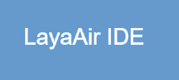
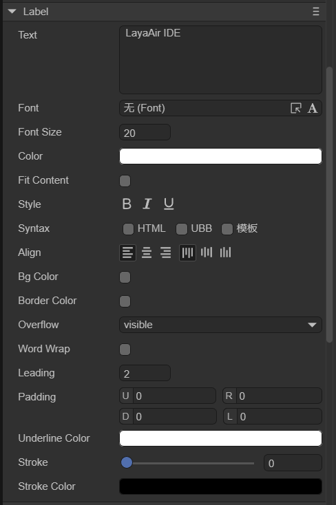
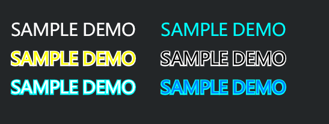

# 显示文本组件(Label)


## 一、通过LayaAir IDE创建Label组件

Label 组件用来显示一段文字。Label 组件的脚本接口请参考 [Label API](https://layaair.layabox.com/3.x/api/Chinese/index.html?version=3.0.0&type=2D&category=UI&class=laya.ui.Label)。

###     1.1 创建Label

如图1-1所示，可以在`层级`窗口中右键进行创建，也可以从`小部件`窗口中拖拽添加。


（图1-1）

Label组件拖放到编辑区后，设置 text 属性的值为 LayaAir IDE 后的显示效果如下：



（图1-2）

###  1.2 Label 属性



（图1-3）

| **属性**       | 功能说明                                                     |
| -------------- | ------------------------------------------------------------ |
| text           | 文本的实际内容                                               |
| font           | 文本的字体名称，例如：`Microsoft YaHei`，这里可以手动输入常用的字体，还可以是[位图字体](../../advanced/useText/readme.md) |
| fontSize       | 文本字体大小，例如： `50`，直接填写正整数                    |
| color          | 文本的颜色，可以直接输入颜色值，例如：`#ffffff`，也可以点击输入条右侧的拾色器选取颜色 |
| fit content    | 否（"no"）：无操作；高度和宽度（"yes"）：Label边框可以根据文字大小和数量，自动调整高度和宽度为合适大小；高度（"height"）：Label边框只自动调整高度 |
| style          | “**B**”(bold)是否为粗体，“***I***”(italic)是否为斜体，“<u>**U**</u>”是否有下划线 |
| syntax         | [多样式混排](../../../../2D/displayObject/Text/readme.md)，支持部分HTML语法和UBB语法。还可以勾选模板，能够在字符串中使用变量 |
| align          | 对齐方式，水平对齐(align)分别是left（居左对齐）、center（居中对齐）、right（居右对齐）;垂直对齐(valign)分别是top（居顶对齐）、middle（居中对齐）、bottom（居底对齐） |
| bgColor        | 背景颜色，勾选后可以直接输入颜色值，例如：`#ffffff`，也可以点击输入条右侧的拾色器选取颜色 |
| bordercolor    | 文本边框颜色，勾选后可以直接输入颜色值，例如：`#ffffff`，也可以点击输入条右侧的拾色器选取颜色 |
| overflow       | 文本溢出处理，共有三种模式。visible（默认模式）：不进行任何裁切。hidden:不显示超出文本域的字符。scroll:不显示文本域外的字符像素，并且支持scroll接口 |
| wordWrap       | 是否自动换行，布尔值选项，默认为`false`，选择`true`可以开启自动换行 |
| leading        | 垂直行间距，当开启自动换行时，文本内容多行时有效。间距以像素为单位，输入正整数即可 |
| padding        | 文本边距，以像素为单位，由4个整数值组成。“U”表示距上边框的距离、”R“表示距右边框的距离、”D“表示距下边框的距离、”L”表示距左边框的距离 |
| underlinecolor | 下划线颜色，可以直接输入颜色值，例如：`#ffffff`，也可以点击输入条右侧的拾色器选取颜色 |
| stroke         | 描边宽度，范围为0~100                                        |
| strokeColor    | 文本的描边颜色，可以直接输入颜色值，例如：`#ffffff`，也可以点击输入条右侧的拾色器选取颜色 |

 

### 1.3 脚本控制Label

在Scene2D的属性设置面板中，增加一个自定义组件脚本。然后，将Label拖入到其暴露的属性入口中。下面给出一个示例代码，实现脚本控制Label：

```typescript
const { regClass, property } = Laya;

@regClass()
export class LabelControl extends Laya.Script {
    //declare owner : Laya.Sprite3D;

    @property( { type : Laya.Label } )
    public lab: Laya.Label;

    constructor() {
        super();
    }

    /**
     * 组件被激活后执行，此时所有节点和组件均已创建完毕，此方法只执行一次
     */
    onAwake(): void {
        this.lab.pos(Laya.stage.width >> 1, Laya.stage.height >> 1); //位置
        this.lab.size(500, 30); //大小
        this.lab.pivot(this.lab.width/2, this.lab.height/2); //轴心点
        this.lab.text = "大家好，欢迎大家来到LayaAir IDE"; //文本内容
        this.lab.font = "宋体"; //字体
        this.lab.fontSize = 50; //字体大小
        this.lab.color = "#ff0000"; //字体颜色
        this.lab.bold = true; //加粗
        this.lab.italic = true; //斜体
        this.lab.underline = true; //下划线
        this.lab.underlineColor = "#ff0000"; //下划线颜色
        this.lab.stroke = 5; //描边宽度
        this.lab.strokeColor = "#000000" ; //描边颜色
        this.lab.wordWrap = true; //自动换行
        this.lab.leading = 10; //垂直行间距
        this.lab.align = "left"; //水平对齐方式
        this.lab.valign = "top"; //垂直对齐方式
        this.lab.overflow = "visible"; //文本溢出
        // this.lab.fitContent = "yes"; //自适应大小

        this.lab.bgColor = "#19a4f1"; //背景颜色
        this.lab.borderColor = "#f6ff03" //边框颜色
    }

}
```


## 二、通过代码创建Label组件

在进行项目开发的时候，有时不想让Label一开始就在舞台上，而是在要用的时候才添加，这就要通过代码来创建了。在Scene2D的属性设置面板中，增加一个自定义组件脚本，创建`UI_Label`类，通过代码创建Label，它的其他属性也可以通过代码来设置。下述示例代码演示了如何通过代码创建不同皮肤（样式）的Label，开发者可以自己通过代码设置Label，创建出符合自己需要的文字效果。

**示例代码：**

```typescript
const { regClass, property } = Laya;
const Label = Laya.Label;
@regClass()
export class UI_Label extends Laya.Script {

    constructor() {
        super();
    }

    /**
     * 组件被激活后执行，此时所有节点和组件均已创建完毕，此方法只执行一次
     */
    onAwake(): void {
        this.setup();        
	}

	private setup(): void {
		this.createLabel("#FFFFFF", null).pos(30, 50);
		this.createLabel("#00FFFF", null).pos(290, 50);
		this.createLabel("#FFFF00", "#FFFFFF").pos(30, 100);
		this.createLabel("#000000", "#FFFFFF").pos(290, 100);
		this.createLabel("#FFFFFF", "#00FFFF").pos(30, 150);
		this.createLabel("#0080FF", "#00FFFF").pos(290, 150);
	}

	private createLabel(color: string, strokeColor: string): Laya.Label {
		const STROKE_WIDTH: number = 4;

		var label: Laya.Label = new Label();
		label.font = "Microsoft YaHei";
		label.text = "SAMPLE DEMO";
		label.fontSize = 30;
		label.color = color;

		if (strokeColor) {
			label.stroke = STROKE_WIDTH;
			label.strokeColor = strokeColor;
		}

		this.owner.addChild(label);

		return label;
	}
}
```

**效果预览：**



（图2-1）

 	