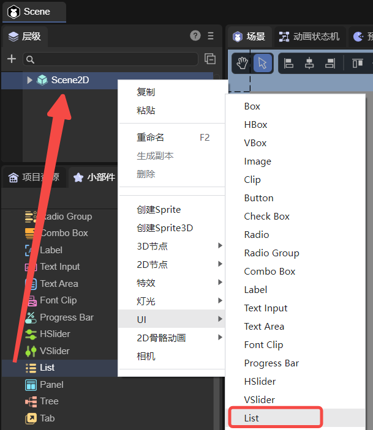
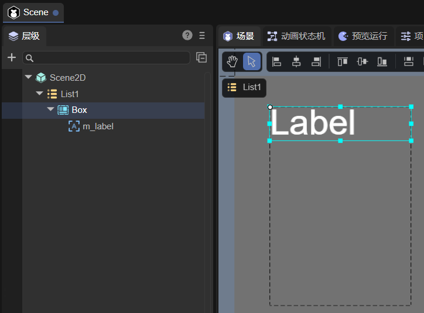
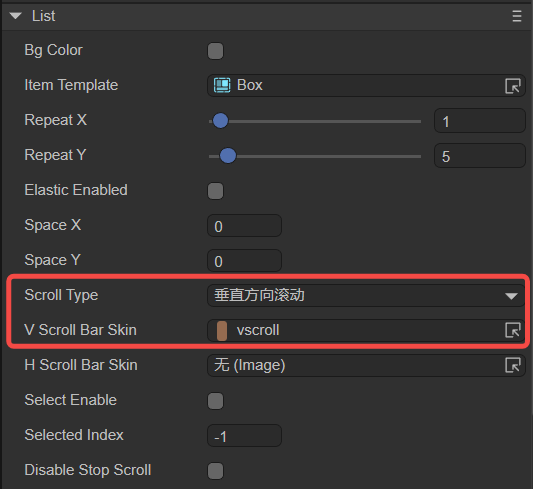
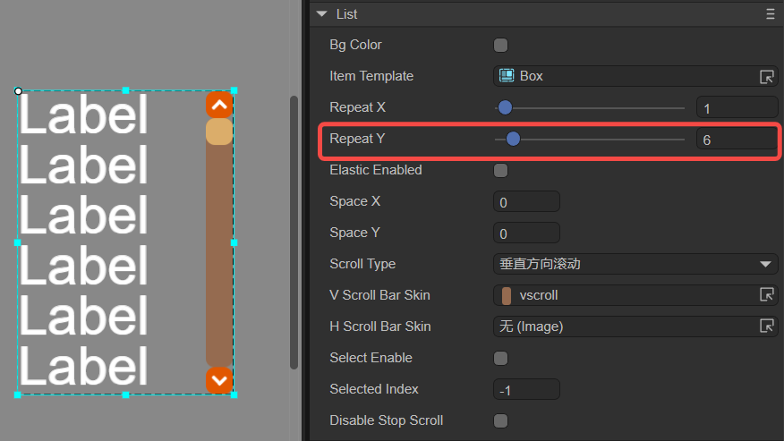
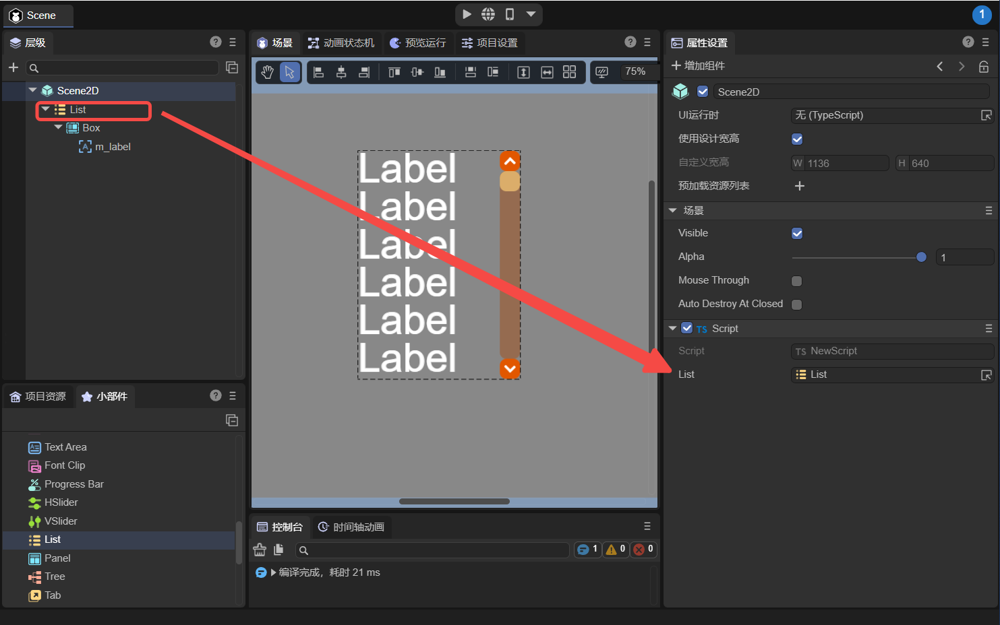
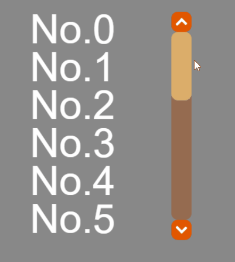
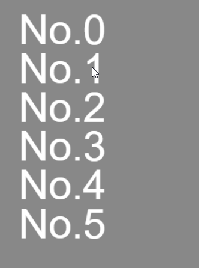
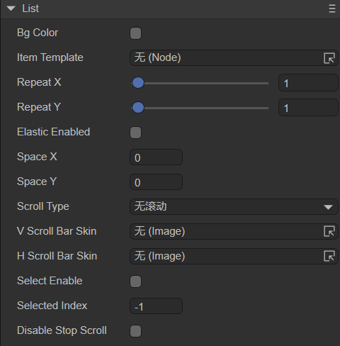

# 列表组件（List）

List组件可显示项目列表，默认为垂直方向列表。List的每一个列表通常是一样的，也可以使用编辑器自定义不同样式的列表内容项。List组件的脚本接口请参考[List API](https://layaair.com/3.x/api/Chinese/index.html?version=3.0.0&type=2D&category=UI&class=laya.ui.List)。

##  一、通过LayaAir IDE创建List组件

### 1.1 List的组成

List通常由两个部分组成：列表渲染项（单元格）、滚动条。

列表渲染项可以是Box对象或其它自定义页面对象，也被称为子项模板（Item Template）。子项模板内可以放Label、Image等组件。

滚动条可以设置垂直滚动条或水平滚动条，还可以两者同时设置。


### 1.2 创建List

#### 1.2.1 添加List组件

如图1-1所示，可以在`层级`窗口中右键进行创建，也可以从`小部件`窗口中拖拽添加。



（图1-1）


#### 1.2.2 添加并指定List的列表项

此处以Box对象为例。如图1-2所示，在List组件下添加一个Box组件，并且调整好Box的大小。然后在Box下添加一个Label组件，命名为m_label，并设置一下Label的显示效果，使它更好看一些。



（图1-2）

再将创建好的Box节点拖入到List的Item Template属性中，如图1-3所示，这样就指定List的列表项为子节点Box了。


（图1-3）


#### 1.2.3 添加滚动条皮肤

选择List属性的Scroll Type为垂直方向滚动。V Scroll Bar Skin属性用来设置垂直滚动条的皮肤，从资源面板里选择vscroll.png到该属性中，会立即生成滚动条皮肤。



（图1-4）

> 注意：当Scroll Type为无滚动时，即使设置了滚动条皮肤，在运行时也不会有滚动效果。

设置Repeat Y为6，表示当列表项超出6个时，会开始滚动。



（图1-5）


#### 1.2.4 设置数据源

必须要在代码中给List组件设置数据源。

```typescript
const { regClass, property } = Laya;

@regClass()
export class Script extends Laya.Script {

    @property({ type: Laya.List })
    list: Laya.List

    constructor() {
        super();
    }

    // 组件被启用后执行，例如节点被添加到舞台后
    onEnable(): void {
        // 给List对象赋值
        var data: Array<any> = [];
        for (var m: number = 0; m < 20; m++) {
            data.push({ m_label: "No." + m });
        }
        this.list.array = data;
    }
}
```

> 代码中，m_label的命名要与List列表项下的Label组件命名相同。


#### 1.2.5 运行查看效果

将脚本挂载到Scene2D场景上，然后将List组件拖入到脚本暴露出来的属性即可，如图1-6所示。



（图1-6）

运行效果如下：



（动图1-7）


#### 1.2.6 设置List效果

还可以在1.2.4中的代码里添加代码，设置List组件的效果。例如，隐藏滚动条、设置拖拽的橡皮筋效果等。具体的属性请参考1.3节。

```typescript
const { regClass, property } = Laya;

@regClass()
export class Script extends Laya.Script {

    @property({ type: Laya.List })
    list: Laya.List

    constructor() {
        super();
    }

    // 组件被启用后执行，例如节点被添加到舞台后
    onEnable(): void {
        // 给List对象赋值
        var data: Array<any> = [];
        for (var m: number = 0; m < 20; m++) {
            data.push({ m_label: "No." + m });
        }
        this.list.array = data;

        // 设置List属性效果
        this.list.scrollType = Laya.ScrollType.Vertical;//设置列表使用垂直滚动
        this.list.vScrollBarSkin = "";//隐藏列表的滚动条皮肤
        this.list.elasticEnabled = true;//设置橡皮筋为ture
        this.list.scrollBar.elasticBackTime = 200;//设置橡皮筋回弹时间。单位为毫秒
        this.list.scrollBar.elasticDistance = 50;//设置橡皮筋极限距离
        // this.list.scrollBar.autoHide = true;///不滚动时隐藏列表的滚动条皮肤（有滚动条皮肤时设置）
    }
}
```

效果如下所示：



（图1-8）


### 1.3 List组件常用属性

List的特有属性如下：



（图1-9）  

| **属性**          | **功能说明**                                                 |
| ----------------- | ------------------------------------------------------------ |
| bgColor           | 背景颜色，勾选后可以直接输入颜色值，例如：`#ffffff`，也可以点击输入条右侧的拾色器选取颜色 |
| itemTemplate      | 子项模板，是列表的渲染子项。该属性指定List下的任意子节点为子项模板，通常是Box |
| repeatX           | 水平方向列表渲染单元的最大数量。当列表数据超出该值时，如果设置了水平滚动条，会显示水平滚动效果 |
| repeatY           | 垂直方向列表渲染单元的最大数量。当列表数据超出该值时，如果设置了垂直滚动条，会显示垂直滚动效果 |
| elasticEnabled    | 是否开启橡皮筋回弹效果，默认为false                          |
| spaceX            | 水平方向显示的单元格之间的间距（以像素为单位）               |
| spaceY            | 垂直方向显示的单元格之间的间距（以像素为单位）               |
| scrollType        | 滚动类型，需要配合对应的滚动条皮肤使用。共有四种类型：none：无滚动（默认），horizontal：水平方向滚动，vertical：垂直方向滚动，both：水平与垂直都滚动 |
| vScrollBarSkin    | 垂直方向滚动条皮肤                                           |
| hScrollBarSkin    | 水平方向滚动条皮肤                                           |
| selectEnable      | 是否可以选中。启用后，选中列表渲染单元，会显示选中后的自定义选项框效果 |
| selectedIndex     | 当前列表中，选中的渲染单元的索引                             |
| disableStopScroll | 禁用滚动条停止。用于控制array更新时是否停止滚动条，默认在更新数据时会停止滚动条。当通过滑动滚动条进行动态更新List的cell时，设置为true会让列表滚动的平滑流畅 |


## 二、通过代码创建List组件

在进行书写代码的时候，免不了通过代码控制UI，创建UI_List类，通过代码设定List相关的属性。

**示例代码：**

```typescript
const { regClass, property } = Laya;

@regClass()
export class UI_List extends Laya.Script {

    public _list: Laya.List;

    constructor() { super(); }

    onAwake(): void {
        var list: Laya.List = new Laya.List();

        list.itemRender = Item;
        list.repeatX = 1;
        list.repeatY = 4;

        list.x = (Laya.stage.width - Item.WID) / 2;
        list.y = (Laya.stage.height - Item.HEI * list.repeatY) / 2;

        // 设置List的垂直滚动
        list.scrollType = Laya.ScrollType.Vertical;
        // 设置List的垂直滚动皮肤，不设置或者""就没有滚动条皮肤
        list.vScrollBarSkin = "";
        // 开启橡皮筋效果
        list.elasticEnabled = true;
        // 设置橡皮筋回弹时间，单位为毫秒
        list.scrollBar.elasticBackTime = 300;
        // 设置橡皮筋极限距离
        list.scrollBar.elasticDistance = 50;
        // 设置是否可以选中
        list.selectEnable = true;
        list.selectHandler = new Laya.Handler(this, this.onSelect);
        // 单元格渲染处理
        list.renderHandler = new Laya.Handler(this, this.updateItem);
        this.owner.addChild(list);

        // 设置数据源为对应图片的路径
        var data: any[] = [];
        for (var i: number = 0; i < 10; ++i) {
            data.push("resources/res/ui/listskins/1.jpg");
            data.push("resources/res/ui/listskins/2.jpg");
            data.push("resources/res/ui/listskins/3.jpg");
            data.push("resources/res/ui/listskins/4.jpg");
            data.push("resources/res/ui/listskins/5.jpg");
        }
        list.array = data;
        this._list = list;
    }

    private updateItem(cell: Item, index: number): void {
        cell.setImg(cell.dataSource);
    }

    private onSelect(index: number): void {
        console.log("当前选择的索引：" + index);
    }

}

class Item extends Laya.Box {
    static WID: number = 373;
    static HEI: number = 85;

    private img: Laya.Image;
    constructor() {
        super();
        this.size(Item.WID, Item.HEI);
        this.img = new Laya.Image();
        this.addChild(this.img);
    }

    setImg(src: string): void {
        this.img.skin = src;
    }
}
```

**运行效果：**


（图2-1）


List的其他属性也可以通过代码来设置，有兴趣的读者可以自己通过代码设置List，创建出符合自己需要的列表。

