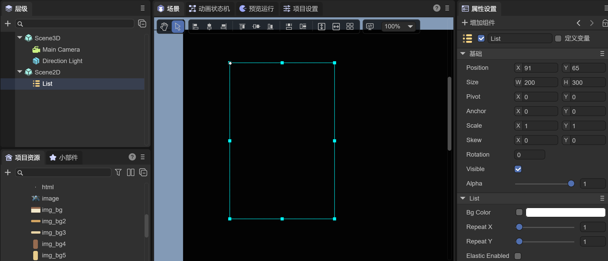
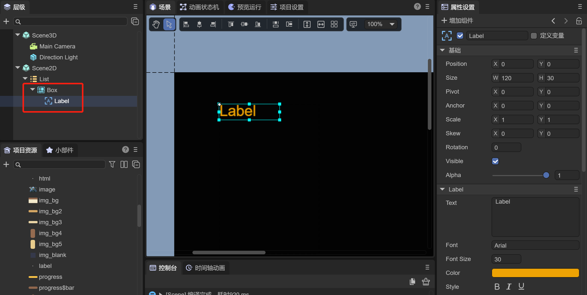
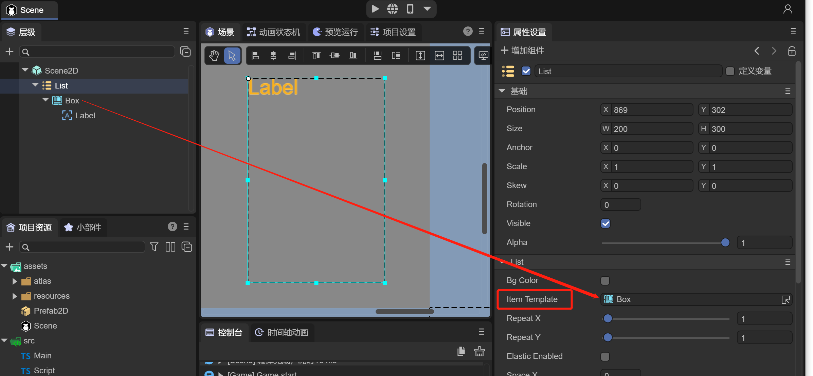
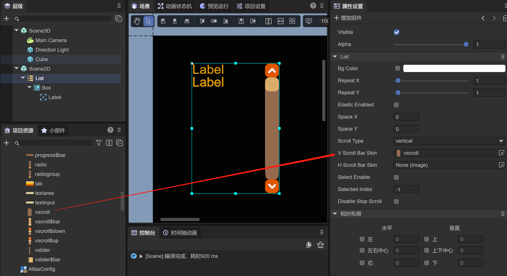
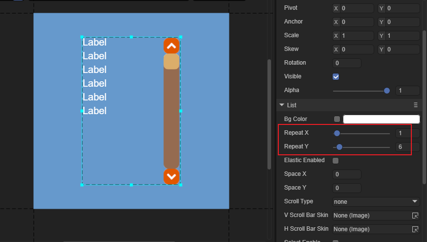
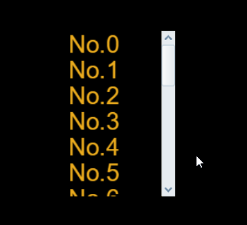
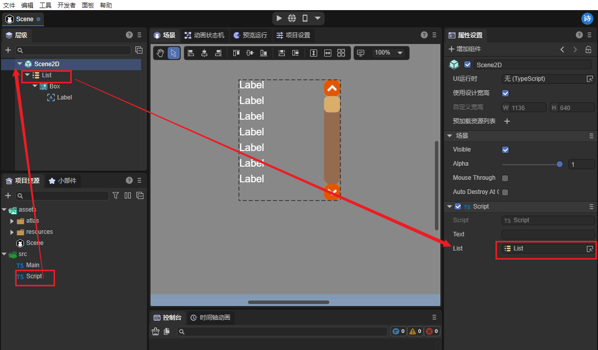
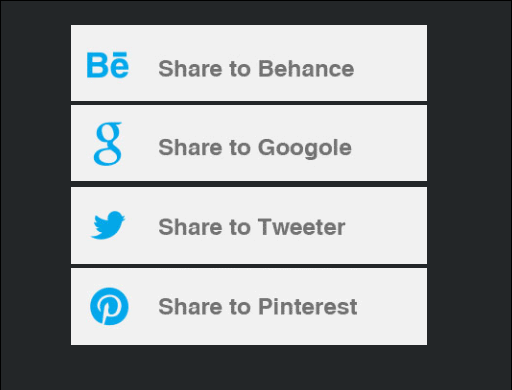

# List 组件参考


##  一、IDE创建List组件

List 组件可显示项目列表。默认为垂直方向列表。可通过UI编辑器自定义列表。List 列表的每一个列表通常是一样的，也可以使用编辑器自定义不同样式的列表内容项。

List 通常由两个部分组成：列表渲染项（单元格）、滚动条。
List 组件的脚本接口请参考 [List API](https://layaair.layabox.com/3.x/api/Chinese/index.html?version=3.0.0&type=2D&category=UI&class=laya.ui.List)。

 

### 1.1 创建 List 组件

#### 1.添加List组件

点击Scene2D节点，用鼠标右键打开菜单，选择UI，点击List，完成List组件的添加，调整好List的Size，如图1所示



（图1）


#### 2.添加列表项。

列表项可以是 Box 对象或 View（页面） 或其它自定义页面对象。此处以Box 对象为例。
**a.** 点击List节点，用鼠标右键打开菜单，选择UI，点击Box，完成Box的添加，调整好Box的高度为30
**b.** 从资源面板里选择拖入一个 Label 组件，拖入到层级中Box的节点下，设置一下 Label 的显示相关属性使它更好看一些。



（图2）


#### 3.指定 List 的列表item模板

LayaAir3.0与2.0的区别是已经去掉了renderType属性，方式做了改变

在3.0中，List组件下的属性Item模板，可以指定List的列表item模板。因此我们将List节点下的Box节点拖入到List的Item模板属性中，如图3所示

 

（图3）


#### 4.为 List 添加滚动条组件

LayaAir3.0与2.0的区别是List增加了Scroll Type属性，用Scroll Type去控制是否有滚动条。而是否有皮肤，已经与是否滚动脱钩。选择List组件，查看右侧属性面板

**a.**先选择List的属性Scroll Type为vertical

**b.**V Scroll Bar Skin属性用来设置垂直滚动条的皮肤，从资源面板里选择并拖拽一个vscroll组件到这个skin属性中，会立即生成滚动条皮肤



（图4）

> 注意：当Scroll Type为none时，即时设置了滚动条皮肤，在运行时也不会有滚动效果


#### 5.拖动设置 List 的宽高

设置属性 repeatX 的值为 1，设置 repeatY 的值为6。如图5所示


（图5）


#### 6.在代码里给 List 对象赋值


```javascript
var data: Array<any> = [];

for(var m:number =0; m<20; m++){
    
	data.push({m_label:"No."+m});
    
}
m_list.array = data;
```


#### 7.在程序里运行查看效果。

 

（图6）


#### 8.在代码里添加脚本，隐藏滚动条，设置拖拽的橡皮筋效果

```javascript
 m_list.scrollType = Laya.ScrollType.Vertical;//设置列表使用垂直滚动
 m_list.vScrollBarSkin = "";//隐藏列表的滚动条皮肤
 m_list.elasticEnabled = true;//设置橡皮筋为ture
 m_list.scrollBar.elasticBackTime = 200;//设置橡皮筋回弹时间。单位为毫秒。
 m_list.scrollBar.elasticDistance = 50;//设置橡皮筋极限距离。
```


### 1.2 List 组件常用属性

 

（图8）

  

| **属性**          | **功能说明**                                                 |
| ----------------- | ------------------------------------------------------------ |
| repeatX           | 水平方向显示的单元格数量。                                   |
| repeatY           | 垂直方向显示的单元格数量。                                   |
| elasticEnabled    | 是否开启橡皮筋效果                                           |
| spaceX            | 水平方向显示的单元格之间的间距（以像素为单位）。             |
| spaceY            | 垂直方向显示的单元格之间的间距（以像素为单位）。             |
| scrollType        | 是否开启滚动                                                 |
| vScrollBarSkin    | 垂直方向滚动条皮肤。                                         |
| hScrollBarSkin    | 水平方向滚动条皮肤。                                         |
| selectenable      | 是否可以选中。                                               |
| selectindex       | 当前选择的项索引。                                           |
| disablestopscroll | 禁用滚动条停止，用于控制array更新时是否停止滚动条，默认在更新数据时会停止滚动条，当通过滑动滚动条，进行动态更新，list的cell时，设置为true，不停止滚动条会让列表滚动的平滑流畅。 |


## 二、通过代码创建List组件

在我们进行书写代码的时候，免不了通过代码控制UI，创建UI_List类，通过代码设定List相关的属性。

**运行示例效果:**
  

(图9)

List的其他属性也可以通过代码来设置，下述示例代码演示了如何通过代码创建List，有兴趣的读者可以自己通过代码设置List，创建出符合自己需要的列表。


**示例代码：**

```javascript
import { BaseScript } from "../../BaseScript";

import List = Laya.List;
import Event = Laya.Event;


const { regClass, property } = Laya;

@regClass()
export class UI_List extends BaseScript {

	private _list: List;

    constructor() {
        super();
    }

    onAwake(): void {

        super.base();
		this.setup();
	}
	
	private setup(): void {
		var list: List = new List();

		list.itemRender = Item;
		list.repeatX = 1;
		list.repeatY = 4;

		list.x = (this.pageWidth - Item.WID) / 2;
		list.y = (this.pageHeight - Item.HEI * list.repeatY) / 2;

		// 设置List的垂直滚动
		list.scrollType = Laya.ScrollType.Vertical;
		// 设置List的垂直滚动皮肤，不设置或者""就没有滚动条皮肤
		list.vScrollBarSkin = "";
		// 是否开启橡皮筋效果
		list.elasticEnabled = true;
		// 设置橡皮筋回弹时间。单位为毫秒。
		list.scrollBar.elasticBackTime = 300;
		// 设置橡皮筋极限距离。
		list.scrollBar.elasticDistance = 50;
		list.selectEnable = true;
		list.selectHandler = new Laya.Handler(this, this.onSelect);

		list.renderHandler = new Laya.Handler(this, this.updateItem);
		this.box2D.addChild(list);

		// 设置数据项为对应图片的路径
		var data: any[] = [];
		for (var i: number = 0; i < 10; ++i) {
			data.push("resources/res/ui/listskins/1.jpg");
			data.push("resources/res/ui/listskins/2.jpg");
			data.push("resources/res/ui/listskins/3.jpg");
			data.push("resources/res/ui/listskins/4.jpg");
			data.push("resources/res/ui/listskins/5.jpg");
		}
		list.array = data;
		this._list = list;
	}

	private _itemHeight: number;
	private _oldY: number;
	private onMuseHandler(type: Event, index: number): void {
		console.log("type:" + type.type + "ddd--" + this._list.scrollBar.value + "---index:" + index);
		var curX: number, curY: number;
		if (type.type == "mousedown") {
			this._oldY = Laya.stage.mouseY;
			let itemBox = this._list.getCell(index);
			this._itemHeight = itemBox.height;
		} else if (type.type == "mouseout") {
			curY = Laya.stage.mouseY;
			var chazhiY: number = Math.abs(curY - this._oldY);
			var tempIndex: number = Math.ceil(chazhiY / this._itemHeight);
			console.log("----------tempIndex:" + tempIndex + "---_itemHeight:" + this._itemHeight + "---chazhiY:" + chazhiY);
			var newIndex: number;
			
		}
	}

	private updateItem(cell: Item, index: number): void {
		cell.setImg(cell.dataSource);
	}

	private onSelect(index: number): void {
		console.log("当前选择的索引：" + index);
	}
}


class Item extends Laya.Box {
	static WID: number = 373;
	static HEI: number = 85;

	private img: Laya.Image;
	constructor() {
		super();
		this.size(Item.WID, Item.HEI);
		this.img = new Laya.Image();
		this.addChild(this.img);
	}

	setImg(src: string): void {
		this.img.skin = src;
	}
}
```

