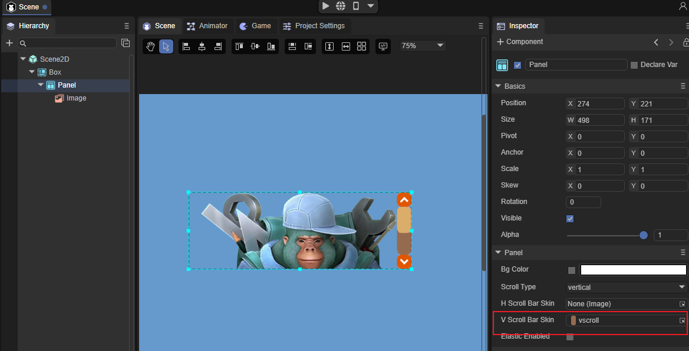

# Panel组件参考

Panel是一个带有裁剪功能的面板容器类，常用来设置元素的显示区域。可以直接将要显示的元素添加到Panel容器中，Panel的宽高就是元素将要显示的宽高。

[Panel API]:https://layaair.layabox.com/3.x/api/Chinese/index.html?version=3.0.0&type=2D&category=UI&class=laya.ui.Panel


### 一、通过LayaAirIDE创建Panel组件

**1.1 以拖拽的形式将Panel组件拖拽到页面编辑区**

从IDE资源管理右侧组件面板的UI文件夹中，将Panel组件拖拽到UI页面中。如动图1所示：

 

(图1)

给Panel设置宽高（例如：100*100）。双击UI界面中的Panel组件，放入一张图片。显示效果以及层级结构图如图2所示：

 

(图2)

由图2可以看出放入的图片被裁剪了，图片最终所显示的宽高就是Panel容器的宽高。这样我们就可以直接调整图片的坐标让其显示的内容发生改变了。


**1.2 添加滚动条显示**

Panel组件还可以设置滚动条；**除list组件外，Panel是唯一一个可以设置滚动条的容器组件**。在此我们可以对Panel设置一个滚动条看下效果。为Panel设置滚动条，如图3所示：



（图3）


## 二、通过代码创建Panel组件

panel组件除了可以直接在UI界面中可视化的操作之外，在代码中实现出上面的效果也是很简单的。

**示例代码：**

```typescript
const { regClass, property } = Laya;

@regClass()
export class UI_Panel extends Laya.Script {


    constructor() {
        super();
    }

    /**
     * 组件被激活后执行，此时所有节点和组件均已创建完毕，此方法只执行一次
     */
    onAwake(): void {

		this.setup();
	}
    
	private setup(): void {
		var panel: Laya.Panel = new Laya.Panel();
		panel.hScrollBarSkin = "resources/res/ui/hscroll.png";
		panel.size(600, 275);

		this.owner.addChild(panel);

		var img: Laya.Image;
		for (var i: number = 0; i < 4; i++) {
			img = new Laya.Image("resources/res/ui/dialog (1).png");
			img.x = i * 250;
			panel.addChild(img);
		}
	} 
}
```

