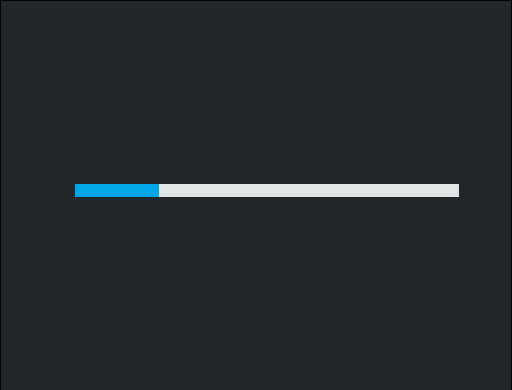

# ProgressBar 组件参考


##  一、通过LayaAirIDE创建ProgressBar组件

### 	1.1 创建ProgressBar

​        ProgressBar 经常被用于显示游戏中某个操作的进度，例如加载资源的进度、角色经验或血量的进度。
​        点击选择资源面板里的 ProgressBar 组件，拖放到页面编辑区，即可添加 ProgressBar 组件到页面上。
​        ProgressBar 的脚本接口参考 [ProgressBar API](https://layaair.layabox.com/3.x/api/Chinese/index.html?version=3.0.0&type=2D&category=UI&class=laya.ui.ProgressBar)。

​        ProgressBar 组件的资源示例：

​         

​    （图1）

​         

​    （图2）

​        设置 ProgressBar 组件的属性 value 的值为 0.3 后，显示效果如下所示：

​         

​    （图3）

  

### 1.2 ProgressBar 组件的常用属性

​         

​    （图4）

 

| **属性**   | **功能说明**           |
| -------- | ------------------ |
| sizeGrid | 进度条的图像资源的有效缩放网格数据。 |
| skin     | 进度条的图像资源。          |
| value    | 进度条的进度值，0到1之间。     |

 

##  二、通过代码创建ProgressBar

​	在我们进行书写代码的时候，免不了通过代码控制UI，创建UI_ProgressBar类，在代码中导入`laya.ui.ProgressBar`的包，并通过代码设定ProgressBar相关的属性。

**运行示例效果:**
​	 

​	(图5)通过代码创建ProgressBar

​	ProgressBar的其他属性也可以通过代码来设置，上述示例演示了如何通过代码创建不同皮肤（样式）的ProgressBar，有兴趣的读者可以自己通过代码设置ProgressBar，创建出符合自己需要的进度条。

**示例代码：**

```javascript
const { regClass, property } = Laya;

@regClass()
export class UI_ProgressBar extends Laya.Script {

    private progressBar: Laya.ProgressBar;

    constructor() {
        super();
    }

    /**
     * 组件被激活后执行，此时所有节点和组件均已创建完毕，此方法只执行一次
     */
    onAwake(): void {


		Laya.loader.load(["resources/res/ui/progressBar.png", "resources/res/ui/progressBar$bar.png"]).then( ()=>{
            this.onLoadComplete();
        } );
	}

	private onLoadComplete(e: any = null): void {
		this.progressBar = new Laya.ProgressBar("resources/res/ui/progressBar.png");

		this.progressBar.width = 400;


		this.progressBar.sizeGrid = "5,5,5,5";
		this.progressBar.changeHandler = new Laya.Handler(this, this.onChange);
		this.owner.addChild(this.progressBar);

		Laya.timer.loop(100, this, this.changeValue);
	}

	private changeValue(): void {

		if (this.progressBar.value >= 1)
			this.progressBar.value = 0;
		this.progressBar.value += 0.05;
	}

	private onChange(value: number): void {
		console.log("进度：" + Math.floor(value * 100) + "%");
	}

 
}
 
```

