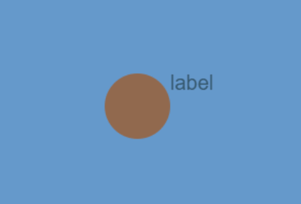

# Radio组件参考

> Author：  诗换花

Radio继承自Buttn，前面Buttn中介绍过的这里就不再过多讲述。

[Radio API]:https://layaair.layabox.com/3.x/api/Chinese/index.html?version=3.0.0&type=2D&category=UI&class=laya.ui.Radio


## 1、创建Radio组件

 使用LayaAirIDE创建Radio非常简单，通过IDE的可视化操作，就可以实现组件的创建与布局，也是推荐使用的组件创建方式。可以从层级面板创建，步骤是右键单击Scene2D，找到UI，点击Radio即可创建完毕，如图1所示。

 

（图1）

 我们也可以从IDE资源管理右侧组件面板的UI文件夹中，将Radio组件拖拽到UI页面中，如动图2所示。

 

（动图2）

## 2、Radio组件属性介绍

 

（图3）

| 属性         | 功能说明                                                     |
| ------------ | ------------------------------------------------------------ |
| selected     | 是否为选中状态，默认为不选中。                               |
| lable        | 按钮的文本标签。                                             |
| strokecolors | 鼠标在元素释放时（抬起移开）、鼠标移动到元素时、鼠标按下时各个状态下的描边颜色。 |

Radio承于Buttn，是一个单选框组件，单选框组件的特性是点中之后不会恢复状态，如动图4所示。

 

（动图4）

Radio与RadioGroup不同的是Radio并不能通过修改lable属性来增加单选框。

## 3、代码创建Radio

代码运行示例如动图5所示

 

（动图5）

```
const { regClass, property } = Laya;

@regClass()
export class UI_Radio extends Laya.Script {
    //declare owner : Laya.Sprite3D;

    @property()
    public text: string = "";

    constructor() {
        super();
    }

    /**
     * 组件被激活后执行，此时所有节点和组件均已创建完毕，此方法只执行一次
     */
    onAwake(): void {
        this.setup();

    }

    private setup():void{

        var Radio:Laya.Radio = new Laya.Radio();
        Radio.pos(200,200);
        Radio.size(600,275);
        Radio.stateNum = 3;
        Radio.selected = false;
        Radio.skin = 'atlas/comp/radio.png';
        Radio.sizeGrid = '13,14,23,8,0';
        Radio.label = 'Layabox';
        Radio.labelFont = 'Arial';
        Radio.labelSize = 20;
        Radio.labelBold = false;
        Radio.labelAlign = 'center';
        this.owner.addChild(Radio);
    }

}
```

