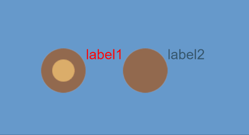
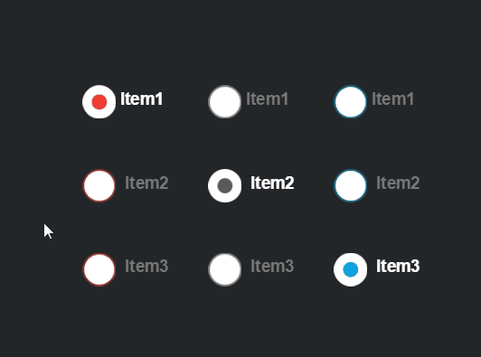

#                                                                                                                                                                                                                                                           RadioGroup 组件详解

> 由于很多组件属性是通用的，常用及通用的组件属性在`属性设置器`文档中已进行介绍。阅读本篇内容前请先阅读《属性设置器》文档。

## 1、了解RadioGroup组件

### 1.1 RadioGroup组件的作用

RadioGroup是单选框按钮组，按钮组之内的组件选项互相排斥，用户每次只能选择一个单选框（Radio）组件。如动图1所示。
 

（动图1）

### 1.2 RadioGroup组件的皮肤（skin）规范

RadioGroup组件的皮肤是以`RadioGroup`或以`RadioGroup_`为前缀进行命名，在皮肤设计规范方面，是竖向等分的两态图或三态图，如图2所示。

 

(图2)三态RadioGroup皮肤

*Tips：RadioGroup组件的皮肤无法使用九宫格属性，所以要在资源设计的时候就确定好实际应用时的大小。*

### 1.3 RadioGroup组件的API介绍


[RadioGroup API]: https://layaair.com/3.x/api/Chinese/index.html?version=3.0.0&type=2D&category=UI&class=laya.ui.RadioGroup


## 2、通过LayaAirIDE创建RadioGroup组件

### 	2.1 创建RadioGroup

​        点击选择资源管理器里的 RadioGroup 组件资源，拖拽到场景编辑器，即在页面中成功的创建了一个 RadioGroup  组件。如动图3所示。

​       

 （动图3）


### 2.2 通过labels增加单选框 

   如动图3中所示，默认的单选框组中只有两个单选框。如想增加单选框，只需在labels属性中增加新的标签即可，修改标签内容也在该属性中设置，操作如动图4-1所示。

   

 （动图4-1）


### 2.3  改变单选框组RadioGroup的布局方向与间距 

 RadioGroup 默认是水平布局（*horizontal*），通过更改direction属性，实现垂直布局（*vertical*）。设置间距可以通过space属性实现。如图4-2所示。

 

（图4-2）


### 2.4 设置单选框组RadioGroup的默认选项

selectedIndex属性是用于改变单选框组的索引值，默认不设置时，不勾选任何选项，如果要设置RadioGroup的默认勾选，可以设置selectedIndex的属性值，0为第1个单选框，1为第2个单选框……以此类推。

假设我们将属性值设置为0时，运行效果如动图4-3所示。

 

(图4-3)


## 3、创建自定义的RadioGroup组件

​	在上例中，我们使用了同一种单选框资源通过设置labels生成了三个子项目的单选框组。然而在实际的游戏中，在同一个RadioGroup组件中对单选框样式有不同的需求，那么通过labels设置的方式是无法达到效果的，这个时候就需要使用自定义RadioGroup组件的方式。


### 3.1 准备美术资源

​	我们用两张不同的`radio单选框`美术资源来组成`自定义RadioGroup组件`，资源如 图5 所示。

​         

​    （图5 ）

**Tips**：

这里要特别注意一下皮肤图片的命名规则，在自定义的RadioGroup组件中，我们不能使用`RadioGroup`或`RadioGroup_`为前缀命名。因为要使用Radio单选框组件来作为它的子项组件，所以本例中的图片资源命名使用`radio_`为前缀。


### 3.2 在IDE中创建Radio组件

将资源拷贝到项目的资源管理器文件夹，然后在IDE中，将制作的radio组件从资源管理器中逐个拖拽到场景编辑器，从左到右（或从上到下）将每个Radio组件的name属性，按先后顺序依次修改成“item0、item1、item2.....”，（不按此规则增加名字属性，生成的RadioGroup组件为无效组件，不能正常运行。）

当设置完label属性的文本、label标签的字体颜色、大小、位置关系等，以及调整好位置后，效果如 图6、图7 所示。

​         

​    （图6）

​         

​    （图7）

​	**Tips：自定义的RadioGroup组件的name属性中，命名规则为英文字符+数字，英文字符后不能加下划线，数字要按先后顺序从0开始。**。


### 3.3 转换成RadioGroup容器

​	当修改好子项属性后，全选组件右键单击调出设置面板，点击change Type点击UI，选择转换成RadioGroup容器类型，如图8所示。

​         

​    （图8）


转换成功后，调整默认选择的索引selectedIndex为0（第一个Radio），如图9所示，单选框间距space、方向direction可以不调节，在场景编辑器中通过鼠标调整也可以。

 

（图9）

​	通过以上几个步骤可以看到自定义RadioGroup组件制作成功。默认选择了第一个选框并切换到它的第三帧选择状态，其他选框则是第一帧未选择状态。

## 4、代码创建RadioGroup

代码运行结果：

 

```javascript
const { regClass, property } = Laya;

@regClass()
export class UI_RadioGroup extends Laya.Script {

	private SPACING: number = 150;
	private X_OFFSET: number = 200;
	private Y_OFFSET: number = 80;

	private skins: any[];

    constructor() {
        super();
    }

    /**
     * 组件被激活后执行，此时所有节点和组件均已创建完毕，此方法只执行一次
     */
    onAwake(): void {

		this.skins = ["resources/res/ui/radioButton (1).png", "resources/res/ui/radioButton (2).png", "resources/res/ui/radioButton (3).png"];
		Laya.loader.load(this.skins).then( ()=>{
            this.onLoadComplete();
        } );
	}

	private onLoadComplete(e: any = null): void {
		for (var i: number = 0; i < this.skins.length; ++i) {
			var rg: Laya.RadioGroup = this.createRadioGroup(this.skins[i]);
			rg.selectedIndex = i;
			rg.x = i * this.SPACING + this.X_OFFSET;
			rg.y = this.Y_OFFSET;
		}
	}

	private createRadioGroup(skin: string): Laya.RadioGroup {
		var rg: Laya.RadioGroup = new Laya.RadioGroup();
		rg.skin = skin;

		rg.space = 70;
		rg.direction = "v";

		rg.labels = "Item1, Item2, Item3";
		rg.labelColors = "#787878,#d3d3d3,#FFFFFF";
		rg.labelSize = 20;
		rg.labelBold = true;
		rg.labelPadding = "5,0,0,5";

		rg.selectHandler = new Laya.Handler(this, this.onSelectChange);
		this.owner.addChild(rg);

		return rg;
	}

	private onSelectChange(index: number): void {
		console.log("你选择了第 " + (index + 1) + " 项");
	}

 
}
```

