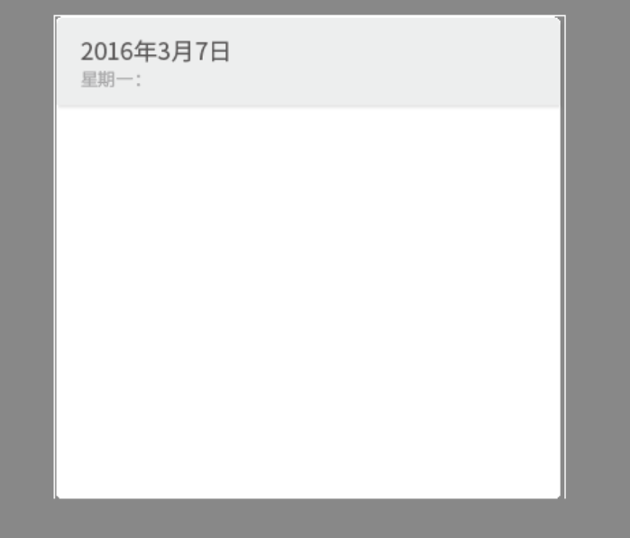

# 多行输入文本组件(TextArea)

由于TextArea继承于TextInput，两者相同点太多这篇文章只介绍两者不同的地方，TextInput介绍到的点这里不再过多讲解。详细内容可以查阅[TextArea API](https://layaair.layabox.com/3.x/api/Chinese/index.html?version=3.0.0&type=2D&category=UI&class=laya.ui.TextArea)。

 

## 1. LayaAir IDE中使用TextArea

### 1.1 创建TextArea

如图1-1所示，可以在`层级`窗口中右键进行创建，也可以从`小部件`窗口中拖拽添加。


（图1-1）


### 1.2 TextArea属性介绍


（图1-2）

> 属性：text、font、fontSize、color、style、syntax、align、bgColor、bordercolor、overflow、wordWrap（默认为true）、leading、padding、underlinecolor、stroke、strokeColor、skin、sizeGrid、type、maxchars、restrict、prompt、promptcolor、editable、multiline（默认为true）;
>
> 以上属性均已在[输入文本组件](../TextInput/readme.md)中列出过，这里不在详细描述，与之不同的地方已在括号内标出。

TextArea比TextInput多出的属性如下：

| 属性           | 功能说明                                                     |
| -------------- | ------------------------------------------------------------ |
| vscrollbarskin | 添加垂直滚动条皮肤                                           |
| hscrollbarskin | 添加水平滚动条皮肤                                           |
| scrolltype     | 文本域的滚动类型，需要配合对应的滚动条皮肤使用。共有四种类型：none：无滚动（默认），horizontal：水平方向滚动，vertical：垂直方向滚动，both：水平与垂直都滚动 |

TextArea是一个用于多行的文本域，相较于TextInput的区别是它可以添加垂直滚动条皮肤和水平滚动条皮肤。水平方向滚动效果如动图1-3所示，垂直方向滚动效果如动图1-4所示。


（动图1-3）


（动图1-4）


### 1.3 脚本控制TextArea

```typescript
const { regClass, property } = Laya;

@regClass()
export class TextAreaControl extends Laya.Script {
    //declare owner : Laya.Sprite3D;

    @property( { type : Laya.TextArea } )
    public txtarea: Laya.TextArea;

    constructor() {
        super();
    }

    /**
     * 组件被激活后执行，此时所有节点和组件均已创建完毕，此方法只执行一次
     */
    onAwake(): void {
        this.txtarea.pos(Laya.stage.width >> 1, Laya.stage.height >> 1); //位置
        this.txtarea.size(500, 200); //大小
        this.txtarea.pivot(this.txtarea.width/2, this.txtarea.height/2); //轴心点
        this.txtarea.text = "大家好，欢迎各位开发者使用LayaAir IDE，这里是TextArea的文本内容，您可以基于此文本进行调试";
        this.txtarea.font = "宋体"; //字体
        this.txtarea.fontSize = 50; //字体大小
        this.txtarea.color = "#ff0000"; //字体颜色
        this.txtarea.bold = true; //加粗
        this.txtarea.italic = true; //斜体
        this.txtarea.underline = true; //下划线
        this.txtarea.underlineColor = "#ff0000"; //下划线颜色
        this.txtarea.stroke = 5; //描边宽度
        this.txtarea.strokeColor = "#000000" ; //描边颜色
        this.txtarea.wordWrap = true; //自动换行
        this.txtarea.overflow = "scroll"; //文本溢出
        this.txtarea.skin = "atlas/comp/textarea.png"; //皮肤
        this.txtarea.borderColor = "#f6ff03" //边框颜色

        this.txtarea.scrollType = Laya.ScrollType.Vertical; //滚动方式
        this.txtarea.vScrollBarSkin = "atlas/comp/vscroll.png"; //滚动条皮肤
    }

}
```

> 开发者注意滚动方式的设置代码：`Laya.ScrollType.Vertical`，这是垂直方向滚动；`Laya.ScrollType.Horizontal`，这是水平方向滚动。不同的滚动方式需要设置对应的滚动条皮肤。

## 2. 通过代码创建TextArea

```typescript
const { regClass, property } = Laya;

@regClass()
export class UI_TextArea extends Laya.Script {
	
	private skin: string = "resources/res/ui/textarea.png";

    constructor() {
        super();
    }

    /**
     * 组件被激活后执行，此时所有节点和组件均已创建完毕，此方法只执行一次
     */
    onAwake(): void {

		Laya.loader.load(this.skin).then( ()=>{
            this.onLoadComplete();
        } );
	}

	private onLoadComplete(e: any = null): void {

		let ta: Laya.TextArea = new Laya.TextArea("");
		ta.skin = this.skin;

		ta.font = "Arial";
		ta.fontSize = 18;
		ta.bold = true;

		ta.color = "#3d3d3d";

		ta.pos(100, 15);
		ta.size(375, 355);

		ta.padding = "70,8,8,8";

		this.owner.addChild(ta);
	}
}
```

（代码中的图片资源来自“引擎API使用示例”项目，开发者可以自行创建下载）

运行结果：



（图2-1） 

