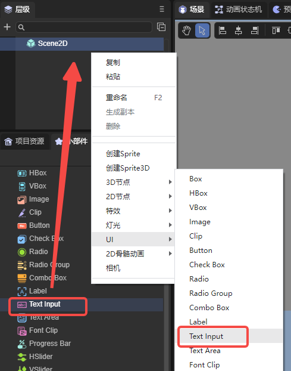
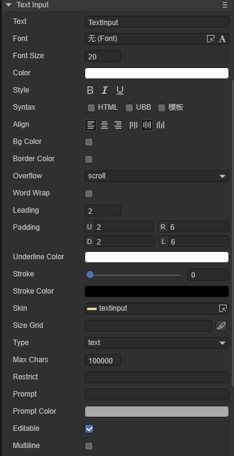
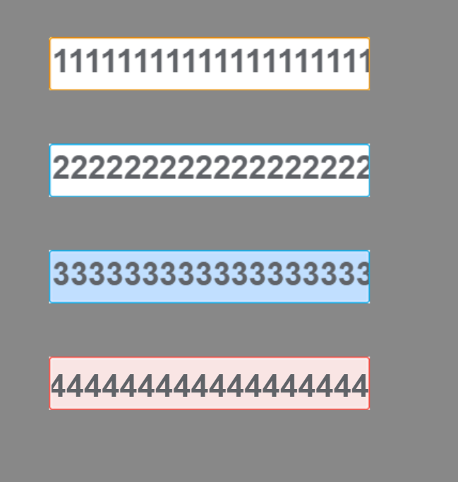

# 输入文本组件(TextInput)

## 1. LayaAir IDE中使用TextInput

文本输入框是游戏中经常会用到的一个UI组件，任何需要输入的时候可以使用TextInput。TextInput类的API可以参考[这里](https://layaair.layabox.com/3.x/api/Chinese/index.html?version=3.0.0&type=2D&category=UI&class=laya.ui.TextInput)。

### 1.1 创建TextInput

如图1-1所示，可以在`层级`窗口中右键进行创建，也可以从`小部件`窗口中拖拽添加。



（图1-1）

### 1.2 TextInput属性



（图1-2）

| **属性**       | 功能说明                                                     |
| -------------- | ------------------------------------------------------------ |
| text           | 初始显示的文本内容                                           |
| font           | 文本的字体名称，例如：`Microsoft YaHei`，这里可以手动输入常用的字体，还可以是[位图字体](../../advanced/useText/readme.md) |
| fontSize       | 文本字体大小，例如： `50`，直接填写正整数                    |
| color          | 文本的颜色，可以直接输入颜色值，例如：`#ffffff`，也可以点击输入条右侧的拾色器选取颜色 |
| style          | “**B**”(bold)是否为粗体，“***I***”(italic)是否为斜体，“<u>**U**</u>”是否有下划线 |
| syntax         | [多样式混排](../../../../2D/displayObject/Text/readme.md)，支持部分HTML语法和UBB语法。还可以勾选模板，能够在字符串中使用变量 |
| align          | 对齐方式，水平对齐(align)分别是left（居左对齐）、center（居中对齐）、right（居右对齐）;垂直对齐(valign)分别是top（居顶对齐）、middle（居中对齐）、bottom（居底对齐） |
| bgColor        | 背景颜色，勾选后可以直接输入颜色值，例如：`#ffffff`，也可以点击输入条右侧的拾色器选取颜色 |
| bordercolor    | 文本边框颜色，勾选后可以直接输入颜色值，例如：`#ffffff`，也可以点击输入条右侧的拾色器选取颜色 |
| overflow       | 文本溢出处理，共有三种模式。visible：不进行任何裁切。hidden:不显示超出文本域的字符。scroll（默认模式）:不显示文本域外的字符像素，并且支持scroll接口 |
| wordWrap       | 是否自动换行，布尔值选项，默认为`false`，选择`true`可以开启自动换行 |
| leading        | 垂直行间距，当开启自动换行时，文本内容多行时有效。间距以像素为单位，输入正整数即可 |
| padding        | 文本边距，以像素为单位，由4个整数值组成。“U”表示距上边框的距离、”R“表示距右边框的距离、”D“表示距下边框的距离、”L”表示距左边框的距离 |
| underlinecolor | 下划线颜色，可以直接输入颜色值，例如：`#ffffff`，也可以点击输入条右侧的拾色器选取颜色 |
| stroke         | 描边宽度，范围为0~100                                        |
| strokeColor    | 文本的描边颜色，可以直接输入颜色值，例如：`#ffffff`，也可以点击输入条右侧的拾色器选取颜色 |
| skin           | 设置皮肤，选择对应的图像资源即可。代码中表示皮肤的地址，以字符串表示 |
| sizeGrid       | 背景图的有效缩放网格数据。数据格式："上边距，右边距，下边距，左边距，是否重复填充（值为0：不重复填充，1：重复填充）"，以逗号分隔。例如："4,4,4,4,1" |
| type           | 输入框类型，共有十三种类型：text、password、email、url、number、range、date、month、week、time、dateime、dateime—local、search。效果等同HTML的[input](https://www.w3school.com.cn/html/html_form_input_types.asp) |
| maxchars       | 最大字符数，默认为100000。设置字符数量限制时，小于等于0的值将会限制字符数量为100000 |
| restrict       | 限制输入的字符，在TextInput里只能输入这些。不建议开启，适用于简单的文本，不支持反斜杠 |
| prompt         | 输入前的提示文本                                             |
| promptcolor    | 提示文本的颜色                                               |
| editable       | 设置可编辑状态，默认为true                                   |
| multiline      | 是否是文本域，值为true表示当前是文本域，可多行输入，否则不是文本域。默认为false |


### 1.3 脚本控制TextInput

在Scene2D的属性设置面板中，增加一个自定义组件脚本。然后，将TextInput拖入到其暴露的属性入口中。下面给出一个示例代码，实现脚本控制TextInput：

```typescript
const { regClass, property } = Laya;

@regClass()
export class TextInputControl extends Laya.Script {
    //declare owner : Laya.Sprite3D;

    @property( { type : Laya.TextInput } )
    public txtin: Laya.TextInput;

    constructor() {
        super();
    }

    /**
     * 组件被激活后执行，此时所有节点和组件均已创建完毕，此方法只执行一次
     */
    onAwake(): void {
        this.txtin.pos(Laya.stage.width >> 1, Laya.stage.height >> 1); //位置
        this.txtin.size(500, 60); //大小
        this.txtin.pivot(this.txtin.width/2, this.txtin.height/2); //轴心点
        this.txtin.font = "宋体"; //字体
        this.txtin.fontSize = 50; //字体大小
        this.txtin.color = "#ff0000"; //字体颜色
        this.txtin.bold = true; //加粗
        this.txtin.italic = true; //斜体
        this.txtin.underline = true; //下划线
        this.txtin.underlineColor = "#ff0000"; //下划线颜色
        this.txtin.stroke = 5; //描边宽度
        this.txtin.strokeColor = "#000000" ; //描边颜色
        this.txtin.wordWrap = true; //自动换行
        this.txtin.overflow = "scroll"; //文本溢出
        // this.txtin.skin = "atlas/comp/textinput.png"; //皮肤
        this.txtin.bgColor = "#19a4f1"; //背景颜色
        this.txtin.borderColor = "#f6ff03" //边框颜色

        this.txtin.editable = true; //可编辑状态
        // this.txtin.type = "password"; //输入框类型
        // this.txtin.maxChars = 5; //最大字符数
        // this.txtin.restrict = "12345"; //输入限制
        // this.txtin.prompt = "请输入"; //输入提示
        // this.txtin.promptColor = "#a9a9a9"; //提示词颜色
        // this.txtin.multiline = true; //文本域
    }

}
```

（为了防止效果杂乱，示例代码中的部分代码先注释掉了，开发者可以自行取消注释观察效果）


## 2. Textinput代码创建

有时，不想让Textinput组件一开始就在舞台上，而是在要用的时候才添加，这就要通过代码来创建了。在Scene2D的属性设置面板中，增加一个自定义组件脚本，示例代码如下：

```typescript
const { regClass, property } = Laya;

@regClass()
export class UI_Input extends Laya.Script {

    private SPACING: number = 100;
	private Y_OFFSET: number = 50;

	private skins: any[];

    constructor() {
        super();
    }

    /**
     * 组件被激活后执行，此时所有节点和组件均已创建完毕，此方法只执行一次
     */
    onAwake(): void {


		this.skins = ["resources/res/ui/input (1).png", "resources/res/ui/input (2).png", "resources/res/ui/input (3).png", "resources/res/ui/input (4).png"];
		Laya.loader.load(this.skins).then( ()=>{
            this.onLoadComplete();
        } );
	}

	private onLoadComplete(): void {
		for (var i: number = 0; i < this.skins.length; ++i) {
			var input: Laya.TextInput = this.createInput(this.skins[i]);
			input.prompt = 'Type:';
			input.x = (Laya.stage.width - input.width) / 2;
			input.y = i * this.SPACING + this.Y_OFFSET;
		}
	}

	private createInput(skin: string): Laya.TextInput {
		var ti: Laya.TextInput = new Laya.TextInput();

		ti.skin = skin;
		ti.size(300, 50);
		ti.sizeGrid = "0,40,0,40";
		ti.font = "Arial";
		ti.fontSize = 30;
		ti.bold = true;
		ti.color = "#606368";

		this.owner.addChild(ti);

		return ti;
	}
}
```

（代码中的图片资源来自“引擎API使用示例”项目，开发者可以自行创建下载）

运行结果：

 

（图2-1）