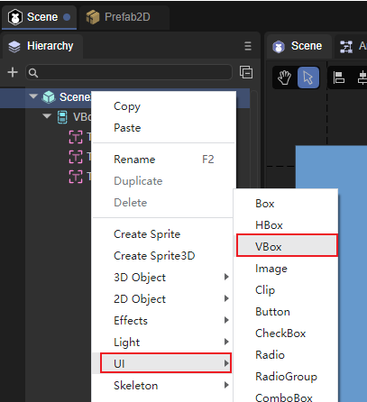
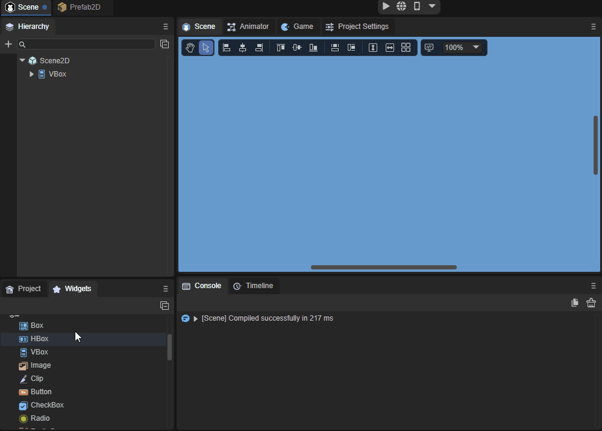
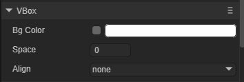
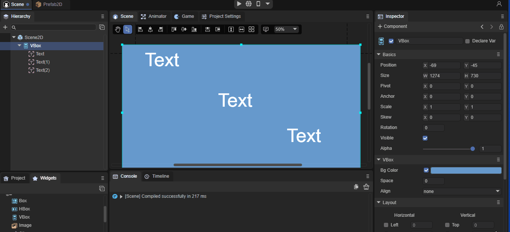
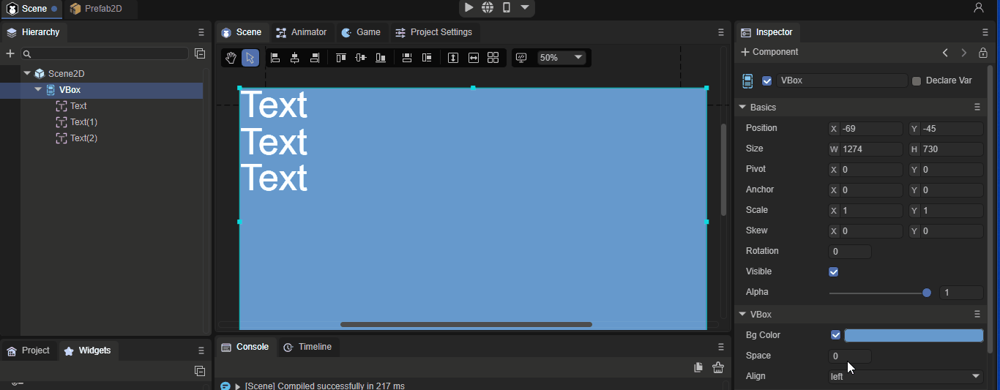

# VBox组件参考

VBox是容器类组件，继承自Box，VBox是常用于垂直布局的容器组件，对比Box它增加了布局的功能。

## 1、VBox组件创建

通过IDE的可视化操作可以直接在层级面板对VBox进行创建，步骤为鼠标右键单击Scence2D，找到UI，点击VBox即可完成创建，如图1所示。

 

（图1）

也可以从IDE资源管理右侧组件面板的UI文件夹中，将VBox组件拖拽到UI页面中，如动图2所示。

 

(动图2)

### 2、VBox属性介绍

 

（图3）

| 属性  | 功能                                                         |
| ----- | ------------------------------------------------------------ |
| spac  | 子对象的间隔，以像素为单位。                                 |
| align | 布局元素的水平对齐，共有四个选项。none：不进行水平对齐，left：居左水平对齐，center：居中水平对齐，right：居右水平对齐，默认为none。 |

（图3）

### 2.1 Align属性

VBox的子节点无论在IDE中怎样排列，在设置了Align选项后都会变成相对应的水平排序，如动图4所示。

动图（4）

### 2.2 Space属性

Space属性就是设置子对象的间隔，以像素为单位，可以自行输入数字，也可以通过鼠标左键长按滑动来输入数值，非常的容易操作与理解，如动图5所示。

（动图5）