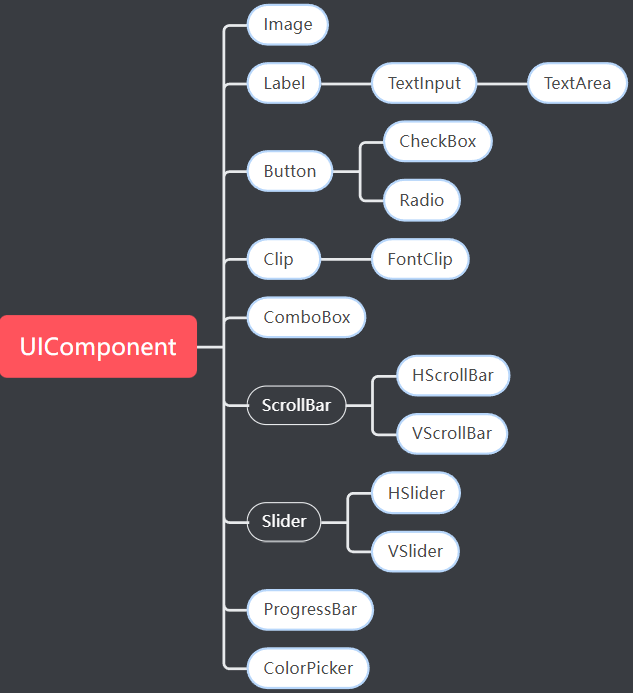
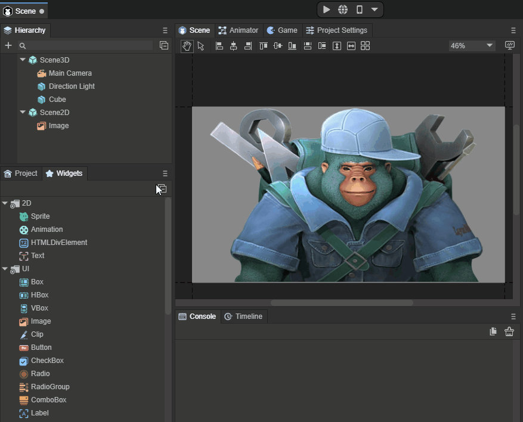
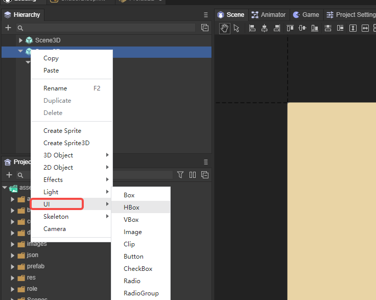

# UI组件详解

> Author: Charley  

UI组件是2D编辑中的基础组件，我们日常开发的2D UI界面的编辑，都是基于UI组件。

## 一、什么是UI组件

从引擎类的结构上看，`UIComponent`类是UI组件的基类，也就是说UI组件有一个共性，都是继承于`UIComponent`类而实现的组件。

UI组件，又分成基础UI组件和容器UI组件。比较容易理解和识别的方式为，Box和继承于Box的都属于容器类组件。其它的都是基础UI组件。

### 1.1  基础UI组件

基础UI组件显示对象，一共有16个，直接或间接继承于`UIComponent`，如图1的高亮部分所示。

  

（图1）

### 1.2 容器组件

继承于Box的组件，加上Box容器本身，容器对象一共有9个。如图2的高亮部分所示。

 

(图2)

这些容器单单自己是没有意义的，必须要包括基础的UI组件作为子节点，才能使得组件功能完整。

例如，List必须要有基础UI组件作为列表的渲染单元，单选框组（RadioGroup）是多个单选框（Radio）组件的容器。

## 二、UI组件的创建

UI组件的创建有三种方式：分别是从`UI小部件（Widgets）`面板里拖拽UI组件使用、从层级管理（Hierarchy）面板的右键菜单里创建、通过组件资源命名规则为资源命名，然后直接被IDE识别。

### 2.1  直接使用组件

`UI小部件（Widgets）`面板里包括了基础节点，也包括了UI组件，使用时直接拖拽到导级面板或场景编辑窗口内即可。效果如动图3所示。

 

(动图3)

### 2.2  右键菜单

层级管理（Hierarchy）面板的2D节点下，右键菜单里也可以直接创建UI组件，效果如图4所示。

  

(图4)

### 2.3 通过组件资源命名规则，直接被IDE识别

对于一些常用的UI组件，LayaAir引擎与IDE，提供了资源命名的规则。

当图像资源文件按照LayaAir引擎UI组件命名规则命名时，会直接被IDE识别为基础UI组件。

组件资源的命名有两类，

一类是，一个资源就对应一个UI组件的常规资源，例如，`img_layabox.png`，会被识别为Image组件。

另一类是，多个资源对应一个UI组件的组合资源，例如，`progress_loading.png`与`progress_loading$bar.png`组合形成一个progress组件，`progress_loading.png`为组件名是进度条的背景资源，另一个在`progress_loading`后面带了一个`$bar`的是进度条的进度资源。

总结以上，我们会发现两点规律：

- 无论是哪种资源，下划线`_`之前是组件规则名称，并且必须要放到文件名的开头。
- 组合资源，在主资源名称的后面，再通过美元符号`$`相隔，带一个辅助标识名，方便IDE与引擎识别。

#### 常规资源命名规则如下：

| 组件名     | 中文组件名   | 资源文件名前缀 | 资源文件名前缀缩写 |
| ---------- | ------------ | -------------- | ------------------ |
| Image      | 图像         | image_         | img_               |
| Button     | 按钮         | button_        | btn_               |
| ComboBox   | 下拉框       | comboBox_      | combo_             |
| TextInput  | 文本输入     | textInput_     | input_             |
| TextArea   | 文本域       | textArea_      | area_              |
| CheckBox   | 多选框       | checkBox_      | check_             |
| Label      | 显示文本     | label_         | 无缩写             |
| RadioGroup | 单选框       | radioGroup_    | 无缩写             |
| Radio      | 单选框组     | radio_         | 无缩写             |
| Tab        | 导航标签组   | tab_           | 无缩写             |
| Clip       | 位图切片     | clip_          | 无缩写             |
| FontClip   | 位图字体切片 | fontClip_      | 无缩写             |

> 资源前缀不区分大小写

#### 组合资源命名规则如下：

| 组件名      | 中文组件名 | 资源文件名前缀 | 资源文件名前缀缩写 | 辅助标识名                                            |
| ----------- | ---------- | -------------- | ------------------ | ----------------------------------------------------- |
| VScrollBar  | 垂直滚动条 | vscrollbar_    | vscroll_           | 垂直划动条`$bar`、上点击按钮`$up` 、下点击按钮`$down` |
| HScrollBar  | 水平滚动条 | hscrollbar_    | hscroll_           | 水平划动条`$bar`、左点击按钮`$up` 、右点击按钮`$down` |
| ProgressBar | 进度条     | progressbar_   | progress_          | 进度条`$bar`                                          |
| VSlider     | 垂直划动条 | vslider_       | 无缩写             | 垂直划动按钮`$bar`                                    |
| HSlider     | 水平划动条 | hslider_       | 无缩写             | 水平划动按钮`$bar`                                    |

> 资源前缀不区分大小写

示例说明：

- 垂直滚动条aa，由四个资源文件构成。分别是`vscroll_aa.png、vscroll_aa$bar.png、vscroll_aa$up.png、vscroll_aa$down.png`。
- 进度条bb，由两个资源文件构成。分别是`progress_bb.png、progress_bb$bar.png`。

### 2.4 容器组件的创建与解除

了解完资源命名规则后发现，除了继承于UI组(UIGroup)的RadioGroup与Tab组件，是可以通过资源前缀规则命名识别的。其它的容器组件均不支持通过资源名称直接识别创建。

除了采用2.1与2.2的方式创建外，还可以在IDE里将一个或多个选中的基础组件通过`Ctrl+B`快捷键转化为容器组件。如果不想要容器组件了，也可以通过`Ctrl+U`解除当前选中的容器。

> 此处有个印象即可，在介绍具体的容器组件时，还会详细描述创建方法与流程。

## 三、UI组件详解

至此，我们对UI组件已有了基础的了解，我们将开始对全部的UI组件进行详细介绍。

为避免文档的标题过长，对UI组件根据使用的特点进行分类介绍，并不按组件类的继承关系。

在阅读顺序上，如果是首次接触LayaAir引擎的开发者，一定要阅读图像组件，因为在这里不仅会介绍Image特有的属性，还会介绍UI组件基类`UIComponent`的属性，以及介绍`UIComponent`父类Sprite的属性。

在其它的UI组件里，这些基础和通用的属性，将不再重复介绍。

下面，通过左侧导航点开UI组件文档了解更多吧~