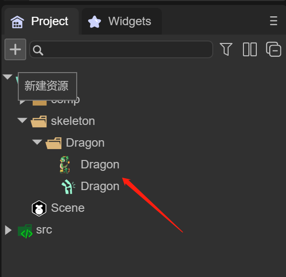

# 内置骨骼动画


## 一、概述

Spine骨骼动画，DragonBones（龙骨）骨骼动画，都是游戏中经常使用的骨骼动画，使用LayaAir内置骨骼转换工具，可以将这两种格式转换为LayaAir引擎支持的骨骼动画格式。

LayaAir IDE中支持骨骼动画的添加，预览和运行。使用之前，需要在 IDE 中勾选 laya.ani 类库，如图1-1所示

 

（图1-1）


## 二、IDE中使用内置骨骼动画

### 2.1 将动画资源复制到项目中

如图2-1所示，我们将做好的动画资源放入 assets 目录下

 

（图2-1）


### 2.2 在场景中添加内置骨骼动画组件

IDE中通过两种方式，可以在场景中添加内置骨骼动画组件

1，直接拖入骨骼动画组件，如动图2-2所示


（动图2-2）

2，通过Scene2D或者任何节点下，创建骨骼动画组件，如动图2-3所示


（动图2-3）

此时骨骼动画组件就准备好了，下一步可以拖入动画资源了


### 2.3 设置动画资源

我们先来看看骨骼动画组件，都有什么属性，如图2-4所示

 

 （图2-4）

`Source`：骨骼动画的配置文件，也就是 .sk 文件

`Skin Name`：骨骼动画名称

`Animation Name`：播放动画名称

`Loop`：是否循环播放

`Preview`：在IDE中预览

首先，我们把 .sk 文件拖入 `Source` 属性中，在IDE中将会看到动画，如动图2-5所示


 （动图2-5）


### 2.4 IDE中预览动画

通过勾选Preview选项，我们就可以在IDE中直接预览骨骼动画效果，如动图2-6所示


 （动图2-6）

同时，勾选Loop可以设置是否循环动画，也可以选择动画名字来切换动画


### 2.5 动画基础操作

在IDE中，可以对动画的位置，大小，缩放进行基础操作，如动图2-7所示


 （动图2-7）


## 三、代码中内置骨骼动画

在代码中使用时，我们在使用骨骼动画时需要引用指定 `Laya.Skeleton` 和 `Laya.Templet` 类

其中，`Laya.Skeleton`  是骨骼动画必须要引用的类，`Laya.Templet` 是用于处理资源

代码示例：

```typescript
const { regClass, property } = Laya;

@regClass()
export class Main extends Laya.Script {

	private mCurrIndex: number = 0;
	private mArmature: Laya.Skeleton;

    onStart() {
        console.log("Game start");
		//加载内置骨骼动画资源
		Laya.loader.load("skeleton/Dragon/Dragon.sk").then((templet: Laya.Templet) => {
			//创建模式为1，可以启用换装
			this.mArmature = templet.buildArmature(0);
			this.mArmature.x = 300;
			this.mArmature.y = 350;
			this.mArmature.scale(0.5, 0.5);
			this.owner.addChild(this.mArmature);
			//设置动画播放完成后，调用completeHandler继续播放下一个动画
			this.mArmature.on(Laya.Event.STOPPED, this, this.completeHandler);
			this.play();
		});
    }

	
	private completeHandler(): void {
		this.play();
	}

	//播放骨骼动画
	private play(): void {
		//每次到下一个动画
		this.mCurrIndex++;
		if (this.mCurrIndex >= this.mArmature.getAnimNum()) {
			this.mCurrIndex = 0;
		}
		this.mArmature.play(this.mCurrIndex, false);
	}
}
```

运行效果如下

 

（动图3-1）


具体效果大家可以在LayaAir 2D入门示例中查看。