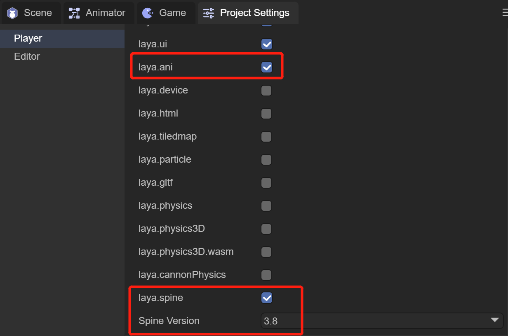
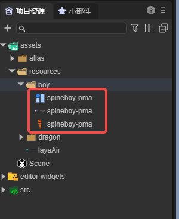
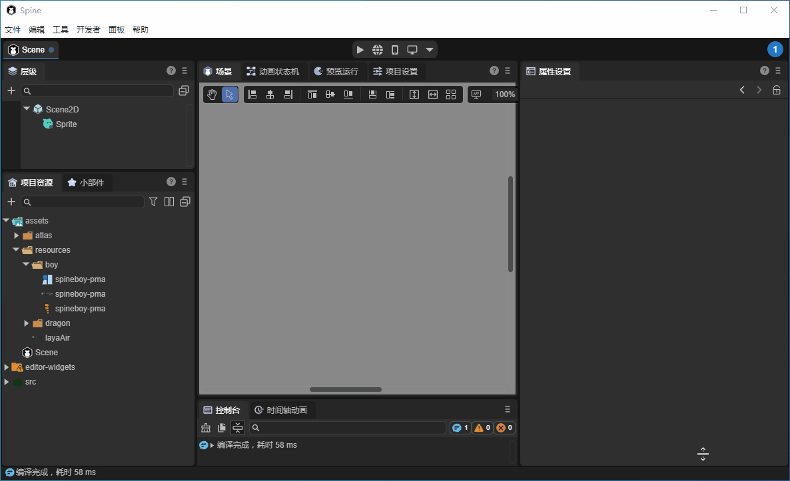
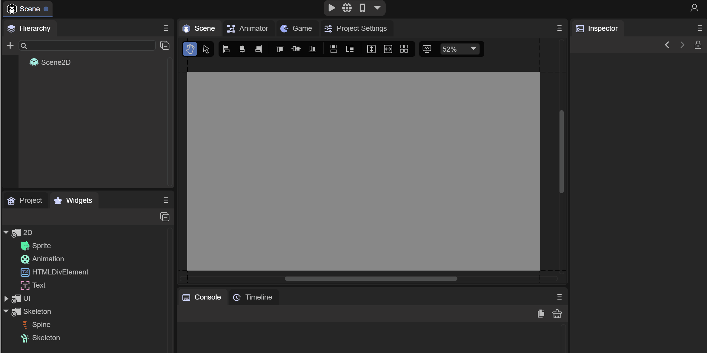
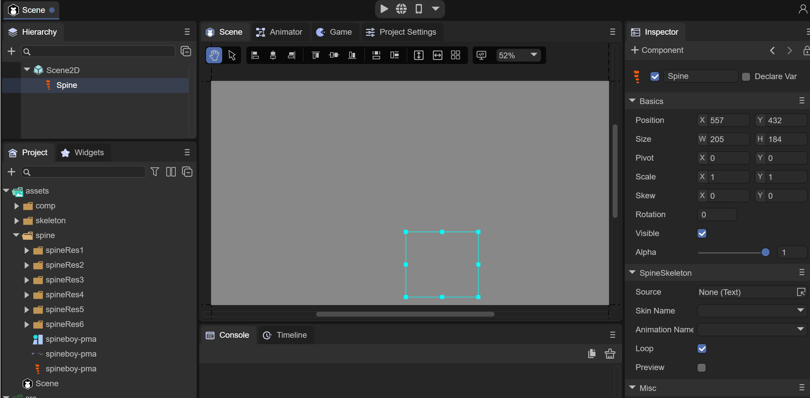

# Spine骨骼动画


## 一、概述

Spine骨骼动画，是游戏中经常使用的骨骼动画之一，使用Spine工具通过将图片绑定到骨骼上，然后再控制骨骼实现动画。

如何制作Spine骨骼动图，在这里就不介绍了，感兴趣的开发者可以到 Spine 官网查看。http://zh.esotericsoftware.com/

LayaAir IDE中支持Spine骨骼动画的添加，预览和运行。使用之前，需要在 IDE 中勾选类库，和选择 Spine 的版本

 

（图1-1）

1，勾选 laya.ani 类库

2，勾选 laya.spine 类库

3，选择此项目使用的 Spine 版本

目前LayaAir 支持 3.7，3.8和4.0版本，接下来我们会通过使用3.8版本的Spine动画来讲解IDE中的使用


## 二、IDE中使用Spine动画

### 2.1 将spine资源复制到项目中

如图2-1所示，我们将做好的Spine动画资源放入 assets 目录下，这里我们用Spine官网下载的示例展示

 

（图2-1）


### 2.2 在场景中添加spine动画组件

IDE中通过两种方式，可以在场景中添加Spine动画组件

1，直接拖入Spine动画组件，如动图2-2所示



（动图2-2）

2，通过Scene2D或者任何节点下，创建Spine动画组件，如动图2-3所示



（动图2-3）

此时 Spine 动画组件就准备好了，下一步可以拖入动画资源了


### 2.3 设置动画资源

我们先来看看Spine动画组件，都有什么属性，如图2-4所示

 

 （图2-4）

`Source`：spine动画的配置文件，也就是 .skel 文件

`Skin Name`：骨骼动画名称

`Animation Name`：播放动画名称

`Loop`：是否循环播放

`Preview`：在IDE中预览

首先，我们把 .skel 文件拖入 `Source` 属性中，在IDE中将会看到动画，如动图2-5所示



 （动图2-5）


### 2.4 IDE中预览动画

通过勾选Preview选项，我们就可以在IDE中直接预览Spine动画效果，如动图2-6所示


 （动图2-6）

同时，勾选Loop可以设置是否循环动画，也可以选择动画名字来切换动画


### 2.5 动画基础操作

在IDE中，可以对动画的位置，大小，缩放进行基础操作，如动图2-7所示


 （动图2-7）


## 三、代码中Spine动画

在代码中使用时，我们在使用Spine时需要引用指定的类有`Laya.SpineSkeleton`、`Laya.SpineTemplet`

其中，`Laya.SpineSkeleton`是spine骨骼动画必须要引用的类，这里封装了spine的runtime库。`Laya.SpineTemplet`是用于资源处理。

代码示例：

```
const { regClass, property } = Laya;

@regClass()
export class Main extends Laya.Script {

    private skeleton: Laya.SpineSkeleton;
    private index: number = -1;

    onStart() {
        console.log("Game start");
		//加载Spine动画资源
        Laya.loader.load("spine/spineboy-pma.skel", Laya.Loader.SPINE).then((templet: Laya.SpineTemplet) => {
        	//创建SpineSkeleton对象
            this.skeleton = new Laya.SpineSkeleton();
            this.skeleton.templet = templet;
            this.owner.addChild(this.skeleton);
            this.skeleton.pos( Laya.stage.width / 2, Laya.stage.height / 2 + 100);
            this.skeleton.scale(0.4, 0.4);
            this.skeleton.on(Laya.Event.STOPPED, this, this.play);
            this.play();
        });
    }

	//播放Spine动画
    private play(): void {
        if (++this.index >= this.skeleton.getAnimNum()) {
            this.index = 0
        }
        this.skeleton.play(this.index, false, true)
    }
}
```

具体效果大家可以在LayaAir 2D入门示例中查看。