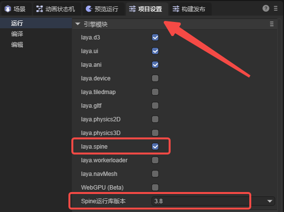

# Spine骨骼动画


## 一、概述

Spine骨骼动画，是游戏中经常使用的骨骼动画之一，使用Spine工具通过将图片绑定到骨骼上，然后再控制骨骼实现动画。

如何制作Spine骨骼动图，在这里就不介绍了，感兴趣的开发者可以到[Spine 官网](http://zh.esotericsoftware.com/)查看。

LayaAir IDE中支持Spine骨骼动画的添加，预览和运行。使用之前，需要在 IDE 中勾选类库，和选择 Spine 的版本



（图1-1）

1，勾选 laya.ani 类库

2，勾选 laya.spine 类库

3，选择此项目使用的 Spine 版本

目前LayaAir 支持 3.7，3.8，4.0，4.1版本，接下来我们会通过使用3.8版本的Spine动画来讲解IDE中的使用


## 二、IDE中使用Spine动画

### 2.1 将spine资源复制到项目中

如图2-1所示，我们将做好的Spine动画资源放入 assets 目录下，这里我们用Spine官网下载的示例展示


（图2-1）


### 2.2 添加spine动画组件

在LayaAir IDE中，可以通过添加组件的方式，实现骨骼动画。首先创建一个2D节点，然后在组件上添加一个spine组件，如动图2-2所示，


（动图2-2）


### 2.3 属性

先来看看Spine动画组件有什么属性，如图2-3所示 


（图2-3）

`Source`：spine动画的配置文件，也就是 .skel 文件

`Skin Name`：骨骼动画名称

`Animation Name`：播放动画名称

`Loop`：是否循环播放

`Preview`：是否在IDE中预览


然后就可以拖入动画资源了。首先，把 .skel 文件拖入 `Source` 属性中，勾选`preview`属性，在IDE中将会看到动画。勾选Loop可以设置是否循环动画，也可以选择动画名字来切换动画。如动图2-4所示，


 （动图2-4）


## 三、代码中Spine动画

在代码中使用时，首先加载Spine动画资源，然后添加spine组件。

代码示例：

```typescript
const { regClass, property } = Laya;

@regClass()
export class NewScript extends Laya.Script {

    @property({ type: Laya.Sprite })
    public sprite: Laya.Sprite;

    private spine: Laya.Spine2DRenderNode;
    private index: number = -1;

    //组件被激活后执行，此时所有节点和组件均已创建完毕，此方法只执行一次
    onAwake(): void {

        //加载Spine动画资源
        Laya.loader.load("resources/boy/spineboy-pma.skel").then(() => {
            //添加spine组件
            this.spine = this.sprite.addComponent(Laya.Spine2DRenderNode);
            this.spine.source = "resources/boy/spineboy-pma.skel";
            this.spine.animationName = "walk";
        });
    }
}
```

