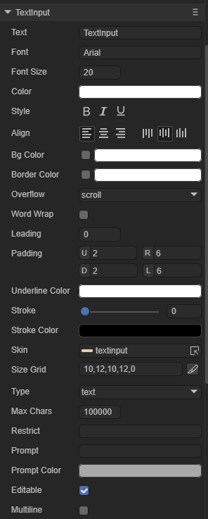

# TextInput的单行输入&多行输入

​        文本输入框是游戏中经常会用到的一个UI组件，任何时候需要输入的时候都要使用到textInput这个类，我们先看一下TextInput这个类的API。

| laya.ui.textInput中所有的API参数 |                                                              |           |
| -------------------------------- | ------------------------------------------------------------ | :-------: |
| editable : Boolean               | 设置可编辑状态。                                             | TextInput |
| focus : Boolean                  | 表示焦点是否在显示对象上。                                   | TextInput |
| height : Number                  | 表示显示对象的高度，以像素为单位。注：当值为0时，高度为自适应大小。 | TextInput |
| inputElementXAdjuster:int        | 设置原生inputs输入框的x坐标偏移。                            | TextInput |
| inputElementYAdjuster:int        | 设置原生inputs输入框的y坐标偏移。                            | TextInput |
| maxChars : int                   | 字符数量限制，默认为100000。设置字符数量限制时，小于等于0的值将会限制字符数量为100000。 | TextInput |
| multiline : Boolean              | 指示当前是否是文本域。值为true表示当前是文本域，否则不是文本域。 | TextInput |
| prompt : String                  | 设置输入提示符。                                             | TextInput |
| promptColor : String             | 设置输入提示符颜色。                                         | TextInput |
| restrict : String                | 限制输入的字符                                               | TextInput |
| sizeGrid : String                | 当前实例的背景图(AutoBitmap)实例的有效缩放网格数据。数据格式："上边距，右边距，下边距，左边距，是否重复填充（值为0：不重复填充，1：重复填充）"，以逗号分隔。例如："4,4,4,4,1" | TextInput |
| skin : String                    | 对象的皮肤地址，以字符串表示。如果资源未加载，则先加载资源，加载完成后应用于此对象。注意：资源加载完成后，会自动缓存至资源库中。 | TextInput |
| type : String                    | 输入框类型为Input静态常量之一。平台兼容性参见http:/www.w3school.com.cn/html5/html_5_form_input_ types_asp。 | TextInput |
| width : Number                   | [override]表示显示对象的宽度，以像素为单位。注：当值为0时，宽度为自适应大小。 | TextInput |

### TextInput相关属性：

 

（图1）

| 属性名      | 功能说明                                                     |
| ----------- | ------------------------------------------------------------ |
| type        | 输入框类型，共有十三种类型：text、password、email、url、number、range、date、month、week、time、dateime、dateime—local、search |
| maxchars    | 最大字符数，默认为100000。                                   |
| restrict    | 限制输入的字符，输入到这里的是只能输入这些。不建议开启，适用于简单的文本，不支持反斜杠。 |
| prompt      | 输入前提示文本。                                             |
| promptcolor | 输入前提示文本的颜色。                                       |
| editable    | 设置可编辑状态，默认为true。                                 |
| multiline   | 是否是文本域，值为true表示当前是文本域，可多行输入，否则不是文本域。默认为false |

​        这里我们设置文本的单行输入和多行输入，单行输入只能在一行内输入，多行可以通过回车在上一行未满的情况下在下一行输入。

```typescript
module laya {
    import Input = Laya.Input;
    import Stage = Laya.Stage;
    import Browser = Laya.Browser;
    import WebGL = Laya.WebGL;
    export class HelloLayabox {
 
      constructor() {
            // 不支持WebGL时自动切换至Canvas
            Laya.init(Browser.clientWidth, Browser.clientHeight, WebGL);
 
            Laya.stage.alignV = Stage.ALIGN_MIDDLE;
            Laya.stage.alignH = Stage.ALIGN_CENTER;

            Laya.stage.scaleMode = "showall";
            Laya.stage.bgColor = "#232628";

            this.createSingleInput();
            this.createMultiInput();
        }

       private createSingleInput(): void {
            var inputText: Input = new Input();

            inputText.size(350, 100);
            inputText.x = Laya.stage.width - inputText.width >> 1;
            inputText.y = (Laya.stage.height - inputText.height >> 1) - 100;

            // 移动端输入提示符
            inputText.prompt = "Type some word...";
 
            // 设置字体样式
            inputText.bold = true;
            inputText.bgColor = "#666666";
            inputText.color = "#ffffff";
            inputText.fontSize = 20;
            Laya.stage.addChild(inputText);
        }
        private createMultiInput(): void {
            var inputText: Input = new Input();

            // 移动端输入提示符
            inputText.prompt = "Type some word...";
            //多行输入
            inputText.multiline = true;
            inputText.wordWrap = true;

            inputText.size(350, 100);
            inputText.x = Laya.stage.width - inputText.width >> 1;
            inputText.y = (Laya.stage.height - inputText.height >> 1) +100;
            inputText.padding = [2, 2, 2, 2];

            inputText.bgColor = "#666666";
            inputText.color = "#ffffff";
            inputText.fontSize = 20;

            Laya.stage.addChild(inputText);
        }
    }
}
new laya.HelloLayabox();
```

运行结果：

</br>

 （图2）