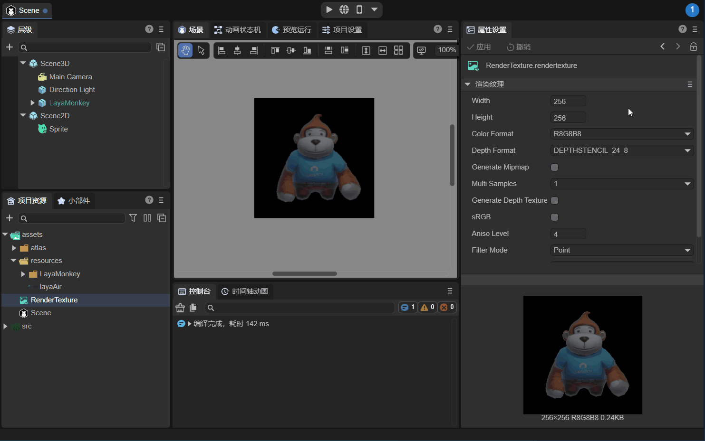

# 混合使用3D


## 一、概述

在我们2D项目开发过程中，开发者往往需要在UI界面显示3D场景或者3D物体，比如游戏开发中，3D人物在2D背景地图上跑动，英雄属性界面里会展示3D的英雄模型等等，如动图1-1所示，

 

（动图1-1）

动图1-1是LayaAir创建的2D入门示例中的“混合3D”示例。

首先，利用LayaAir引擎中的 `RenderTexture` 可以很方便的实现这个功能。渲染纹理 （Render Texture）是在运行时不断更新渲染的一种特殊类型纹理 。渲染纹理的一个典型用法是将其设置为摄像机的“目标纹理”属性，这将使摄像机渲染到纹理， 而不是渲染到屏幕。随后可以如同普通纹理 (Texture) 一样在2D UI下的Sprite对象中使用。

现在我们分别讲解在IDE和代码中是如何利用渲染纹理混合使用3D的。


## 二、IDE中混合使用3D

### 2.1 IDE中创建RenderTexture文件

如图2-1所示，先在IDE的 assets 资源中创建一个渲染纹理（RenderTexture）文件。


（图2-1）

点击新创建的RenderTexture文件，在属性面板中，会显示属性信息，如图2-2所示。 


（图2-2）

Width：渲染纹理的像素宽度。

Height：渲染纹理的像素高度。

Color Format：渲染纹理的颜色格式。

Depth Format：渲染纹理的深度格式。

Generate Mipmap：如果勾选了，则自动生成多级渐进纹理级别。

Multi Samples：多重采样。

sRGB：此渲染纹理是否使用sRGB读/写转换（只读）。

AnisoLevel：各向异性值。

FilterMode：采样过滤模式。

WrapModeU：U方向采样模式。

WrapModeV：V方向采样模式。

> 对本篇来说，渲染纹理的宽度，高度，颜色格式和深度格式，对效果有一定影响，暂时使用默认设置。


### 2.2 3D场景添加渲染物

在IDE中的3D场景中，添加我们希望显示的3D物体，此例中把LayaMonkey添加到3D场景中，如图2-3所示。


（图2-3）

摄像机正对LayaMonkey，同时把摄像机的 Render 组件中的Clear Color定义为“#000000”。

然后如图2-4所示，改摄像机为正交投影，并调整好摄像机的显示比例。


（图2-4）


### 2.3 设置摄像机的目标纹理

把之前创建好的渲染纹理文件，拖入摄像机的目标纹理属性中，此时摄像机渲染到纹理， 而不是渲染到屏幕了。如动图2-5所示，


（动图2-5）


### 2.4 设置Sprite的Texture

在Scene2D中创建一个Sprite，作为显示3D物体的载体，把之前创建的渲染纹理拖入Sprite的Texture属性中，如图2-6所示，


（动图2-6）

可以看到，LayaMonkey已经显示在2D Sprite中了，不过背景是黑色的，需要再次对渲染纹理的颜色格式修改，支持透明色。


### 2.5 修改渲染纹理属性

如动图2-7所示，修改渲染纹理的颜色格式为R16G16B16A16，背景黑色变成透明了（在2.2节中，摄像机Render组件中的Clear Color的A值要设为0）。



（动图2-7）

仔细观察LayaMonkey，图像比较粗糙，主要原因是渲染纹理的分辨率是256x256太低导致，下面修改分辨率为1024x1024，如动图2-8所示。


（动图2-8）

这样，LayaMonkey一下变清晰了，到此我们就把3D对象通过渲染纹理的方式，混合到UI界面了。运行效果如动图2-9所示：

 

（动图2-9）


## 三、代码中混合使用3D

LayaAir引擎提供的“2D入门示例”中有完整的3D混合使用代码示例，其中核心代码是通过使用 `Laya.RenderTexture` 来创建渲染纹理，并把渲染纹理分别应用到摄像机对象和Sprite对象中：

```typescript
// 把3D摄像机视图画到256宽高的纹理上
_camera.renderTarget = new Laya.RenderTexture(256, 256, Laya.RenderTargetFormat.R8G8B8A8, Laya.RenderTargetFormat.DEPTHSTENCIL_24_8);
// 再将离屏3D画到2D节点上，至此，就完成把3D画到2D的基础渲染流程
sp.texture = new Laya.Texture(_camera.renderTarget);
```

运行效果如本篇开始的动图1-1所示。

