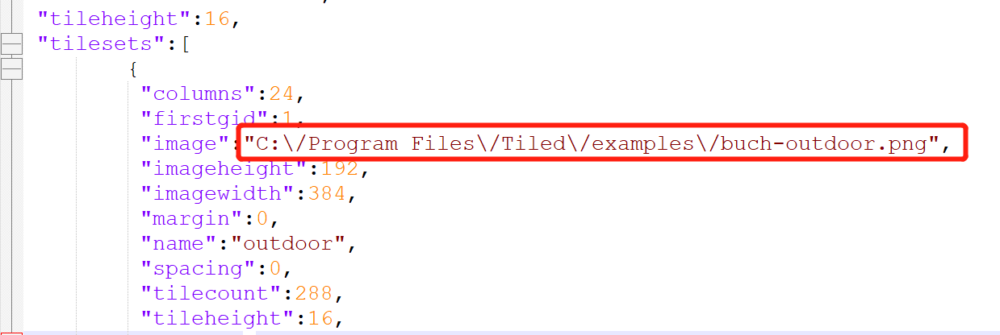
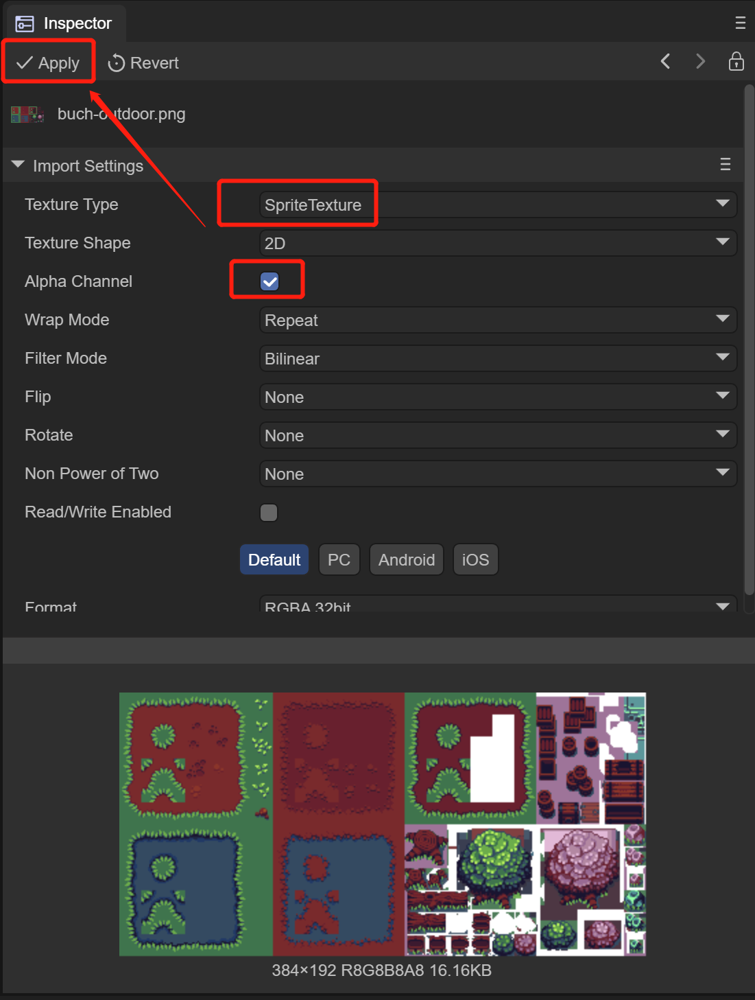
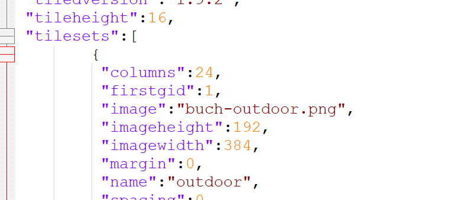
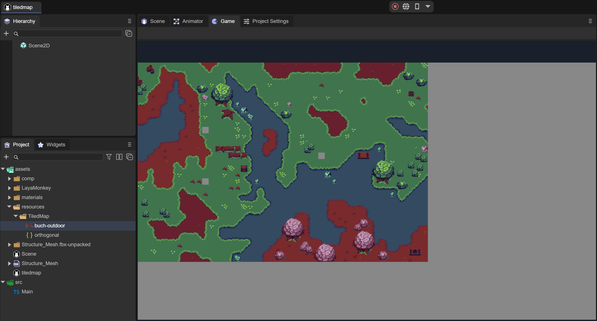
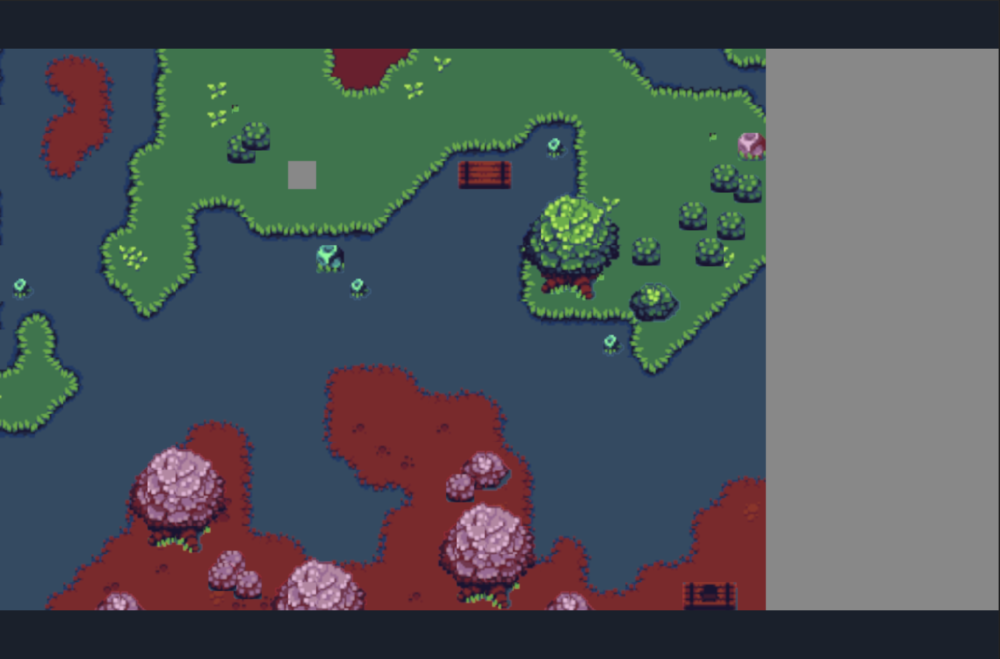
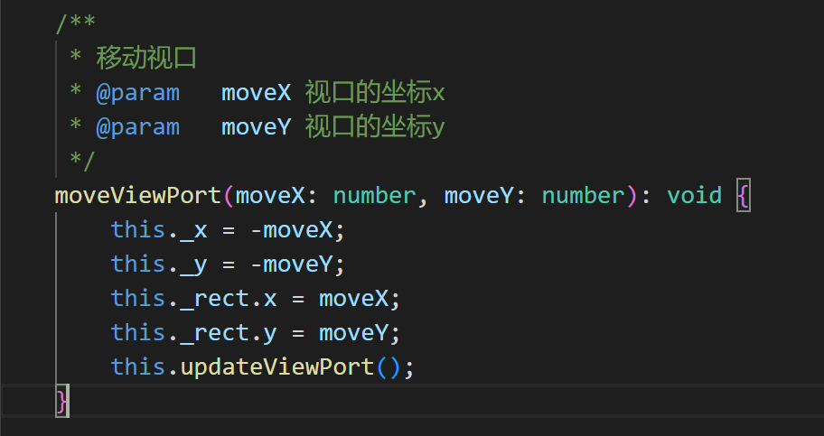
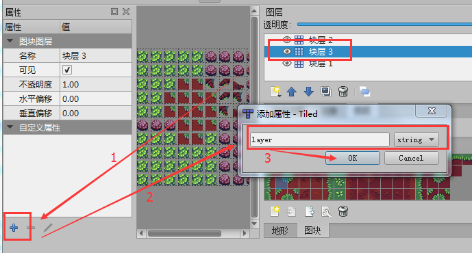

# 使用TiledMap地图


## 一、概述

Tiled Map Editor是一个免费的地图编辑器，可以用来编辑2D游戏地图，LayaAir引擎支持解析Tiled Map导出的地图。本文将介绍如何在LayaAir引擎开发中使用Tiled Map Editor导出的地图。

*注意：本文仅面向熟悉和使用Tiled Map地图工具的开发者。在文中介绍Tiled Map Editor导出的地图在LayaAir引擎的项目中如何使用，关于Tiled Map Editor工具的自身内容请自行查找第三方教程文档。*


## 二、导出引擎支持的Tiled Map地图

### 2.1 Tiled Map Editor下载安装

打开官方首页（http://www.mapeditor.org/）后，直接点击`DownLoad at itch.io`按钮进入下载链接（https://thorbjorn.itch.io/tiled）。

 

（图2-1） 

如果官网改版，也可以直接从下载页 http://www.mapeditor.org/download.html 找到下载链接。

找到对应的系统版本链接，下载安装即可，(*本篇文档采用的版本为Tiled 1.9.2* )。

**Tips**：

*打开下载会弹出赞助该软件的付费页面，如果不想付费，可以直接点击 No thanks, just take me to the downloads，会带你进入一个免费下载的链接。*


### 2.2 导出引擎支持的Tiled Map地图格式

Tiled Map工具的具体使用方式，本文不多讲，可以自行在百度或谷歌中搜索相关教程文档。和引擎有莫大关系的是格式。需要开发者特别注意，一般出问题都是在这里没有注意。

#### 2.2.1 创建地图时，对图块层格式的要求

点击新建地图，设置好地图大小和块大小等初始参数后，点击另存为，存在你指定的位置即完成了创建。

然而，图块层格式需要特别注意，由于**LayaAir引擎不支持Tiled Map地图为Base64的图块层格式。**所以在创建新地图时**必须**为`CSV格式`，如图2-2所示。

 

（图2-2）

如果创建的时候选错了，也可以在属性面板里，将图块层格式改为CSV或者是XML，如图2-3所示，Base64相关的格式都不支持。

 

（图2-3）


#### 2.2.2 导出为json格式

本例中，我们直接打开Tiled Map的示例地图 orthogonal-outside.tmx（*位于Tiled Map地图安装目录的 examples目录下*），如图2-4所示

 

（图2-4）

在导出的时候，我们要选择json的格式。

在Tiled工具的文件菜单里，点击另存为，将已完成的Tiled地图，另存为json文件类型，本例命名为 `orthogonal.json`（文件名开发者随意，后面保持一致即可），点击保存，存到**项目目录内**（本例为项目根目录\assets\resources\TiledMap\），如图2-5所示。

 

（图2-5）


#### 2.2.3 修改图集路径和复制Tiled资源

只是存为json文件还不够，我们还要更改image绝对路径为相对路径。

我们通过IDE，打开刚刚保存的 `orthogonal.json`，搜索关键字 `image` 我们会发现默认的图集路径位于Tiled安装目录中。如图2-6所示。

 

（图2-6）

路径在Tiled安装目录中肯定是不行的，

所以，我们需要先将这个图片复制到项目目录，与之前保存的`orthogonal.json`同级，

如图2-7所示。

 

（图2-7）

同时，我们要把图片文件在IDE里的格式做修改，支持透明通道

 

（图2-8）

然后将 `orthogonal.json` 中的图集路径修改为相对路径，如图2-9所示

 

（图2-9）

准备阶段结束，下面开始步入编码阶段……


## 三、LayaAir引擎使用Tiled Map 地图

### 3.1 IDE勾选laya.tiledmap组件

 

（图3-1）

如图3-1，勾选laya.tiledmap组件后，引擎类库中才支持 tiledmap


### 3.2 创建TiledMap地图 

#### 3.2.1 createMap API 说明

laya.TiledMap类中的`createMap`方法可以创建一个 `TiledMap` 地图。基础的参数说明如图3-2所示。

 

（图3-2）


#### 3.2.2 创建地图示例

```typescript
const { regClass, property } = Laya;

@regClass()
export class Main extends Laya.Script {

    private tMap:Laya.TiledMap;

    onEnable() {

		//创建地图对象
		this.tMap = new Laya.TiledMap();
        //创建Rectangle实例，视口区域
        var viewRect:Laya.Rectangle = new Laya.Rectangle(0, 0, Laya.stage.designWidth, Laya.stage.designHeight);
        //创建TiledMap地图
        this.tMap.createMap("resources/TiledMap/orthogonal.json", viewRect, new Laya.Handler(this, this.completeHandler));
    }

    //添加地图到Scene2D下
	private onLoaded(): void {
		this.tMap.mapSprite().removeSelf();
		this.owner.addChild(this.tMap.mapSprite());
	}

	//地图加载完成的回调
	private completeHandler(e: any = null): void {
		this.onLoaded();
	}
}
```

编译运行代码，效果如图3-3所示，说明地图已创建成功。



（图3-3）


### 3.3 控制地图

控制地图必须要先加载地图的json，然后在回调方法里控制。下面将结合实例了解相关的用法。

#### 3.3.1 地图的缩放

`laya.map.TiledMap`类中的`scale`属性可以控制地图的缩放比例。我们沿用之前的示例，在`createMap`方法内，增加回调，然后使用`scale`属性对地图进行缩放。

示例代码如下：

```typescript
private onLoaded():void
{
	this.tMap.mapSprite().removeSelf();
	this.owner.addChild(this.tMap.mapSprite());
	//将原地图放大2倍
	this.tMap.scale = 2;
}
```

运行效果如图3-4所示。

 

（图3-4）


#### 3.3.2 设置地图缩放的中心点

很明显，图3-4中的效果并不是我们想要的。放大后。有一部分并没有显示出来。这是默认的缩放的中心点是在视口的中心区域造成的。

##### 视口区域与默认的缩放中心点位置

视口区域在创建地图方法 （`createMap`）的第二个参数中所设置，

```typescript
//创建地图对象
this.tMap = new Laya.TiledMap();
//创建Rectangle实例，视口区域
var viewRect:Laya.Rectangle = new Laya.Rectangle(0, 0, Laya.stage.designWidth, Laya.stage.designHeight);
//创建TiledMap地图
this.tMap.createMap("resources/TiledMap/orthogonal.json", viewRect, new Laya.Handler(this, this.completeHandler));
```

通过查看代码，我们发现视口被设置为（ `Laya.stage.designWidth, Laya.stage.designHeight`）。而控制缩放的方法 `setViewPortPivotByScale` 默认值为0.5。那么中心点位置如图3-5所图。

 

（图3-5）

当地图放大两倍时（`this.tMap.scale = 2;`）由于是以视口区域的x与y轴的中心点进行的缩放，所以放大后，会产生图3-6的效果。

 

（图3-6）

下面我们通过动图3-7，从原图比例的0.1到2倍的缩放变化效果，来进一步理解scale属性的中心点。

 

（动图3-7）


##### 用`setViewPortPivotByScale`方法设置缩放中心点

前文中介绍的是默认的缩放中心点效果。那如何设置和改变缩放中心点呢。在`laya.map.TiledMap`类中的`setViewPortPivotByScale()`方法可以设置视口的中心点。API基础说明如图3-8所示。

 

（图3-8）

`setViewPortPivotByScale()` 方法的第一个参数 `scaleX` 是X轴方向的缩放坐标比例，`scaleY` 是Y轴方向的缩放坐标比例。

例如：

```
this.tMap.setViewPortPivotByScale(0.1,0.5);
```

**代码说明**：

假设视口大小为1136*640

- `scaleX` 值 `0.1` 表示x轴缩放中心点的坐标为113.6（1136*0.1）
- `scaleY` 值 `0.5` 表示y轴缩放中心点的坐标为320（640*0.5）

代码运行时以x轴113.6，y轴320为视口的中心点坐标进行缩放。


##### 将缩放中心点设置为视口的左上角

当 `setViewPortPivotByScale` 的缩放中心点设置为`0,0`时，为视口的左上角。继续沿用前面的示例，编码如下：

```typescript
//添加地图到Scene2D下
private onLoaded(): void {
    this.tMap.mapSprite().removeSelf();
    this.owner.addChild(this.tMap.mapSprite());
    //设置缩放中心点为视口的左上角
    this.tMap.setViewPortPivotByScale(0,0);
    //将原地图放大2倍
    this.tMap.scale = 2;
}
```

将缩放中心点设置在视口的左上角，再放大2倍时，效果如图3-9所示。

 

（图3-9）


### 3.4 拖动地图

当地图被放大后，无法全部显示。这时就需要拖动地图查看全部。

拖动地图除了前文中介绍的方法外，还需要用到`moveViewPort()`（移动视口）方法和`changeViewPort()`（改变视口大小）方法。 这两个API的基础说明如图3-10与3-11所示。

 

（图3-10）

 

（图3-11）

下面直接查看代码，了解这两个方法的使用。

```typescript
const { regClass, property } = Laya;

@regClass()
export class Main extends Laya.Script {

    private tMap:Laya.TiledMap;
    private MapX:number = 0;
    private MapY:number = 0;
    private mLastMouseX:number;
    private mLastMouseY:number;

    onEnable() {

		//创建地图对象
		this.tMap = new Laya.TiledMap();
        //创建Rectangle实例，视口区域
        var viewRect:Laya.Rectangle = new Laya.Rectangle(0, 0, Laya.stage.designWidth, Laya.stage.designHeight);
        //创建TiledMap地图
        this.tMap.createMap("resources/TiledMap/orthogonal.json", viewRect, new Laya.Handler(this, this.completeHandler));
    }

    //添加地图到Scene2D下
	private onLoaded(): void {
		this.tMap.mapSprite().removeSelf();
		this.owner.addChild(this.tMap.mapSprite());
        //设置缩放中心点为视口的左上角
        this.tMap.setViewPortPivotByScale(0,0);
        //将原地图放大3倍
	    this.tMap.scale = 3;

        Laya.stage.on(Laya.Event.RESIZE,this,this.resize);
        Laya.stage.on(Laya.Event.MOUSE_DOWN, this, this.mouseDown);
        Laya.stage.on(Laya.Event.MOUSE_UP, this, this.mouseUp);
        this.resize();
	}

	//地图加载完成的回调
	private completeHandler(e: any = null): void {
		this.onLoaded();
	}

    /**
     * 移动地图视口
     */
    private mouseMove():void{
        var moveX:number = this.MapX - (Laya.stage.mouseX - this.mLastMouseX);
        var moveY:number = this.MapY - (Laya.stage.mouseY - this.mLastMouseY)
        //移动地图视口
        this.tMap.moveViewPort(moveX, moveY);
    }
    private mouseUp():void
    {
        this.MapX = this.MapX - (Laya.stage.mouseX - this.mLastMouseX);
        this.MapY = this.MapY - (Laya.stage.mouseY - this.mLastMouseY);
        Laya.stage.off(Laya.Event.MOUSE_MOVE, this, this.mouseMove);
    }
    private mouseDown():void
    {
        this.mLastMouseX = Laya.stage.mouseX;
        this.mLastMouseY = Laya.stage.mouseY;
        Laya.stage.on(Laya.Event.MOUSE_MOVE, this, this.mouseMove);
    } 

    /**
     *  改变视口大小
     *  重设地图视口区域
     */    
    private resize():void
    {
        //改变视口大小
        this.tMap.changeViewPort(this.MapX, this.MapY, Laya.stage.designWidth, Laya.stage.designHeight);
    }
}
```


代码运行效果如动图3-12所示。

 

（动图3-12）


## 四、Tiled Map 使用优化

### 4.1 销毁地图

当Tiled Map不再使用的时候，需要使用destroy()方法进行销毁，回收被占用的内存。

例如：

```
this.tMap.destroy();
```


### 4.2 缓存相关

#### 4.2.1 开启和关闭自动缓存

LayaAir引擎使用`TiledMap`时，默认会将没有动画的地块自动缓存起来，并且缓存类型默认为normal。

```typescript
//自动缓存没有动画的地块
this.tMap.autoCache = true;
//自动缓存的类型，地图较大时建议使用normal
this.tMap.autoCacheType = "normal";
//消除缩放导致的缝隙，也就是去黑边
this.tMap.antiCrack = true;
```

以上的代码属性是引擎的默认值，在多数情况下，保持默认值即可，无需额外设置。

那么为什么要再介绍一遍呢？

因为有的时候，缓存后的Tiled地图会出现黑边（缝隙）。尽管有 `antiCrack` 属性，可以消除绝大多数因 normal 缓存导致的黑边。但如果偶现的黑边问题仍未得到解决时。可以通过关闭自动缓存来解决黑边（缝隙）问题。


#### 4.2.2 设置缓存区块大小

##### 缓存区块的设置推荐

`TiledMap` 地图都是由一个个单元区块拼接组成。如果缓存时保持原大小，当小图区块很多时会对性能产生影响。因此建议开启缓存区块设置，并将缓存区块的大小设置为512像素左右，必须保持原小图区块的整数倍。

例如，本文示例中的单图区块大小为`16*16`，那么缓存区块可以设置 16的32倍，即为 `512*512`。

如果单图是`15*15`，缓存可区块可以设置为`510*510`（34倍），以此类推，尽量在原区块整数倍的前提下，设置在512左右。推荐为 `512*512`。

##### 缓存区块的具体设置方法

缓存区块的设置需要在 `createMap`（创建地图）的时候设置。设置第四个参数 `gridSize`，示例如下：

```typescript
//为第二个参数创建Rectangle实例，视口区域
var viewRect:Laya.Rectangle = new Laya.Rectangle(0, 0, Laya.Browser.width, Laya.Browser.height);
//为第四个参数gridSize创建一个512*512大小的Point对象实例
var gridSize:Laya.Point = new Laya.Point(512, 512);
//创建TiledMap地图
this.tMap.createMap("res/TiledMap/orthogonal.json",viewRect, Laya.Handler.create(this,this.onMapLoaded), null, gridSize);
```


### 4.3 合并图层

#### 4.3.1 开启合并图层

当 `TiledMap` 里有多个图层时，开启合并图层的属性 `enableMergeLayer`，可以将图层合并，会对性能有所提高。

开启的方式为：

```typescript
//开启图层合并
this.tMap.enableMergeLayer = true;
```

**Tips**:

需要注意的是，如果需要对合并前的图层进行操作，那就不能直接合并。因为合并后会导致无法对合并前的图层进行操作。


#### 4.3.2 图层合并分组

如果没有在 `TiledMap` 里将图层分组，那么图层合并时，会将所有图层合并到一起。因此，需要分为多个图层并分别操作时。可以在 `TiledMap` 里将图层分组。

##### `TiledMap`图层分组方式

打开 `TiledMap` 地图编辑器，选中要分组的图层，在图层的自定义属性栏，添加一个名为`layer`的`string`类型属性。操作如图4-1所示。

 

（图4-1）

点击OK，添加完成后，将所有添加了自定义属性layer的图层。设置分组名称。

例如，我们将块层2与块层3的分组名称设置为 layaAir，那么名为 layaAir 的图层，开启 `enableMergeLayer` 后，会合并到同一个图层。操作如图4-2所示。

 

(图4-2)

开启合并图层时，图层属性内可添加layer属性，运行时将会将相邻的layer属性相同的图层进行合并以提高性能


### 4.4 移除被覆盖的格子

如果下层的格子被遮挡，并且遮挡地块并不是透明的，那么被遮挡的部分直接移除而不被渲染，可以提高性能。

移除被覆盖的开启方式为：

```
//移除被非透明地块覆盖的部分
this.tMap.removeCoveredTile = true;
```

**Tips**：

如果开启后，需要对移除的部分进行操作，是不可能的。所以开启该功能前要确认，不再对移除部分进行操作。

##### `removeCoveredTile` 开启的前提

如果在Tiled Map中没有对图块设置 `type` 属性，那么即便开启了 `removeCoveredTile` ，也是无效的。所以，开启之前，需要先在 `TiledMap` 编辑器中，为图块新增自定义属性type，并将设置为1。

##### Tiled Map中设置图块type的操作方式

在图块面板中，点击图块编辑，打开图块地形编辑面板。操作如图4-3所示。

 

(图4-3)

在图块地形编辑面板内，选中地形，在自定义属性栏，点击`+`号图标，添加`int`类型的`type`属性。然后点击OK，完成添加。操作如图4-4所示。

 

(图4-4)

完成添加后，设置`type`属性值为1。操作如图4-5所示。

 

(图4-5)

只要是自定义属性type设置为1的地形，当 `removeCoveredTile` 开启后。被遮挡不可见时都可以被移除，以提高性能。