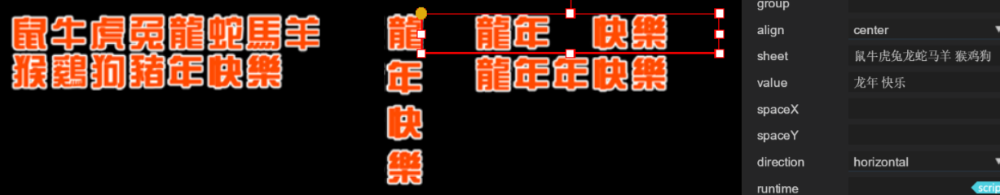
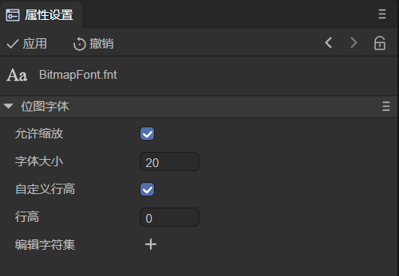
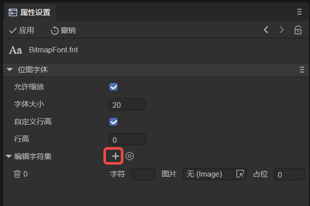
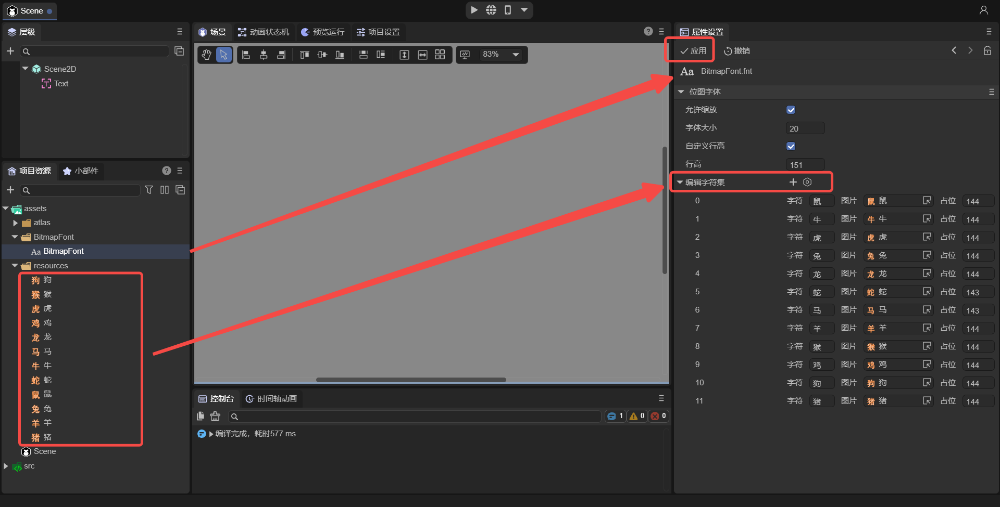

## 文本进阶使用


LayaAir引擎与IDE提供了丰富的文本组件，适用于各种文本应用场景。本篇分别就IDE中的显示文本组件、位图文本组件、可输入文本组件，这几个类型的组件进行介绍，让大家全面了解一下LayaAir引擎的各个文本组件。

### 一、显示文本组件

显示文本就是只能看，不能编辑修改的基础文本。LayaAirIDE中提供了Text和Label这两种基础的显示文本组件。

#### 1.1、文本的底层渲染机制

LayaAir引擎在文本的底层渲染上，有两种方式。

分别是Text文本类的文本统一提交方式，和Graphics类的fillText文本单字符绘制提交方式。

如果采用了Text文本，那每一个Text文本对象中的文本字符会一起形成小图集提交到大图合集中，比如游戏中某个文本对象有300字，其中一个字符发生改变，也会对该文本对象的300字整段文本图集重新提到大图合集中。

又假如，在一个剧情游戏中，两人在对话。那其中一个文本对象，要不断的重新取值和赋值操作，使得该文本对象的显示内容频繁发生改变。此时，Text文本对象，就会不断的向大图合集进行文本图集的提交，占满大图集后，又需要创建一个新的图集继续提交，而不用的旧图集，如果没达到GC条件，也会一直存在，所以如果此次查看内存占用统计信息，就可以看到会一直在涨内存，直到GC条件达到之后，才会被销毁。并且GC在清空垃圾内存的时候，还有可能会导致瞬间的卡顿。

而采用Graphics类的fillText文本绘制，则是按单个字符向大图合集中进行提交，并且大图合集中已经存在的字符不会重复提交。所以对于图集的利用率比较好，即便是发生文本改变的时候，也不会向Text文本那样，创建很多垃圾图集。

这样看来，是不是fillText就是最好用的呢？

如果文本不需要改变，那按单字提交图集的效率是不如一次性直接提交的。

所以，我们还是要看文本的类型，对应文本使用时的类型，选用相应的引擎API，才会更好。

#### 1.2、静态文本与动态文本

基于上一小节的文本渲染提交的机制，以及文本仅用于展示或用于交互的区别，我们分成两种概念，就是把仅用于显示，文本内容无需改变的文本叫静态文本。对于文本内容需要改变的文本叫动态文本。

Text和Label都属于处理静态文本的类，它们都是把文本的每次改动都统一提交大图集的渲染机制。

fillText、fillBorderText、strokeText等，都是Graphics类中用于单字符提交的文本绘制方法。

在LayaAirIDE中，Text和Label属于静态文本组件，而LayaAir引擎中Graphics类的fillText、fillBorderText、strokeText等文本绘制方法，在IDE中是没有封装为组件的，需要在项目代码中直接使用引擎的API。

#### 1.3、不同的文本API的使用区别与选择

如果我们已经理解了什么是静态文本和动态文本，那使用起来的选择就比较简单了，例如，一些导航和标签按钮等，他在UI上完全没有必要进行改变，完全可以使用静态文本。文字剧情和任务等，就需要动态文本了。

那静态文本组件有Text和Label两种，那是怎么选择呢。

其中Text是最基础的文本组件，他直接继承于Sprite，而Label继承于UIComponent再往上才是Sprite，从原理上，路径越短，性能自然越好。所以，比较简单的文本，当Text可以满足时，原则上优先使用Text，而Label由于属性非常丰富，适用于相对布局等等Text无法满足的应用场景。

对于fillText而言，我们不仅要了解它的优势，也要了解他的不足。fillText文本由于是引擎自己绘制的，目前只适用于中英文等主流国家语言，对于泰国语、阿拉伯语等复杂的语言，显示可能会有异常。所以对于这些排版复杂的国际语言游戏，那只能是采用静态文本组件的系统字或者是位图字，尽可能减少文本动态修改的产品需求。

#### 1.4、使用时要注意的

静态的文本优先使用Text组件，因为只显示静态文本的时候性能最好。动态文本优先使用fillText，除非是国际化等需求不能满足的时候。

静态文本，对于有相对布局等复杂需求时，Label组件的功能比较强大。

fillText的代码使用方法说明如下：

```typescript
 /**
     * 在画布上绘制文本。
     * @param text 在画布上输出的文本。
     * @param x 开始绘制文本的 x 坐标位置（相对于画布）。
     * @param y 开始绘制文本的 y 坐标位置（相对于画布）。
     * @param font 定义字号和字体，比如"20px Arial"。
     * @param color 定义文本颜色，比如"#ff0000"。
     * @param textAlign 文本对齐方式，可选值："left"，"center"，"right"。
     */
    fillText(text: string | WordText, x: number, y: number, font: string, color: string, textAlign: string): FillTextCmd {
        return this.addCmd(FillTextCmd.create(text, x, y, font, color, textAlign, 0, ""));
    }
```

这里重点介绍一下fillText中font属性与其它几个文本font属性区别，fillText示例代码如下：

```typescript
	/**
     * 组件被激活后执行，此时所有节点和组件均已创建完毕，此方法只执行一次
     */
    onAwake(): void {
        let sprite = new Laya.Sprite();
        Laya.stage.addChild(sprite);
        sprite.graphics.fillText("fillText:引擎绘制的文本，适合简单的单行文本", 100, 300, " 60px  simHei  ", "#ff0000", "left");
    }
```

在Text与Label中，font仅仅是指系统字体，例如该文本是`Microsoft YaHei`还是`Arial`，选择或者输入对应的字体就可以。而fillText中，font是字体与字体大小的设置值，也可以把所有相关的文本样式（大小、字体、斜体、加粗）也在这里指定。

例如，当值为 `60px simHei` ，是将文本大小设置为60像素大小，采用simHei字体。如下图1-1所示：


（图1-1） 

值为`60px simHei italic` 增加了斜体效果。如下图1-2所示：


（图1-2）

值为`bold 60px simHei italic` 增加了文本加粗效果。如下图1-3所示：


（图1-3） 

> Tips:
>
> - 大小与字体是必须设置的，并且在字体必需要放到文本px大小的后面。
> - bold需要放到文本px大小的前面。

### 二、位图显示文本组件

位图显示文本，是一种基于位图的文本，虽然显示的是文本的内容，其本质还是位图。通常用于系统上不通用的字体或者美术设计的个性字体，通过位图的方式可以保障字体的兼容性与美观。对于文本效果与位置要求比较严格的游戏，建议采用位图文本。

> 普通的文本，在不同运行环境下，可能会存在像素级的位置偏移。比如Chrome低版本和高版本也存在位置偏移。所以要求高的静态UI文本，可以采用位图显示文本。
>
> 位图文本适用于文本单字总量不大需求，常用于第X关，X连击等标题性文本。对于文字剧情这种游戏，就不太适合。

#### 1、FontClip字体剪辑组件

FontClip组件是LayaAir基于等份切割原理将完整的位图切分成一个个独立的文本单元，然后任意剪辑拼接起来。效果如图2-1所示，


（图2-1） 

图2-1的数字0-9是美术原图效果的展示，数字999是FontClip组件效果。

在图2-1右侧的属性面板上，sheet值对应位图的9个数字，此时数字要完全对应起来，因为这个值不仅是引擎切割份数的参考依据，更是文本映射关系。只有对应起来，属性value中输入什么值就会显示什么值，例如图2-1的999。并且FontClip组件还可以控制切割后的位图文本间距等效果。

如果位图文本不是数字，是字母或者中文等，内容比较多，美术出图时也可以将文本多行排行，但是每个文本之间必须要等高等宽等距进行排列。此时用于映射的sheet值，要在每行结束位置加一个空格，让引擎知道这个位图文本是多行排行的。效果如下图所示：



（图2-2） 

通过图2-2，我们可以看出sheet属性值`鼠牛虎兔龙蛇马羊 猴鸡狗猪年快乐`对应了位图上的文本，并且在羊后加了一个空格，此时就可以在value输入位图上的文本字符了，而且我们还展示了竖向排版的效果，说明切割后的文本还可以排版控制的。

如果细心的开发者会发现，位图字是繁体的，sheet的值是简体的，但展示的效果并没有受到影响。这是因为sheet值只是起到映射关系的作用，哪怕这十二生肖的文本对应的就是生肖图片，那也会显示对应的生肖图。但是映射的文本与位图上的数量一定要是完整的，否则切片的份数不对，就会导致位图剪辑后的显示错误。

最后再说一下空格，如果当前的FontClip组件是图2-1那样面向单行的整句文本，此时sheet值是不支持空格的。而对于图2-2的多行文本，sheet值里的空格表示换行，并不是空一格。如果在Value值里加一个空格，可以从图2-2中看出，会空出一个完整的文本位置。其实不止是空格，所有sheet值中不存在的文本，输入在value中都会以空的完整字符占位。


#### 2、BitmapFont位图字体

通常FontClip已经可以满足关卡、特效等单行位图文本的需求。如果有特殊情况，就是想要空格或者某些系统里没有的艺术字体，那也可以通过BitmapFont位图字体来实现。在LayaAir IDE里，可以直接创建制作位图字体，下面就来介绍这一功能。

如图2-3所示，在项目资源面板中，右键创建`位图字体`。


（图2-3）

创建后，如图2-4所示，会生成一个`BitmapFont.fnt`字体文件，


（图2-4）

点击选中后，在如图2-5所示的属性设置面板中，就可以创建位图字体了。



（图2-5）

点击“编辑字符集”的`+`创建一个字符，如图2-6所示：



（图2-6）

| <span style="display:inline-block;width:80px">参数</span> | 意义                                                         |
| --------------------------------------------------------- | ------------------------------------------------------------ |
| 允许缩放                                                  | 勾选后，可以按文本中的字体大小设置进行缩放显示。如果这里不勾选，则会无视字体大小设置，仅按位图文本的实际大小显示 |
| 字号                                                      | 勾选允许缩放后，此处的字体大小用于实际文本字体大小的缩放调节。例如，实际文本的字体大小设置为24，位图字体的字体大小设置为12，那么位图字体最终将放大1倍显示，此处建议与文本组件的”font size“属性保持一致，这样获得的缩放效果最准确。如果不允许缩放，那此处与实际文本的字体大小设置均无效，会始终保持位图字体的源图大小 |
| 自定义行高                                                | 勾选后，可以设置行高。如果不勾选，则使用默认行高。行高决定了文本多行显示时每行所占高度，主要用于文本垂直方向的排版。如果为0，就是采用字号大小作为行高。如果大于0，就是实际文本的行间距（两个位图字体上边界之间的距离）。创建后可以在文本组件的”leading“属性中设置行高 |
| 字符                                                      | 图片对应的字符，只支持单字符，可以是数字或者字符串           |
| 图片                                                      | 资源库里的一张图片                                           |
| 占位                                                      | 如果值为0，创建后表示一个字符的水平占位宽度，它由字符图片的宽度决定。如果值大于0，则使用该值作为字符之间的字间距（两个位图字体左边界之间的距离） |

如图2-7所示，在resources文件夹下有十二张图片，分别是”鼠牛虎兔龙蛇马羊猴鸡狗猪“十二个字的位图，将这十二张图作为位图字体。图片的高度为151 px，所以行高设置为151。占位默认为0，创建后会变为144，即图片的宽度。编辑好之后点击”应用“，点击后还会再创建一张BitmapFont.png图片用于预览位图字体。



（图2-7）

位图字体可以在Text、Label、TextInput、TextArea等文本组件的Font属性中被选择，并且能够调整字体大小与行间距等。下面以Text为例，演示位图字体的使用。如动图2-8所示，在Text中选择好刚刚创建的位图字体，然后在文本中输入位图字体对应的”字符“即可使用位图字体了。


（动图2-8）

> Tips：
>
> 开发者也可以通过外部工具制作完成后，再导入使用。这里推荐一个开源工具：https://snowb.org/，在线即可制作。

### 三、HTML、UBB、模板

在所有的文本相关的UI组件上使用HTML标签，并且可以与其它的UBB标签、文本模板、普通文本混合使用，开发者只需设置对应的syntax属性即可，支持的语法与使用方式请参考文档[《基础文本》](../../displayObject/Text/readme.md)。

### 四、可输入文本组件

可输入文本组件为单行输入组件TextInput和多行文本域组件TextArea。

从组件名字其实上就可以看出区别，

一个是不能换行，用于单行输入。比如注册信息上的那些单行输入框用TextInput。

另一个是能换行的多行文本组件TextArea，比如个人简介，备注说明等等。而且TextArea文本组件支持右侧的垂直滚动条，和底部的水平滚动条。

由于可输入文本组件的用法比较简单，组件也比较容易理解。这里就不详细介绍了，具体在使用过程中，可以看提示进行尝试或者直接看对应的组件属性说明文档。

### 五、关于文本的性能优化

### 5.1 尽可能使用对应的文本组件

每个不同的组件都是有自己独特的作用，所以一定要充分了解组件的作用，对应特点来使用。

上文中也讲到过，静态显示文本Text组件的性能是最好的，所以，在项目开发时，能用Text尽可能要用Text组件。当Text组件不满足的时候再用Label。

对于无需改变内容的静态文本，当文本组件节点较多时，我们可以开启cacheAs，设置normal可以优化节点数，设置bitmap可以优化DrawCall数。

而当文本内容需要改变时，哪怕只改变一个字符，如果FillText可以满足需求的话，那尽可能优先使用FillText文本组件。FillText不能满足时，其次考虑位图文本组件是否可以满足，最后再考虑静态文本组件。

### 5.2 尽可能避免使用文本描边

在运行时，设置了描边的文本比没有描边的文本多调用一次绘图指令。此时，文本对CPU的使用量和文本的数量成正比。因此，尽量使用替代方案来完成同样的需求。例如，字符量较少的时候，可以使用位图文本。

### 5.3 被文本打断的DrawCall优化

在2D的UI布局时，如果开发者将文本与其它UI节点混合排列，那么必然会打断图集的合并渲染，增加DrawCall数量，产生不必要的性能开销。所以，有两个方案来优化。

一是，LayaAir IDE编辑布局时，将所有文本组件在节点中顺序排列，不要与其它UI组件穿插。 

二是，LayaAir IDE中的组件中有一个drawCallOptimize属性，我们为所有文本的父级节点drawCallOptimize属性设置true值。当这样设置之后，引擎会自动启用文本合并优化，将所有的文本提取到最上层，而开发者无需再刻意调整图集资源和文本的排序，即可实现drawCall自动优化的目标，而且优化的更加干脆彻底。

> 需要提醒的是，drawCallOptimize优化方案由于会自动将文本提升显示层级，不适用于必须要将文本半遮挡的特殊需求。当然，绝大多数情况下文本是要处于全文显示的，如果有全隐藏的情况，可以直接设置隐藏属性。所以，建议开发者开启该优化方案。


