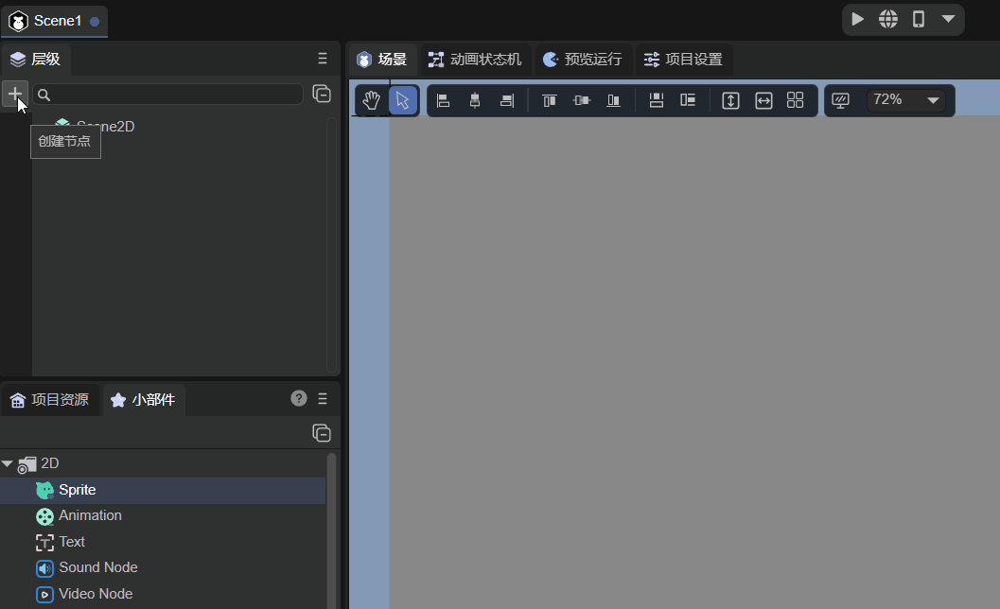
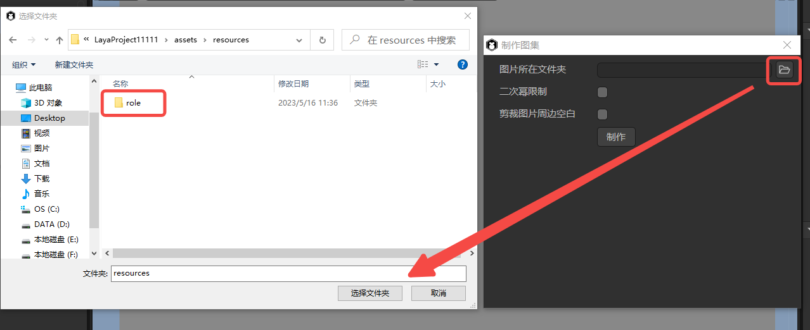
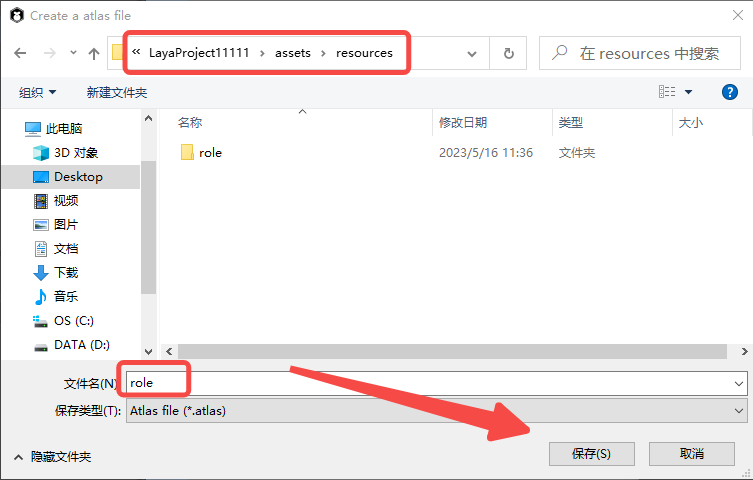
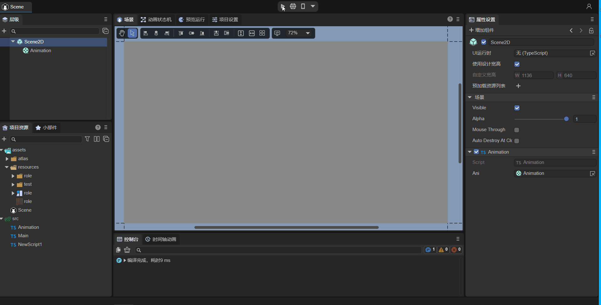

# 动画节点（Animation）


## 1. 初步认知Animation节点

Animation是节点动画，可以方便的创建图集动画、多帧动画。如动图1-1所示，就是由Animation创建的动画效果。Animation节点的API请参考[Animation API](https://layaair.com/3.x/api/Chinese/index.html?version=3.0.0&type=Core&category=display&class=laya.display.Animation )。

 

（动图1-1）

**Animation节点的常用属性**

| 属性     | 功能说明                                                     |
| -------- | ------------------------------------------------------------ |
| images   | 添加动画图像。                                               |
| source   | 添加动画图集。                                               |
| autoplay | 动画图集是否自动播放，默认为false。如果设置为true，则动画被创建并添加到舞台后自动播放。 |
| wrapmode | 播放类型：默认为0是正序播放（POSITIVE），1为倒序播放（REVERSE），2为pingpong播放（PINGPONG）。 |
| interval | 动画播放间隔，单位为毫秒，默认值为50毫秒。                   |
| index    | 播放位置。                                                   |


## 2. 通过LayaAir IDE创建Animation节点

### 2.1 创建Animation

如动图2-1所示，可以在`层级`面板中创建Animation节点，点击`+`或通过右键点击创建。



（动图2-1）

也可以从`小部件`里直接拖入Animation到IDE的`场景编辑器`或`层级`面板中，如动图2-2所示。


（动图2-2）


### 2.2 接收动画数据源

接收动画数据源有设置Images和Source两种方式。

#### 2.2.1 Images

第一种方法是`Images`，可以摁住键盘 **↓** 方向键快速选择图片，也可以单击图片进行添加，如动图2-3所示。


（动图2-3）

#### 2.2.2 Source

第二种方法更为简单快捷，直接将打包好的图集放入`Source`属性中即可，如图2-4所示。 


（图2-4）

#### 2.2.3 制作图集

虽然添加图集的方式较为快捷，但是上述的“图集”资源需要开发者自己制作。LayaAir IDE提供了制作图集的工具，如图2-5所示，在导航栏的`工具`菜单栏中选择`制作图集`。


（图2-5）

点击后打开的制作图集工具如图2-6所示。


（图2-6）

制作图集时，要将需要放入图集的一系列图片，存放在一个文件夹中（这里存放在了文件夹“role”中）。然后将参数`图片所在文件夹`设置为存放图片的文件夹“role”中，如图2-7所示。



（图2-7）

勾选**二次幂限制**，则生成的图集图片宽高将会是2的整次幂。

勾选**裁剪图片周边空白**，生成图集的图片将会更加密集一些。

点击`制作`按钮，如图2-8所示，选择图集文件存放的路径，并对图集文件进行命名，然后点击保存。



（图2-8）

图集制作完成后，会显示“**成功！**”字样的提示（如图2-9）。


（图2-9）

最终生成的图集文件为同名的`.atlas`文件和`.png`文件（role.atlas和role.png）。其中，`.atlas`是LayaAir IDE特有的图集格式，仅用于图集。


### 2.3 设置自动播放（autoPlay）

`autoPlay`属性可以设置是否自动播放，默认为false，不自动播放。如果设置为true，即勾选状态下，动画被创建并添加到舞台后自动播放。


### 2.4 控制动画的播放模式（wrapMode）

动画播放模式属性`wrapMode`有三个值可选。默认值是0，正序播放（POSITIVE）。选1时，倒序播放（REVERSE）。选2时，pingpong（乒乓）模式（PINGPONG），直白一些就是来回播放。下面以加载图集的方式演示三种播放模式。

> 注意：播放时要勾选`AutoPlay`参数，即将其设为true。

#### 2.4.1 正序模式播放

默认不设置wrapMode属性或是将wrapMode属性值设为0时，为正序播放模式（POSITIVE）。也就是序列图从前到后的顺序进行播放，如动图2-10所示。


（动图2-10）


#### 2.4.2 倒序模式播放

将wrapMode属性值设为1时，为倒序播放模式（REVERSE）。也就是序列图从后到前的顺序进行播放，与正序播放模式完全相反，如动图2-11所示。


(动图2-11)


#### 2.4.3 pingpong（乒乓）模式播放

将wrapMode属性值设为2时，为pingpong播放模式（PINGPONG）。在这个模式下，同一套动作，正序播放完了，并不是直接回到图集设置的第一帧重头播放，而是从倒序的倒数第二帧播放，从而让动作更加平滑和完整。因此，pingpong模式也是游戏中经常使用的模式之一，在保障效果的前提下，还可以大幅减少美术资源量。效果如动图2-12所示。 


(动图2-12)


### 2.5 动画播放的帧间隔时间(interval)

`interval`属性可以设置动画播放的帧间隔时间(单位：毫秒)，默认值为50毫秒。例如，我们将刚刚播放的动画，放慢一倍，设置为100毫秒。效果如动图2-13所示。


（动图2-13）

> **Tips**：如果动画正在播放，设置后会重置帧循环定时器的起始时间为当前时间，也就是说，如果频繁设置interval，会导致动画帧更新的时间间隔会比预想的要慢，甚至不更新。


### 2.6 设置播放的起始位置（index）

`index`属性可以指定动画的帧索引，默认的索引是0，可以设置为动画中的任意一帧。设置后，将会跳到设定的动画帧，效果如动图2-14所示。


（动图2-14）

> **Tips**：该属性仅用于静态指定，比如通过代码或点击事件来手动切换动画帧。如果设置为自动播放，仍会从第0帧开始播放，与索引的设置没有关系。


### 2.7 脚本控制Animation

在Scene2D的属性设置面板中，增加一个自定义的组件脚本，命名为“Animation.ts”。然后，按照动图2-15，将Animation节点拖入到“Animation.ts”暴露的属性入口中。


（动图2-15）

接着，就可以在脚本文件“Animation.ts”中用代码对Animation进行控制了，示例代码如下：

```typescript
const { regClass, property } = Laya;

@regClass()
export class Animation extends Laya.Script {
    //declare owner : Laya.Sprite3D;

    @property({ type: Laya.Animation }) //在IDE面板中显示属性
    ani: Laya.Animation;

    constructor() {
        super();
    }

    //组件被激活后执行，此时所有节点和组件均已创建完毕，此方法只执行一次 
    onAwake(): void {
        this.ani.source = "resources/role.atlas"; //接收动画数据源为图集
        this.ani.autoPlay = true; //开启自动播放
        this.ani.wrapMode = 0; //播放模式为正序播放模式（POSITIVE）
        this.ani.interval = 50; //动画播放的帧间隔时间为50毫秒
    }
}
```

运行效果如动图2-16所示：



（动图2-16）


## 3. 代码创建Animation

有时，不想让动画节点一开始就在舞台上，而是在要用的时候才添加，这就要通过代码来创建了。在Scene2D的属性设置面板中，增加一个自定义的组件脚本，在代码中创建Animation。示例代码如下：

```typescript
const { regClass, property } = Laya;

@regClass()
export class UI_Animation extends Laya.Script {
    //declare owner : Laya.Sprite3D;

    constructor() {
        super();
    }

    //组件被激活后执行，此时所有节点和组件均已创建完毕，此方法只执行一次
    onAwake(): void {
        this.setup();
    }

    private setup(): void {

        var Animation: Laya.Animation = new Laya.Animation();
        Animation.pos(200, 200); //设置节点位置
        Animation.source = "resources/role.atlas"; //接收动画数据源为图集
        Animation.size(600, 275); //设置节点大小
        Animation.interval = 100; //动画播放的帧间隔时间为100毫秒
        Animation.autoPlay = true; //开启自动播放
        Animation.wrapMode = 2; //播放模式为pingpong播放模式（PINGPONG）
        this.owner.addChild(Animation) //添加节点
    }

}
```

效果如动图3-1所示：


（动图3-1）