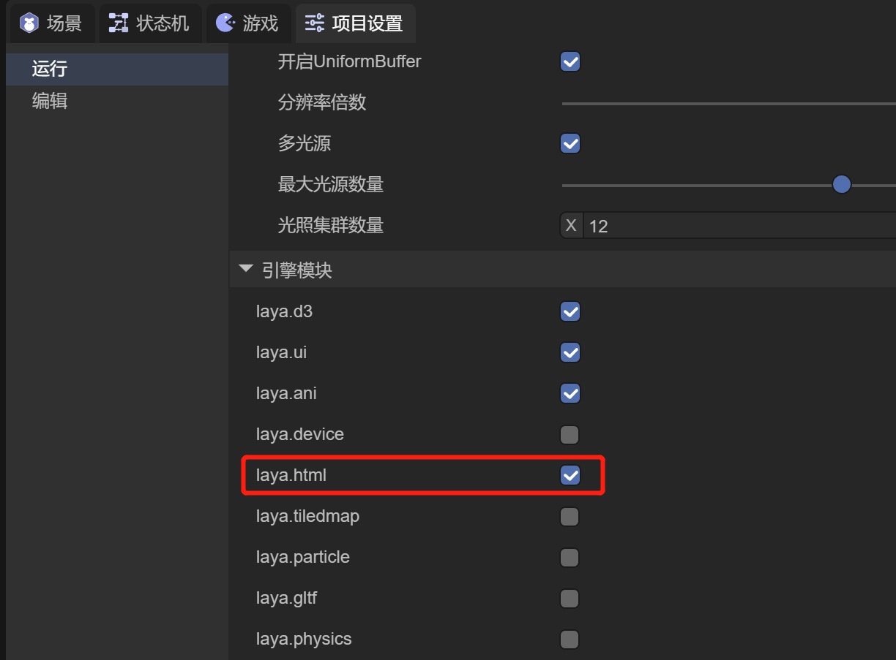
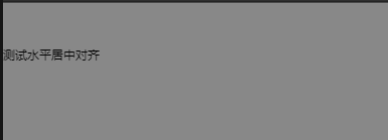
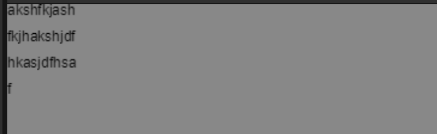
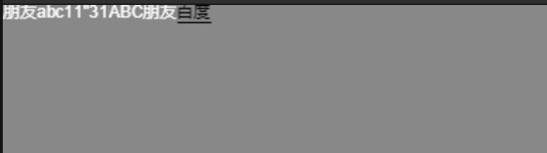

# HTML文本


## 一、概述

HTML文本组件，就像使用HTML语言一样来实现UI。在LayaAir IDE中，我们可以使用HTML文本组件来实现一些比较复杂的UI效果，比如图文混排的功能，一段文字中某些文字变色的功能等等


## 二、IDE中使用

### 2.1 添加html类库

使用HTML文本之前，在项目设置中，需要勾选laya.html类库，如图2所示

 

（图2）


### 2.2 节点中创建

在一个Scene2D的Hierarchy窗口中，任何节点下，或者是空白位置，都可以通过鼠标右键来创建HTML文本，如动图2-1所示

 

（动图2-1）

此时创建的HTML文本，是看不到任何效果的，后面将介绍如何添加文本内容


### 2.3 控件中创建

在控件的2D标签下，可以在任何节点下，创建HTML文本，如动图2-2所示

 

（动图2-2）


### 2.4 InnerHTML属性

 

（图2-3）

如图2-3所示，HTML文本中只有一个Inner HTML属性，我们只需要在属性里添加文本内容即可。

文本内容参照HTML语言，我们来看看一个示例，如图2-4所示

 

（图2-4）

如图2-4所示，是在Inner HTML内容中输入下述文本的运行效果

```
<span style='font-weight:bold;font:50px Arial;color:red' href='https://ask.layabox.com'>LayaBox</span>
```

可以看到，LayaBox文字使用了 Bold 粗体，字体大小是50像素，Arial字体，字体颜色是红色，并且LayaBox是一个带有下划线的文字链接形式


## 三、代码中使用

`Laya.HTMLDivElement` 类位于laya.html类库中。HTML图文类，用于显示html内容

```
/**
 * HTML图文类，用于显示html内容
 *
 * 支持的标签如下:
 * a:链接标签，点击后会派发"link"事件 比如:<a href='alink'>a</a>
 * div:div容器标签，比如:<div>abc</div>
 * span:行内元素标签，比如:<span style='color:#ff0000'>abc</span>
 * p:行元素标签，p标签会自动换行，div不会，比如:<p>abc</p>
 * img:图片标签，比如:</img>
 * br:换行标签，比如:<div>abc<br/>def</div>
 * style:样式标签，比如:<div style='width:130px;height:50px;color:#ff0000'>abc</div>
 * link:外链样式标签，可以加载一个css文件来当style使用，比如:<link type='text/css' href='html/test.css'/>
 *
 * style支持的属性如下:
 * italic:true|false;					是否是斜体
 * bold:true|false;						是否是粗体
 * letter-spacing:10px;					字间距
 * font-family:宋体; 					   字体
 * font-size:20px;						字体大小
 * font-weight:bold:none;				字体是否是粗体，功能同bold
 * color:#ff0000;						字体颜色
 * stroke:2px;							字体描边宽度
 * strokeColor:#ff0000;					字体描边颜色
 * padding:10px 10px 20px 20px;			边缘的距离
 * vertical-align:top|bottom|middle;	垂直对齐方式
 * align:left|right|center;				水平对齐方式
 * line-height:20px;					行高
 * background-color:#ff0000;			背景颜色
 * border-color:#ff0000;				边框颜色
 * width:100px;							对象宽度
 * height:100px;						对象高度
 *
 * 示例用法：
 * var div:HTMLDivElement=new HTMLDivElement();
 * div.innerHTML = "<link type='text/css' href='html/test.css'/><a href='alink'>a</a><div style='width:130px;height:50px;color:#ff0000'>div</div><br/><span style='font-weight:bold;color:#ffffff;font-size:30px;stroke:2px;italic:true;'>span</span><span style='letter-spacing:5px'>span2</span><p>p</p></img>";
 */
 export class HTMLDivElement extends Sprite {
```

下面我们通过一些示例代码来看看运行效果：


### 3.1 同一个文本中设置Bold、Font、FontSize、Color、下划线

**【注意：目前不支持斜体、描边、span标签内嵌的方式】**

示例如下：

```
var div:Laya.HTMLDivElement = new Laya.HTMLDivElement();
div.innerHTML="<span style='font-weight:bold;" +
"font:24px Arial' " +
"color='red' " +
"href='https://ask.layabox.com'>" +
"LayaBox</span><span>欢迎你的加入</span>";

Laya.stage.addChild(div);
```

运行效果：

 


### 3.2 **同一个文本中设置字体、颜色不同**

示例如下：

```
var htmlD:HTMLDivElement = new HTMLDivElement();
Laya.stage.addChild(htmlD);
htmlD.innerHTML = "<font style='fontSize:30' color='#67fc2c'>测试</font><font style='fontSize:20'>html组件</font>";
```

运行效果：

 


### 3.3 **获取html文本的实际宽高（contextWidth、contextHeight）**

示例如下：

```
var htmlDiv:HTMLDivElement=new HTMLDivElement();
var html:string = "<span color='#e3d26a'>使用</span>";
html += "<span style='color:#FFFFFF;font-weight:bold'>HTMLDivElement</span>";
html += "<span color='#6ad2e3'>创建的</span><br/>";
html += "<span color='#d26ae3'>HTML文本</span>";
htmlDiv.innerHTML = html;
htmlDiv.pos(50,200);
console.log("文本的实际宽度为"+htmlDiv.contextWidth,"文本的实际高度为"+htmlDiv.contextHeight)
Laya.stage.addChild(htmlDiv);
```

运行效果：

 

运行输出：文本的实际宽度为158.677734375 文本的实际高度为24


### 3.4 设置文本的水平居中对齐(align需要和width配合使用)、换行(
)、空格_(;)

**【注意：目前不支持文本的垂直居中对齐，开发者可以将(图片的高度-文本的高度)/2的值赋给文本的Y值，进行垂直居中对齐替代设置】**

示例如下：

```
var html3:HTMLDivElement=new HTMLDivElement();
html3.style.lineHeight=30;
html3.style.width=300;
html3.style.align="center";
html3.innerHTML="<br/><span>  测试水平居中对齐</span>";
Laya.stage.addChild(html3);
```

运行效果：

 


### 3.5 实现超链接

示例如下：

```
var div:HTMLDivElement=new HTMLDivElement();
div.innerHTML="<span href='http://ask.layabox.com/'>LayaBox欢迎你的加入！</span>";
div.on(Laya.Event.LINK,this,(data:any)=>{
	Laya.Browser.window.location.href=data;
});
Laya.stage.addChild(div);
```

运行效果：

 

点击文字链接可以打开浏览器访问网址


### 3.6 实现html页面跳转

示例如下：

```
var iHtml:HTMLIframeElement = new HTMLIframeElement();
Laya.stage.addChild(iHtml);
iHtml.href="test.html";
```

运行效果：

 


### 3.7 为HtmlDivElement设置行间距，leading属性，注意，必须设置valign=’middle’

示例如下：

```
var t:HTMLDivElement = new HTMLDivElement;
Laya.stage.addChild(t);
t.style.valign = "middle";
t.size(60, 120);
t.style.wordWrap = true;
t.style.leading = 10;
t.innerHTML = "akshfkjashfkjhakshjdfhkasjdfhsaf";
```

运行效果：

 


### 3.8 解决IOS手机上英文字母偏下的问题（在style样式中加垂直向上对齐valign:top属性）

示例如下：

```
var html:HTMLDivElement=new HTMLDivElement();
html.innerHTML = "<span style='color:#ffffff;valign:top;'>朋友abc11''31ABC朋友</span><span href='http://www.baidu.com' target='_blank'>百度</span>";
Laya.stage.addChild(html);
```

运行效果：

 

