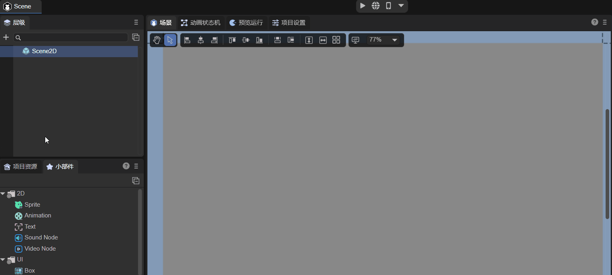
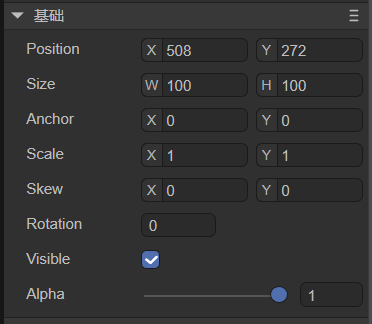
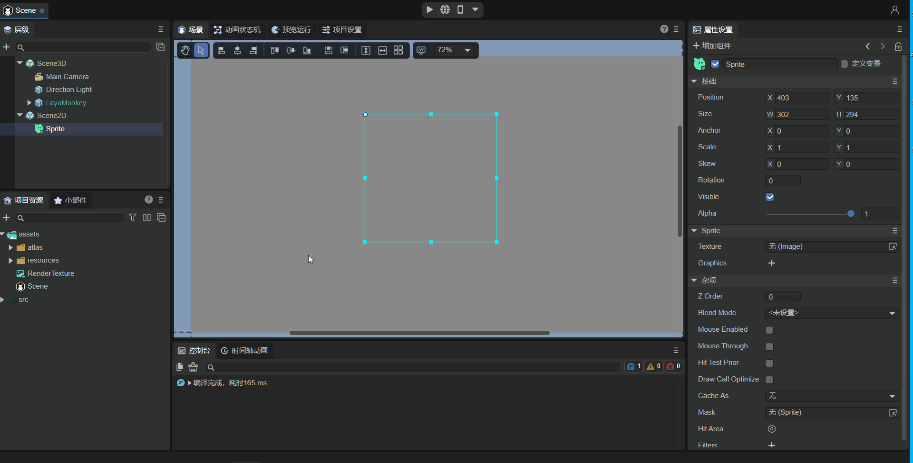
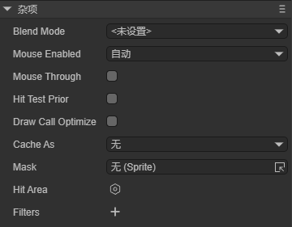
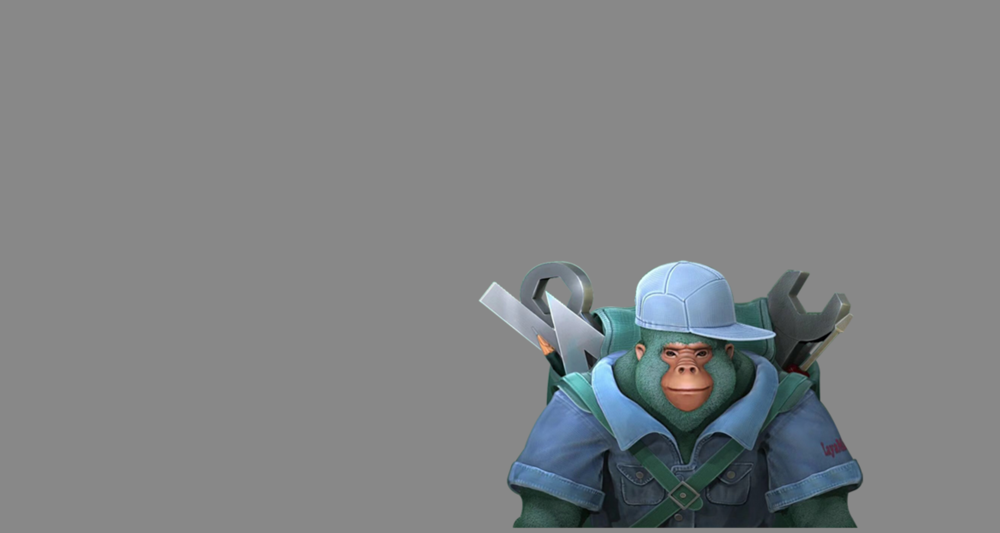
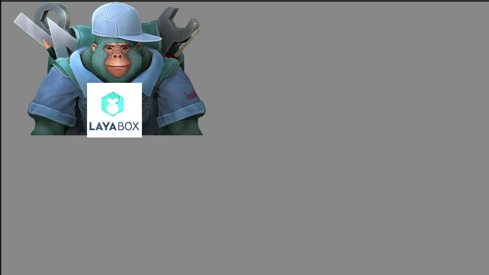

# 精灵


## 一、概述

游戏中Sprite精灵是在屏幕中能够被控制的显示对象，如果屏幕中的显示对象不能被控制那就只是一个节点。准确来说，Sprite精灵是一个能够通过改变自身属性，比如角度、位置、缩放、颜色等，变为可控动画的2D图像。

`Sprite` 是基本的显示图形的显示列表节点。 通过 `graphics` 可以绘制图片或者矢量图，支持旋转，缩放，位移等操作。`Sprite`同时也是容器类，可用来添加多个子节点。`Sprite`针对不同的情况做了渲染优化，所以保证一个类实现丰富功能的同时，又达到高性能。

另外，在LayaAir 2D UI中，Sprite是所有节点对象的基础类，如图1-1所示，Sprite 类的基础功能会被继承到所有继承的节点对象中，因此本篇会详解介绍 Sprite 类的基础功能，后续的节点对象将不再介绍。

 

（图1-1）


## 二、IDE中使用

### 2.1 创建精灵

#### 2.1.1 Scene2D中创建

在一个Scene2D的Hierarchy窗口中，任何节点下，或者是空白位置，都可以通过鼠标右键来创建精灵，如动图2-1所示

 

（动图2-1）

此时创建的精灵，是看不到任何效果的，实际上就是创建了一个空的2D精灵节点。


#### 2.1.2 控件中创建

在控件的2D标签下，可以在任何节点下，创建精灵，如动图2-2所示

 

（动图2-2）


### 2.2 基础属性

如图2-3所示，精灵有如下基础属性

 

（图2-3）

`Position`：精灵的位置坐标

`Size`：精灵的宽高

`Pivot`：精灵的轴心点坐标

`Anchor`：精灵的锚点

`Scale`：精灵的缩放

`Skew`：精灵的倾斜角度

`Rotation`：精灵的旋转度

`Visible`：精灵是否可见

`Alpha`：精灵的透明度

我们通过一组操作，来看看这些属性是如何操作的，如动图2-4

 

（动图2-4）

由于此时的精灵只是一个空节点，没有显示对象，因此 Visible 和 Alpha 的调整是没有任何显示变化的，我们先来看看几个常用的基础属性


#### 2.2.1 轴心点 pivot

什么是pivot轴心点呢？一个Sprite精灵对象默认的轴心点位于自身的左上角，设置Sprite精灵的位置时默认是以左上角为基准进行定位的。

轴心点pivot是基准点，决定着Sprite在舞台的位置。轴心点以像素为单位，默认XY坐标为(0,0)表示图片左上角作为基准点。当修改了Sprite对象设置默认轴心点，对Sprite对象设置位置Position、缩放Scale、旋转Rotation时，都是以轴心点为基准，而并非默认的Sprite对象左上角的坐标值。

改变轴心点pivot可以控制旋转和缩放的中心
轴心点pivot会影响对象位置、缩放中心、旋转中心


#### 2.2.2 锚点 anchor

锚点anchor和轴心点pivot都是基准点，决定着Sprite在舞台的位置。锚点则是以Sprite的宽和高的倍数为单位，取值范围是0~1。

改变锚点anchor的同时，轴心点pivot也会随着改变，因此说明修改锚点anchor是改变轴心点pivot的另外一种简单方式。


#### 2.2.3 修改组件缩放大小

Scale的X和Y是以轴心点为中心进行水平、垂直大小缩放。

默认为1，不缩放；正数值越大，缩放尺寸越大。

缩放到0，不可见；

`-1`为镜像。负数值越大，镜像后缩放尺寸越大。


#### 2.2.4 修改倾斜角度

Skew的X和Y是以轴心点为中心进行水平、垂直角度倾斜


### 2.3 Texture和Graphics属性

 

（图2-5） 

如图2-5所示，精灵的自身属性有：

`Texture`：绘制一个图片或者渲染纹理

`Graphics`：绘制一个或者一组图形

#### 2.3.1 Image的Texture

首先，Sprite的Texture是支持通过拖入或者加载一张图片作为纹理Texture绘制的。

如动图2-6所示，来了解下拖入一张图片到Texture属性中的过程

 

（动图2-6）

> **注意：在实现项目开发过程中，如果只是绘制一张图片，那么尽量使用Spirte对象通过Texture的方式绘制，性能是最高的**


#### 2.3.2 RenderTexture的Texture

渲染纹理 （Render Texture）是在运行时不断更新渲染的一种特殊类型纹理 。渲染纹理的一个典型用法是将其设置为摄像机的“目标纹理”属性，这将使摄像机渲染到纹理， 而不是渲染到屏幕。随后可以如同普通纹理 (Texture) 一样在Sprite对象中使用。

如动图2-7所示，是把一张创建好的渲染纹理拖入到Sprite的Texture属性中的



（动图2-7）

> **注意：只有通过Sprite的Texture属性才能设置渲染纹理，其它任何显示对象组件中设置渲染纹理的方式都是不正确的**


#### 2.3.3 Graphics属性

通过使用Graphics属性，我们可以绘制矩形，圆形，多边形等图形，如动图2-8所示

   

（动图2-8）

具体每一种图形的绘制介绍和代码使用方法，请开发者参考[《绘制图形》](IDE/uiEditor/graphics/readme.md)一篇。


### 2.4 其它属性

Misc属性面板中包括了精灵的其它属性，如图2-9所示

   

（图2-9）

`Z Order`：Z排序，更改此值，则会按照值的大小对同一容器的所有对象重新排序。值越大，越靠上。默认为0，则根据添加顺序排序。

`Blend Mode`：指定要使用的混合模式。目前只支持"lighter"

`Mouse Enabled`：是否接受鼠标事件

`Mouse Through`：鼠标事件与此对象的碰撞检测是否可穿透。

`Hit Test Prior`：指定鼠标事件检测是优先检测自身，还是优先检测其子对象。

`Draw Call Optimize`：是否开启DrawCall优化

`Cache As`：是否开启静态缓存优化

`Mask`：设置遮罩节点对象

`Hit Area`：点击区域

`Filters`：UI滤镜效果

`Disable`：是否禁用

`Gray`：是否变灰


#### 2.4.1 设置遮罩mask

根据对象（支持位图和矢量图）的形状进行遮罩显示，遮罩对象坐标系是相对于遮罩对象本身的。

如动图2-10所示，我们来看看设置mask的操作过程，比如我们在第一个Sprite绘制的图形上设置一个圆形的遮罩


（动图2-10）


#### 2.4.2 静态缓存优化

 

（图2-11）

如图2-11所示，可以设置两种类型的静态缓存，我们来看看静态缓存的一些说明：

**当游戏中有大量的UI，并且一个UI有多个节点，变化较小时，推荐使用cacheAs（大部分UI都可以使用）。**

例如我们使用的LayaAir IDE，软件中的很多面板，例如属性设置器、资源管理器、项目管理器等，它们的节点子对象很多，但不是很频繁的改动，因此我们都使用了cacheAs进行缓存，提高了渲染效率。

**对于经常变化的复杂UI，可以把UI分成两层，较少变化的一层使用cacheAs，经常变化的层不使用。**例如有“倒计时”显示的UI，我们也可以把它分成倒计时部分和其他部分，其他部分进行cacheAs，倒计时部分不进行cacheAs。

开发时使用cacheAs需认真学习理解，错误的理解和使用缓存机制反而会降低性能。下列是两个主要属性的详细说明：

**cacheAs：**

缓存组件，是否缓存为静态图像，合理作用能提高性能 。它有”none”，”normal”和”bitmap”三个值可选。

**“none选项”：**表示不做任何缓存。

**“normal选项”：**

 canvas模式下进行画布缓存 ：它相当于把由多个子对象组成的UI缓存成一张位图，游戏每帧渲染时，只是渲染缓存的位图，而不是把所有子对象全部渲染一次，因此节省了渲染开销，提高了性能。

 webgl模式下进行命令缓存：它相当于只缓存了子对象遍历过程及程序命令组织，未缓存成一张位图，在游戏每帧渲染时，不用再次去遍历子对象，而是直接把子对象按照遍历好的层级进行显卡渲染，它不会减少drawcall，不会增加内存损耗，渲染性能中等。

**Tips**： *cacheAsBitmap属性功能等同cacheAs属性的normal模式，cacheAsBitmap属性为兼容旧版本IDE而保留，当前如果有相关需求，建议使用cacheAs的normal进行设置。*

**“bitmap选项”**：

 canvas模式下依然是画布缓存。

 webgl模式下进行renderTarget缓存：它相当于把多个子对象组成的UI 缓存成一张位图并提交给显卡进行每帧渲染，减少了drawcall，渲染性能最高。需注意的是缓存的位图会额外增加一部分内存开销，缓存的位图越大，内存开销越大。且缓存位图大小不能超过2048。这种模式在不断重绘时也会增加CPU的开销。

**Tips**：*当cacheAs选择”normal”和”bitmap”时，子对象发生变化，会自动重新缓存，同时也可以手动调用reCache方法更新缓存。*


#### 2.4.3 鼠标操作相关属性

鼠标操作相关属性说明及演示效果如下

| **其他属性** | **功能说明**                                                 |
| :----------- | :----------------------------------------------------------- |
| mouseEnabled | 是否接受鼠标事件。 默认为false，如果监听鼠标事件，则会自动设置本对象及父节点的属性 mouseEnable 的值都为 true（如果父节点手动设置为false，则不会更改）。 |
| disabled     | 是否禁用，禁用后变灰，且不接收鼠标事件。                     |
| gray         | 是否变灰，变灰后仍能接受鼠标事件。                           |


（图2-12）

**mouseThrough：**

组件 `mouseEnabled`=true 鼠标可用时，是否可穿透。默认值为false，如果设置为true，则点击空白区域可以穿透过去，只针对自身有效。

**hitTestPrior：**

是否优先检测自己。默认为false， 鼠标碰撞检测是优先检测子对象，然后冒泡到父对象，如果 `hitTestPrior`=true 鼠标碰撞优先检测本对象，本对象被击中后，才进一步检测子对象。 对于已知大小的容器（特别是根容器），默认为false，设置此值为true，能减少节点碰撞，提高性能。

例如一个较复杂的Box，内部有多个子对象，但我们只需要对Box本身进行鼠标监听，因此可以设置 `hitTestPrior` 为true，鼠标点击的时候，省去了从子对象冒泡到Box的过程，直接触发了鼠标事件，从而提高了性能。


#### 2.4.4 设置点击区

如果我们对一个图片设置点击事件，那么这个Sprite的长宽所组成的矩形就是它的点击区域，如动图2-13为设置操作点击区和非点击区

 

（动图2-13）

自定义区域只支持圆形、矩形、多边形


#### 2.4.5 设置Z Order

如动图2-14所示，我们在IDE中设置了两个Sprite的Z Order的值，看看运行的效果，说明值越大，越靠上


（动图2-14）


#### 2.4.6 设置BlendMode

如动图2-15所示，我们在IDE中设置了两个Sprite，原本Sprite2是覆盖Sprite1的，当使用BlendMode为“lighter”后，看看运行的效果，两个Sprite的图的颜色叠加了


（动图2-15）

> **注意：在IDE中，只支持lighter模式，原有图形和新图形都显示，交集部分做颜色叠加**


## 三、代码中使用

`Laya.Sprite` 类位于Core核心类库中，是 `laya.display.Sprite` 类封装后形成的。LayaAir引擎API设计精简巧妙，核心显示类只有一个`Sprite`。


### 3.1 创建Sprite

创建Sprite对象实例

```
let sprite = new Laya.Sprite();
```


### 3.2 基础属性

我们通过一些代码示例来看看：


```
let sp = new Sprite();
//设置起始点
sp.x = Laya.stage.width/2;
//设置起始点
sp.y = Laya.stage.height/2;
//设置图片的起始位置
sp.pos(20,20);
//设置轴心点
sp.pivot(55, 72);
//设置锚点
sp.anchor(0.5, 0.5);
//设置缩放
sp.scale(2, 2);
//旋转
sp.rotation = 30;
```

运行效果如图3所示

 

（图3） 


### 3.3 显示图片

图片的显示是游戏开发的基础，Sprite类中用于显示图片是 `Sprite.loadImage ` 和 `Sprite.setTexture`

#### 3.3.1 loadImage

```
    /**
     * <p>加载并显示一个图片。相当于加载图片后，设置texture属性</p>
     * <p>注意：2.0改动：多次调用，只会显示一个图片（1.0会显示多个图片）,x,y,width,height参数取消。</p>
     * @param url		图片地址。
     * @param complete	（可选）加载完成回调。
     * @return	返回精灵对象本身。
     */
    loadImage(url: string, complete: Handler = null): Sprite {

```

 我们来看看代码示例：

```
let sprite = new Laya.Sprite();
// 加载并显示一个图片
sprite.loadImage("comp/image.png", null);
sprite.pos(Laya.stage.width >> 1, Laya.stage.height >> 1);
// 添加到舞台
Laya.stage.addChild(sprite);
```

#### 3.3.2 setTexture

```
    /**
     * 设置一个Texture实例，并显示此图片（如果之前有其他绘制，则会被清除掉）。
     * 等同于graphics.clear();graphics.drawImage()，但性能更高
     * 还可以赋值一个图片地址，则会自动加载图片，然后显示
     */
    set texture(value: Texture) {
```

 我们来看看代码示例：

```
Laya.loader.load("comp/image.png").then(() => {
    let sprite = new Laya.Sprite();
    //精灵设置纹理并居中显示
    let res = Laya.loader.getRes("comp/image.png");
    sprite.pos(Laya.stage.width >> 1, Laya.stage.height >> 1);
    sprite.texture = res;
    // 添加到舞台
    Laya.stage.addChild(sprite);
});
```

这两个示例代码的运行效果是一样的，如图3-1所示，开发者可以根据自己的需要来使用

 

（图3-1）


### 3.4 其它属性

由于Sprite是继承自Node，因此Node的基础属性就不在这里介绍了，我们来看看Sprite的三个特有的属性：

```
    /**
     * 鼠标事件与此对象的碰撞检测是否可穿透。碰撞检测发生在鼠标事件的捕获阶段，此阶段引擎会从stage开始递归检测stage及其子对象，直到找到命中的目标对象或者未命中任何对象。
     * 穿透表示鼠标事件发生的位置处于本对象绘图区域内时，才算命中，而与对象宽高和值为Rectangle对象的hitArea属性无关。如果sprite.hitArea值是HitArea对象，表示显式声明了此对象的鼠标事件响应区域，而忽略对象的宽高、mouseThrough属性。
     * 影响对象鼠标事件响应区域的属性为：width、height、hitArea，优先级顺序为：hitArea(type:HitArea)>hitArea(type:Rectangle)>width/height。
     * @default false	不可穿透，此对象的鼠标响应区域由width、height、hitArea属性决定。
     */
    mouseThrough: boolean = false;
    
    /**
     * 指定是否自动计算宽高数据。默认值为 false 。
     * Sprite宽高默认为0，并且不会随着绘制内容的变化而变化，如果想根据绘制内容获取宽高，可以设置本属性为true，或者通过getBounds方法获取。设置为true，对性能有一定影响。
     */
    autoSize: boolean = false;
    
    /**
     * 指定鼠标事件检测是优先检测自身，还是优先检测其子对象。鼠标事件检测发生在鼠标事件的捕获阶段，此阶段引擎会从stage开始递归检测stage及其子对象，直到找到命中的目标对象或者未命中任何对象。
     * 如果为false，优先检测子对象，当有子对象被命中时，中断检测，获得命中目标。如果未命中任何子对象，最后再检测此对象；如果为true，则优先检测本对象，如果本对象没有被命中，直接中断检测，表示没有命中目标；如果本对象被命中，则进一步递归检测其子对象，以确认最终的命中目标。
     * 合理使用本属性，能减少鼠标事件检测的节点，提高性能。可以设置为true的情况：开发者并不关心此节点的子节点的鼠标事件检测结果，也就是以此节点作为其子节点的鼠标事件检测依据。
     * Stage对象和UI的View组件默认为true。
     * @default false	优先检测此对象的子对象，当递归检测完所有子对象后，仍然没有找到目标对象，最后再检测此对象。
     */
    hitTestPrior: boolean = false;
```


#### 3.4.1 设置遮罩mask

代码示例如下：

```
        //创建遮罩
        let mask = new Laya.Sprite();      
        mask.graphics.drawCircle(0, 0, 100, "#FFFFFF");
        mask.pos(Laya.stage.width/2, Laya.stage.height/2);
 
        //图片添加遮罩
        sprite.mask = mask;
 
        //添加移动事件
        Laya.stage.on(Laya.Event.MOUSE_MOVE, this, function(){
            mask.x = Laya.stage.mouseX;
            mask.y = Laya.stage.mouseY;
        });
```

运行效果如下：

 

（动图3-2）

 

#### 3.4.2 缓存为静态图像

示例代码如下：

```
    var textBox :Sprite = new Sprite();
    //缓存为静态图像，这里设置的容器的属性
    textBox.cacheAsBitmap = true;
    通过将多个显示对象缓存成静态图像可以大幅提升渲染效率
```


#### 3.4.3 设置点击区hitArea

示例代码如下：

```
		let sp = new Laya.Sprite();
		Laya.stage.addChild(sp);
        // 加载并显示一个图片
        sp.loadImage("comp/image.png", null);
		//设置图片的点击事件
		sp.on("click",this,() => {
			console.log("click");
			Laya.Tween.to(sp,{scaleX:0.5,scaleY:0.5},100);
		});
		//设置鼠标点击为true
		sp.mouseEnabled = true;
		let hitArea: Laya.HitArea = new Laya.HitArea();
		hitArea.hit.drawRect(0,0,100,100,"#00ff00");
		sp.hitArea = hitArea;
```

我们来看看运行结果

 

（动图3-3）

可以看到，点击区域是有点击效果的，其他区域是没有效果的，而如果不设置hitArea，只要是图片范围，都可以接受点击事件。


#### 3.4.4 设置zOrder

设置 zOrder 的示例代码如下：

```
		let sp1 = new Laya.Sprite();
		Laya.stage.addChild(sp1);
		sp1.x = 150;
		sp1.y = 50;
        // 加载并显示一个图片1
        sp1.loadImage("c1.png", null);
		let sp2 = new Laya.Sprite();
		Laya.stage.addChild(sp2);
        // 加载并显示一个图片2
        sp2.loadImage("comp/image.png", null);

		sp1.zOrder = 100;
		sp2.zOrder = 0;
```

我们来看看运行结果

  

（图3-4）

可以看到，sp1原本是先添加的子节点，sp2是后添加的子节点，原本sp2是会覆盖掉sp1的，但是通过修改zOrder，会让sp1在显示最上层


#### 3.4.5 设置BlendMode

设置 BlendMode 的示例代码如下：

```
		let sp1 = new Laya.Sprite();
		Laya.stage.addChild(sp1);
        // 加载并显示一个图片1
        sp1.loadImage("comp/image.png", null);
		let sp2 = new Laya.Sprite();
		Laya.stage.addChild(sp2);
        // 加载并显示一个图片2
        sp2.loadImage("c1.png", null);
		sp2.x = 150;
		sp2.y = 50;

		sp2.blendMode = "lighter";
```

我们来看看运行结果

  

（图3-5）

可以看到，使用“lighter”的blendMode后，sp2图片的颜色和sp1的颜色叠加了

