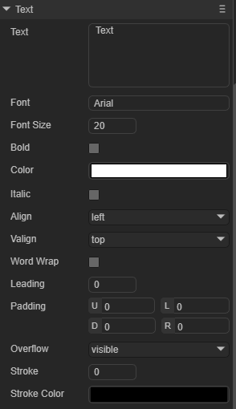

## Text组件属性介绍

Text属性继承于Sprite，是静态文本的基础组件。这里我们介绍一下Text专属的组件属性。

在IDE中，我们将Text组件添加到场景编辑的视图区后，属性面板中Text组件的专属属性如下图所示：

 

下面我们分别对这些属性进行介绍说明：

| 属性名      | 属性说明                                                     |
| ----------- | ------------------------------------------------------------ |
| text        | 文本的实际内容                                               |
| font        | 文本字体，例如：`Microsoft YaHei`，这里可以手动输入常用的字体。 |
| fontSize    | 文本字体大小，例如： `50`，直接填写正整数就行                |
| bold        | 是否为粗体，布尔值选项，默认为`false`，选择`true`可以设置字体的粗体样式 |
| color       | 文本的颜色，可以直接输入颜色值，例如：`#ffffff`，也可以点击输入条右侧的拾色器选取颜色 |
| italic      | 是否为斜体，布尔值选项，默认为`false`，选择`true`可以设置字体的斜体样式 |
| align       | 水平对齐方式，有三个选项值，分别是left（居左对齐）、center（居中对齐）、right（居右对齐） |
| valign      | 垂直对齐方式，有三个选项值 ，分别的top（居顶对齐）、middle（居中对齐）、bottom（居底对齐） |
| wordWrap    | 是否自动换行，布尔值选项，默认为`false`，选择`true`可以开启自动换行。 |
| leading     | 垂直行间距，当开启自动换行时，文本内容多行时有效。间距以像素为单位，输入正整数即可，如：`10` |
| padding     | 文本边距，以像素为单位，由4个整数值组成，逗号间隔，例如：`10,10,10,10`分别代表上右下左的边距 |
| overflow    | 文本溢出处理，共有三种模式。visible（默认模式）：不进行任何裁切。hidden:不显示超出文本域的字符。scroll:不显示文本域外的字符像素，并且支持scroll接口。 |
| stroke      | 描边宽度。                                                   |
| strokecolor | 描边颜色。                                                   |

