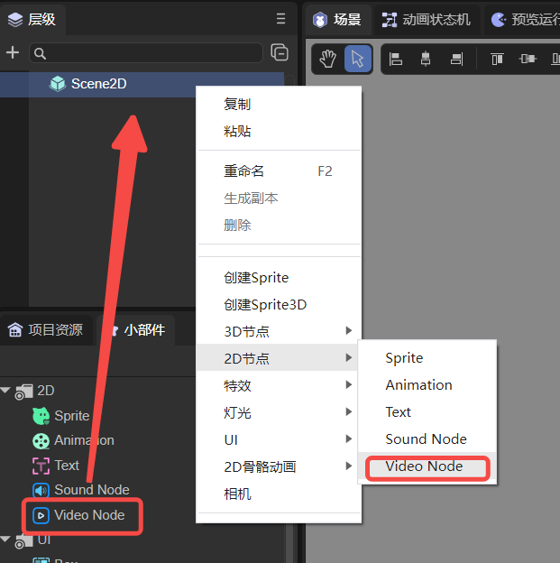
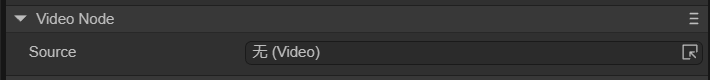

# 视频节点(VideoNode)

## 1. LayaAir IDE中使用视频节点

### 1.1 创建VideoNode

如图1-1所示，可以在`层级`窗口中右键进行创建，也可以从`小部件`窗口中拖拽添加。



（图1-1）


### 1.2 属性介绍

在IDE中，将VideoNode节点添加到场景编辑的视图区后，属性面板中VideoNode的专属属性如下图所示： 



（图1-2）

它只有一个Source属性，将视频文件添加到Source中即可。


### 1.3 脚本控制VideoNode

在1.2节中，将视频文件添加到Source后，是无法自动播放的，需要用代码进行控制。在Scene2D的属性设置面板中，增加一个自定义组件脚本。然后，将VideoNode拖入到其暴露的属性入口中。下面给出一个示例代码，实现脚本控制VideoNode：

```typescript
const { regClass, property } = Laya;

@regClass()
export class NewScript extends Laya.Script {

    @property({ type: Laya.VideoNode })
    public video: Laya.VideoNode;

    constructor() {
        super();
    }

    // 组件被激活后执行，此时所有节点和组件均已创建完毕，此方法只执行一次
    onAwake(): void {
        // 鼠标点击触发播放
        Laya.stage.on(Laya.Event.MOUSE_DOWN, () => {
            Laya.loader.load("resources/layaAir.mp4").then(() => {
                this.video.play(); //播放视频
            });
        })
    }
}
```

如果是在LayaAir IDE中运行，则VideoNode无需通过事件触发播放。但是在Chrome中，自动播放只允许**静音自动播放**。只有用户进行交互（单击、双击等）后，才允许自动播放声音。


# 2. 代码创建VideoNode

如果不想让VideoNode节点一开始就在舞台上，而是在要用的时候才添加，这就要通过代码来创建了。在Scene2D的属性设置面板中，增加一个自定义组件脚本，示例代码如下：

```typescript
const { regClass, property } = Laya;

@regClass()
export class NewScript extends Laya.Script {
    //declare owner : Laya.Sprite3D;

    constructor() {
        super();
    }

    /**
     * 组件被激活后执行，此时所有节点和组件均已创建完毕，此方法只执行一次
     */
    onAwake(): void { 
        let video = new Laya.VideoNode;
        //添加到舞台
        Laya.stage.addChild(video);
        video.pos(200,200); //设置位置
        video.source = "resources/layaAir.mp4"; //设置视频源文件
        video.play(); //开始播放
    }
}
```

