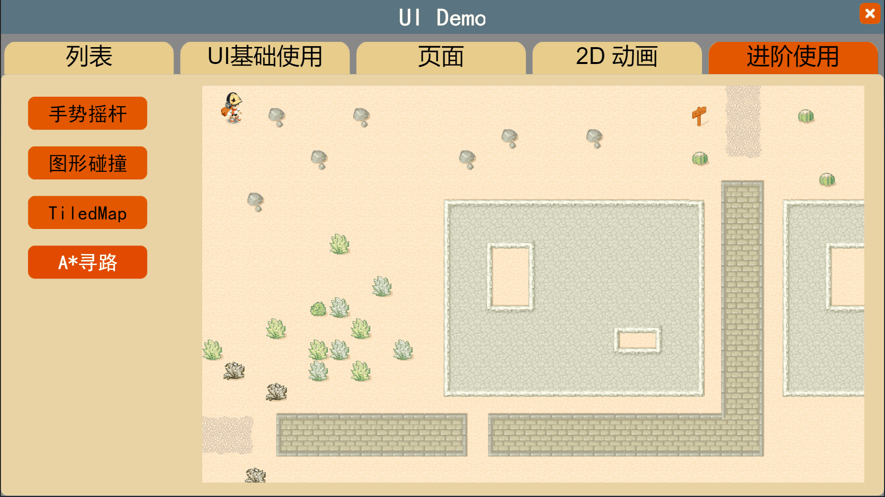

# 3D寻路


## 一、概述

本篇将讲解3D场景的寻路问题，以动图1-1为参考示例，我们来讲解3D场景中寻路和移动时需要考虑的问题

 

（动图1-1）

在动图1-1的场景中，有几个LayaBox贴图的盒子作为角色移动的目标点，每次鼠标点击一下地面，角色开始移动到下一个盒子目标点。在移动过程中，地形有高有低，也有不同的障碍物，说明有些地方是不可以行走的，因此需要用过A*算法找到最短行走路线。那么基本上本示例已经覆盖了3D场景中的地形，角色移动，寻路等所涉及的问题，我们列举有如下几点， 接下来我们会分别介绍这几点

- **A*寻路**

- **地形处理**

- **角色移动**


## 二、A*寻路

在LayaAir3.0引擎的2D入门示例中，如图2-1所示，有一个2D的A*寻路的示例，开发者也可以先通过此示例来了解2D项目中是怎么使用的，如动图2-2所示

 

（图2-1）


 

（动图2-2）


### 2.1 A*算法

A*算法的工作原理是怎样的，在这里就不做介绍了，开发者可以从网上搜索算法的具体实现方式。简单来说，A *算法是一种很常用的路径查找和图形遍历算法。它有较好的性能和准确度。

要想使用A*作为寻路的方案，首先需要到 https://github.com/bgrins/javascript-astar 官网下载 [astar.js](https://github.com/bgrins/javascript-astar/blob/master/astar.js)

然后把 astar.js 放到项目的bin目录中，并在 index.html 里引入，如下所示

```typescript
	<script type="text/javascript" src="astar.js"></script>
```


### 2.2 A*代码中使用

添加好A*类库之后，我们来看看代码中是怎么使用的

先来看一个最基本的A*代码示例

```typescript
	var graph = new Graph([
		[1,1,1,1],
		[0,1,1,0],
		[0,0,1,1]
	]);
    var start = graph.grid[0][0];
    var end = graph.grid[1][2];
    var result = astar.search(graph, start, end);
    // result is an array containing the shortest path
```

1，`graph` 是A*类中的地形数据类，数据中1表示可以通过的地块，0表示不可以通过的地块，因此这个数据表明了角色的可行走和不可行走节点，同理复杂的场景地形也可以划分出单位长度的地块，来作为角色行走的区域数据

2，`start` 是起始点坐标

3，`end` 是终点坐标

4，astar 是A*算法类，用来计算从起点到终点的最短路线

5，result 是通过A*算法类，计算出来的结果，是一个数组，按顺序存放每个坐标点

可以看到，A*的代码使用是比较简单的


### 2.3 地形数据导入

对于复杂场景中可行走的地块数据，我们不可能在代码中用数组的形式来标记每一个节点的信息，这样做太庞大了，因此可以通过一张只具有黑白两色的图来制作，并通过代码来转换成地图数据

如图2-3所示，此图只有64x64像素，可以存放4096个地块信息，白色代表可以行走的区域，黑色代表不可以行走的区域

 

（图2-3） 

通过下面代码，可以读取此图，并将颜色值放到数组中

```typescript
    /**
     * 通过图片数据计算得到AStart网格
     */
    private createGridFromAStarMap(texture): any {
        var textureWidth = texture.width;
        var textureHeight = texture.height;
        var pixelsInfo = texture.getPixels();
        var aStarArr = [];
        var index = 0;
        for (var w = 0; w < textureWidth; w++) {
            var colaStarArr = aStarArr[w] = [];
            for (var h = 0; h < textureHeight; h++) {
                var r = pixelsInfo[index++];
                var g = pixelsInfo[index++];
                var b = pixelsInfo[index++];
                var a = pixelsInfo[index++];
                if (r == 255 && g == 255 && b == 255 && a == 255)
                    colaStarArr[h] = 1;
                else {
                    colaStarArr[h] = 0;
                }
            }
        };
        return aStarArr;
    }
```

再通过下面的代码，可以初始化A*的地图数据

```typescript
//读取地形图
this.aStarMap = Loader.getTexture2D("res/threeDimen/scene/TerrainScene/Assets/AStarMap.png");
//获得地图数据
var aStarArr = this.createGridFromAStarMap(this.aStarMap);
//使用astar初始化地图数据
this.graph = new (window as any).Graph(aStarArr);
this.opts = [];
this.opts.closest = true;
this.opts.heuristic = (window as any).astar.heuristics.diagonal;
```


### 2.4 获得最短路径

每次鼠标点击地面时，通过鼠标事件发起获得最短路径的调用：

```typescript
//设置鼠标弹起事件响应
Laya.stage.on(Event.MOUSE_UP, this, function (): void {
    //起始和目标点
    var start = this.graph.grid[this.startPoint.x][this.startPoint.y];
    var end = this.graph.grid[this.endPoint.x][this.endPoint.y];
    //调用A* serach方法获得最短路径
    this._everyPath = (window as any).astar.search(this.graph, start, end, {
        closest: this.opts.closest
    });
}
```

到此，A*寻路从配置类库，初始化地图数据，指定起始目标点坐标，获得最短路径等方法都已经介绍了，下面来看看场景中对于高低地形的处理


## 三、地形处理

在制作3D场景过程中，我们往往是通过一张预先渲染好的灰度图来创建地形建模的，在这里就不介绍地形的创建过程了。有了地形的模型，是无法让角色自动在地形上行走的，我们需要获得地形的数据，才能通过A*算法之后，让角色在真实的坐标位置上移动。


### 3.1 高度图

地形上每个点的高度被表示为一个矩阵中的一列值。这个矩阵可以用一个被称为高度图（`heightmap`）的灰度图来表示。灰度图是一种使用二维图形来表示三维的高度变化的图片。近黑色的、较暗的颜色表示较低的点，接近白色的、较亮的颜色表示较高的点。

 

（图3-1） 

如图3-1所示，左上角接近纯黑色，为地形的最低点，右下角为接近纯白色，为地形最高点，对应场景地图如图3-2所示

 

（图3-2）  

有了高度图和地形模型，我们来看看在Laya中是如何获得地形数据的


### 3.2 **网格地形3D精灵 `MeshTerrainSprite3D`**

Laya引擎中，网格地形3D精灵类 `MeshTerrainSprite3D` 可以从网格创建一个 `TerrainMeshSprite3D` 实例，来读取高度图的属性。

```typescript
	/**
	 * 从网格创建一个TerrainMeshSprite3D实例、图片读取高度图属性。
	 * @param mesh 网格。
	 * @param image 高度图。
	 * @param name 名字。
	 * @returns 地形渲染节点
	 */
	static createFromMeshAndHeightMap(mesh: Mesh, texture: Texture2D, minHeight: number, maxHeight: number, name: string = null): MeshTerrainSprite3D {
		var meshTerrainSprite3D: MeshTerrainSprite3D = new MeshTerrainSprite3D(mesh, null, name);
		meshTerrainSprite3D._initCreateFromMeshHeightMap(texture, minHeight, maxHeight);
		return meshTerrainSprite3D;
	}
```

`mesh`：整个地形的网络数据

`texture`：是地形高度图

`minHeight`：最低高度

`maxHeight`： 最高高度

最终得到 `MeshTerrainSprite3D` 对象，用来存放地形的高度数据

在代码中，是这样使用的：

```typescript
//读取高度图
var heightMap = Loader.getTexture2D("res/threeDimen/scene/TerrainScene/Assets/HeightMap.png");
//初始化MeshTerrainSprite3D
this.terrainSprite = MeshTerrainSprite3D.createFromMeshAndHeightMap((<Mesh>meshSprite3D.meshFilter.sharedMesh), heightMap, 6.574996471405029, 10.000000953674316);
```


### 3.3 更新世界矩阵

```typescript
//更新terrainSprite世界矩阵(为可行走区域世界矩阵)
this.terrainSprite.transform.worldMatrix = meshSprite3D.transform.worldMatrix;
```

把场景模型的世界矩阵赋值到 `MeshTerrainSprite3D` 对象中，从而初始化地形的x，z轴数据


### 3.4 得到整数的网格索引

通过地形x，z轴的坐标点，获得地图上的地块坐标点

```typescript
    /**
    * 得到整数的网格索引
    */
    private getGridIndex(x: number, z: number, out: Vector2) {
        var minX = this.terrainSprite.minX;
        var minZ = this.terrainSprite.minZ;
        var cellX = this.terrainSprite.width / this.aStarMap.width;
        var cellZ = this.terrainSprite.depth / this.aStarMap.height;
        var gridX = Math.floor((x - minX) / cellX);
        var gridZ = Math.floor((z - minZ) / cellZ);
        var boundWidth = this.aStarMap.width - 1;
        var boundHeight = this.aStarMap.height - 1;
        (gridX > boundWidth) && (gridX = boundWidth);
        (gridZ > boundHeight) && (gridZ = boundHeight);
        (gridX < 0) && (gridX = 0);
        (gridZ < 0) && (gridZ = 0);
        out.x = gridX;
        out.y = gridZ;
    }
```

A*算法的搜索最短路径时，是需要传入起始点和目标点坐标的，因此通过调用 getGridIndex 方法来获得地块坐标点

```typescript
//调用getGridIndex方法，得到网格索引
this.getGridIndex(this.path[this.curPathIndex % this.pointCount].x, this.path[this.curPathIndex++ % this.pointCount].z, this.startPoint);
this.getGridIndex(this.path[this.nextPathIndex % this.pointCount].x, this.path[this.nextPathIndex++ % this.pointCount].z, this.endPoint);
//初始化start,end坐标点
var start = this.graph.grid[this.startPoint.x][this.startPoint.y];
var end = this.graph.grid[this.endPoint.x][this.endPoint.y];
```


### 3.5 得到世界坐标系下的真实坐标

通过起始点和A*算法搜索到的最短路径，得到地形的真实坐标数组，用于角色的每一个行走世界坐标

```typescript
    /**
     * 得到世界坐标系下的真实坐标
     */
    private getRealPosition(start, path): any {
        this.resPathLength = path.length;
        var minX = this.terrainSprite.minX;
        var minZ = this.terrainSprite.minZ;
        var cellX = this.terrainSprite.width / this.aStarMap.width;
        var cellZ = this.terrainSprite.depth / this.aStarMap.height;
        var halfCellX = cellX / 2;
        var halfCellZ = cellZ / 2;

        this.resPath[0].x = start.x * cellX + halfCellX + minX;
        this.resPath[0].y = start.y * cellZ + halfCellZ + minZ;

        if (this.resPath.length < path.length) {
            var diff: number = path.length - this.resPath.length;
            for (var j: number = 0; j < diff; ++j) {
                var newPoint: Vector2 = new Vector2();
                this.resPath.push(newPoint);
            }

        }

        for (var i = 1; i < path.length; i++) {
            var gridPos = path[i];
            this.resPath[i].x = gridPos.x * cellX + halfCellX + minX;
            this.resPath[i].y = gridPos.y * cellZ + halfCellZ + minZ;
        }
        return 0;
    }
```


### 3.6 初始化目标点

在场景中放了几个立方体盒子作为角色的行走目标点，当点击鼠标后，角色会从当前目标点移动到下一个目标点，path数组用来存放所有目标点的坐标

```typescript
private initPath(scene: Scene3D): void {
    for (var i: number = 0; i < this.pointCount; i++) {
    var str: string = "path" + i;
   this.path.push(((<MeshSprite3D>scene.getChildByName('Scenes').getChildByName('Area').getChildByName(str))).transform.localPosition);
    }
}
```


## 四、角色移动

角色移动，实际上就是在间隔很短的时间内，改变角色的位置。在我们的示例中，是通过每40毫秒来循环检查角色行走路线，通过Tween来执行角色位置改变的

```typescript
    //开启定时重复执行
    Laya.timer.loop(40, this, this.loopfun);

    private loopfun(): void {
    	//resPath，角色需要移动的每个世界坐标位置数组
        if (this.resPath && this.index < this.resPathLength) {
            //AStar寻路位置
            this._position.x = this.resPath[this.index].x;
            this._position.z = this.resPath[this.index++].y;
            //HeightMap获取高度数据
            this._position.y = this.terrainSprite.getHeight(this._position.x, this._position.z);
            if (isNaN(this._position.y)) {
                this._position.y = this.moveSprite3D.transform.position.y;
            }

            this._tarPosition.x = this._position.x;
            this._tarPosition.z = this._position.z;
            this._tarPosition.y = this.moveSprite3D.transform.position.y;

            //调整方向
            this.layaMonkey.transform.lookAt(this._tarPosition, this._upVector3, false);
            //因为资源规格，这里需要旋转180度
            this.layaMonkey.transform.rotate(this._rotation2, false, false);
            //调整位置
            Tween.to(this._finalPosition, { x: this._position.x, y: this._position.y, z: this._position.z }, 40);
            this.moveSprite3D.transform.position = this._finalPosition;
        }
    }
```

到此，我们已经为角色在场景中的地形数据，寻路算法，角色移动等做好了准备工作，通过下面完整的代码示例，就可以实现3D场景的寻路过程，开发者可以通过下面的代码进一步了解。


## 五、最终代码


```typescript
/**
 * Based upon https://github.com/bgrins/javascript-astar
 */
export class AStarFindPath {

    private terrainSprite: MeshTerrainSprite3D;
    private layaMonkey: Sprite3D;
    private path: Vector3[];
    private _everyPath: any[];
    private _position: Vector3 = new Vector3(0, 0, 0);
    private _upVector3: Vector3 = new Vector3(0, 1, 0);
    private _tarPosition: Vector3 = new Vector3(0, 0, 0);
    private _finalPosition: Vector3 = new Vector3(0, 0, 0);
    private _rotation: Vector3 = new Vector3(-45, 180, 0);
    private _rotation2: Vector3 = new Vector3(0, 180, 0);
    private index: number = 0;
    private curPathIndex: number = 0;
    private nextPathIndex: number = 1;
    private moveSprite3D: Sprite3D;
    private pointCount: number = 10;
    private scene: Scene3D;

    //寻路使用的变量
    private aStarMap: any;
    private graph: any;
    private opts: any;
    private resPath: Array<Vector2> = new Array<Vector2>();
    private resPathLength: number;

    private startPoint: Vector2;
    private endPoint: Vector2;
    constructor() {
        //初始化引擎
        Laya3D.init(0, 0);
        Laya.stage.scaleMode = Stage.SCALE_FULL;
        Laya.stage.screenMode = Stage.SCREEN_NONE;
        //显示性能面板
        Stat.show();

        this.path = [];
        this.startPoint = new Vector2();
        this.endPoint = new Vector2();
        for (var i: number = 0; i < 20; ++i) {
            var newVec: Vector2 = new Vector2();
            this.resPath.push(newVec);
        }

        //预加载所有资源
        var resource: ILoadURL[] = [{ url: "res/threeDimen/scene/TerrainScene/XunLongShi.ls", priority: 1 },
        { url: "res/threeDimen/skinModel/LayaMonkey/LayaMonkey.lh", priority: 1 },
        { url: "res/threeDimen/scene/TerrainScene/Assets/HeightMap.png", priority: 1, constructParams: [1024, 1024, 1, false, true] },
        { url: "res/threeDimen/scene/TerrainScene/Assets/AStarMap.png", priority: 1, constructParams: [64, 64, 1, false, true] }
        ];

        Laya.loader.load(resource, Handler.create(this, this.onLoadFinish));
    }

    private onLoadFinish(): void {
        //初始化3D场景
        this.scene = (<Scene3D>Laya.stage.addChild(Loader.createNodes("res/threeDimen/scene/TerrainScene/XunLongShi.ls")));

        //根据场景中方块生成路径点
        this.initPath(this.scene);

        //获取可行走区域模型
        var meshSprite3D: MeshSprite3D = (<MeshSprite3D>this.scene.getChildByName('Scenes').getChildByName('HeightMap'));
        //使可行走区域模型隐藏
        meshSprite3D.active = false;
        var heightMap = Loader.getTexture2D("res/threeDimen/scene/TerrainScene/Assets/HeightMap.png");
        //初始化MeshTerrainSprite3D
        this.terrainSprite = MeshTerrainSprite3D.createFromMeshAndHeightMap((<Mesh>meshSprite3D.meshFilter.sharedMesh), heightMap, 6.574996471405029, 10.000000953674316);
        //更新terrainSprite世界矩阵(为可行走区域世界矩阵)
        this.terrainSprite.transform.worldMatrix = meshSprite3D.transform.worldMatrix;

        //读取墙壁的数据
        this.aStarMap = Loader.getTexture2D("res/threeDimen/scene/TerrainScene/Assets/AStarMap.png");

        //使用astar组织数据
        var aStarArr = this.createGridFromAStarMap(this.aStarMap);
        this.graph = new (window as any).Graph(aStarArr);
        this.opts = [];
        this.opts.closest = true;
        this.opts.heuristic = (window as any).astar.heuristics.diagonal;

        //初始化移动单元
        this.moveSprite3D = (<Sprite3D>this.scene.addChild(new Sprite3D()));
        this.moveSprite3D.transform.position = this.path[0];


        //初始化小猴子
        this.layaMonkey = (<Sprite3D>this.moveSprite3D.addChild(Loader.createNodes("res/threeDimen/skinModel/LayaMonkey/LayaMonkey.lh")));

        var tmpLocalScale: Vector3 = this.layaMonkey.transform.localScale;
        tmpLocalScale.setValue(0.5, 0.5, 0.5);
        var aniSprite3d: Sprite3D = (<Sprite3D>this.layaMonkey.getChildAt(0));

        //获取动画组件
        var animator: Animator = (<Animator>aniSprite3d.getComponent(Animator));
        //创建动作状态
        var state: AnimatorState = new AnimatorState();
        //动作名称
        state.name = "run";
        //动作播放起始时间
        state.clipStart = 40 / 150;
        //动作播放结束时间
        state.clipEnd = 70 / 150;
        //设置动作
        state.clip = animator.getDefaultState().clip;
        //为动画组件添加一个动作状态
        animator.getControllerLayer(0).addState(state);
        //播放动画
        animator.play("run");

        //创建BlinnPhong材质
        var mat: BlinnPhongMaterial = (<BlinnPhongMaterial>((<SkinnedMeshSprite3D>this.layaMonkey.getChildAt(0).getChildAt(0))).skinnedMeshRenderer.sharedMaterial);
        //设置反照率强度
        mat.albedoIntensity = 8;
        //设置猴子精灵的位置
        this.layaMonkey.transform.position.cloneTo(this._finalPosition);

        //初始化相机
        var moveCamera: Camera = (<Camera>this.moveSprite3D.addChild(new Camera()));
        var tmpLocalPosition: Vector3 = moveCamera.transform.localPosition;
        tmpLocalPosition.setValue(-1.912066, 10.07926, -10.11014);
        moveCamera.transform.localPosition = tmpLocalPosition;
        moveCamera.transform.rotate(this._rotation, true, false);
        moveCamera.addComponent(CameraMoveScript);

        //设置鼠标弹起事件响应
        Laya.stage.on(Event.MOUSE_UP, this, function (): void {
            this.index = 0;
            //获取每次生成路径
            this.getGridIndex(this.path[this.curPathIndex % this.pointCount].x, this.path[this.curPathIndex++ % this.pointCount].z, this.startPoint);
            this.getGridIndex(this.path[this.nextPathIndex % this.pointCount].x, this.path[this.nextPathIndex++ % this.pointCount].z, this.endPoint);
            var start = this.graph.grid[this.startPoint.x][this.startPoint.y];
            var end = this.graph.grid[this.endPoint.x][this.endPoint.y];

            this._everyPath = (window as any).astar.search(this.graph, start, end, {
                closest: this.opts.closest
            });
            if (this._everyPath && this._everyPath.length > 0) {
                this.getRealPosition(start, this._everyPath);
            }
        });
        //开启定时重复执行
        Laya.timer.loop(40, this, this.loopfun);
    }

    private loopfun(): void {
        if (this.resPath && this.index < this.resPathLength) {
            //AStar寻路位置
            this._position.x = this.resPath[this.index].x;
            this._position.z = this.resPath[this.index++].y;
            //HeightMap获取高度数据
            this._position.y = this.terrainSprite.getHeight(this._position.x, this._position.z);
            if (isNaN(this._position.y)) {
                this._position.y = this.moveSprite3D.transform.position.y;
            }

            this._tarPosition.x = this._position.x;
            this._tarPosition.z = this._position.z;
            this._tarPosition.y = this.moveSprite3D.transform.position.y;

            //调整方向
            this.layaMonkey.transform.lookAt(this._tarPosition, this._upVector3, false);
            //因为资源规格,这里需要旋转180度
            this.layaMonkey.transform.rotate(this._rotation2, false, false);
            //调整位置
            Tween.to(this._finalPosition, { x: this._position.x, y: this._position.y, z: this._position.z }, 40);
            this.moveSprite3D.transform.position = this._finalPosition;
        }
    }

    private initPath(scene: Scene3D): void {
        for (var i: number = 0; i < this.pointCount; i++) {
            var str: string = "path" + i;
            this.path.push(((<MeshSprite3D>scene.getChildByName('Scenes').getChildByName('Area').getChildByName(str))).transform.localPosition);
        }
    }

    /**
    * 得到整数的网格索引
    */
    private getGridIndex(x: number, z: number, out: Vector2) {
        var minX = this.terrainSprite.minX;
        var minZ = this.terrainSprite.minZ;
        var cellX = this.terrainSprite.width / this.aStarMap.width;
        var cellZ = this.terrainSprite.depth / this.aStarMap.height;
        var gridX = Math.floor((x - minX) / cellX);
        var gridZ = Math.floor((z - minZ) / cellZ);
        var boundWidth = this.aStarMap.width - 1;
        var boundHeight = this.aStarMap.height - 1;
        (gridX > boundWidth) && (gridX = boundWidth);
        (gridZ > boundHeight) && (gridZ = boundHeight);
        (gridX < 0) && (gridX = 0);
        (gridZ < 0) && (gridZ = 0);
        out.x = gridX;
        out.y = gridZ;
    }

    /**
     * 得到世界坐标系下的真实坐标
     */
    private getRealPosition(start, path): any {
        this.resPathLength = path.length;
        var minX = this.terrainSprite.minX;
        var minZ = this.terrainSprite.minZ;
        var cellX = this.terrainSprite.width / this.aStarMap.width;
        var cellZ = this.terrainSprite.depth / this.aStarMap.height;
        var halfCellX = cellX / 2;
        var halfCellZ = cellZ / 2;

        this.resPath[0].x = start.x * cellX + halfCellX + minX;
        this.resPath[0].y = start.y * cellZ + halfCellZ + minZ;

        if (this.resPath.length < path.length) {
            var diff: number = path.length - this.resPath.length;
            for (var j: number = 0; j < diff; ++j) {
                var newPoint: Vector2 = new Vector2();
                this.resPath.push(newPoint);
            }

        }

        for (var i = 1; i < path.length; i++) {
            var gridPos = path[i];
            this.resPath[i].x = gridPos.x * cellX + halfCellX + minX;
            this.resPath[i].y = gridPos.y * cellZ + halfCellZ + minZ;
        }
        return 0;
    }

    /**
     * 通过图片数据计算得到AStart网格
     */
    private createGridFromAStarMap(texture): any {
        var textureWidth = texture.width;
        var textureHeight = texture.height;
        var pixelsInfo = texture.getPixels();
        var aStarArr = [];
        var index = 0;
        for (var w = 0; w < textureWidth; w++) {
            var colaStarArr = aStarArr[w] = [];
            for (var h = 0; h < textureHeight; h++) {
                var r = pixelsInfo[index++];
                var g = pixelsInfo[index++];
                var b = pixelsInfo[index++];
                var a = pixelsInfo[index++];
                if (r == 255 && g == 255 && b == 255 && a == 255)
                    colaStarArr[h] = 1;
                else {
                    colaStarArr[h] = 0;
                }
            }
        };
        return aStarArr;
    }
}
```


