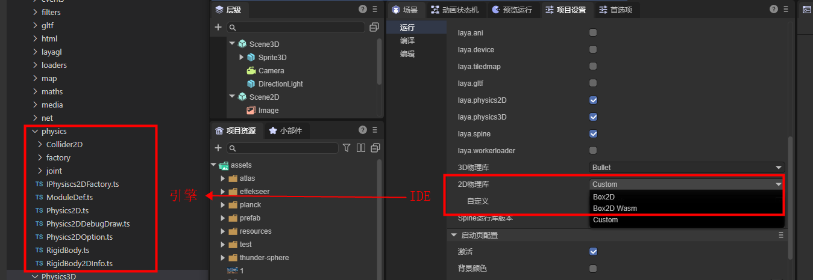
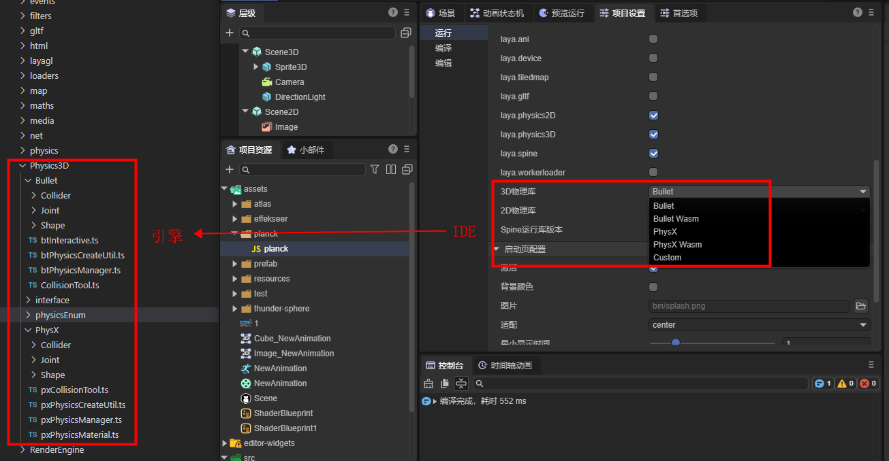
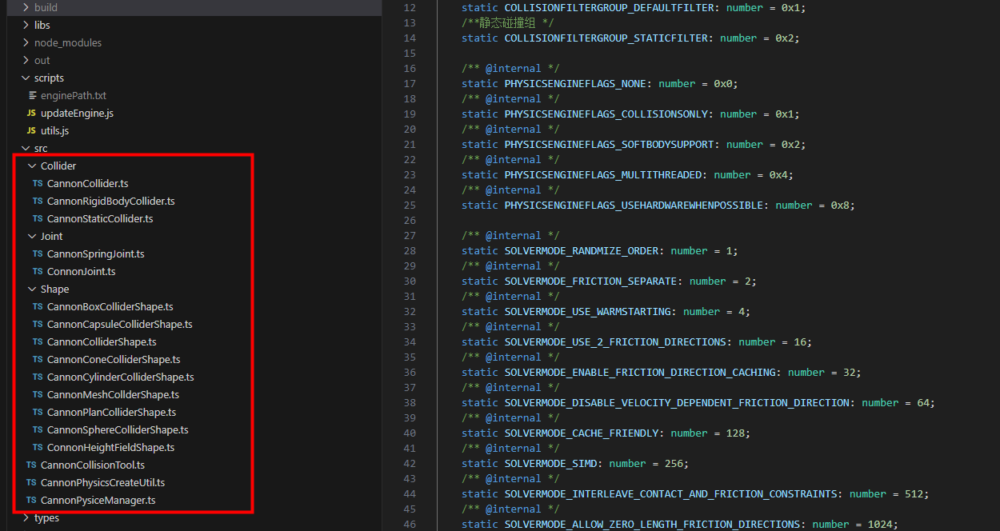

# 自定义物理引擎库

## 一、理解内置的物理引擎

### 1.1 内置物理引擎对应了哪些类

LayaAir3引擎在2D方面内置了Box2D物理引擎，对应了引擎源码Physics目录下的类，如图1-1所示：

 

(图1-1)

在3D方面内置了Bullet与PhysX物理引擎，对应了引擎源码Physics3D目录下的类，如图1-2所示。

 

 （图1-2）

### 1.2 把引擎编译为物理库

内置物理引擎，并非是直接将第三方物理引擎拿来就用。

而是要将物理引擎的接口与引擎的接口进行逐个对接，这样，我们开发者就可以通过LayaAir3引擎的物理接口，直接切换使用各种物理引擎。并且在IDE中，通过物理组件的方式，进行可视化的编辑。

而开发者，最终使用的物理引擎，是基于第三方物理引擎以及LayaAir引擎的物理对接类，整合打包后的完整物理库。

自定义物理引擎库与引擎内置的物理引擎库，对接过程上，都是同样的流程。区别仅仅是内置引擎是引擎官方开发者对接好了并内置到开源引擎中，而自定义引擎是项目开发者通过了解与参照引擎的对接流程与接口，自行与第三方物理引擎对接，并整合形成的物理引擎库。

下面，我们就通过分析引擎源码中的编译脚本，了解需要将哪些类文件编译整合为一个独立的物理引擎库。

首先，我们打开gulp脚本中的`build`任务，仅通过子任务名称，就可以清晰的看出用于复制第三方引擎库的任务`copyJsLibs`以及各种物理引擎库处理的子任务，如图2-1所示。

 

（图2-1）

如果查看任务的代码，会更加清晰的看出，`copyJsLibs`任务中通过`gulp.src()`指定要处理的文件规则，然后按这个规则把符合条件的文件通过`gulp.dest()`复制到指定的目录中去。在物理引擎库的任务代码中，也可以直观的看出，每一个LayaAir物理引擎库都是LayaAir引擎的物理引擎对接代码与第三方物理引擎JS库合并后的一个新库。

 

(图2-2)

当然，一个完整的物理引擎实现，除了对应第三方的物理引擎库之外，还是存在物理组件等基础的物理功能。这些作为物理引擎基础库来使用，2D与3D均存在物理引擎基础库，分别为`laya.physics2D.js`与`laya.physics3D.js`，如图2-3所示。

 

（图2-3）

通过分析引擎库的编译过程，我们能理解到，物理引擎分成三个部分，LayaAir引擎的物理基础与物理组件的实现、LayaAir引擎与物理引擎的适配库（对接代码）、第三方的物理引擎库。

最终，LayaAir引擎的物理基础库与物理组件的实现，形成了LayaAir引擎物理基础库，LayaAir引擎物理适配库与第三方的物理库合并成为一个完整的物理引擎库。

## 二、自定义物理引擎库的流程

理解完LayaAir内置物理引擎的结构，本小节，我们来了解开发者在自定义物理引擎库的过程中，需要做哪些工作。

> 自定义物理引擎，需要居有引擎代码的阅读和编写能力，如果无法完成自定义的对接，可以联系微信LayaAir_Engine进行商业定制

### 2.1 选择并获取第三方的物理引擎库

尽管Box2D、Bullet、PhysX这些内置的物理引擎都是国际上顶级的知名引擎。但是某些开发者也存在一些特定的需求。例如，有的项目，不需要精度很高的物理引擎，仅仅需要一些基础的物理特性，但要求引擎库比较轻量等需求。通过自定义引擎库的方式，使得这些开发者可以选用最适合项目的引擎。

例如，2D物理轻量引擎**matter.js**以及3D物理轻量引擎**cannon.js**等。

开发者可以自行从开源网站中获得这些物理引擎的源代码或编译好的引擎库。

无论是通过源码代码编译成引擎库，还是获得现成的JS引擎库，上一小节中介绍的物理引擎库的三部分之一"第三方物理引擎库"的准备工作就完成了。

### 2.2 适配第三方的物理引擎

另外的两部分，LayaAir引擎物理基础库，不需要开发者重写，直接默认使用引擎编译好的库即可。

开发者仅需要对物理引擎的适配库进行对接。为了帮助大家更方便的理解如何对接第三方的物理引擎，我们在LayaAir引擎库之外，以Cannon物理库的适配接入为例，独立开源了一个物理引擎适配库**LayaAir3Physics-Cannon**，这样可以让开发者更加简洁的理解适配的全过程。

具体的操作如下：

首先，我们通过Git克隆我们适配好的Cannon.js库的项目源码，地址为：https://github.com/layabox/LayaAir3Physics-Cannon.git

源码项目克隆到本地之后，我们根据 [开源使用文档（README.zh-CN.md）](https://github.com/layabox/LayaAir3Physics-Cannon/blob/master/README.zh-CN.md) 来配置好项目的编译环境。

在这个项目源码中，`src`目录下就没那么复杂了，这里只包括了物理引擎适配的代码。如图3-1所示：

 

(图3-1)

当我们阅读和理解完了`src`下的适配源码，我们可以用此源码作为参照，适配其它的物理引擎库。

在适配的过程中，有一点需要重点提醒一下。如果开发者需要在场景初始化流程插入自己的初始化流程，例如有些物理引擎使用了wasm，需要在初始化阶段去下载资源，那么就需要使用`Laya.addBeforeInitCallback()`来注册方法，代码使用示例如图3-2所示。

  

(图3-2)

### 2.3 合并为完整的物理引擎库

完成适配工作后，开发者可以参照Cannon适配源码中的gulp脚本，将物理引擎适配源码编译，然后与第三方的物理引擎库合并为一个独立的物理引擎库。

在cannon适配源码中，我们可以参照gulp脚本中的build流程，进行分析需要做哪些工作。

这里我们仍然以Cannon源码项目为例，重点描述一下，需要做哪几块工作。

第一，开发者把获取的第三方物理引擎库放到libs目录下，

本例中的`cannon.js`就是第三方物理引擎的原始库文件，如图3-3所示，开发者可以修改gulp替换为自己的第三方物理引擎库。

 

（图3-3）

第二，适配完成后，修改gulp脚本中的适配库生成文件名，将laya.cannon替换为自己的物理引擎库名称，然后执行脚本。脚本会自动完成编译以及引擎库的合并与输出工作。

## 三、使用自定义物理引擎库

合并完成后的引擎库可以放到IDE的资源面板下的assets目录下，

然后对于`2D引擎库`或`3D引擎库`选项，先设置`自定义（Custom）`，然后拖拽自定义的物理引擎库文件到自定义的输入框中，如图4-1所示：

 

至此，

自定义引擎的基础流程已介绍完毕。