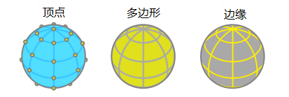
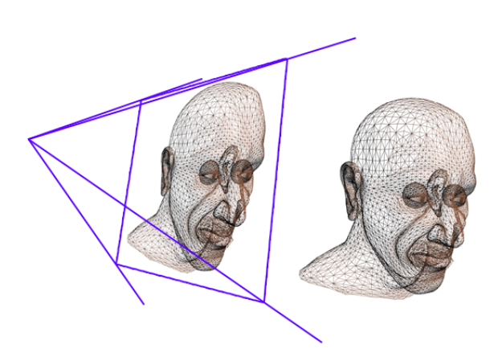
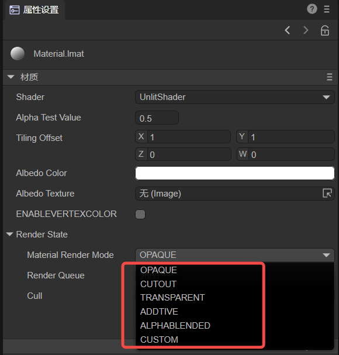

# 一篇学会自定义Shader


本篇文档属于LayaAir引擎3D使用的进阶性文档，在阅读前需要具备3D顶点、法线、UV等通用的3D基础知识，如果涉及到不理解的名词，请先阅读相关的基础概念文档。

## 一、Shader基础知识

### 1.1 Shader是什么？

Shader 中文名为着色器， Shader本质上是一段采用GLSL着色语言编写在GPU上运行的程序 ， 用于告诉图形软件如何计算和输出图像。小到每一个像素，大到整个屏幕。

> 着色语言好几种，LayaAir引擎基于webGL，只能用GLSL语言。

Shader主要分两类：顶点着色器Vertex Shader和片段着色器Fragment Shader（也叫片元着色器） 。

#### 1.1.1 顶点着色器Vertex Shader

顶点着色器是用来处理顶点数据的程序，如顶点坐标、法线、颜色和纹理坐标。 

它在每个顶点上调用，可将几何图形（例如：三角形）从一个位置转换为另一个位置， 例如，用于顶点变换、纹理坐标生成、 纹理坐标变换等等。 

由于3D图形是一个个三角面片组成的，所以，顶点Shader要计算每个三角面片上的顶点，并为最终的像素渲染做准备。

#### 1.1.2 片段着色器Fragment Shader

片段着色器用来计算和填充每个像素的颜色，所以也称为像素着色器。可用于插值的运算、 纹理存取、纹理应用 、 雾 、 色彩计算等。

对于由图元覆盖的像素的每个样本，都会生成“片段”。每个片段都有一个“窗口空间”位置以及其他一些值，并且它包含来自上一个“顶点处理”阶段的所有内插的每个顶点输出值。片段着色器的输出是深度值，可能的模板值（片段着色器未修改）以及可能会写入当前帧缓冲区中的缓冲区的零个或多个颜色值。片段着色器将单个片段作为输入，并生成单个片段作为输出。

### 1.2 LayaAir引擎的Shader

#### 1.2.1 结构与组成

LayaAir引擎中的Shader主要是围绕着.shader文件为核心，在引擎核心中.shader文件是Shader3D类对象抽象为文本化表示的结果，在选择不同的Shader效果会生成不同的.shader文件，这些.shader文件成为模型材质各不相同的核心因素。

如何创建.shader文件？

在项目资源窗口右键菜单栏 -> 选择创建 -> 选择着色器（如图1-1所示），有五种内置Shader可选。


（图1-1）

#### 1.2.2 应用范围

LayaAir引擎中的Shader的应用主要体现在对不同物体的材质效果表达，通过对不同Shader的选择，物体的材质随之改变形成了各不相同的效果。

LayaAir引擎内置的默认Shader有：BlinnPhong（布林冯），Unlit（不受光），PBR（基于物理渲染），Particle（粒子），PostProcess（后期处理）。
## 2.如何自定义Shader
### 2.1 Mesh中常见的属性
> polygon这个词来自希腊语，由poly(很多)和gnow(角)组成，根据定义，多边形是指以线段为界的封闭平面图形

在不同的3D软件或游戏引擎中我们可以找到最基本的常见3D物体：球体，圆柱体，胶囊体，方块，这些基本的3D物体由若干的多边形组合而成，这些3D物体的形状不相同，但性质相似，它们都存在顶点、法线、UV坐标、顶点颜色等属性，这些都存储在定义为Mesh的数据结构中。我们可以在一个Shader中独立访问所有的这些属性，并将它们保存在一些常见的数据结构中，例如Vector，这样是很好的，因为我们可以修改他们的数值，从而产生令人兴奋的效果。

下图2-1展示的是顶点、多边形、边缘的可视化三种形态，



（图2-1）

接下来单独介绍Mesh数据结构中常见的属性：

- 顶点 

顶点是什么？顶点是三角形中两条边相交的点，因此每个三角形都由三个顶点组成，所以一个最基本的三角形片元拥有三个顶点，

下图2-2展示的是物体对象的transform和物体顶点坐标的可视化形态。


（图2-2）

- 法线

假设我们有一张空白的纸，我们让一个朋友在纸的正面画画。如果两侧相等，我们如何确定哪一个是空白页的正面？这就是法线存在的原因。法线对应于多边形曲面上的垂直向量，用于确定面或顶点的方向或方向。

在3D软件中我们可以选择可视化顶点的法线，它可以让我们看到顶点在空间中的位置，

下图2-3展示的是物体对象的法线可视化的结果。


（图2-3）

- UV坐标

纹理坐标，也称UV坐标，映射了纹理的宽度和高度；在UV坐标上定位顶点的过程称为“UV映射”。这是一个创建、编辑和组织显示为对象网格的平面二维表示的UV的过程。在我们的着色器中，我们可以访问此属性，以在三维模型上定位纹理或在其中保存信息，图2-4展示了Mesh和UV坐标的形态关系。


（图2-4）

UV坐标的面积等于0.0f到1.0f的范围，其中0.0f表示起点，1.0表示终点，下图2-5展示了UV坐标的可视化表达。


（图2-5）

- VertexColor

当我们从 3D 软件中导出对象时，软件会为要受影响的对象分配颜色，通过照明或复制另一种颜色。 这种颜色称为顶点颜色，默认情况下对应于白色，在 RGBA 通道中具有值“1.0”。

### 2.2 规则说明

`Shader3D Start/End` Shader文件头/尾

用于声明渲染pass，渲染状态、材质参数等参数

```typescript
 Shader3D Start
{
	//此处填写Shader渲染pass、渲染状态、材质参数等属性
}
Start3D End
```

` name ` Shader名称

用于解释该Shader的名称，区别不同的Shader的功能与效果

```typescript
Shader3D Start
{
	//此处ShaderName为Shader的名字，非.shader文件名字，实际为Shader3D对象的名称
	name: ShaderName 
}
Shader3D End
```

`type` Shader类型

目前LayaAir仅支持Shader3D类型，考虑后续支持Compute Shader等高级Shader类型

```typescript
Shader3D Start
{
	type:Shader3D
}
Shader3D End
```

## 3.uniformMap

Uniform是一种从CPU中的应用向GPU中的着色器发送数据的方式，但uniform和顶点属性有些不同。首先，uniform是全局的(Global)。全局意味着uniform变量必须在每个着色器程序对象中都是独一无二的，而且它可以被着色器程序的任意着色器在任意阶段访问。第二，无论你把uniform值设置成什么，uniform会一直保存它们的数据，直到它们被重置或更新。

UniformMap则是存储这样一堆Uniform变量的数据结构，通过组合的形式更直观的让开发者了解到在Shader中所使用到的Uniform变量。

#### 3.1 Uniform常见变量类型

Uniform变量的常见类型：Texture2D，Color，Vector2，Vector3，Vector4，Bool，Float，Matrix4x4，TextureCube

`Texture2D`用于2D纹理采样的图片类型，图片本地支持格式：JPG，PNG

`Color` 颜色类型，为四个Float类型组成的向量值，单位为0-1范围的RGB值变量

`Vector2` 向量2类型，多用于2D的坐标位置表示，常用于UV坐标和屏幕坐标

`Vector3`向量3类型，最常用的3D坐标位置表示，三个分量xyz表达3D空间中的具体位置

`Vector4` 向量4类型，多用于齐次化3D空间的坐标位置表示

`Bool` 布尔类型

`Float`浮点类型

`Matrix4X4` 4X4齐次矩阵

`TextureCube` 用于3D纹理采样的图片类型，图片本地支持格式：PNG，JPG，HDR

```typescript
Shader3D Start
{
	//联动上面2.2节提到的属性(name, type)
	type: Shader3D
	name: ExampleShader
	uniformMap : {
		u_Color : {type: Color, default:[1,1,1,1]},
		u_MainTex : {type: Texture, default: "white"},
		u_SampleTexcoord : {type: Vector2, default:[1,1]},
		u_LightDir : {type: Vector3, default:[1,1,1]},
		u_vecPos : {type:Vector4, default:[1,1,1,1]},
		u_isWebGL2 : {type: bool, default: true},
		u_spend : {type:float, default:1.0},
		u_SkyMap : {type:TextureCube, defalue: "black"}
		u_defaultMat : {type:Matrix4x4, default:[
		1,0,0,0
		0,1,0,0,
		0,0,1,0,
		0.0,0,
		]}
	}
}
Shader3D End
```

#### 3.2 引擎常见内置Uniform

> 注意：以下列举的Uniform变量仅为引擎常用的Uniform变量，其余引擎涉及到的Uniform变量为高阶的使用方法在本文中不会做详细的介绍，感兴趣的开发者可以在引擎中的xx.glsl文件中可以找到相对应的Uniform变量，在此篇幅仅介绍在常用的Shader编写中所使用的到的一些高频的Uniform变量。

| 变量名                                                       | 描述        | 所属GLSL文件(高阶操作不推荐直接使用) |
| :----------------------------------------------------------- | :---------- | ------------------------------------ |
| u_WorldMat                                                   | 世界矩阵    | Sprite3DCommon.glsl                  |
| u_ProjectionParams(near,   far,  invert,  1 / far)           | 投影参数    | Camera.glsl                          |
| u_Viewport(x,   y,   width,   height)                        | 视口        | Camera.glsl                          |
| u_CameraDirection                                            | 相机方向    | Camera.glsl                          |
| u_CameraUp                                                   | 相机上朝向  | Camera.glsl                          |
| u_CameraPos                                                  | 相机位置    | Camera.glsl                          |
| u_ZBufferParams：<br />1.0 - far / near,   far / near,   (near - far) / (near * far),   1 / near | Zbuffer参数 | Camera.glsl                          |
| u_CameraDepthTexture                                         | 深度纹理    | Camera.glsl                          |
| u_Time                                                       | 时间        | Scene.glsl                           |
| u_FogParams(Start, range, Density, 缺省)                     | 雾效参数    | Scene.glsl                           |
| u_FogColor                                                   | 雾效颜色    | Scene.glsl                           |

## 4.子着色器SubShader

### 4.1 什么是SubShader

SubShader子着色器可以理解为Shader的渲染方案。每个Shader至少一个SubShader，可以有多个SubShader，子着色器用将Shader对象分为多个部分，分别兼容不同的硬件、渲染管线和运行设置信息。

在一个subShader中包含有：

- 有关此子着色器的硬件、管线和运行时设置等信息。
- 一个或者多个pass。

### 4.2 什么是Pass

Pass是Shader对象的基本元素，SubShader中定义了一系列的Pass，它包含设置GPU状态的质量和在GPU上运行的Shader程序。

但是过多的Pass存在一个SubShader中会造成渲染效率的下降，产生性能瓶颈。

```typescript
Shader3D Start
{
    .....
    shaderPass:[
        {
            //Shader VS/FS Info here
        }
    ]
}
Shader3D End
```

## 5.Shader文件结构详述

### 5.1 Instancing

#### 5.1.1 什么是Instancing

当渲染的时候如果存在一类相同顶点数据的物体，只不过是世界空间位置不同，这样的物体就是适合Instancing渲染。想象一个充满草的场景：每根草都是一个包含几个三角形的小模型。你可能会需要绘制很多根草，最终在每帧中你可能会需要渲染上千或者上万根草。因为每一根草仅仅是由几个三角形构成，渲染几乎是瞬间完成的，但上千个渲染函数调用却会极大地影响性能。

如果启动Instancing，将这类数据一次性发送给GPU，然后调用一次绘制函数让OpenGL利用这些数据绘制多个物体，这样就十分的方便，这就是Instancing。Instancing可以让我们使用一个DrawCall来绘制多个物体，节省每次绘制时CPU->GPU的通信。

#### 5.1.2 enableInstancing开关

`enableInstancing`：是否启用Instancing。

当启用enableInstancing为true时，Shader启用Instancing功能，当启用enableInstancing为false是，Shader不开启Instancing功能。

```typescript
Shader3D Start
{
	....
    enableInstancing:true,
    ....
	....
}
Shader3D End
```


### 5.2 ReflectionProbe

#### 5.2.1 什么是ReflectionProbe

反射探针可以从各个方向捕获周围的环境，然后将捕获到的内容存储为CubeMap（立方体贴图），可供给具有反射材料的对象使用。在一个场景中可以使用多个反射探针，探针可在场景中的关键点对视觉环境进行采样。当反射对象靠近探针时，探针采样的反射可用于对象的反射贴图。此外，当几个探针位于彼此附近时，引擎可在它们之间进行插值，从而实现反射的逐渐变化。因此，使用反射探针可以产生非常逼真的反射，同时将处理开销控制在可接受的水平。

#### 5.2.2 反射探针的工作原理

探针的捕获环境可由CubeMap表示，CubeMap在概念上很像一个在内部表面绘制有立方体六个面图像的盒子，需要Shader必须能够采样CubeMap的图像。对象表面的每个点都可在表面朝向的方向（即表面法向矢量的方向）上“看到”立方体贴图的一小块区域。着色器在此处使用立方体贴图的颜色来计算对象表面应该是什么颜色，下图5-1展示了CubeMap和天空盒的对比结果。


(图5-1)

#### 5.2.3 supportReflectionProbe开关

`supportReflectionProbe` ：ReflectionProbe开关。

当场景中存在探针时，将开关启用为True，当场景中不存在探针时，将开关启用为False。

```typescript
Shader3D Start
{
	....
	....
    supportReflectionProbe:false,
    ....
	....
}
Shader3D End
```

### 5.3 attributeMap

`attribute`通常是来自Mesh顶点中的数据，该属性的变量值是只读的，通常情况下是不需要设置的，引擎中默认有一套attributeMap，满足常见的mesh顶点类型，只有需要特殊mesh数据的时候才需要对attributeMap中设置特殊的变量

在LayaAir3D中的顶点数据是逐精灵的，在这里只介绍常用的模型精灵相关的顶点数据。（即不包含拖尾精灵与粒子精灵）

> 该表格会列出目前所有会有引擎传入的顶点数据的变量名与对应的顶点通道。

| 描述                       | 通道                               |
| :------------------------- | :--------------------------------- |
| 顶点在模型空间下的位置     | VertexMesh.MESH_POSITION0          |
| 顶点在模型空间下的法向量 | VertexMesh.MESH_NORMAL0            |
| 模型空间的切向量                     | VertexMesh.MESH_TANGENT0           |
| 第一个uv坐标               | VertexMesh.MESH_TEXTURECOORDINATE0 |
| 第二个uv坐标               | VertexMesh.MESH_TEXTURECOORDINATE1 |
| 骨骼权重                   | VertexMesh.MESH_BLENDWEIGHT0       |
| 骨骼索引                   | VertexMesh.MESH_BLENDINDICES0      |
| MVP矩阵                    | VertexMesh.MESH_MVPMATRIX_ROW0     |
| 世界矩阵                   | VertexMesh.MESH_WORLDMATRIX_ROW0   |
| 顶点色                     | VertexMesh.MESH_COLOR0             |
| 用户自定义预留位           | VertexMesh.MESH_CUSTOME0           |


### 5.4 defines

#### 5.4.1 基本用法

使用宏开关来控制顶点着色器和片段着色器产生不同分支条件的Shader指令，在defines中宏开关的基本构成为：

defineName ：宏开关的名称。

type：一般为bool，true或false触发两个不同的分支。

private：当private值为false时，在材质的属性设置面板，Shader窗口中宏开关会显示为勾选开关的形式，供开发者按需在面板控制宏的开启与关闭；当private值为true，不显示勾选开关。

（下图5-2展示了勾选开关在Shader窗口的展示，图5-3展示了defines在Shader文件中的具体使用方法）


(图5-2)


(图5-3)

#### 5.4.2 与uniformMap联动

defines中的宏开关可与uniformMap中的全局属性进行联动设置，例如，下面的示例代码：

```glsl
	uniformMap:{
        //修改u_AlbedoTexture1时同时define A
        u_AlbedoTexture1: { type: Texture2D, define: A },
        //修改u_AlbedoTexture2时同时define A和B
        u_AlbedoTexture2: { type: Texture2D, define: [A,B] }
    },
        
	defines: {
        A : { type: Bool },
        B : { type: Bool },
        C : { type: Bool }
    },
```

在材质的属性设置面板中，给u_AlbedoTexture1添加纹理，会使A被勾选；给u_AlbedoTexture2添加纹理，会使A和B被勾选，效果如动图5-4所示。


（动图5-4）

### 5.5 styles

原来在uniformMap或者defines中，可以直接对uniform或者define在UI上的显示细节调整，现在也可以把这些细节移到styles段，使uniformMap和defines更简洁。

#### 5.5.1 对于uniformMap

原来在uniformMap中，需要定义更多的细节，例如（原有写法）：

```glsl
    uniformMap:{
        u_Number: { type: Float, default:0, alias:"数字",  range:[0,100], fractionDigits: 2 }
    },
```

如果细节较多，为了uniformMap的简洁性，可以将这些细节移到styles：

```glsl
    uniformMap:{
        u_Number: { type: Float, default:0 }
    },
    styles: {
        u_Number: { caption:"数字", range:[0,100], fractionDigits: 2 }
    },
```

#### 5.5.2 对于defines

styles更重要的功能是可以定义只用于UI而不属于uniform和define的属性。例如：

```glsl
    defines: {
        RAIN : { type: Bool, default: true },
        SNOWY : { type: Bool, default: false }
    },

    styles: {
        RAIN : { caption: "下雨", inspector : null }, //inspector为null，不显示在属性面板
        SNOWY : { caption: "下雪"},

        // 定义不属于uniform和define的属性
        weather : { caption:"天气", inspector: RadioGroup, options: { members: [RAIN, SNOWY] }}
    },
```

RAIN和SNOWY在defines中，但是在styles中RAIN的inspector为null，所以不显示。SNOWY正常显示。weather是只用于UI而不属于uniform和define的属性，效果如图5-5所示。


（图5-5）

## 6.GLSL语法简述

GLSL的变量类型跟uniformMap存在部分重合的内容，LayaAir引擎的Shader文件是基于GLSL语言的封装的，目的是为了提升开发者编写着色器的易用性。GLSL是基于GL系的图形API而推出的着色器语言，包含了一些常见的变量类型和针对向量和矩阵的操作，使得渲染管线具有可编程的特性。

### 6.1 **常见的变量类型**

| 变量类型             | 说明                         | LayaAir 中的默认值                          |
| :------------------- | :--------------------------- | :----------------------------------------------- |
| bool                 | 布尔型标量数据类型           | false                                            |
| float/vec2/vec3/vec4 | 包含 1，2，3，4 个浮点型向量 | 0/[0, 0]/[0, 0, 0]/[0, 0, 0, 0]                  |
| sampler2D            | 表示 2D 纹理                 | “white”                                          |
| samplerCube          | 表示立方体纹理               |                                                   |
| mat4                 | 表示 4x4 的矩阵              |                                                  |

### **6.2 常见的向量类型**

向量的构造方式可以通过下面的三种形式构造

```glsl
vec2 v1 = vec2(1.0, 0.0);
vec3 v2 = vec3(1.0); // v2 = [1.0, 1.0, 1.0]
vec4 v3 = vec4(1.0, 0.0, vec2Value); //v3 = [1.0, 1.0, vec2Value.x, vec2Value.y]
```

向量可以通过x，y，z，w和r，g，b，a进行访问操作，glsl支持同时访问多个下标 eg:  vec.xyz

### **6.3 常见的矩阵类型**

```glsl
mat4 marixt4x4 = mat4(1.0); // marixt4x4 = { 1.0, 0.0, 0.0, 0.0, 
                            //                0.0, 1.0, 0.0, 0.0 
                            //                0.0, 0.0, 1.0, 0.0                    
                            //                0.0, 0.0, 0.0, 1.0 }
 mat2 matrix2x2 = mat2(coll1, col2);     
 mat3 matrix3x3 = mat3(0.0, 0.0, 0.0,   // 第一列
                      0.0, 0.0, 0.0,   // 第二列
                      0.0, 0.0, 0.0);  // 第三列
```

### **6.4 varying**

`varying` 是由顶点着色器输出并传输给片元着色器的变量。在管线的作用下，变量值并不会和顶点着色器输出的保持一致，而是由管线进行插值，这就可能会出现顶点输出的法线没有归一化的情况。此时需要手动归一化，代码示例如下：

```glsl
// 归一化法线
vec3 normal = normalize(v_normal);
```


## 7.ShaderPass

前面我们在SubShader中简要的介绍了Pass的作用，在本节中我们会结合详细的Shader内容来展示ShaderPass的具体功能

```typescript
Shader3D Start
{
	type:Shader3D
	name:exmpleShader
    enableInstancing:true,
    supportReflectionProbe:false,
	uniformMap: {
		u_MVPMatrix : {type: Matrix4x4},
		u_OutLineWidth : {type: float, default:0.0}
	}
	shaderPass:[
		{
			pipeline:Forward,
			VS:OutLineVS,
			FS:OutLineFS
		}
		{
			pipeline:Forward,
			VS:OutLine1VS,
			FS:OutLine1FS
		}
	]
}
Shader3D End
```

Shader3D Block设置了Shader的type和name以及对instancing、探针的支持情况，对shader中需要的uniform变量做了声明，shaderpass定义了渲染的方式为前向渲染和相对于的glsl的vs和fs的GLSL Block内容。

## 8.GLSL Block

该部分的内容主要是定义上述ShaderPass中不同渲染片段中的vs和fs中的glsl语句内容

开始和结束标志：GLSL Start / GLSL End

Pass 对应的VS和FS片段标记：#defineGLSL  “name”  / #endGLSL 

其中，#defineGLSL 和#endGLSL 中包含的内容为与之着色器功能相对于的glsl的语句

```glsl
GLSL  Start
#defineGLSL  OutlineVS
    void main()
    {
        vec4 position = vec4(a_Position.xyz + a_Normal * u_OutlineWidth, 1.0);
        gl_Position = u_MvpMatrix * position;
    }
#endGLSL 

#defineGLSL  OutlineFS
	varying vec3 v_Normal; 
    varying vec2 v_Texcoord0; 
    void main() 
    { 
        gl_Position = u_MvpMatrix * a_Position; 
        mat3 worldMat=mat3(u_WorldMat); 
        v_Normal=worldMat*a_Normal; 
        v_Texcoord0 = a_Texcoord0; 
        gl_Position=remapGLPositionZ(gl_Position); 
    }
#endGLSL 
GLSL  End
```

## 9.开始编写一个LayaAir Shader

### 9.1 创建一个Shader

在LayaAir IDE界面，找到项目资源窗口 -> 右键打开菜单界面 -> 选择创建选项 -> 选择着色器选项（如下图9-1所示）。可以创建一个“不受光”类型的.shader文件，然后用编辑器打开，编写自定义的Shader。


（图9-1）

> 开发者在学习本节时，着重感受FS片段和VS片段所实现的功能，具体的原理会在第10节和第11节说明。

### 9.2 编写一个Shader

#### 9.2.1 基本属性信息

刚才创建的Shader文件，默认创建的Shader里面包含一些实际开发中可能遇到的常见功能：

`Shader3D Start` Shader文件开始头。

`Shader3D End` Shader文件结束头。

> Shader3D Start/End 中的内容为Shader的一些属性信息，不涉及glsl语句。

下图9-2展示了一个基本Shader3D Start/Shader3D End 结构中包含的基本信息：


（图9-2）

`type`: 设置type为Shader3D。

`name`: 设置Shader名称为NewShader（原来的名称为UnlitShader）。

`enableInstancing`: 是否启用Instancing。

`supportReflectionProbe`： 是否启用光照探针支持。

`UniformMap`： 创建了四个Uniform变量，下图9-3显示了材质与Shader绑定后在IDE面板上显示的结果。当材质与Shader绑定之后，UniformMap中的变量就会成为IDE材质编辑器上的一个面板接口，可以在面板接口上对uniform值进行修改。


（图9-3）

`shaderPass`：当前Shader只有一个pass，vs内容为unlitVS，fs内容为unlitPS，渲染模式为前向渲染。


#### 9.2.2 FS片段与VS片段

`GLSL  Start  /  GLSL End`： 每个Pass的VS与FS对的开始与结束，#defineGLSL 定义 VS或FS的glsl语句片段。

##### FS片段

将原来UnlitShader.shader中，FS片段main()中的内容删除。

下面实现几种简单的效果：

（1）给物体填一个纯色，将gl_FragColor设置为一个带有透明通道的vec4变量，实际的结果如下图9-4所示，


（图9-4）

（2）给物体填上纹理的颜色，将gl_FragColor设置为采样纹理的颜色值，具体效果如下图9-5所示，图中左上角为原始纹理示意图，


（图9-5）

（3）给物体颜色填充为uniform变量的颜色，在IDE中调节颜色，具体效果如下图9-6所示，


（图9-6）

（4）使用TilingOffset对UV纹理的采样进行偏移，具体效果如下图9-7所示，


（图9-7）

> 注意：此时的v_Texcoord0是在VS中进行放缩偏移变换的，并非在FS中变换的，此处先按下不表，在VS部分会详细讲解。

对UV纹理的采样进行偏移时，需要使用二次幂的纹理图才能显示出图9-7的效果。如果是非二次幂的图像，需要按照图9-8所示进行设置，将图像进行二次幂缩放设置后，点击应用。


（图9-8）

##### VS片段

示例代码如下：

```glsl
#defineGLSL unlitVS

    #define SHADER_NAME UnlitShader

    #include "Math.glsl";
    #include "Scene.glsl";
    #include "SceneFogInput.glsl";
    #include "Camera.glsl";
    #include "Sprite3DVertex.glsl";
    #include "VertexCommon.glsl";

    #ifdef UV
    varying vec2 v_Texcoord0;
    #endif // UV

    #ifdef COLOR
    varying vec4 v_VertexColor;
    #endif // COLOR

    void main()
    {
        Vertex vertex;
        getVertexParams(vertex);

    #ifdef UV
        v_Texcoord0 = transformUV(vertex.texCoord0, u_TilingOffset);
    #endif // UV

    #ifdef COLOR
        v_VertexColor = vertex.vertexColor;
    #endif // COLOR

        mat4 worldMat = getWorldMatrix();
        vec4 pos = (worldMat * vec4(vertex.positionOS, 1.0));
        vec3 positionWS = pos.xyz / pos.w;
        gl_Position = getPositionCS(positionWS);
        gl_Position = remapPositionZ(gl_Position);

    }
#endGLSL
```

LayaAir Shader中的#include类似于C语言的include，xxx.glsl中内置了一些引擎已经打包好的shader算法，上述代码展示了一部分这些算法的用法。

在图形学中常常有围绕着变换进行的一些用法：例如世界矩阵、投影矩阵、裁剪空间，UV变换等等，在LayaAir的.glsl头文件中存在了这样一些用法，如下：

- getWorldMatrix() 返回一个mat4类型的世界矩阵( ) ，模型空间坐标 * 世界矩阵 = 世界空间坐标。**[ Sprite3DVertex.glsl ]**
- getVertexParams() 返回一个Vertex结构体，结构体中包含Mesh的原始数据：顶点坐标、法线、UV（UV宏）、切线（NEEDTBN宏）、副切线（NEEDTBN宏）、顶点颜色（COLOR宏）。**[ VertexCommon.glsl ]**
- transfromUV() 返回一个vec2的新UV坐标，按照函数第二参数进行放缩和偏移的操作，实际的算法为：newUV = (oldUV.x * x + tilloffset.z,  oldUV.y * y + tilloffset.w) tilloffset的xy对应xy的放缩值，zw对应xy的偏移值。 **[ Sprite3DCommon.glsl ]**
- 结构体PixelParams定义了一些世界空间下的顶点属性：顶点坐标、法线、UV（UV宏）、切线（NEEDTBN宏）、副切线（NEEDTBN宏）。结构体PixelParams只是定义了这些世界的顶点属性，并没有初始化，InitPixelParams() 返回初始化后的PixelPaams变量。**[ BlinnPhongCommon.glsl ]**
- getPositionCS() 传入世界坐标返回的是裁剪空间的坐标。**[ Camera.glsl ]**
- remapPositionZ() 对裁剪空间的坐标Z进行重映射。**[ Camera.glsl ]**


#### 9.2.3 Shader引用glsl文件

在LayaAir IDE的.shader文件中，如果引用的是引擎内置的glsl（通常是在ShaderInit3D.ts中，通过Shader3D.ts的addInclude方法注册的），则直接引用即可。例如：

```glsl
#include "Color.glsl";
```

如果是自定义的.glsl文件，它可以放置在assets文件夹下的任何地方。然后.shader文件通过相对路径引用.glsl文件，即使是同级目录，也要使用./开头，例如：

```glsl
#include "./abc.glsl";
#include "./path/to/abc.glsl";
#include "../path/abc.glsl";
```


## 10.顶点着色器片段

顶点着色器的主要功能是对输入的顶点进行变换，从模型空间变换到裁剪空间下输出到片段着色器，图10-1展示了一个顶点着色器简单的输入与输出。



（图10-1）

读者不必深入了解WebGL的运行细节，只需要专注于GLSL的语句的内容，就可以轻松的完成Shader内容的创作，前面章节简述了GLSL的一些内容，下图10-2展示了顶点着色器在图形渲染管线中的运行阶段图示。


（图10-2）

在上图所示的阶段，从模型中的顶点经过了图10-3的一系列变换内容。


（图10-3）

- Local Space 局部坐标，也可以称之为模型坐标。可以理解为就是相对于父节点的坐标。
- World Space 世界坐标。世界坐标是一个很大的空间范围，相对于世界原点。通过模型坐标与世界矩阵相乘之后得出。
- View Space 观察坐标。可以理解为将世界坐标转换到相机空间的坐标，转换后的值是相对于相机原点。通过世界坐标与观察矩阵相乘之后得出。
- Clip Space 裁剪坐标。也就是将观察坐标处理到 -1.0 ～ 1.0 的范围，也就是我们在 WebGL 里提供的标准设备化坐标，最终剔除超出 -1 ～ 1 的坐标。通过观察坐标结合投影矩阵得出。
- Screen Space 屏幕坐标。这个过程其实就是将 -1.0 ～ 1.0 范围的坐标转换到 gl.viewport 所定义的坐标范围内。最后变换出来的坐标会送到光栅器，转换成片段。


## 11.片段着色器片段

片段着色器的主要功能是计算每个像素片段的颜色，从顶点着色器获得颜色的差值，从纹理中采样出颜色数据。图11-1展示了模型采样纹理的着色结果。


（图11-1）


## 12.GLSL数据传递

### 12.1 应用处理阶段

模型在应用处理阶段被整合为基本片元（三角形），从模型中获取到不同的属性坐标信息，图12-1红色框选部分为应用处理阶段。


（图12-1）


### 12.2 顶点着色器阶段

应用阶段完成计算后的一些值作为uniform传入顶点着色器参与计算，然后再通过varing类型的形式传入到光栅化以及后面的片段着色器部分，图12-2红色框选部分为顶点着色器阶段。 


（图12-2）


### 12.3 片段着色器片段

在光栅化阶段完成颜色插值之后的varing类型结果，传入到片段着色器中，片段着色器对颜色值进行处理，将结果输出到对应的缓冲区（分为颜色缓冲区和深度缓冲区），这个步骤为图12-3中的红色框选部分。


（图12-3）


## 13. 材质的渲染模式与Shader的渲染模式

在LayaAir中不同的材质有着不同的渲染模式，不同的模式下的渲染结果是不相同的，常见的渲染模式如下图13-1红色框选内容所示：



（图13-1）

> 材质相关的内容可以参考[《材质编辑模块》](../../../IDE/materialEditor/readme.md)。

- OPAQUE（不透明）

  无任何透明效果，即使贴图中有半透明，模型也不会发生半透明效果，Alpha值不影响最终渲染效果，始终为1。

- CUTOUT（镂空）

   

  （图13-2）

  根据包含Alpha信息的贴图中采样出来的Alpha值进行透明裁剪，也可以根据图13-2中的AlphaTest的值与贴图中采样的Alpha值进行对比来进行裁切，这样裁剪出来的结果造成的空洞部分与正常部分会产生严重的锯齿，但效率高，如果锯齿效果印象严重，建议是采样TRANSPARENT模式，透明的结果就会比较线性。

- TRANSPARENT（半透明）

  根据贴图中Alpha值来进行半透明的渲染或者给定固定的Alpha值来进行渲染。

- ADDTIVE（加色混合）

   主要用于一些透明并颜色亮度较高的材质，它会根据贴图像素的亮度进行加色混合，模型正面与背面贴图颜色、相重叠的模型的贴图颜色会相互叠加，形成高亮半透明效果。

   

  （图13-3）

- ALPHABLENDED（透明混合）

  这意味着对象为半透明的模式，但是最终像素的着色的混合模式不同，AlphaBlended混合方式为SrcAlpha * SrcColor + （1 - SRCAlpha）* DstColor，通常来说SrcAlpha来自纹理的Alpha值。
  
  
  
  （图13-4）

在引擎内部Shader的RenderMode会和材质上的RenderMode做一个比较，一般是以材质上的RenderMode为主。
