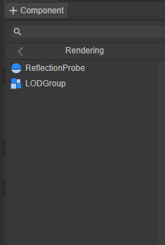
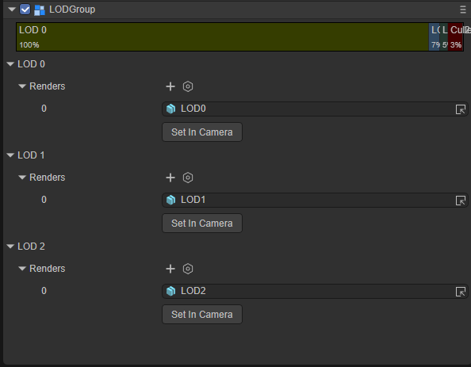
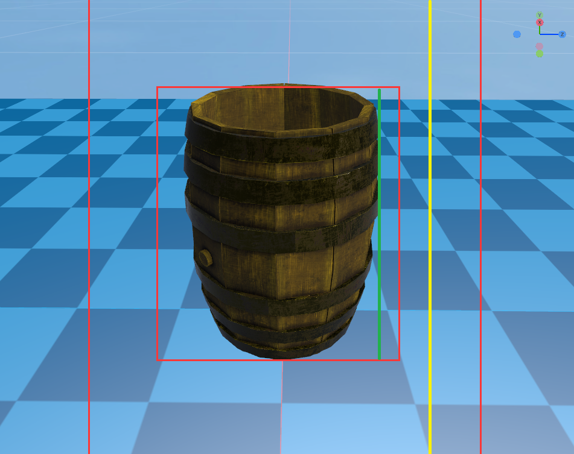
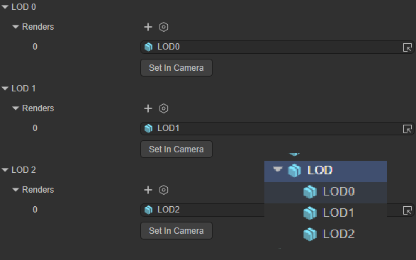
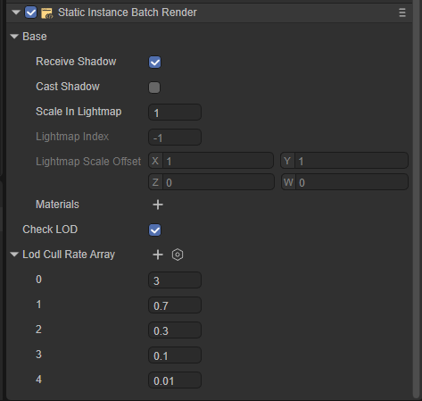

# LOD

## 1. LOD概述

细节级别 (LOD) 是一种减少 LayaAir引擎渲染远距离网格所需的 GPU 操作数量的技术。

当场景中的某个游戏对象距离摄像机很远时，与距离摄像机很近的游戏对象相比，可以看到的细节将会减少。但默认情况下，引擎会使用相同数量的三角形来渲染两个远近不同距离的游戏对象。这可能会浪费 GPU 运算资源，从而影响场景中的性能。

LOD 技术允许引擎根据与摄像机的距离来相应减少为游戏对象渲染的三角形数量。要使用此技术，游戏对象必须具有大量网格，这些网格的几何体的细节级别逐渐降低。这些网格称为 LOD 级别。游戏对象离摄像机越远，引擎渲染的 LOD 细节级别越低。此技术减轻了这些远处游戏对象给硬件带来的负担，因此可以提高渲染性能。

## 2.LOD组件

### 2.1 创建LOD组件

可以通过创建一个LOD组件向场景中物件添加LOD组，引擎的LOD可以添加多个LOD组来实现不同距离实现不同的渲染结果

创建LODGroup组件的步骤：添加组件 -> 选择Rendering组件类型 -> 选择LOD Group组件

 

图2-1

 

图2-2

### 2.2 LOD 等级滑块

通过调整不同LOD等级在LOD等级滑块上的占比来调整不同LOD的切换范围

 

图2-3

LOD等级滑块被划分为一个从左到右范围为[100%, 0%]的区间, 每一级的区间显示百分比为当前区块的左区间值

黑线指示了当前相机所处的LOD等级, 黑色指示线是实时刷新的,会随着相机的移动而变换到不同的LOD区间内。

#### 拓展  Mincull Rate

 

图2-4

每个 LOD 级别层级的**Mincull Rate**表示激活该级别的阈值。该阈值基于游戏对象的屏幕空间高度与屏幕总高度之比。例如，如果 LOD0的阈值设置为0.4，则当摄像机回拉得足够远，使得游戏对象的高度占视图的40%时，LOD0就会激活。

在上图中Mincull Rate的比值在图像中表现为绿色线的长度与黄色线长度的比值，通常情况为一个0.0到1.0的浮点小数

### 2.3 Renders

 

图2-5

Renders渲染器实际上是该LOD层级保存网格的Sprite3D对象。通常情况下这是具有LOD 组件的Sprite3D对象的子对象

Renders渲染器可以添加多个渲染对象在同一个LOD层级可以渲染多个对象

## 3.导入LOD网格（实验性）

在美术创建好一个带有LOD层级网格资源时，在导入引擎之后，选择网格模型文件，勾选中导入设置中的Add Lod Group功能

 

图3-1

## 4.LOD Cull Rate Array

实际上LOD Cull Rate Array是Static Batch Volume的其中一个功能。

 

 

LOD Cull Rate Array实际上是对这个Volume中的物体计算的Rate的N种等级的渲染。

例如当前视野与Volume的实际Rate为0.2， LOD Cull Rate Array中LOD2的等级为0.1， 所以当前视角的物体为渲染的LOD2的物体。
