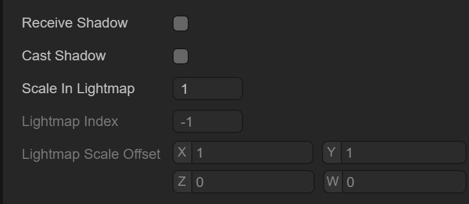
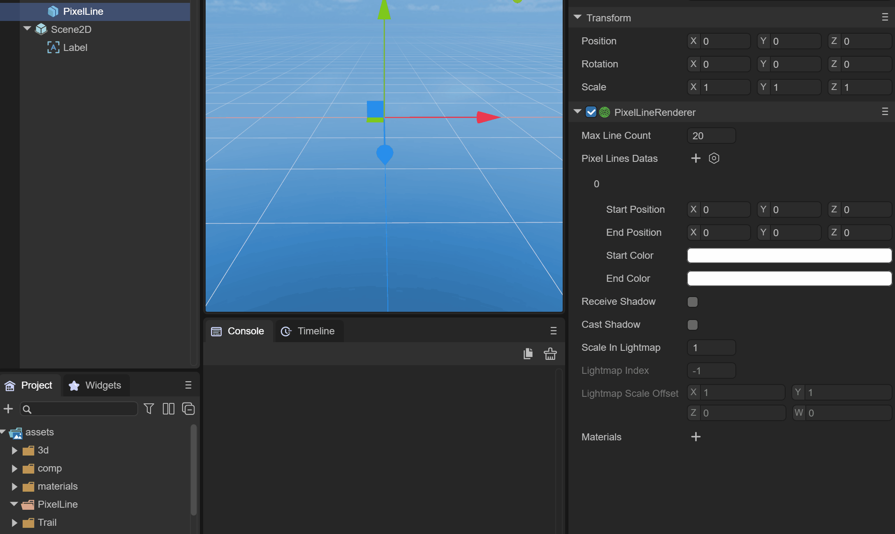

# 像素线


## 一、概述

像素线（Pixel Line ）也可以称之为像素线3D精灵，是通过渲染一组带有颜色的线，来绘制3D精灵的方式，如图1-1所示

 

（图1-1）

如图1-1所示，这是六种IDE提供的3D基础显示对象的网格模式，是一种用线条来展现网格的绘制方式


## 二、IDE中创建与使用

### 2.1 创建像素线3D精灵

在一个3D场景的Hierarchy窗口中，任何节点下，或者是空白位置，都可以通过鼠标右键来创建像素线3D精灵，如动图2-1所示

 

（动图2-1）

此时创建的像素线3D精灵，是看不到任何效果的，实际上就是创建了一个空的3D精灵节点，并添加了像素线渲染器（Pixel Line Renderer）组件，我们来了解一下像素线渲染器组件的信息


### 2.2 属性设置

如图2-2所示，像素线渲染器有如下的属性

 

（图2-2）

由于 `Pixel Line Renderer` 组件是继承自 `Base Renderer` 组件，因此像素线渲染器本身具备一些基础属性，如图2-3所示

 

（图2-3）

接收阴影 `Receive Shadow` ，产生阴影的设置 `Case Shadow` 和光照贴图的缩放和偏移等基础属性，在这里就不介绍了


### 2.3 像素线材质

首先我们在Asset下新建一个Material，默认情况下 Material 的 Shader 是 `BlinnPhone`，接下来我们先把这个Material拖入像素线渲染器的材质属性中，如动图2-4所示

 

（动图2-4）

第二步要修改 `BlinnPhone` 的 shader 为 `Laya.Unlit` shader ，并勾选 `Vertex Color` 

 

（动图2-5）

有了材质，剩下就需要添加像素线数据了


### 2.4 像素线数据

像素线数据就两点，像素线的最大线数量和像素线数据，如图2-6所示

   

（图2-6）

Max Line Count：最大线数量

Pixel Lines Datas：像素线数据

> 注意：像素线数据的数量是不能超过最大线数量的

默认时，已经添加了一个像素线数据，从（0，0，0）点到（0，0，0）点的白色线，只不过是一个点，我们无法看到效果

我们可以通过修改 End Position 和颜色，如图2-7所示

 

（图2-7）

修改之后，我们可以看到一条最基本的像素线，如图2-8所示

 

（图2-8） 


到此，像素线渲染器就介绍完了，通常我们通过IDE来添加每一条像素线来描绘一个网格是不可能的，往往我们会通过代码来实现，下面我们介绍代码是如何使用的


## 三、代码中创建与使用

`PixelLineSprite3D` 是 LayaAir引擎提供的像素线3D精灵类，我们看看这个类最重要的方法


### 3.1 构造方法

从下面的代码中可以看到，当初始化一个`PixelLineSprite3D` 的构造方法时，代码已经帮我们添加了 `PixelLineRenderer` 组件和 设置了 `UnlitMaterial` 材质并勾选了使用 `VertexColor` ，如上面2.3小节中手动添加材质的过程在代码中是自动做好了

```typescript
    /**
     * 创建一个 <code>PixelLineSprite3D</code> 实例。
     * @param maxCount 最大线段数量。
     * @param name 名字。
     */
    constructor(maxCount: number = 2, name: string = null) {
        super(name);

        this._render = this.addComponent(PixelLineRenderer);
        this._geometryFilter = (this._render as PixelLineRenderer)._pixelLineFilter;
        (this._render as PixelLineRenderer).maxLineCount = maxCount;
        let material = this._render.material = new UnlitMaterial();
        material.enableVertexColor = true;
    }
```


### 3.2 AddLine()

`PixelLineSprite3D` 已经直接调用了 `PixelLineRenderer` 组件的 `addLine()` ，看来可以直接设置点位置和颜色即可

```typescript
    /*
     * 增加一条线。
     * @param	startPosition  初始点位置
     * @param	endPosition	   结束点位置
     * @param	startColor	   初始点颜色
     * @param	endColor	   结束点颜色
     */
    addLine(startPosition: Vector3, endPosition: Vector3, startColor: Color, endColor: Color): void {
        (this._render as PixelLineRenderer).addLine(startPosition, endPosition, startColor, endColor);
    }
```


### 3.3 Tool.linearModel()

通常我们可以利用`addLine()` 方法来实现把复杂的网格数据转变成像素线数据，我们可以写一个Tool工具类，方便转换使用：

```typescript
//Tool工具类
export class Tool {
    private static transVertex0: Laya.Vector3 = new Laya.Vector3();
    private static transVertex1: Laya.Vector3 = new Laya.Vector3();
    private static transVertex2: Laya.Vector3 = new Laya.Vector3();
    private static corners: Laya.Vector3[] = [];
    static linearModel(sprite3D: Laya.Sprite3D, lineSprite3D: Laya.PixelLineSprite3D, color: Laya.Color): void {
        if (sprite3D.getComponent(Laya.MeshFilter)) {
            var mesh: Laya.Mesh = sprite3D.getComponent(Laya.MeshFilter).sharedMesh;
            var positions: Array<Laya.Vector3> = [];
            mesh.getPositions(positions);
            var indices = mesh.getSubMesh(0).getIndices();

            for (var i: number = 0; i < indices.length; i += 3) {
                var vertex0: Laya.Vector3 = positions[indices[i]];
                var vertex1: Laya.Vector3 = positions[indices[i + 1]];
                var vertex2: Laya.Vector3 = positions[indices[i + 2]];
                Laya.Vector3.transformCoordinate(vertex0, sprite3D.transform.worldMatrix, this.transVertex0);
                Laya.Vector3.transformCoordinate(vertex1, sprite3D.transform.worldMatrix, this.transVertex1);
                Laya.Vector3.transformCoordinate(vertex2, sprite3D.transform.worldMatrix, this.transVertex2);
                lineSprite3D.addLine(this.transVertex0, this.transVertex1, color, color);
                lineSprite3D.addLine(this.transVertex1, this.transVertex2, color, color);
                lineSprite3D.addLine(this.transVertex2, this.transVertex0, color, color);
            }
        }

        for (var i: number = 0, n: number = sprite3D.numChildren; i < n; i++)
            Tool.linearModel((<Laya.Sprite3D>sprite3D.getChildAt(i)), lineSprite3D, color);
    }

    constructor() {
    }

}
```


### 3.4 代码使用

通过如下代码对工具类 Tool.linearModel 的使用，可以把一个 PixelLineSprite3D 对象的网格数据设置成像素线数据：

```typescript
onAwake(): void {
    /* 创建球体 */
    let sphere = new Laya.Sprite3D;
    let sphereMesh = sphere.addComponent(Laya.MeshFilter);
    sphereMesh.sharedMesh = Laya.PrimitiveMesh.createSphere(0.25, 20, 20);
    let sphereRender = sphere.addComponent(Laya.MeshRenderer);
    // 为球体添加像素线渲染精灵
    let sphereLineSprite3D: Laya.PixelLineSprite3D = new Laya.PixelLineSprite3D(3500);
    this.scene.addChild(sphereLineSprite3D);
    //设置像素线渲染精灵线模式
    Tool.linearModel(sphere, sphereLineSprite3D, Laya.Color.GREEN);
}
```


到此，像素线代码部分就介绍完了，往往我们也可以对一个外部模型转换成像素线数据来使用，在实际项目中可以丰富展现效果

如动图3-1所示，展示外部模型的像素线效果

 

（动图3-1） 

 


