# 程序蓝图

> 版本 >= 3.2 beta3

在使用蓝图前，首先需要在LayaAir-IDE的项目设置面板中勾选蓝图模块。


## 一、创建蓝图

在项目资源目录下，通过点击“＋”或鼠标右键进行蓝图的创建，


（图1-1）

然后双击蓝图要继承的类，就会创建好蓝图文件了。


（图1-2）

双击创建好的蓝图文件，就可以打开蓝图编辑器了。

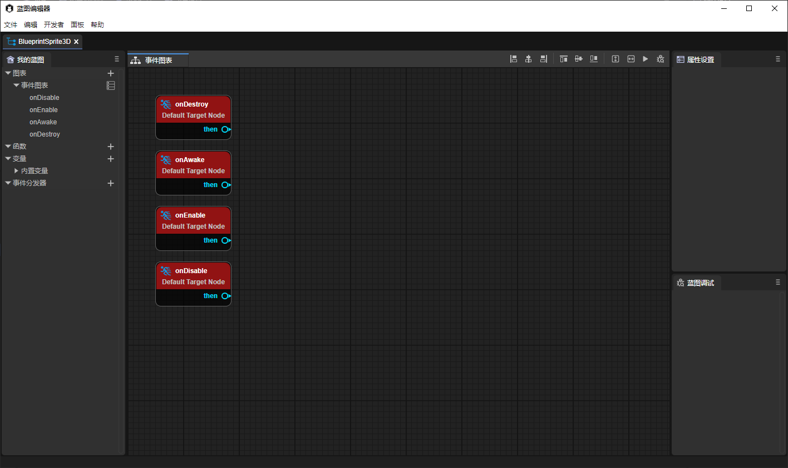

（图1-3）

不同的蓝图文件有不同的使用方式：

- 继承Sprite3D的蓝图直接拖到3D场景中使用 （也可拖到3D场景的层级目录）。


（图1-4）

- 继承UI派生类的蓝图直接拖到2D场景中使用  （也可以拖到2D场景的层级目录）。


（图1-5）

- 继承组件的蓝图，自动会填充到IDE的组件列表中，也可以直接拖拽到属性面板上直接添加 （与脚本组件在IDE中的使用方式相同）。


（图1-6）


## 二、蓝图编辑器的使用

### 2.1 节点类型

- 事件节点，包括一些生命周期方法（蓝图运行的入口），只有输出引脚。

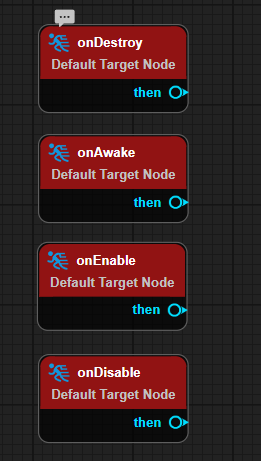

（图2-1）


- 函数节点，有一个执行类型输入引脚（excute），一个目标类型引脚（target），一个执行类型输出引脚（then）。


（图2-2）


- 分支节点，包括Sequence 、Branch、forLoop、forEach。

Sequence用于顺序执行，不等待异步操作。


（图2-3）

Branch用于进行判断。


（图2-4）

forLoop(withBreak)用于创建循环结构。


（图2-5）

forEach(withBreak)用于遍历所有元素。


（图2-6）


- 参数节点，包括一些数学公式、变量的get等。

参数节点只有被函数节点的输入参数引用触发。输出执行类型的引脚只能连接一个执行类型的引脚（例如，一个then只能连接一个execute，如果强行连接第二个execute，之前的那个连线就会断掉）。输入参数类型的引脚也只能连接一个参数类型的输出引脚。

如图2-7给出的示例，当蓝图节点触发onEnable生命周期时，开始打印”game start“，然后等待2秒 （这里的add就是参数节点，将1+1的结果输入给waitTime），再顺序执行打印“3”，2秒过后打印“4”。


（图2-7）


### 2.2 蓝图编辑

#### 2.2.1 新建蓝图事件图表

如图3-1所示，点击图表右面的加号，增加一个新的事件图表，并可以给事件图表重命名。

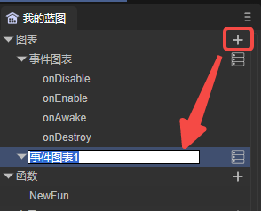

（图3-1）

创建后，双击即可打开新建的事件图表，

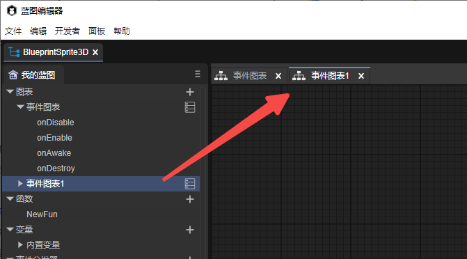

（图3-2）


#### 2.2.2 增加蓝图节点

如动图4-1所示，可以通过鼠标右键增加蓝图节点，并支持搜索节点。

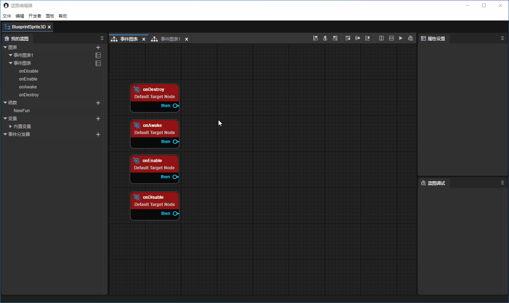

（动图4-1）

蓝图编辑器还支持多选节点以后，对节点进行对齐操作，可以使用图4-2所示的功能，


（图4-2）

> 此操作与UI编辑器的基础交互相同，可参考[《 UI编辑器基础交互》](../../uiEditor/basic/readme.md)。


#### 2.2.3 创建函数

如图5-1所示，蓝图支持创建静态函数和普通函数。


（图5-1）

创建完函数以后可以给函数重命名，双击可以进入函数的编辑，如动图5-2所示。进入函数编辑以后，默认会有函数的入口执行节点。


（动图5-2）

在左侧属性面板中还可以增加函数的参数以及返回节点，

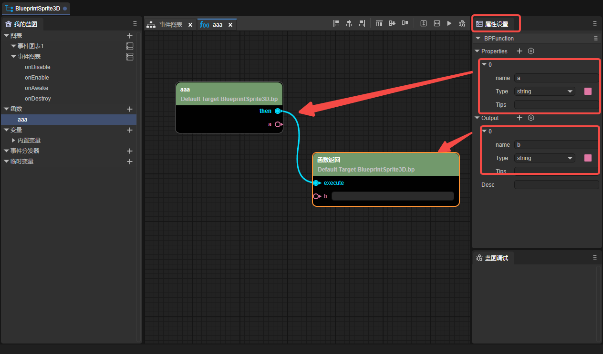

（图5-3）

#### 2.2.4 创建变量

支持创建变量和静态变量，

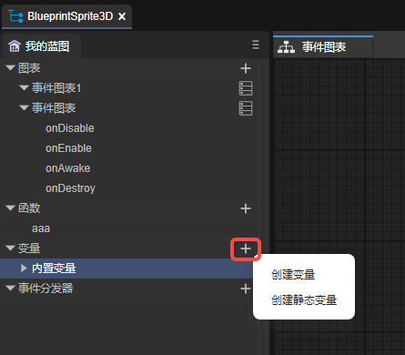

（图6-1）

创建变量以后可以对变量进行重命名，右侧的眼睛图标（如图6-2）可以控制该变量是否是外部可见的，


（图6-2）

将变量拖入面板中，可以选择是设置还是获取该变量。

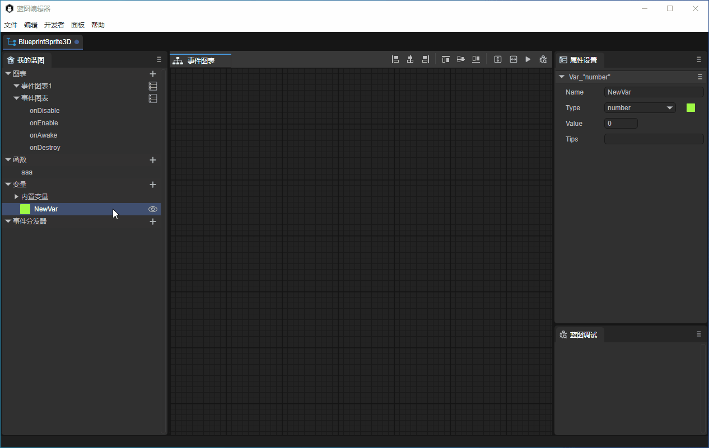

（动图6-3）

如果是获取变量，那这个变量入口只有一个target，出口就是这个变量的值。


（图6-4）

如果是设置变量，那变量入口会有（execute，target，set）出口会有（then和return），


（图6-5）

如果是静态变量，target是无法设置的。

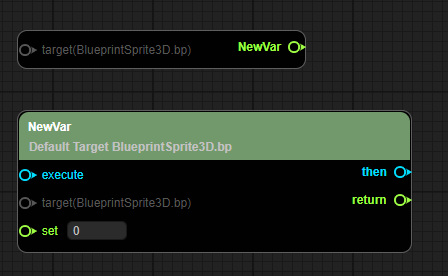

（图6-6）


#### 2.2.5 创建事件分发器

点击图7-1的“+“图标可以创建事件分发器，


（图7-1）

事件分发器创建完成以后，拖拽到面板中，会分为（调用、绑定、解除绑定、解除全部绑定、事件）。


（图7-2）


#### 2.2.6 快速定位

如动图8-1所示，在左侧的”我的蓝图“面板上，双击事件图表、变量、事件分发器可以快速定位到对应的节点上。


（动图8-1）


#### 2.2.7 注释

注释分为节点注释和范围注释。

- 节点注释

将鼠标移动到节点上，然后点击节点左上角的气泡，可以输入注释，如图9-1所示。


（图9-1）


- 范围注释

框选多个节点以后，鼠标右键，选择范围注释。

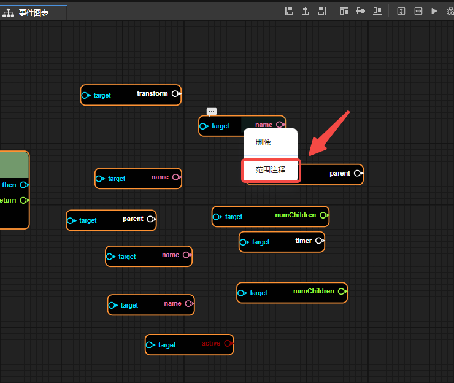

（图10-1）

之后点击范围注释，在属性面板中可以修改注释的颜色，拖动范围注释，所有在范围注释内部的节点都会跟着移动。


（图10-2）


### 2.3 蓝图调试

在要调试的节点上鼠标右键，然后选择增加断点，就会给该节点增加断点。增加断点成功以后，节点的右上角会出现一个红点。


（图11-1）

然后点击调试，

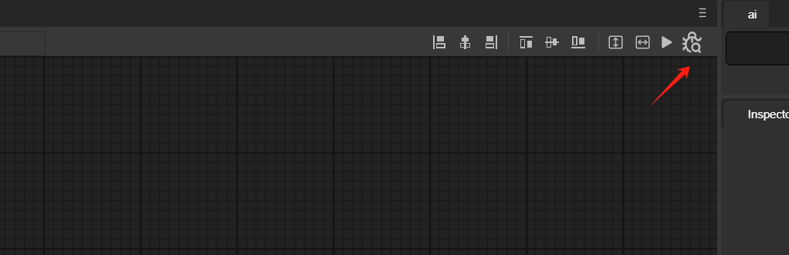

（图11-2）

如动图11-3所示，当程序运行到这个节点以后就会停止。

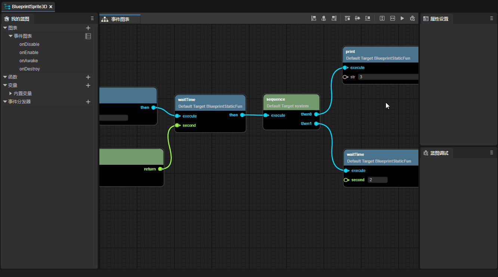

（动图11-3）


## 三、蓝图装饰器

> 自定义的组件脚本与基础装饰器的使用请参考[《 实体组件系统》](../../../basics/common/Component/readme.md)。

在自定义的组件脚本中，使用蓝图装饰器可以暴露类、函数、变量等到蓝图编辑器中。

### 3.1 类

需要在类定义之前使用装饰器的标识`@bpClass`，示例代码如下所示：

```typescript
const { bpClass } = BP;

@bpClass({
    name:"TestBluePrint",
    canInherited: true,
    extends:"Script"
})

export class TestBluePrint extends Laya.Script {
}
```

需要注意的是，只有注册了构造函数，才可以在蓝图编辑器的createNew中创建这个类的实例，如图12-1所示。

```typescript
const { bpClass } = BP;

@bpClass({
    name: "TestBluePrint",
    canInherited: true,
    extends: "Script",
    construct: {
        params: [
            {
                "name": "testParams",
                "type": "string"
            }
        ]
    }
})

export class TestBluePrint extends Laya.Script {

    constructor(testParams: string) {
        super();
    }

}
```

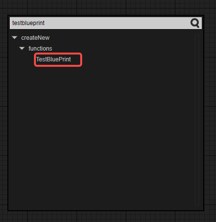

（图12-1）


### 3.2 属性

在变量前使用装饰器的标识`@bpProperty`，在get和set前使用装饰器的标识`@bpAccessor`，示例代码如下所示：

```typescript
const { bpClass, bpAccessor, bpProperty } = BP;

@bpClass({
    name: "TestBluePrint",
    extends: "Script",
    construct: {
        params: [
            {
                "name": "testParams",
                "type": "string"
            }
        ]
    }
})

export class TestBluePrint extends Laya.Script {

    constructor(testParams: string) {
        super();
    }

    // 属性
    @bpProperty({
        "type": "boolean"
    })
    aaa: boolean = true;

    // 静态属性
    @bpProperty({
        "type": "boolean",
        "modifiers": {
            "isStatic": true
        }
    })
    static bbb: boolean = true;

    // get & set
    @bpAccessor({
        "type":"string"
    })
    get testParams():string{
        return "test";
    }

    set testParams(value:string){
        console.log(value);
    }

    // 静态 get & set
    @bpAccessor({
        "type":"string",
        "modifiers": {
            "isStatic": true
        }
    })
    static get testStaParams():string{
        return "test";
    }

    static set testStaParams(value:string){
        console.log(value);
    }
    
}
```

通过createNew创建TestBluePrint类的实例后，如动图12-2所示，就可以使用这些属性了。

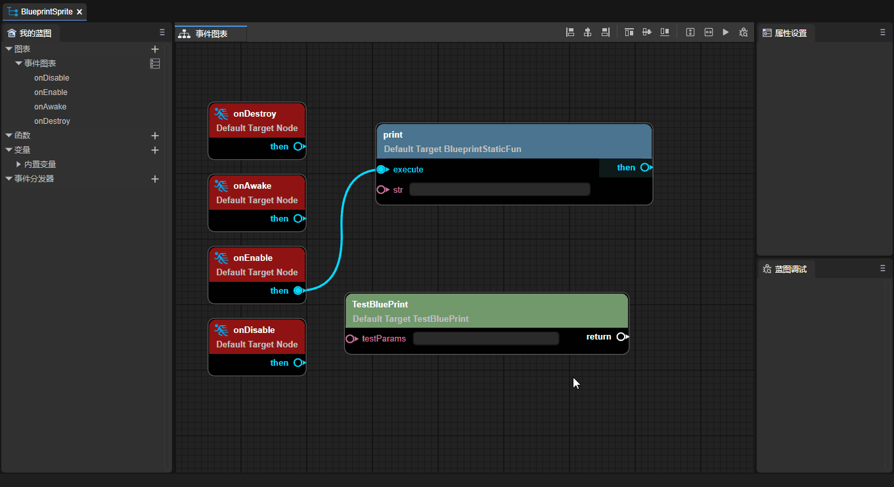

（动图12-2）


### 3.3 函数

在函数前使用装饰器的标识`@bpFunction`，示例代码如下所示：

```typescript
const { bpClass, bpFunction } = BP;

@bpClass({
    name:"TestBluePrint",
    extends:"Script",
    construct: {
        params: [
            {
                "name": "testParams",
                "type": "string"
            }
        ]
    }
})

export class TestBluePrint extends Laya.Script {
    
    constructor(testParams: string) {
        super();
    }
    
    // 函数
    @bpFunction({
        params: [
            {
                name: "PrimaryAssetId",
                type: "string"
            }
        ],
        returnType: "string"
    })
    testFunction(PrimaryAssetId: string): string {
        return "";
    }

    // 静态函数
    @bpFunction({
        params: [
            {
                name: "PrimaryAssetId",
                type: "string"
            }
        ],
        modifiers: {
            isStatic: true
        },
        returnType: "void"
    })
    static testStaFunction(PrimaryAssetId: string) {
    }

}
```

通过createNew创建TestBluePrint类的实例后，就可以使用这些方法了，如图12-3所示。


（图12-3）


### 3.4 事件

需要在`@bpClass`标签中加入events，示例代码如下所示：

```typescript
const { bpClass, bpFunction } = BP;

@bpClass({
    name: "TestEvents",
    extends: "Sprite",
    construct: {
        params: [
            {
                "name": "eee",
                "type": "string"
            }
        ]
    },
    events: [{
        name: "onTest",
        params: [{ name: "name", type: "string" }]
    },
    {
        name: "onEventTest",
        params: [{ name: "name", type: "string" }]
    }]
})

export class Main extends Laya.Sprite {
    
    constructor(eee: string) {
        super();
    }

    onTest(name: string, type: string) {
        this.event('onTest', 'test');
    }

    @bpFunction({
        params: [{ name: "name", type: "string" }],
        type: "event",
        returnType: "void"
    })
    onEventTest(name: string) {
    }

}
```

通过createNew创建TestBluePrint类的实例后，就可以看到这些事件了，如图12-4所示。

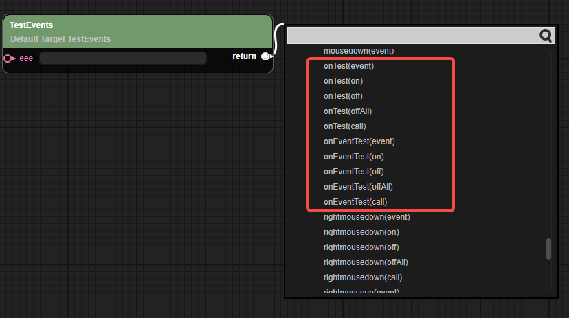

（图12-4）


