# Shader蓝图

## 1.蓝图概述

###  1.1 创建蓝图

在Assert窗口右键Create菜单选择Shader BluePrint创建一个蓝图文件

> 在蓝图文件未打开时，蓝图文件对应的Shader文件并未创建；打开蓝图文件时才会创建Shader文件，完成蓝图与Shader的映射对应

 

图1-1

### 1.2 蓝图界面预览

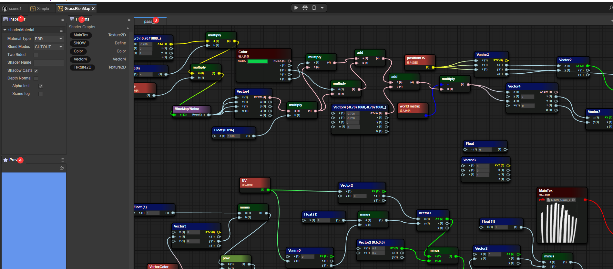

图1-2

1. 蓝图文件Inspector窗口
2. 蓝图Params窗口
3. 蓝图文件Pass窗口
4. 蓝图预览窗口

## 2.与Shader的异同

### 2.1 固定的三种基础材质类型

#### 2.1.1 PBR

常见的Shader属性：

- NormalWS

世界法线计算世界坐标中各顶点的光照结果

- alphaTest

启用AlphaTest开关后，Shader通过alophatest的值来判断是否丢弃该像素

- AlbedoColor

表面颜色（不包含光照）

- Metallica

金属度，描述物体的金属属性的值，实际上是在控制表面在多大程度上像“金属”，对于纯表面金属度的值可能是0或1，现实中的大多数物体其实是介于这个区间之间的

- Smoothness

光滑度，描述物体的光滑程度，通常情况可以根据反射的模糊或者清晰度或者镜面反射高光的广度或者密集度加以确定

- Occlusion

环境光遮蔽参数，环境光遮蔽是一种近似于光线因遮挡而衰减的效果，这是一种细微的表现，使角落，裂缝变得更暗，以创建一个更自然，现实的外观

- Emission

自发光颜色

- Anisotropy

各向异性参数，增加采样次数来补充贴图展示在模型上的细节

- Alpha

透明度，选择了TRANSPARENT渲染模式，会根据Alpha值选择不同的透明度

图2-1展示了PBR材质类型是Shader蓝图的片段着色器内容

 

图2-1

#### 2.1.2 UnLit

NormalWS

世界法线计算世界坐标中各顶点的光照结果

AlphaTest

启用AlphaTest开关后，Shader通过alophatest的值来判断是否丢弃该像素

Color

基础颜色

Alpha

透明度，选择了TRANSPARENT渲染模式，会根据Alpha值选择不同的透明度

图2-2展示了UnLit材质类型是Shader蓝图的片段着色器内容

 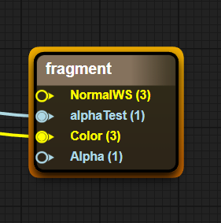

图2-2

#### 2.1.3 Blinnphong

NormalWS

世界法线计算世界坐标中各顶点的光照结果

AlphaTest

启用AlphaTest开关后，Shader通过alophatest的值来判断是否丢弃该像素

DiffuseColor

漫反射颜色（不产生光照的地方的颜色）

SpecularColor

高光颜色（产生光照的地方的颜色）

Shininess

表面光滑度

Gloss

表面粗糙度

Aplha

透明度，选择了TRANSPARENT渲染模式，会根据Alpha值选择不同的透明度

图2-3展示了Blinnphong材质类型是Shader蓝图的片段着色器内容

 

图2-3

### 2.2 材质混合方式

- OPAQUE（不透明）

  最终颜色 = 来源颜色。这意味着材质将绘制在背景前面。

- CUTOUT（镂空）

  ​	如果贴图中采样到的Aplha值  > AlphaTestValue，则最终颜色为来源颜色，否则废弃像素。

- TRANSPARENT（半透明）

  最终颜色 = 来源颜色不透明度 + 目标颜色（1 - 不透明度）。

- ADDTIVE（加色混合）

  最终颜色 = 来源颜色 + 目标颜色

- ALPHABLENDED（透明混合）

  这意味着对象为半透明的模式，但是最终像素的着色的混合模式不同，AlphaBlended混合方式为SrcAlpha * SrcColor + （1 - SRCAlpha）* DstColor，通常来说SrcAlpha来自纹理的Alpha值

### 2.3 ShaderName //待定项

ShaderName文本框中输入的是ShaderName

### 2.4 ShadowCaster

阴影计算开关，开启此开关时，

### 2.5 DepthNormal

DepthNormal开关，开启此开关时，会加入DepthNormal Pass以计算场景的法线信息（部分后期处理可能会用到该功能）

### 2.6 AlphaTest

Alpha测试开关，开启此开关的时，启用片段着色器的AlphaTest变量的Value值功能，启用透明裁剪，触发alphatest Value条件的像素直接丢弃，不填充颜色

### 2.7 SceneFog

场景雾效开关，开启此开关时，启用sceneFog通过屏幕空间的w值来计算雾效的范围

## 3.简单示例

### 3.1 显示一个简单的模型

 

图3-1

1. 通过Params传入一张纹理

2. 通过UV采样传入的纹理
3. 将从纹理中采样到的颜色作为传入Unlit的Color
4. 将世界法线传入Unlit的世界法线输入中

蓝图的结果展示如下

 

图3-2

### 3.2 显示一个简单的Blinnphong材质球

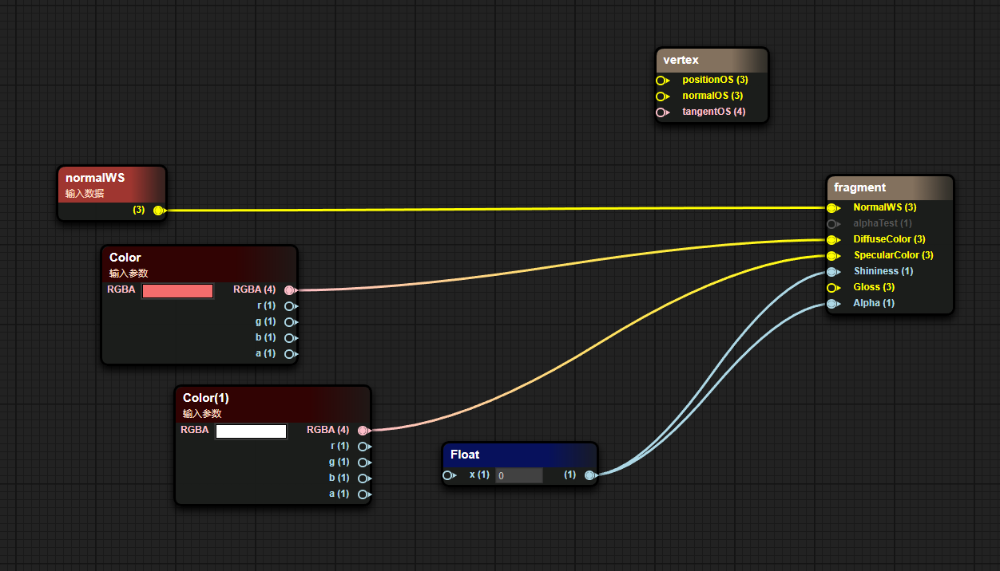

图3-3

1. 传入世界法线
2. 通过Params传入表面颜色

蓝图的结果展示如图

 

图3-4

## 4.节点数据的传输方式

在蓝图中一个节点中左侧为输入数据，右侧为输出数据

输入数据可以来自一个源数据、Params变量或者其他节点的输出

  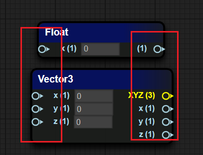

图4-1

## 5.常见的节点类型

### 5.1 坐标类

| 坐标类型   | 坐标释义                                                     |
| ---------- | ------------------------------------------------------------ |
| PositionWS |  世界空间下的顶点世界坐标 |
| normalWS   | 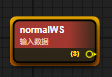 世界空间下的顶点法线世界坐标 |
| tangentWS  | 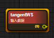 世界空间下的顶点切线世界标 |
| biNormalWS |  世界空间下的顶点副切线世界坐标 |
| worldMat   |  世界空间矩阵 |

### 5.2 相机类

| 属性类型        | 属性释义                                                     |
| --------------- | ------------------------------------------------------------ |
| viewDirection   |  视线向量（3D世界空间下的视线数学化表达) |
| cameraPosition  |  相机位置世界空间坐标 |
| cameraDirection | 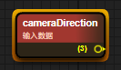 相机forward方向 |
| cameraUp        |  相机Up方向 |
| cameraNear      |  相机近平面大小 |
| cameraFar       | 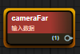 相机远平面大小 |

### 5.3 数学类

| 属性类型                        | 属性释义                                                     |
| ------------------------------- | ------------------------------------------------------------ |
| add / minus / multiply / divide |  四则运算 |
| sin / cos / tan                 |  三角函数 |
| clamp                           |  钳取值在min和max范围内 |
| mix / max                       | 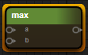 最小值，最大值 |
| step  / smoothstep              |  x > value : 0.0 : 1.0 |
| pow                             | 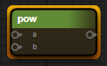 幂次方 |
| dot / cross                     |  点乘向量，叉乘向量 |

### 5.4 纹理类

| 属性类型                  | 属性释义                                                     |
| ------------------------- | ------------------------------------------------------------ |
| sampler2D                 | 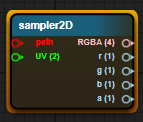 普通采样2D纹理贴图 |
| samplerCube               |  采样3D CubeMap |
| sampler2DNormal（OpenGL） | 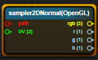 采样法线贴图（GL在左下角) |
| sampler2DNormal(Directx)  |  采样法线贴图（DX在左上角) |

### 5.5 颜色类

| 属性释义      | 属性类型                                                     |
| ------------- | ------------------------------------------------------------ |
| GammaToLinear |  伽马空间转换到线性空间 |
| LinearToGamma | 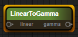 线性空间转换到伽马空间 |

## 6.常见的Params类型

 添加一个Params变量。在Params窗口下选中"＋"，选择相应的Parmas变量类型

 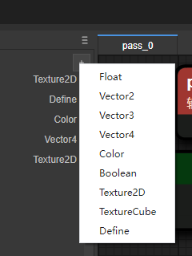

图6-1

### 6.1 Float

定义一个float值，在检视面板中先试用一个float类型的对象

 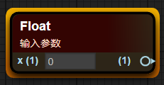

图6-2

### 6.2 Texture2D

定义一个2D纹理的值，在检视面板中显示一个2D纹理类型的对象

 

图6-3

### 6.3 Vector2/3/4

定义一个向量类型，根据不同的分量数量分为Vector2、Vector3、Vector4

 

图6-4

### 6.4 Color

定义一个颜色值，通常存在RGBA四种分量的数据

 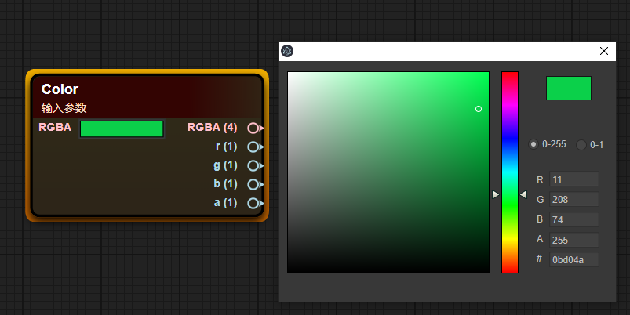

图6-5

### 6.5 Define

宏定义，用于对宏条件的不同触发结果来执行不同的结果内容，效率高于if-else

 

图6-6

## 7.自定义函数

#### 7.1创建蓝图函数

在Project窗口右键Create菜单，选择Shader BluePrint Function创建一个蓝图函数

 

图7-1

#### 7.2 添加参数

在蓝图编辑窗口下，右键空白处，选择ShaderFunction选项，选择Input In选项卡

 

图7-2

#### 7.3 自动返回值

在最后的Default Output Result节点，输入的数据类型决定了该Shader函数的输出类型，函数蓝图会自动判断输出类型，如下图所示

 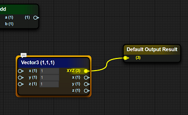

 

图7-3

#### 7.4 函数中调用函数

在蓝图函数界面，在需要放置蓝图函数节点的位置右键，在CustomFun-BlueMap项选择创建蓝图函数时定义的函数（蓝图函数文件名）

 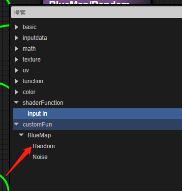

图7-4

## 8.进阶示例

> 简单的草

 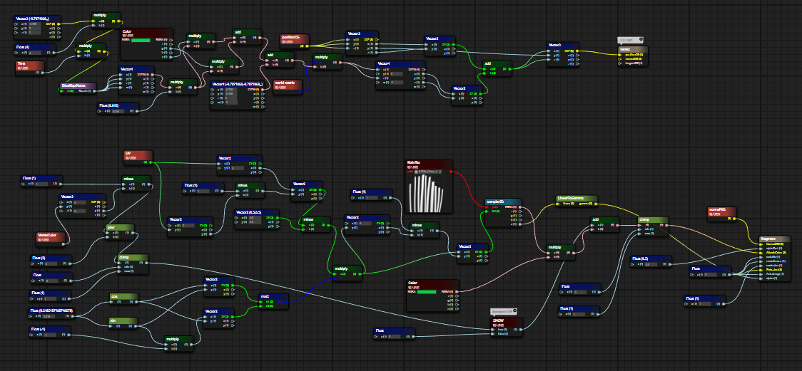

图8-1

### **8.1 顶点着色器片段**

1. 使用柏林噪声模拟出一个Vec4的向量

 

图8-2

2. 对噪声值进行一些特殊的变换

把生成的噪声值缩小0.016，分别与外部传入的Color的g通道和a通道相乘，将分别乘完的结果求和，将得到的和与一个干扰值相加，最后与世界矩阵相乘

图8-3

3.将于世界矩阵相乘完的结果取出xz分量与positionOS的xz分量相加为新的positionOS的xz分量

 

图8-4

### 8.2 片段着色器片段

1. 判断是否启用了SNOW宏，宏启用的时候计算 1- 顶点颜色g值的2次方在（0,1）的结果，宏关闭是值为0

 

图8-5

2. 将UV坐标偏移与一个三角函数组成的2x2矩阵相乘再偏移回原来的位置

图8-6

3. 采样草体纹理贴图，提取其中A通道转换为伽马值作为草体的Alpha值传入PBR函数，Albedo值为传入颜色值 * 纹理采样值 + 宏判断的值

图8-7

蓝图的结果展示如下

 

图8-7

## 拓展：快捷操作

|   节点类型   |   生成方式   |
| ---- | ---- |
| 快速生成float节点 | 长按数字键1，左键点击需要放置的位置 |
| 快速生成Vector2节点 | 长按数字键2，左键点击需要放置的位置 |
| 快速生成Vector3节点 | 长按数字键3，左键点击需要放置的位置 |
| 快速生成Vector4节点 | 长按数字键4，左键点击需要放置的位置 |
| 快速生成int节点 | 长按字母键i，左键点击需要放置的位置 |
| 快速生成bool节点 | 长按字母键b，左键点击需要放置的位置 |
| 快速生成time节点 | 长按子母键t，左键点击需要放置的位置 |
