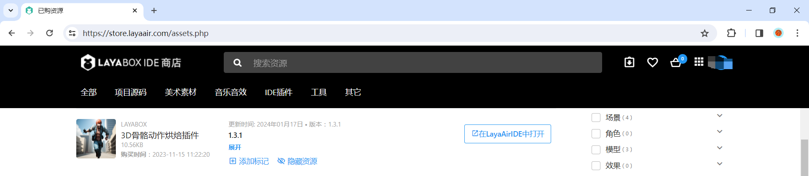
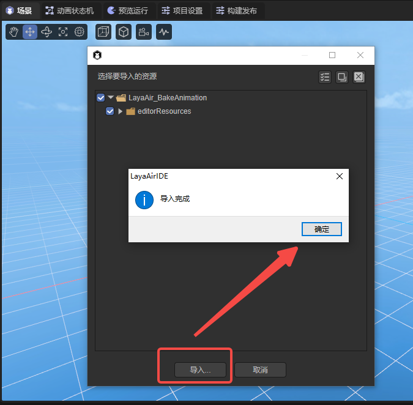
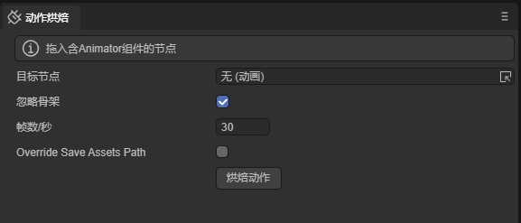

# 3D骨骼动作烘焙插件

## 一、插件概述

动画烘焙是一种特殊的动画优化方案，它将所有动画提前计算一次；将所有的骨骼节点预计算，存入内存中；GPU直接通过内存读取对应节点的矩阵值；进行渲染的方式。通过使用动画烘焙，可以降低CPU的消耗，因为GPU动画效率高于CPU动画，对于大量使用骨骼动画的场景，可以大大提高性能。

- 优点：性能高，可用于大量骨骼动画场景;

- 缺点：动画之间不能平滑切换，不能使用动画遮罩等功能；

## 二、使用说明

### 2.1 导入插件

当将IDE资源商店的资源`添加至我的资源`后，在`已购资源`的列表中，点击`在LayaAirIDE中打开`，会弹出浏览器调用IDE的控件，再次点击`打开LayaAirIDE`，如图2-1所示。

（图2-1）

之后，控件会调起LayaAir3-IDE并弹出导入资源的窗口。点击窗口的`导入`，当导入完成后，会弹出导入完成的提示面板，点击`确定`即完成了插件的导入。如图2-2所示。

（图2-2）

导入完成后的界面如图2-3所示：

（图2-3）

**插件更新**

插件的开发者推出新版本后，不会为插件使用者主动更新版本（有的使用者也许不想升级），所以插件开发者需要手动在资源商店点击更新，更新之后，再点击`“在LayaAirIDE中打开”`才会重新导入并打开新版本的插件。

### 2.2具体使用

详细参考[《动画烘焙详解》](../../../animationEditor/aniBake/readme.md)文档。